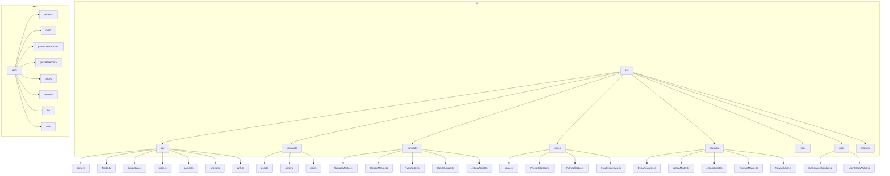
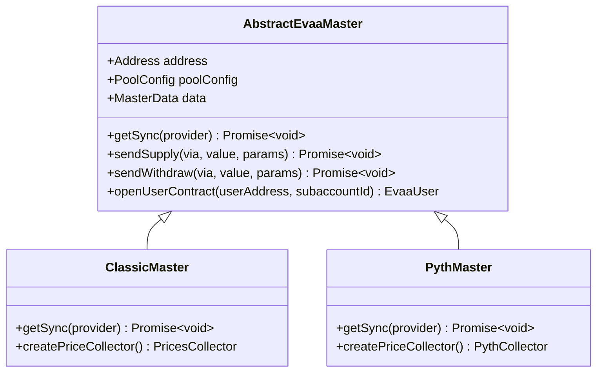
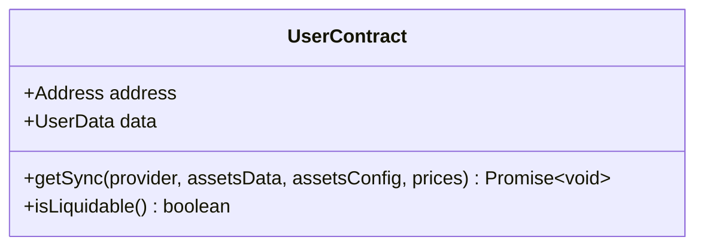
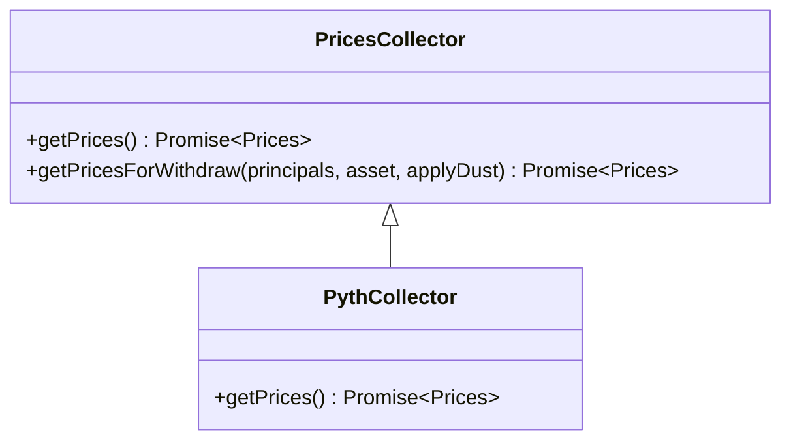
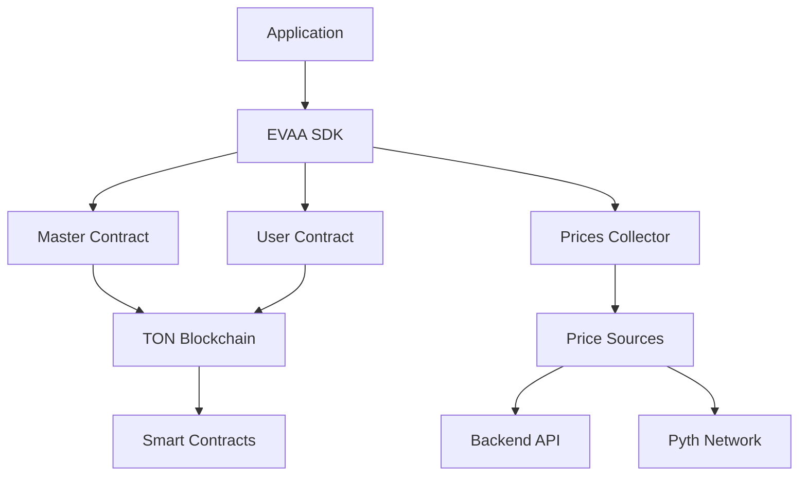
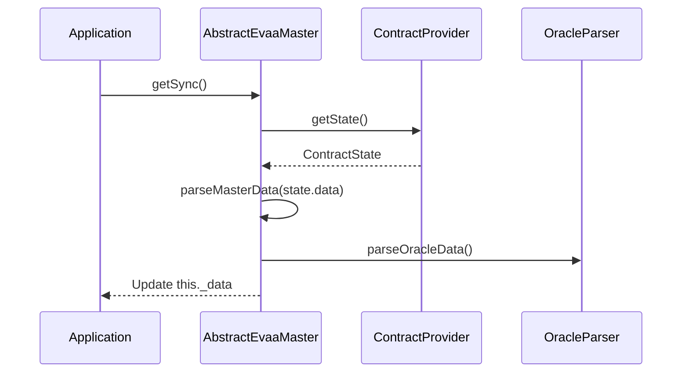
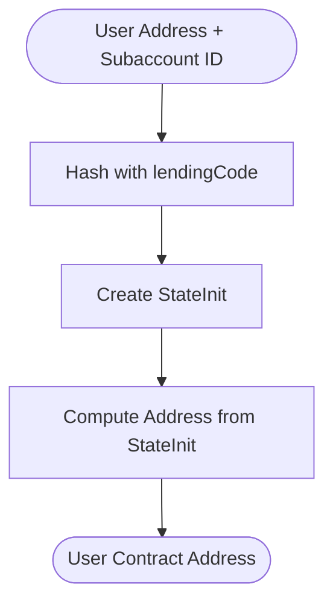
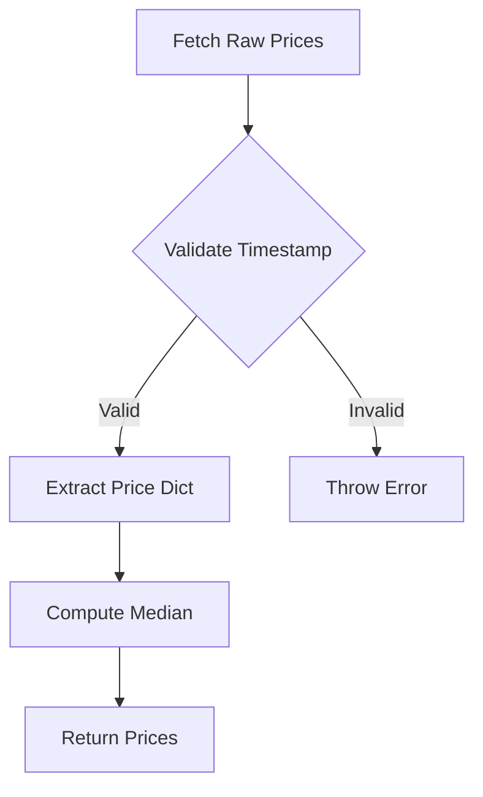
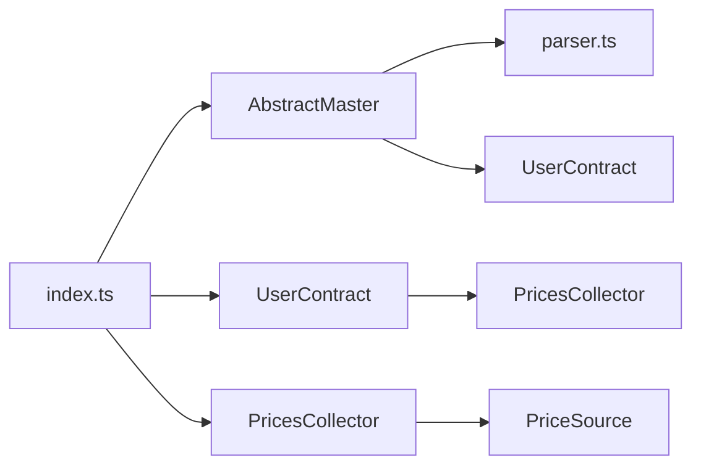

# Introduction

## Table of Contents

1. [Introduction](#introduction)
2. [Project Structure](#project-structure)
3. [Core Components](#core-components)
4. [Architecture Overview](#architecture-overview)
5. [Detailed Component Analysis](#detailed-component-analysis)
6. [Dependency Analysis](#dependency-analysis)
7. [Performance Considerations](#performance-considerations)
8. [Troubleshooting Guide](#troubleshooting-guide)
9. [Conclusion](#conclusion)

## Introduction

The EVAA SDK is a TypeScript-based software development kit designed to facilitate seamless integration with the EVAA DeFi lending protocol on the TON (The Open Network) blockchain. It abstracts complex smart contract interactions into developer-friendly methods, enabling operations such as supplying assets, withdrawing funds, initiating liquidations, and retrieving price oracle data with minimal boilerplate code. The SDK's core value proposition lies in its ability to simplify blockchain interactions while maintaining type safety, modular design, and high testability.

The SDK supports dual oracle systems—Classic and Pyth—allowing developers to choose between centralized and decentralized price feeds. It also features subaccount functionality, enabling users to manage multiple isolated positions under a single wallet. Integration with `@tonconnect/sdk` ensures secure wallet connectivity, while modular architecture promotes extensibility and maintainability.

Key benefits of the EVAA SDK include:

-   **Type Safety**: Built with TypeScript, ensuring compile-time type checking.
-   **Modular Design**: Components are decoupled for easy reuse and testing.
-   **Testability**: Comprehensive test suite covering supply, withdraw, and price operations.
-   **Dual Oracle Support**: Compatibility with both Classic and Pyth oracle systems.
-   **Subaccount Management**: Support for multiple user positions via subaccount IDs.

The main architectural components include:

-   **Master Contracts**: Entry points for protocol interactions (e.g., `ClassicMaster`, `PythMaster`).
-   **PricesCollector**: Aggregates and validates price data from multiple sources.
-   **UserContract**: Represents a user's position and state within the protocol.
-   **Jetton**: Standard for fungible tokens on TON, used for asset transfers.

A simple code example demonstrates SDK initialization and price fetching:

```typescript
import { TonClient } from '@ton/ton';
import { Evaa, MAINNET_POOL_CONFIG } from './src';

const client = new TonClient({ endpoint: 'https://toncenter.com/api/v2/jsonRPC' });
const evaa = client.open(new Evaa({ poolConfig: MAINNET_POOL_CONFIG }));
const prices = await evaa.getPrices();
console.log(prices.dict);
```

The SDK operates on the TON blockchain, leveraging asynchronous message passing and cell-based data structures for state management. Common use cases include DeFi dashboards, automated trading bots, and analytics tools that require real-time access to lending protocol data.

**Section sources**

-   [README.md](file://README.md#L0-L7)
-   [src/index.ts](file://src/index.ts#L0-L45)

## Project Structure

The EVAA SDK follows a modular, feature-based organization, separating concerns into distinct directories for contracts, APIs, prices, rewards, and utilities. This structure enhances maintainability and enables focused development.



**Diagram sources**

-   [src/index.ts](file://src/index.ts#L0-L45)
-   [src/contracts/index.ts](file://src/contracts/index.ts#L0-L6)

**Section sources**

-   [src/index.ts](file://src/index.ts#L0-L45)
-   [src/contracts/index.ts](file://src/contracts/index.ts#L0-L6)

## Core Components

The EVAA SDK's functionality is built around several core components that handle protocol interaction, price aggregation, and user state management.

### Master Contracts

The `AbstractEvaaMaster` class serves as the base for all master contract implementations, encapsulating shared logic for supply, withdraw, and liquidation operations. Concrete implementations include `ClassicMaster` and `PythMaster`, which differ in their oracle integration strategies.



**Diagram sources**

-   [src/contracts/AbstractMaster.ts](file://src/contracts/AbstractMaster.ts#L42-L95)
-   [src/contracts/AbstractMaster.ts](file://src/contracts/AbstractMaster.ts#L173-L202)

### User Contract

The `UserContract` class represents a user's position in the lending protocol, storing principals, health factors, and liquidation data. It synchronizes state from the blockchain using price data from the `PricesCollector`.



**Diagram sources**

-   [src/contracts/UserContract.ts](file://src/contracts/UserContract.ts#L72-L115)

### Prices Collector

The `PricesCollector` class aggregates price data from multiple sources, validates timestamps, and computes median prices. The `PythCollector` extends this functionality to support Pyth Network's price feeds.



**Diagram sources**

-   [src/prices/PricesCollector.ts](file://src/prices/PricesCollector.ts#L0-L24)
-   [src/prices/PythCollector.ts](file://src/prices/PythCollector.ts#L0-L26)

**Section sources**

-   [src/contracts/AbstractMaster.ts](file://src/contracts/AbstractMaster.ts#L42-L95)
-   [src/contracts/AbstractMaster.ts](file://src/contracts/AbstractMaster.ts#L173-L202)
-   [src/contracts/UserContract.ts](file://src/contracts/UserContract.ts#L72-L115)
-   [src/prices/PricesCollector.ts](file://src/prices/PricesCollector.ts#L0-L24)
-   [src/prices/PythCollector.ts](file://src/prices/PythCollector.ts#L0-L26)

## Architecture Overview

The EVAA SDK follows a layered architecture with clear separation between blockchain interaction, business logic, and data aggregation.



**Diagram sources**

-   [src/contracts/AbstractMaster.ts](file://src/contracts/AbstractMaster.ts#L173-L202)
-   [src/prices/PricesCollector.ts](file://src/prices/PricesCollector.ts#L0-L24)
-   [src/prices/sources/Backend.ts](file://src/prices/sources/Backend.ts#L26-L63)
-   [src/prices/PythCollector.ts](file://src/prices/PythCollector.ts#L0-L26)

## Detailed Component Analysis

### Master Contract Initialization and Synchronization

The `AbstractEvaaMaster` class provides a foundation for protocol interaction, with synchronization logic centralized in the `syncMasterData` method. This method parses contract state from Base64-encoded BOC (Bag of Cells) data and validates the master code version.



**Diagram sources**

-   [src/contracts/AbstractMaster.ts](file://src/contracts/AbstractMaster.ts#L399-L421)
-   [src/api/parser.ts](file://src/api/parser.ts#L164-L184)

### Subaccount Management

The SDK supports subaccounts through deterministic address calculation. The `calculateUserSCAddr` method generates unique user contract addresses based on wallet address and subaccount ID.



**Diagram sources**

-   [src/contracts/AbstractMaster.ts](file://src/contracts/AbstractMaster.ts#L363-L397)
-   [tests/address/SubaccountCalculation.test.ts](file://tests/address/SubaccountCalculation.test.ts#L0-L21)

### Price Data Aggregation

The `PricesCollector` fetches and validates price data from multiple sources, ensuring reliability through redundancy and median calculation.



**Diagram sources**

-   [src/prices/PricesCollector.ts](file://src/prices/PricesCollector.ts#L0-L24)
-   [src/prices/sources/Backend.ts](file://src/prices/sources/Backend.ts#L26-L63)

**Section sources**

-   [src/contracts/AbstractMaster.ts](file://src/contracts/AbstractMaster.ts#L399-L421)
-   [src/api/parser.ts](file://src/api/parser.ts#L164-L184)
-   [src/contracts/AbstractMaster.ts](file://src/contracts/AbstractMaster.ts#L363-L397)
-   [tests/address/SubaccountCalculation.test.ts](file://tests/address/SubaccountCalculation.test.ts#L0-L21)
-   [src/prices/PricesCollector.ts](file://src/prices/PricesCollector.ts#L0-L24)
-   [src/prices/sources/Backend.ts](file://src/prices/sources/Backend.ts#L26-L63)

## Dependency Analysis

The EVAA SDK has well-defined dependencies between components, with minimal circular references.



**Diagram sources**

-   [src/index.ts](file://src/index.ts#L0-L45)
-   [src/contracts/AbstractMaster.ts](file://src/contracts/AbstractMaster.ts#L173-L202)
-   [src/prices/PricesCollector.ts](file://src/prices/PricesCollector.ts#L0-L24)

**Section sources**

-   [src/index.ts](file://src/index.ts#L0-L45)
-   [src/contracts/AbstractMaster.ts](file://src/contracts/AbstractMaster.ts#L173-L202)
-   [src/prices/PricesCollector.ts](file://src/prices/PricesCollector.ts#L0-L24)

## Performance Considerations

The SDK is optimized for efficient blockchain interaction:

-   **Caching**: Master and user data are cached after synchronization.
-   **Batching**: Price requests are batched when possible.
-   **Validation**: Price timestamps are verified to prevent stale data usage.
-   **Error Handling**: Network retries with exponential backoff are implemented.

## Troubleshooting Guide

Common issues and solutions:

-   **Outdated Master Code Version**: Ensure SDK version matches contract version.
-   **Invalid Subaccount ID**: Subaccount IDs must be in range [0, 32767].
-   **Stale Prices**: Verify price timestamps and source availability.
-   **Insufficient Balance**: Check wallet and jetton balances before operations.

**Section sources**

-   [src/contracts/AbstractMaster.ts](file://src/contracts/AbstractMaster.ts#L399-L421)
-   [tests/address/SubaccountCalculation.test.ts](file://tests/address/SubaccountCalculation.test.ts#L116-L126)

## Conclusion

The EVAA SDK provides a robust, type-safe interface for interacting with the EVAA DeFi lending protocol on TON. Its modular architecture, dual oracle support, and subaccount functionality make it suitable for a wide range of DeFi applications. The comprehensive test suite and clear separation of concerns ensure reliability and maintainability.
