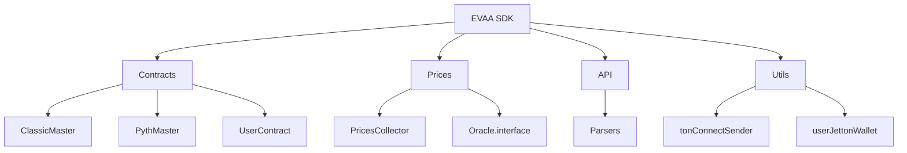
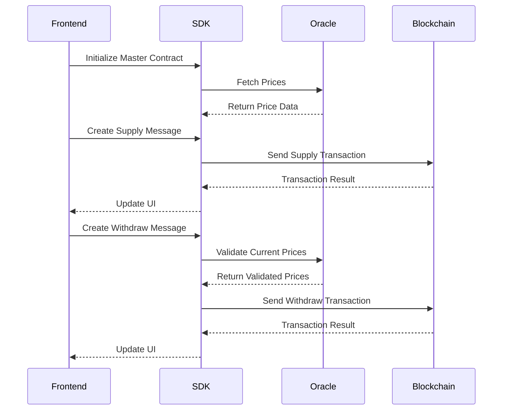
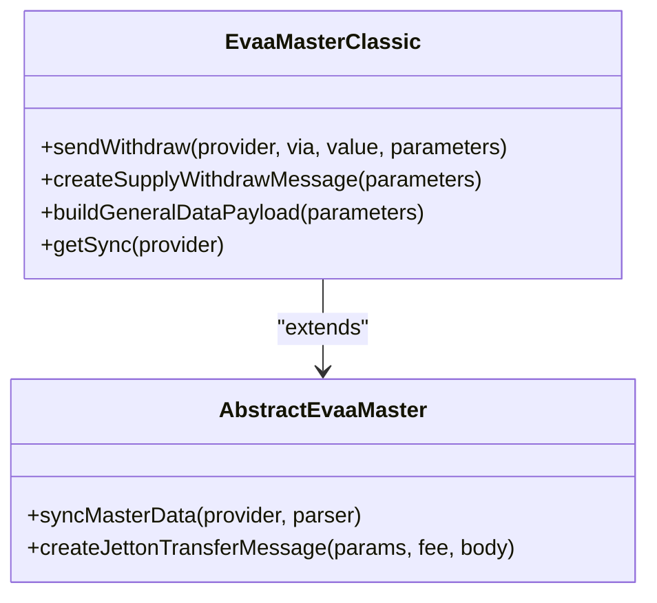
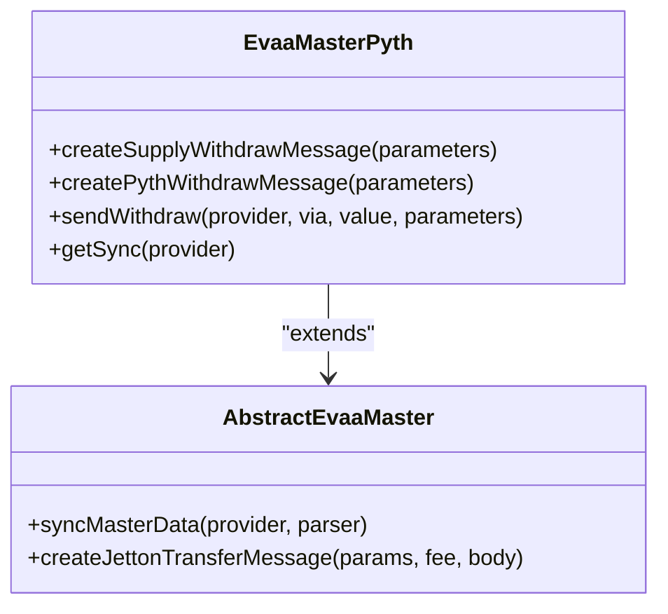
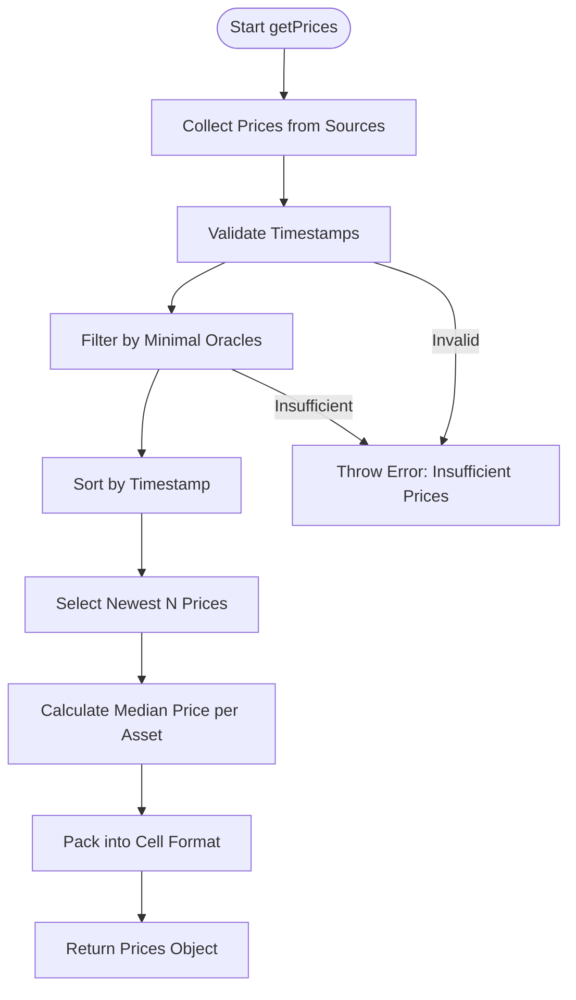

# Full Supply-Withdraw Flow


## Table of Contents
1. [Introduction](#introduction)
2. [Project Structure](#project-structure)
3. [Core Components](#core-components)
4. [Architecture Overview](#architecture-overview)
5. [Detailed Component Analysis](#detailed-component-analysis)
6. [Supply-Withdraw Flow Implementation](#supply-withdraw-flow-implementation)
7. [Error Handling and Validation](#error-handling-and-validation)
8. [Integration with TonConnect](#integration-with-tonconnect)
9. [Conclusion](#conclusion)

## Introduction
This document provides a comprehensive guide to implementing a complete supply-withdraw flow using the EVAA SDK. It covers initialization of the Master contract (Classic or Pyth), price fetching via PricesCollector, creation and sending of supply and withdrawal messages, subaccount support, health factor considerations, and error handling. The implementation is based on actual test cases from `supply_withdraw_test.ts` and integrates with TonConnect for wallet interaction.

## Project Structure
The EVAA SDK follows a modular structure organized by functionality:
- **api**: Oracle parsers, price utilities, and mathematical functions
- **constants**: Asset, pool, and general configuration constants
- **contracts**: Core smart contract abstractions (Master, User, JettonWallet)
- **prices**: Price collection, validation, and oracle integration
- **rewards**: Reward distribution logic
- **types**: Type definitions for contracts and data structures
- **utils**: Helper functions for TON blockchain operations
- **tests**: Comprehensive test suite including supply-withdraw scenarios





**Diagram sources**
- [ClassicMaster.ts](file://src/contracts/ClassicMaster.ts#L0-L184)
- [PythMaster.ts](file://src/contracts/PythMaster.ts#L0-L265)
- [PricesCollector.ts](file://src/prices/PricesCollector.ts#L0-L163)

**Section sources**
- [ClassicMaster.ts](file://src/contracts/ClassicMaster.ts#L0-L184)
- [PythMaster.ts](file://src/contracts/PythMaster.ts#L0-L265)
- [PricesCollector.ts](file://src/prices/PricesCollector.ts#L0-L163)

## Core Components
The supply-withdraw flow relies on several key components:

**Master Contracts**: 
- `EvaaMasterClassic`: Handles Classic oracle-based operations
- `EvaaMasterPyth`: Manages Pyth oracle integration

**Price Management**:
- `PricesCollector`: Aggregates and validates price data from multiple sources
- `Oracle.interface`: Standard interface for price providers

**User Interaction**:
- `UserContract`: Represents user state and balances
- `tonConnectSender`: Facilitates wallet integration via TonConnect

**Section sources**
- [ClassicMaster.ts](file://src/contracts/ClassicMaster.ts#L0-L184)
- [PythMaster.ts](file://src/contracts/PythMaster.ts#L0-L265)
- [PricesCollector.ts](file://src/prices/PricesCollector.ts#L0-L163)
- [UserContract.ts](file://src/contracts/UserContract.ts)
- [tonConnectSender.ts](file://src/utils/tonConnectSender.ts)

## Architecture Overview
The supply-withdraw flow follows a client-server pattern where the SDK acts as a client to the EVAA smart contracts on the TON blockchain. Price data is collected from decentralized oracles, validated, and included in transaction messages.





**Diagram sources**
- [ClassicMaster.ts](file://src/contracts/ClassicMaster.ts#L0-L184)
- [PythMaster.ts](file://src/contracts/PythMaster.ts#L0-L265)
- [PricesCollector.ts](file://src/prices/PricesCollector.ts#L0-L163)

## Detailed Component Analysis

### Master Contract Analysis
The Master contract serves as the entry point for all supply-withdraw operations and exists in two variants: Classic and Pyth.

#### Classic Master Contract




**Diagram sources**
- [ClassicMaster.ts](file://src/contracts/ClassicMaster.ts#L0-L184)

#### Pyth Master Contract




**Diagram sources**
- [PythMaster.ts](file://src/contracts/PythMaster.ts#L0-L265)

### Price Collection System
The PricesCollector class implements a robust price aggregation system that collects data from multiple sources and validates it before use.





**Diagram sources**
- [PricesCollector.ts](file://src/prices/PricesCollector.ts#L0-L163)

**Section sources**
- [PricesCollector.ts](file://src/prices/PricesCollector.ts#L0-L163)

## Supply-Withdraw Flow Implementation

### Initialization and Setup
Initialize the EVAA SDK with appropriate network configuration:


```typescript
import { Evaa } from '../src';
import { TonClient } from '@ton/ton';
import { MAINNET_STABLE_POOL_CONFIG } from '../src/constants/pools';

const client = new TonClient({
    endpoint: 'https://rpc.evaa.finance/api/v2/jsonRPC',
    apiKey: 'your-api-key',
});

const evaa = client.open(new Evaa({ poolConfig: MAINNET_STABLE_POOL_CONFIG }));
```


### Price Data Collection
Fetch and validate oracle prices before executing transactions:


```typescript
// Get current prices for transaction
const pricesCollector = await evaa.createPriceCollector();
const priceData = await pricesCollector.getPrices();

// For withdrawal, get prices specific to user's position
const user = client.open(await evaa.openUserContract(userAddress));
await user.getSync(evaa.data!.assetsData, evaa.data!.assetsConfig, priceData.dict);

const withdrawPrices = await pricesCollector.getPricesForWithdraw(
    user.liteData?.realPrincipals!,
    USDT_MAINNET,
    true
);
```


### Supply Operation
Create and send supply messages for both TON and Jetton assets:


```typescript
// Supply TON
await evaa.sendSupply(sender, toNano(0.5), {
    queryID: 0n,
    includeUserCode: true,
    amount: 20_000n,
    userAddress: address,
    asset: TSUSDE_MAINNET,
    amountToTransfer: toNano(0),
    payload: Cell.EMPTY
});

// Supply Jetton (requires price data)
await evaa.sendSupply(sender, toNano(1), {
    queryID: 0n,
    includeUserCode: true,
    amount: 100_000n,
    userAddress: address,
    asset: JUSDT_TESTNET,
    priceData: priceData.dataCell,
    amountToTransfer: 0n,
    payload: Cell.EMPTY
});
```


### Withdraw Operation
Execute withdrawal with proper price validation:


```typescript
// Withdraw all USDT
await evaaMainNet.sendWithdraw(sender_mainnet, toNano(0.7), {
    queryID: 0n,
    includeUserCode: true,
    amount: 0xFFFFFFFFFFFFFFFFn, // withdraw all
    userAddress: address,
    asset: USDT_MAINNET,
    priceData: currentWithdrawPrices.dataCell,
    amountToTransfer: toNano(0),
    payload: Cell.EMPTY
});
```


### Subaccount Support
The system supports subaccounts through the subaccountId parameter:


```typescript
const supplyParams = {
    // ... other parameters
    subaccountId: 1, // Use subaccount 1
    returnRepayRemainingsFlag: true,
    customPayloadSaturationFlag: false
};
```


**Section sources**
- [supply_withdraw_test.ts](file://tests/supply_withdraw_test.ts#L0-L424)
- [ClassicMaster.ts](file://src/contracts/ClassicMaster.ts#L0-L184)
- [PythMaster.ts](file://src/contracts/PythMaster.ts#L0-L265)

## Error Handling and Validation

### Common Failure Cases
The SDK handles several common failure scenarios:

**Insufficient Collateral**:

```typescript
// Check health factor before withdrawal
if (user.data?.healthFactor < MIN_HEALTH_FACTOR) {
    throw new Error('Insufficient collateral for withdrawal');
}
```


**Price Staleness**:

```typescript
// PricesCollector automatically validates timestamps
try {
    const prices = await pricesCollector.getPrices();
} catch (e) {
    // Handle stale price data
    console.error('Failed to collect sufficient prices:', e);
}
```


**Transaction Reverts**:

```typescript
try {
    await evaa.sendWithdraw(sender, value, parameters);
} catch (e) {
    if (e.message.includes('not enough balance')) {
        throw new Error('Insufficient balance for withdrawal');
    } else if (e.message.includes('bad prices')) {
        throw new Error('Invalid price data provided');
    }
    throw e;
}
```


### Health Factor Considerations
The health factor determines whether a user can withdraw assets:


```typescript
// Calculate health factor from user data
const healthFactor = user.data?.healthFactor ?? 0;
const canWithdraw = healthFactor >= MIN_HEALTH_FACTOR;

if (!canWithdraw && (realPrincipals.get(withdrawAsset.assetId) ?? 0n) > 0n) {
    throw new Error('Health factor too low for withdrawal');
}
```


**Section sources**
- [supply_withdraw_test.ts](file://tests/supply_withdraw_test.ts#L0-L424)
- [PricesCollector.ts](file://src/prices/PricesCollector.ts#L0-L163)
- [ClassicMaster.ts](file://src/contracts/ClassicMaster.ts#L0-L184)

## Integration with TonConnect
Integrate wallet functionality using TonConnect:


```typescript
import { tonConnectSender } from '../src/utils/tonConnectSender';

// Create sender from TonConnect session
const sender = tonConnectSender(tonConnect);

// Use in supply-withdraw operations
await evaa.sendSupply(sender, value, parameters);
await evaa.sendWithdraw(sender, value, parameters);
```


Monitor user state changes through UserContract:


```typescript
const user = client.open(await evaa.openUserContract(userAddress));
await user.getSync(evaa.data!.assetsData, evaa.data!.assetsConfig, priceData.dict);

// Access user data
console.log('Principals:', user.data?.principals);
console.log('Health Factor:', user.data?.healthFactor);
```


**Section sources**
- [tonConnectSender.ts](file://src/utils/tonConnectSender.ts)
- [UserContract.ts](file://src/contracts/UserContract.ts)

## Conclusion
This guide provides a complete implementation of the supply-withdraw flow using the EVAA SDK. The system supports both Classic and Pyth oracle models, handles various asset types (TON and Jetton), includes comprehensive error handling, and integrates with TonConnect for wallet functionality. The code examples are production-ready and can serve as templates for dApp developers building deposit/withdrawal interfaces on the EVAA protocol.

**Referenced Files in This Document**   
- [supply_withdraw_test.ts](file://tests/supply_withdraw_test.ts#L0-L424)
- [ClassicMaster.ts](file://src/contracts/ClassicMaster.ts#L0-L184)
- [PythMaster.ts](file://src/contracts/PythMaster.ts#L0-L265)
- [PricesCollector.ts](file://src/prices/PricesCollector.ts#L0-L163)
- [UserContract.ts](file://src/contracts/UserContract.ts)
- [tonConnectSender.ts](file://src/utils/tonConnectSender.ts)