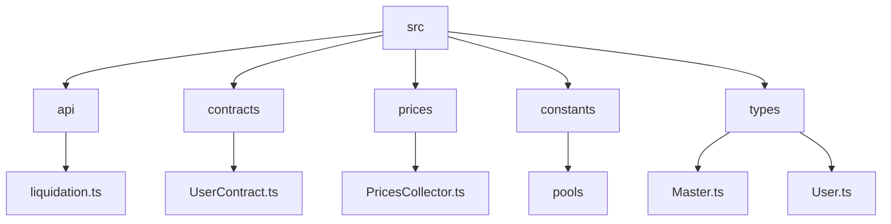
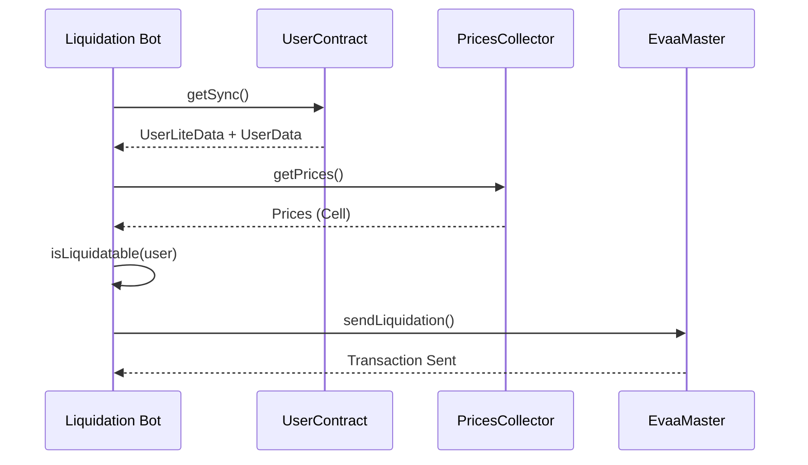
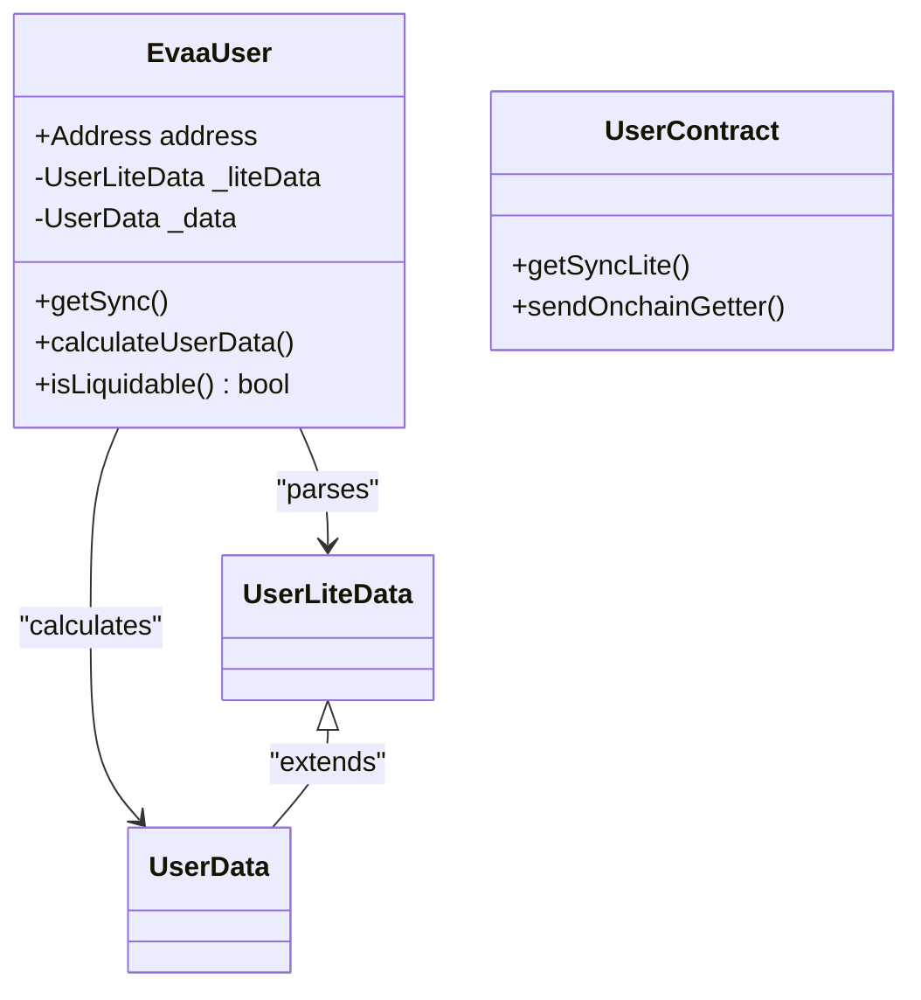
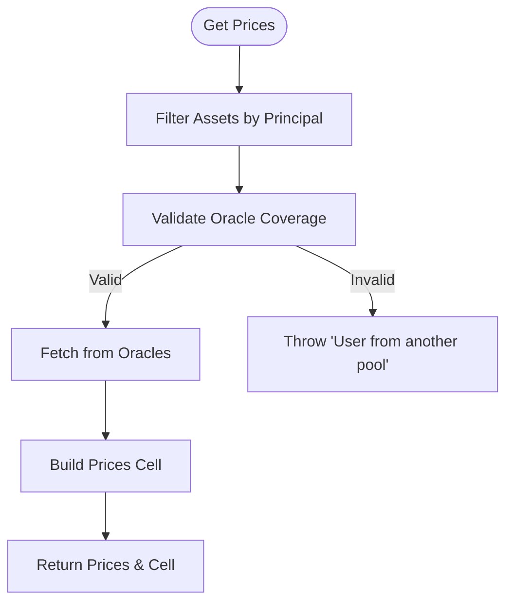
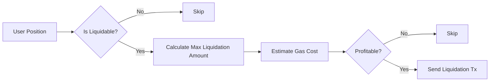

# Liquidation Bot Example


## Table of Contents
1. [Introduction](#introduction)
2. [Project Structure](#project-structure)
3. [Core Components](#core-components)
4. [Architecture Overview](#architecture-overview)
5. [Detailed Component Analysis](#detailed-component-analysis)
6. [Liquidation Workflow](#liquidation-workflow)
7. [Profitability and Safety Checks](#profitability-and-safety-checks)
8. [Error Handling and Edge Cases](#error-handling-and-edge-cases)
9. [Best Practices for Continuous Operation](#best-practices-for-continuous-operation)
10. [Testing on Testnet](#testing-on-testnet)

## Introduction
This document provides a comprehensive implementation guide for building an automated liquidation bot using the EVAA SDK. The bot monitors user positions, calculates health factors, fetches real-time prices, and executes profitable liquidations across assets. It covers integration with core SDK components such as `UserContract`, `PricesCollector`, and liquidation utilities, while incorporating real-world edge cases like partial liquidations and timing windows.

## Project Structure
The EVAA SDK is organized into modular directories that separate concerns such as API logic, contract wrappers, price handling, and utilities. Key directories include:
- `src/api`: Core logic for parsing, math, and liquidation calculations
- `src/contracts`: Contract wrappers like `UserContract` for interacting with on-chain entities
- `src/prices`: Price collection and oracle integration via `PricesCollector`
- `tests`: Real-world usage examples, including `withdraw_pyth_test.ts`





**Diagram sources**
- [UserContract.ts](file://src/contracts/UserContract.ts)
- [PricesCollector.ts](file://src/prices/PricesCollector.ts)
- [liquidation.ts](file://src/api/liquidation.ts)

**Section sources**
- [project_structure](file://workspace_path)

## Core Components
The liquidation bot relies on several core components from the EVAA SDK:
- **UserContract**: Wraps user contract state and exposes health factor and liquidation parameters
- **PricesCollector**: Aggregates price data from multiple oracles for accurate valuation
- **Liquidation Utilities**: Functions to calculate max liquidation amounts, collateral rewards, and min collateral thresholds

These components enable the bot to assess liquidation opportunities, validate profitability, and construct correct transaction payloads.

**Section sources**
- [UserContract.ts](file://src/contracts/UserContract.ts#L1-L145)
- [PricesCollector.ts](file://src/prices/PricesCollector.ts#L1-L60)
- [liquidation.ts](file://src/api/liquidation.ts#L1-L345)

## Architecture Overview
The liquidation bot follows a periodic polling architecture:
1. Query active user contracts
2. Fetch latest oracle prices via `PricesCollector`
3. Calculate health factors using `parseUserData`
4. Identify liquidatable users
5. Compute optimal liquidation parameters
6. Send liquidation transaction via `sendLiquidation`





**Diagram sources**
- [UserContract.ts](file://src/contracts/UserContract.ts#L60-L100)
- [PricesCollector.ts](file://src/prices/PricesCollector.ts#L26-L60)
- [README.md](file://docs/README.md#L169-L221)

## Detailed Component Analysis

### UserContract Analysis
The `EvaaUser` class wraps a user's contract state and provides methods to synchronize and interpret on-chain data.





**Diagram sources**
- [UserContract.ts](file://src/contracts/UserContract.ts#L1-L145)

**Section sources**
- [UserContract.ts](file://src/contracts/UserContract.ts#L1-L145)

### PricesCollector Analysis
`PricesCollector` aggregates price data from multiple sources and ensures sufficient oracle coverage before returning prices.





**Diagram sources**
- [PricesCollector.ts](file://src/prices/PricesCollector.ts#L26-L60)

**Section sources**
- [PricesCollector.ts](file://src/prices/PricesCollector.ts#L26-L60)

## Liquidation Workflow
To execute a liquidation:
1. Synchronize with the master contract using `getSync`
2. Open the target user contract and call `getSync` with current prices
3. Check `isLiquidable` property
4. If liquidable, extract `liquidationParameters`
5. Construct `sendLiquidation` call with proper flags and price data

Example from documentation:

```ts
if (user.isLiquidable) {
    const liquidationData = user.liquidationParameters!;
    const includeUserCode = evaa.data!.upgradeConfig.userCodeVersion !== user.liteData!.codeVersion;
    await evaa.sendLiquidation(sender, FEES.LIQUIDATION, {
        queryID: 0n,
        liquidatorAddress: wallet.address,
        includeUserCode,
        priceData: priceData!.dataCell,
        ...liquidationData,
        type: 'ton',
    });
}
```


**Section sources**
- [README.md](file://docs/README.md#L169-L221)

## Profitability and Safety Checks
The SDK provides utilities to ensure safe and profitable liquidations:
- `calculateLiquidationAmounts`: Computes max loan amount to transfer and max collateral reward
- `calculateMinCollateralByTransferredAmount`: Enforces minimum collateral return when partial liquidation is performed
- `isBadDebt`: Detects if a position is economically unviable to liquidate

Cross-asset liquidations are supported by specifying different loan and collateral assets in the liquidation parameters.





**Section sources**
- [liquidation.ts](file://src/api/liquidation.ts#L1-L345)

## Error Handling and Edge Cases
The bot must handle several edge cases:
- **Empty or missing prices**: Skip assets without price data
- **Different pool assets**: `PricesCollector` throws "User from another pool" if principals reference invalid assets
- **Single asset debt**: Cannot liquidate if only one asset is supplied and in debt
- **Timing windows**: Use `getSync` before every operation to ensure fresh state

From test suite:

```ts
await expect(oracle.getPricesForLiquidate(principals, fetchConfig)).rejects.toThrow('User from another pool');
```


**Section sources**
- [PricesCollector.ts](file://src/prices/PricesCollector.ts#L26-L60)
- [PythCollector.test.ts](file://tests/prices/PythCollector.test.ts#L188-L209)

## Best Practices for Continuous Operation
For reliable 24/7 operation:
- **Rate limiting**: Avoid overwhelming RPC endpoints
- **Error recovery**: Retry failed transactions with exponential backoff
- **Monitoring**: Log liquidation attempts, successes, and gas costs
- **Batching**: Group multiple liquidations in a single block when possible
- **Gas estimation**: Simulate transactions before sending

Use `withdraw_pyth_test.ts` as a reference for wallet integration and transaction sending patterns.

**Section sources**
- [withdraw_pyth_test.ts](file://tests/withdraw_pyth_test.ts#L0-L98)

## Testing on Testnet
Before deployment:
1. Use testnet configuration (`TESTNET_CLASSIC_POOL_CONFIG_TOB_AUDITED`)
2. Fund test wallet with testnet TON
3. Monitor logs for successful withdrawals and liquidations
4. Validate that `sendLiquidation` constructs correct payloads
5. Test edge cases like zero balance and inactive contracts

Example testnet setup:

```ts
const TON_CLIENT = new TonClient({
    endpoint: 'https://testnet.toncenter.com/api/v2/jsonRPC',
});
```


**Section sources**
- [withdraw_pyth_test.ts](file://tests/withdraw_pyth_test.ts#L0-L98)

**Referenced Files in This Document**   
- [withdraw_pyth_test.ts](file://tests/withdraw_pyth_test.ts)
- [PricesCollector.ts](file://src/prices/PricesCollector.ts)
- [liquidation.ts](file://src/api/liquidation.ts)
- [UserContract.ts](file://src/contracts/UserContract.ts)
- [README.md](file://docs/README.md)