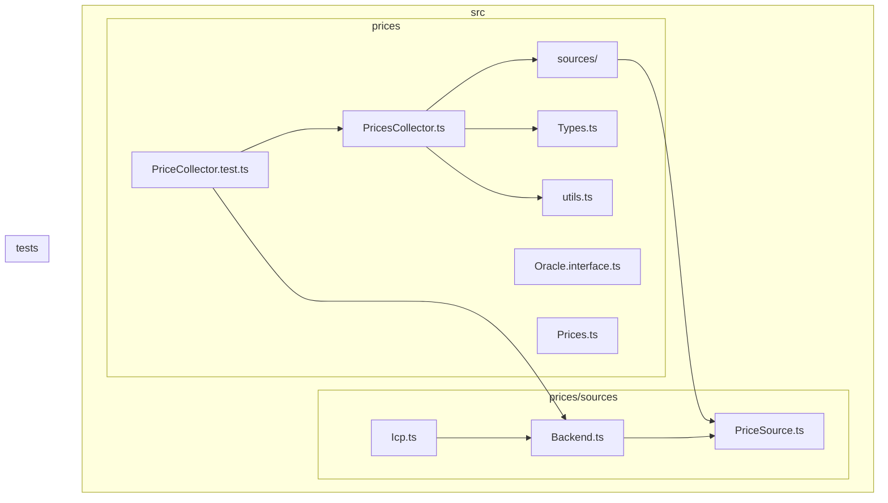
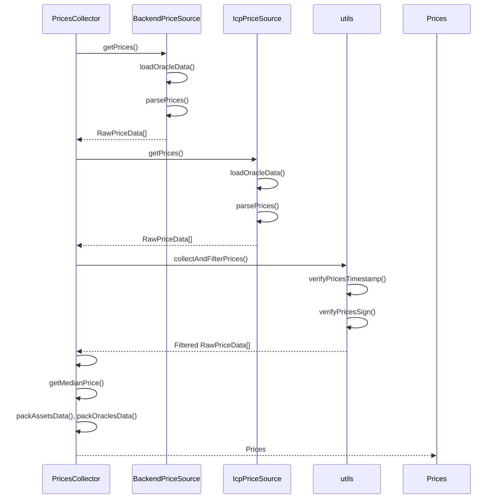
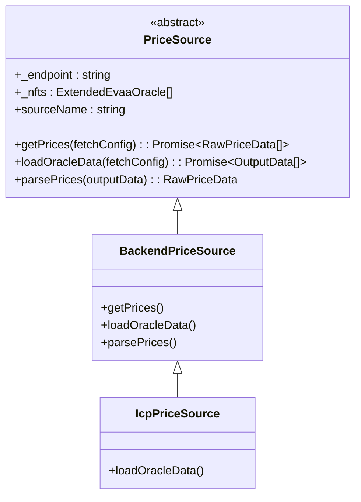
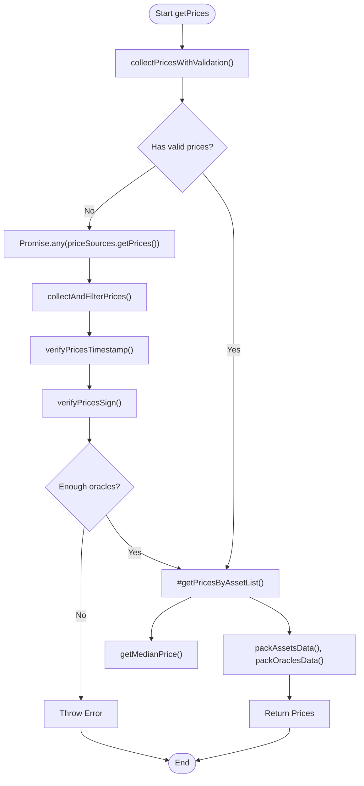
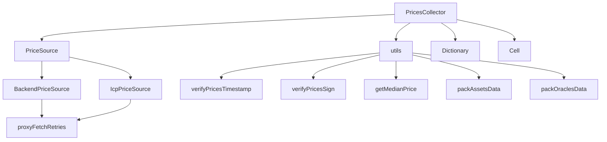

# Price Monitoring Script


## Table of Contents
1. [Introduction](#introduction)
2. [Project Structure](#project-structure)
3. [Core Components](#core-components)
4. [Architecture Overview](#architecture-overview)
5. [Detailed Component Analysis](#detailed-component-analysis)
6. [Dependency Analysis](#dependency-analysis)
7. [Performance Considerations](#performance-considerations)
8. [Troubleshooting Guide](#troubleshooting-guide)
9. [Conclusion](#conclusion)

## Introduction
This document provides a comprehensive guide to implementing a standalone price monitoring script using the EVAA SDK's `PricesCollector` module. The goal is to demonstrate how to initialize the collector with multiple price sources (Backend, ICP), configure validation thresholds for timestamp freshness and data quality, and periodically fetch raw prices. It covers computing medianized values per asset, validating against on-chain expectations, logging mechanisms for tracking price drift and source reliability, and integrating alerts when deviations exceed configurable bounds. Real code patterns from `supply_withdraw_test.ts` are used to illustrate proper error handling and retry logic.

## Project Structure
The EVAA SDK is organized into modular directories that separate concerns such as API interfaces, constants, contracts, price handling, rewards, types, and utilities. The core functionality for price collection resides under `src/prices`, which includes sources, collectors, utilities, and type definitions.





**Diagram sources**
- [PricesCollector.ts](file://src/prices/PricesCollector.ts)
- [Backend.ts](file://src/prices/sources/Backend.ts)
- [Icp.ts](file://src/prices/sources/Icp.ts)
- [PriceSource.ts](file://src/prices/sources/PriceSource.ts)
- [PriceCollector.test.ts](file://tests/prices/PriceCollector.test.ts)

**Section sources**
- [PricesCollector.ts](file://src/prices/PricesCollector.ts)
- [Backend.ts](file://src/prices/sources/Backend.ts)
- [Icp.ts](file://src/prices/sources/Icp.ts)

## Core Components

The core components of the price monitoring system include:
- **PricesCollector**: Central class responsible for aggregating prices from multiple sources.
- **PriceSource**: Abstract base class for all price data providers.
- **BackendPriceSource & IcpPriceSource**: Concrete implementations for fetching price data.
- **RawPriceData**: Interface defining the structure of raw price data.
- **verifyPricesTimestamp & verifyPricesSign**: Validation functions ensuring data freshness and authenticity.

These components work together to collect, validate, and process price data from decentralized or centralized endpoints.

**Section sources**
- [PricesCollector.ts](file://src/prices/PricesCollector.ts#L1-L164)
- [Types.ts](file://src/prices/Types.ts#L1-L63)
- [utils.ts](file://src/prices/utils.ts#L1-L165)

## Architecture Overview

The architecture follows a modular design where the `PricesCollector` orchestrates multiple `PriceSource` instances to retrieve price data. Each source independently fetches data, which is then validated for timestamp freshness and cryptographic signature integrity before aggregation.





**Diagram sources**
- [PricesCollector.ts](file://src/prices/PricesCollector.ts#L50-L150)
- [Backend.ts](file://src/prices/sources/Backend.ts#L10-L60)
- [Icp.ts](file://src/prices/sources/Icp.ts#L10-L30)
- [utils.ts](file://src/prices/utils.ts#L10-L100)

## Detailed Component Analysis

### PricesCollector Analysis
The `PricesCollector` class implements the `Oracle` interface and serves as the main orchestrator for collecting and validating price data from multiple sources.

#### Class Diagram

```mermaid
classDiagram
class PricesCollector {
-prices : RawPriceData[]
-poolAssetsConfig : PoolAssetsConfig
-sourcesConfig : PriceSourcesConfig
-priceSources : PriceSource[]
-minimalOracles : number
+constructor(config : PricesCollectorConfig)
+getPricesForLiquidate(principals, fetchConfig) : Promise~Prices~
+getPricesForWithdraw(principals, withdrawAsset, collateralToDebt, fetchConfig) : Promise~Prices~
+getPricesForSupplyWithdraw(...) : Promise~Prices~
+getPrices(assets, fetchConfig) : Promise~Prices~
#getPricesByAssetList(assets) : {dict, dataCell}
#collectPrices(fetchConfig) : Promise~boolean~
#collectPricesWithValidation(fetchConfig) : Promise~void~
#filterPrices() : number
#filterEmptyPrincipalsAndAssets(principals) : PoolAssetConfig[]
}
class Oracle {
<<interface>>
+getPrices(...) : Promise~Prices~
}
PricesCollector --> Oracle : implements
PricesCollector --> PriceSource : uses
PricesCollector --> RawPriceData : processes
PricesCollector --> Prices : outputs
```


**Diagram sources**
- [PricesCollector.ts](file://src/prices/PricesCollector.ts#L1-L164)
- [Oracle.interface.ts](file://src/prices/Oracle.interface.ts)

**Section sources**
- [PricesCollector.ts](file://src/prices/PricesCollector.ts#L1-L164)

### Price Source Implementation
The price source hierarchy allows extensible integration of different oracle networks.

#### Inheritance Structure




**Diagram sources**
- [PriceSource.ts](file://src/prices/sources/PriceSource.ts)
- [Backend.ts](file://src/prices/sources/Backend.ts)
- [Icp.ts](file://src/prices/sources/Icp.ts)

**Section sources**
- [PriceSource.ts](file://src/prices/sources/PriceSource.ts#L1-L20)
- [Backend.ts](file://src/prices/sources/Backend.ts#L1-L65)
- [Icp.ts](file://src/prices/sources/Icp.ts#L1-L31)

### Data Flow and Validation Logic
The system ensures data integrity through timestamp and signature validation before aggregation.

#### Flowchart of Price Collection




**Diagram sources**
- [PricesCollector.ts](file://src/prices/PricesCollector.ts#L100-L150)
- [utils.ts](file://src/prices/utils.ts#L50-L100)

**Section sources**
- [PricesCollector.ts](file://src/prices/PricesCollector.ts#L100-L150)
- [utils.ts](file://src/prices/utils.ts#L50-L100)

## Dependency Analysis

The price monitoring system has a clear dependency chain from high-level orchestration down to low-level data retrieval and validation.





**Diagram sources**
- [PricesCollector.ts](file://src/prices/PricesCollector.ts)
- [utils.ts](file://src/prices/utils.ts)
- [Backend.ts](file://src/prices/sources/Backend.ts)
- [Icp.ts](file://src/prices/sources/Icp.ts)

**Section sources**
- [PricesCollector.ts](file://src/prices/PricesCollector.ts)
- [utils.ts](file://src/prices/utils.ts)
- [Backend.ts](file://src/prices/sources/Backend.ts)
- [Icp.ts](file://src/prices/sources/Icp.ts)

## Performance Considerations
When implementing a price monitoring script, consider the following performance aspects:

- **Polling Frequency**: Use configurable intervals to avoid overwhelming endpoints.
- **Caching Strategy**: Cache recent valid price sets to reduce redundant network calls.
- **Resource Usage**: Limit concurrent requests and use efficient data structures.
- **Error Handling**: Implement retry logic with exponential backoff via `proxyFetchRetries`.
- **Validation Overhead**: Timestamp and signature checks add minimal computational cost but are critical for security.

The use of `Promise.any()` in `#collectPrices()` ensures fast resolution from the first successful source, improving responsiveness.

## Troubleshooting Guide
Common issues and their solutions:

**Section sources**
- [PricesCollector.ts](file://src/prices/PricesCollector.ts#L120-L140)
- [utils.ts](file://src/prices/utils.ts#L50-L80)
- [PriceCollector.test.ts](file://tests/prices/PriceCollector.test.ts#L100-L180)

### Issue: Insufficient Valid Prices
**Symptom**: `Error per updating prices, valid X of Y`
**Cause**: Not enough sources returned fresh, signed data
**Solution**: 
- Check network connectivity
- Verify oracle public keys match expected values
- Ensure system clock is synchronized
- Increase `minimalOracles` threshold or add more sources

### Issue: Signature Verification Failure
**Symptom**: Prices rejected despite valid timestamps
**Cause**: Mismatch between oracle public key and signature
**Solution**: Validate `evaaOracles` configuration contains correct NFT metadata

### Issue: Empty Prices Cell
**Symptom**: `Cell.EMPTY` returned unexpectedly
**Cause**: User has no debt or single-asset collateral scenario
**Solution**: Review business logic in `getPricesForWithdraw` and `collateralToDebt` flag usage

## Conclusion
The EVAA SDK's `PricesCollector` provides a robust foundation for building price monitoring systems. By leveraging multiple price sources, cryptographic validation, and medianization, it enables reliable oracle watching, MEV protection, and protocol monitoring. The modular design allows easy extension with new price sources while maintaining strong data integrity guarantees. Proper configuration of validation thresholds and integration of alerting mechanisms can create a production-ready monitoring solution.

**Referenced Files in This Document**   
- [PricesCollector.ts](file://src/prices/PricesCollector.ts)
- [Backend.ts](file://src/prices/sources/Backend.ts)
- [Icp.ts](file://src/prices/sources/Icp.ts)
- [PriceSource.ts](file://src/prices/sources/PriceSource.ts)
- [Types.ts](file://src/prices/Types.ts)
- [utils.ts](file://src/prices/utils.ts)
- [PriceCollector.test.ts](file://tests/prices/PriceCollector.test.ts)