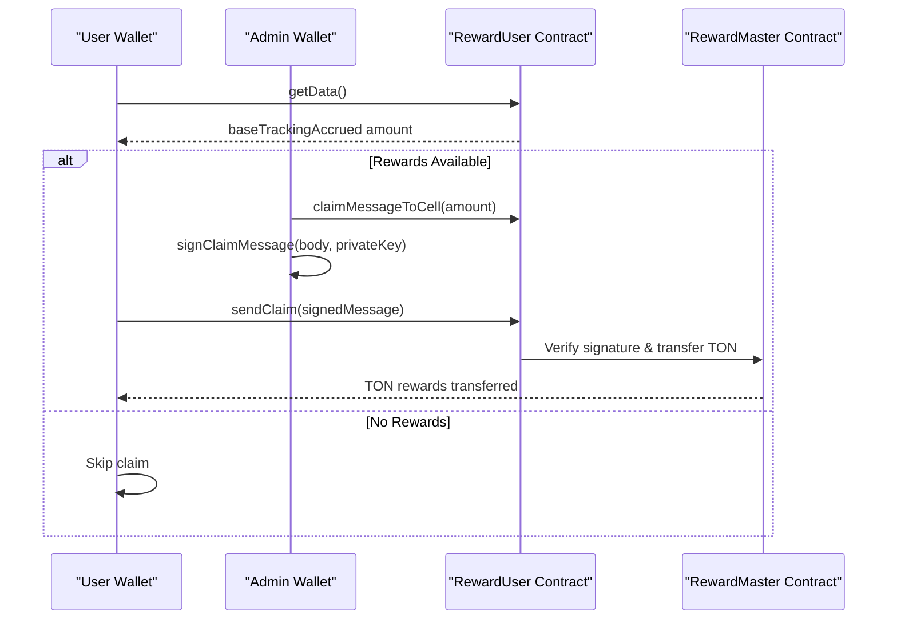

# Reward Claim Automation


## Table of Contents
1. [Introduction](#introduction)
2. [Core Components Overview](#core-components-overview)
3. [Initialization of Reward Contracts](#initialization-of-reward-contracts)
4. [Querying Pending Rewards](#querying-pending-rewards)
5. [Constructing and Signing Claim Messages](#constructing-and-signing-claim-messages)
6. [Sending Claim Transactions](#sending-claim-transactions)
7. [Error Handling and Validation](#error-handling-and-validation)
8. [Batch Claiming Strategy](#batch-claiming-strategy)
9. [Deployment Considerations for Automated Services](#deployment-considerations-for-automated-services)
10. [Sequence Diagram: Reward Claim Flow](#sequence-diagram-reward-claim-flow)

## Introduction
This document provides a comprehensive implementation guide for automating TON reward claims using the EVAA SDK's rewards module. It details the initialization of `RewardMaster` and `RewardUser` contracts, querying pending rewards, constructing and sending claim transactions, and handling common errors. The implementation is based on the `claim_ton.test.ts` test file and relevant source code from the EVAA SDK. The guide also covers strategies for batch claiming and deployment best practices for running secure automated claim services.

## Core Components Overview
The EVAA SDK’s rewards system is built around two primary smart contracts: `RewardMaster` and `RewardUser`. These contracts manage the distribution and claiming of rewards, particularly for TON tokens.

- **RewardMaster**: Manages the global reward pool, admin operations (top-up, withdrawal), and calculates user-specific reward contract addresses.
- **RewardUser**: Represents a user’s individual reward contract, responsible for storing accrued rewards and processing claims.
- **EvaaUserRewards**: A helper class that abstracts the creation and interaction with `RewardUser` contracts.

These components work in tandem to enable secure, scalable reward distribution with cryptographic verification.

**Section sources**
- [RewardMaster.ts](file://src/rewards/RewardMaster.ts#L0-L109)
- [RewardUser.ts](file://src/rewards/RewardUser.ts#L0-L89)
- [EvaaRewards.ts](file://src/rewards/EvaaRewards.ts#L0-L23)

## Initialization of Reward Contracts
To begin interacting with the reward system, both `RewardMaster` and `RewardUser` contracts must be initialized using configuration data.

### RewardMaster Initialization
The `RewardMaster` contract is initialized using `EvaaRewardsConfig`, which includes:
- `adminAddress`: Admin wallet address
- `evaaMasterAddress`: Associated master contract
- `rewardMasterCode`: Contract bytecode
- `asset`: Token configuration (e.g., TON)
- `publicKey`: Public key for signature verification

Example from `mainnet.ts`:

```ts
export const MAINNET_MASTER_TON_REWARD_CONFIG: EvaaRewardsConfig = {
    adminAddress: EVAA_TON_REWARDS_MASTER_MAINNET,
    evaaMasterAddress: new Address(0, Buffer.alloc(32, 0)),
    rewardMasterCode: EVAA_REWARDS_MASTER_CODE_MAINNET,
    rewardUserCode: EVAA_REWARDS_USER_CODE_MAINNET,
    asset: TON_MAINNET,
    availableReward: 0,
    publicKey: Buffer.from('bfe9a30221db4dff4c17e55d985e0b13a8f597bbb28002f311dc4429dad1ca95', 'hex'),
};
```


The contract is instantiated via:

```ts
const rewardMaster = RewardMaster.createFromConfig(config);
```


### RewardUser Initialization
The `RewardUser` contract is derived from the user’s wallet address and the `RewardMaster` configuration. The `EvaaUserRewards` class simplifies this:


```ts
const userReward = new EvaaUserRewards(userWallet.address, config);
const userRewardContract = userReward.openContract(); // Returns RewardUser instance
```


This internally calls `RewardUser.createFromConfig()` with the correct parameters.

**Section sources**
- [mainnet.ts](file://src/constants/pools/mainnet.ts#L170-L178)
- [EvaaRewards.ts](file://src/rewards/EvaaRewards.ts#L18-L23)
- [RewardMaster.ts](file://src/rewards/RewardMaster.ts#L28-L42)
- [RewardUser.ts](file://src/rewards/RewardUser.ts#L38-L46)

## Querying Pending Rewards
Before claiming, it's essential to query the user’s pending rewards. This is done by calling the `getData()` method on the `RewardUser` contract.


```ts
const userData = await userRewardContract.getData(provider);
```


The returned data includes:
- `baseTrackingAccrued`: The amount of TON rewards accrued (in nanoTON)
- `userAddress`: User’s wallet address
- `rewardMasterAddress`: Associated master contract

This value should be checked before proceeding with a claim. If `baseTrackingAccrued` is zero, no claim should be attempted.

**Section sources**
- [RewardUser.ts](file://src/rewards/RewardUser.ts#L75-L89)

## Constructing and Signing Claim Messages
Claiming rewards involves creating a signed message that proves authorization from the admin.

### Step 1: Create Claim Message Body

```ts
const claimAmount = 1_100_000_000n; // nanoTON
const claimBody = userRewardContract.claimMessageToCell(claimAmount);
```


This creates a cell containing:
- User contract address
- Claim amount in nanoTON

### Step 2: Sign the Message
The claim body must be signed by the admin’s private key:


```ts
const signedCell = userRewardContract.signClaimMessage(claimBody, adminPrivateKey);
```


Internally, this:
1. Hashes the claim body
2. Signs the hash with Ed25519
3. Constructs a final cell with:
   - Opcode `0x2` (`REWARD_CLAIM`)
   - Signature buffer
   - Reference to the original claim body

**Section sources**
- [RewardUser.ts](file://src/rewards/RewardUser.ts#L50-L67)

## Sending Claim Transactions
Once signed, the claim message is sent via the user’s wallet sender.


```ts
await userRewardContract.sendClaim(userWallet.sender(userSecretKey), signedCell);
```


The `sendClaim` method sends an internal message with:
- **Value**: `FEES.REWARD_USER_CLAIM` (0.1 TON)
- **Send Mode**: `PAY_GAS_SEPARATELY`
- **Body**: The signed claim message

This triggers the reward contract to transfer the specified amount to the user.

**Section sources**
- [RewardUser.ts](file://src/rewards/RewardUser.ts#L69-L73)

## Error Handling and Validation
Robust automation must handle common failure scenarios.

### Common Errors
| Error | Cause | Mitigation |
|------|------|-----------|
| Zero rewards | No accrued rewards | Check `baseTrackingAccrued > 0` before claiming |
| Invalid signature | Wrong admin key or corrupted message | Validate admin key and message integrity |
| Insufficient gas | Sender wallet lacks funds | Ensure wallet has >0.1 TON for fees |
| Network congestion | High load on TON blockchain | Retry with exponential backoff |

### Example Validation Flow

```ts
const userData = await userRewardContract.getData(provider);
if (userData.baseTrackingAccrued === 0) {
    console.log("No rewards to claim");
    return;
}

if (userData.baseTrackingAccrued < claimAmount) {
    claimAmount = BigInt(userData.baseTrackingAccrued);
}
```


**Section sources**
- [claim_ton.test.ts](file://tests/rewards/claim_ton.test.ts#L25-L43)
- [RewardUser.ts](file://src/rewards/RewardUser.ts#L75-L89)

## Batch Claiming Strategy
For multiple users, batch claiming improves efficiency.

### Approach
1. **Parallel Queries**: Fetch `getData()` for all users concurrently.
2. **Filter Eligible Users**: Only process users with `baseTrackingAccrued > 0`.
3. **Sequential Claims**: Send claims one at a time to avoid nonce conflicts.
4. **Rate Limiting**: Respect TON blockchain throughput (~5-10 tx/sec per account).

### Example Batch Logic

```ts
for (const user of users) {
    const contract = getRewardUserContract(user.address);
    const data = await contract.getData(provider);
    if (data.baseTrackingAccrued > threshold) {
        await claimForUser(user, contract);
    }
}
```


This ensures cost-effective and reliable batch processing.

## Deployment Considerations for Automated Services
Running an automated claim service requires attention to security and reliability.

### Key Management
- Store admin private keys in secure environments (e.g., AWS KMS, Hashicorp Vault)
- Never hardcode keys in source code
- Use environment variables with restricted access

### Monitoring
- Log all claim attempts (success/failure)
- Monitor gas balance of sender wallets
- Set up alerts for failed transactions

### Infrastructure
- Run on reliable cloud providers with uptime SLAs
- Use process managers (e.g., PM2, systemd) for restart resilience
- Implement health checks and liveness probes

### Security
- Restrict network access to trusted IPs
- Rotate keys periodically
- Audit transaction logs regularly

## Sequence Diagram: Reward Claim Flow
The following diagram illustrates the complete flow of a reward claim from initialization to execution.





**Diagram sources**
- [RewardUser.ts](file://src/rewards/RewardUser.ts#L50-L89)
- [claim_ton.test.ts](file://tests/rewards/claim_ton.test.ts#L25-L43)

**Section sources**
- [RewardUser.ts](file://src/rewards/RewardUser.ts#L50-L89)
- [claim_ton.test.ts](file://tests/rewards/claim_ton.test.ts#L25-L43)

**Referenced Files in This Document**   
- [claim_ton.test.ts](file://tests/rewards/claim_ton.test.ts)
- [EvaaRewards.ts](file://src/rewards/EvaaRewards.ts)
- [RewardUser.ts](file://src/rewards/RewardUser.ts)
- [RewardMaster.ts](file://src/rewards/RewardMaster.ts)
- [general/index.ts](file://src/constants/general/index.ts)
- [mainnet.ts](file://src/constants/pools/mainnet.ts)