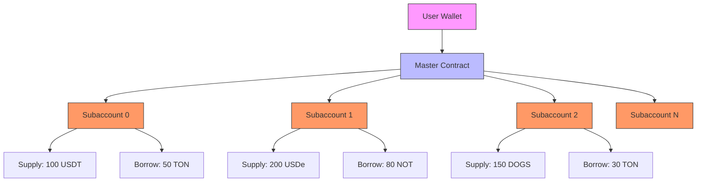
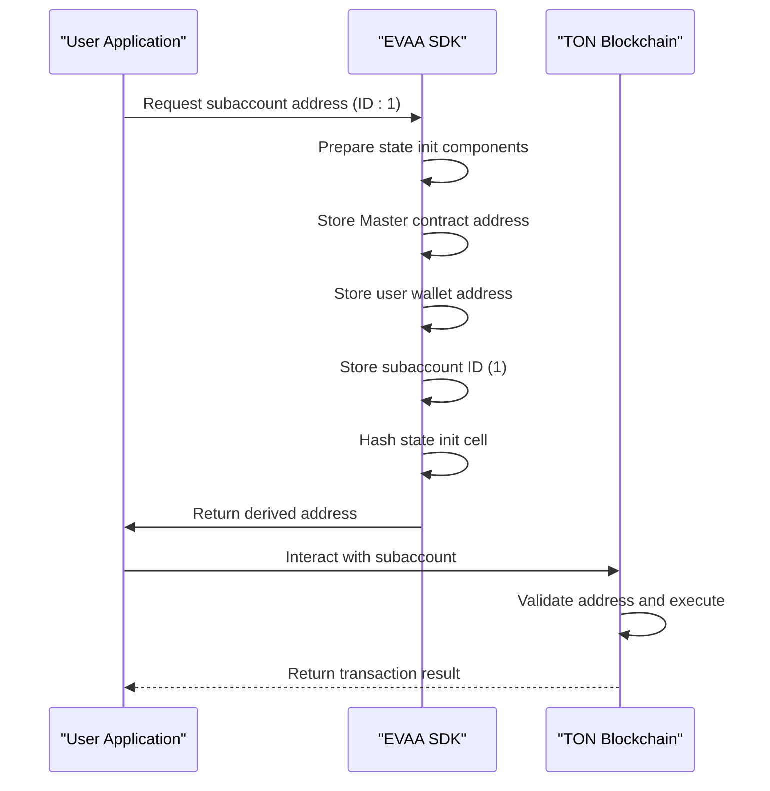
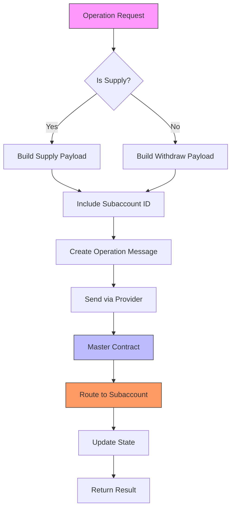

# Subaccount Management Patterns


## Table of Contents
1. [Introduction](#introduction)
2. [Subaccount Architecture Overview](#subaccount-architecture-overview)
3. [Subaccount Address Derivation](#subaccount-address-derivation)
4. [Supply and Withdraw Operations Across Subaccounts](#supply-and-withdraw-operations-across-subaccounts)
5. [Common Subaccount Management Patterns](#common-subaccount-management-patterns)
6. [Subaccount Validation and Boundaries](#subaccount-validation-and-boundaries)
7. [Best Practices for Production Use](#best-practices-for-production-use)

## Introduction
This document provides a comprehensive guide to implementing advanced subaccount management using the EVAA SDK. Subaccounts are a critical feature in the EVAA lending protocol, enabling users to isolate risk, segregate positions, and manage multiple strategies under a single master contract instance. This guide explains the technical implementation of subaccounts, demonstrates how to derive subaccount addresses, and shows how to perform supply and withdraw operations across multiple subaccounts. The analysis is based on test cases and implementation details from the EVAA SDK codebase, with a focus on practical usage patterns and production considerations.

## Subaccount Architecture Overview
The EVAA protocol implements subaccounts as distinct smart contract instances derived from a user's base wallet address and a subaccount identifier. Each subaccount operates as an independent lending position with its own balance, principal, and health factor, while sharing the underlying Master contract infrastructure. This architecture enables efficient state management and gas optimization while maintaining strong isolation between different positions.

The subaccount system is built on top of the TON blockchain's smart contract capabilities, using deterministic address derivation to create unique contract addresses for each subaccount. This approach eliminates the need for on-chain mapping storage, reducing gas costs and improving scalability.





**Diagram sources**
- [AbstractMaster.ts](file://src/contracts/AbstractMaster.ts#L363-L397)
- [SubaccountCalculation.test.ts](file://tests/address/SubaccountCalculation.test.ts#L0-L21)

**Section sources**
- [AbstractMaster.ts](file://src/contracts/AbstractMaster.ts#L363-L397)
- [SubaccountCalculation.test.ts](file://tests/address/SubaccountCalculation.test.ts#L0-L21)

## Subaccount Address Derivation
Subaccount addresses are deterministically derived using the user's wallet address, the Master contract's lending code, and a subaccount identifier. The `calculateUserSCAddr` method in the Evaa class computes the unique address for each subaccount by hashing a state initialization cell that incorporates these three components.

The derivation process follows TON's smart contract address generation rules, ensuring that each subaccount has a unique and predictable address. This deterministic approach enables clients to calculate subaccount addresses off-chain without requiring on-chain queries, improving performance and user experience.





**Diagram sources**
- [SubaccountCalculation.test.ts](file://tests/address/SubaccountCalculation.test.ts#L23-L53)
- [AbstractMaster.ts](file://src/contracts/AbstractMaster.ts#L363-L397)

**Section sources**
- [SubaccountCalculation.test.ts](file://tests/address/SubaccountCalculation.test.ts#L23-L53)
- [AbstractMaster.ts](file://src/contracts/AbstractMaster.ts#L363-L397)

The `openUserContract` method provides a convenient interface for accessing subaccounts, with subaccount ID 0 as the default:


```typescript
openUserContract(userAddress: Address, subaccountId: number = 0): EvaaUser {
    return EvaaUser.createFromAddress(
        this.calculateUserSCAddr(userAddress, this._poolConfig.lendingCode, subaccountId),
        this._poolConfig,
    );
}
```


This implementation ensures that calling `openUserContract` without a subaccount ID parameter returns the default subaccount (ID 0), maintaining backward compatibility while enabling expanded functionality.

## Supply and Withdraw Operations Across Subaccounts
The EVAA SDK supports supply and withdraw operations across multiple subaccounts using the same Master contract instance. This capability is demonstrated in the `supply_withdraw_test.ts` file, which contains test cases for various supply and withdraw scenarios.

The supply and withdraw operations are implemented through message routing that includes the subaccount ID in the transaction payload. The Master contract uses this identifier to route the operation to the correct subaccount state, ensuring proper isolation and state synchronization.





**Diagram sources**
- [ClassicMaster.ts](file://src/contracts/ClassicMaster.ts#L44-L80)
- [supply_withdraw_test.ts](file://tests/supply_withdraw_test.ts#L143-L168)

**Section sources**
- [ClassicMaster.ts](file://src/contracts/ClassicMaster.ts#L44-L80)
- [supply_withdraw_test.ts](file://tests/supply_withdraw_test.ts#L143-L168)

The `buildGeneralDataPayload` method in the Master contract classes includes the subaccount ID in the transaction payload:


```typescript
buildGeneralDataPayload(parameters: ClassicSupplyWithdrawParameters): Cell {
    return beginCell()
        .storeInt(parameters.includeUserCode ? -1 : 0, 2)
        .storeMaybeRef(parameters.priceData)
        .storeUint(parameters.tonForRepayRemainings ?? 0n, 64)
        .storeRef(parameters.payload)
        .storeInt(parameters.subaccountId ?? 0, 16)
        .storeInt(parameters.returnRepayRemainingsFlag ? -1 : 0, 2)
        .storeInt(parameters.customPayloadSaturationFlag ? -1 : 0, 2)
        .endCell();
}
```


This implementation ensures that every supply and withdraw operation includes the subaccount context, enabling the Master contract to properly route the operation to the correct subaccount state.

## Common Subaccount Management Patterns
The EVAA subaccount system supports several common management patterns that enable sophisticated risk management and strategy implementation:

### Per-Strategy Isolation
Users can create separate subaccounts for different investment strategies, isolating risk and performance metrics. For example, a conservative strategy might use one subaccount with low loan-to-value ratios, while an aggressive strategy uses another with higher leverage.

### Delegated Management
Subaccounts can be used to delegate management of specific positions to third parties without granting access to the entire portfolio. This enables users to work with professional managers for specific strategies while maintaining control over their overall assets.

### Multi-Tiered Risk Exposure
Users can implement tiered risk exposure by allocating different asset types and leverage levels across multiple subaccounts. This approach allows for sophisticated portfolio construction with controlled risk parameters.

The test cases in `SubaccountCalculation.test.ts` validate that subaccount IDs produce deterministic and distinct user contract addresses:


```typescript
test('addresses are unique and deterministic across valid subaccount IDs (incl. boundaries)', () => {
    const ids = [0, 1, 2, 42, 32766, 32767, -1, -32767];
    const results = ids.map((id) =>
        evaa.calculateUserSCAddr(userAddr, MAINNET_POOL_CONFIG.lendingCode, id).toString({
            urlSafe: true,
            bounceable: true,
        }),
    );

    const unique = new Set(results);
    expect(unique.size).toBe(results.length);
});
```


This ensures that each subaccount maintains complete isolation, preventing cross-contamination of state between different strategies or risk profiles.

**Section sources**
- [SubaccountCalculation.test.ts](file://tests/address/SubaccountCalculation.test.ts#L55-L89)
- [ClassicMaster.ts](file://src/contracts/ClassicMaster.ts#L97-L124)

## Subaccount Validation and Boundaries
The EVAA SDK implements strict validation for subaccount IDs to ensure system integrity and prevent overflow errors. The `isValidSubaccountId` function enforces boundaries on the allowed subaccount ID range:


```typescript
export function isValidSubaccountId(subaccountId: number) {
    return (subaccountId << 16) >> 16 === subaccountId && subaccountId !== -0x8000;
}
```


This validation ensures that subaccount IDs are within the 16-bit signed integer range (-32767 to 32767), with -32768 explicitly excluded. The bit-shifting operation `(subaccountId << 16) >> 16` effectively truncates any value to 16 bits, ensuring that only valid 16-bit signed integers pass the validation.

The test cases verify these boundaries:


```typescript
test('isValidSubaccountId boundary cases', () => {
    expect(isValidSubaccountId(0x7fff)).toBe(true);
    expect(isValidSubaccountId(0x7fff + 1)).toBe(false);
    expect(isValidSubaccountId(-0x8000)).toBe(false);
    expect(isValidSubaccountId(-0x8000 - 1)).toBe(false);
});
```


The Master contract also throws an error when attempting to calculate addresses with invalid subaccount IDs:


```typescript
expect(() => evaa.calculateUserSCAddr(userAddr, MAINNET_POOL_CONFIG.lendingCode, 32768)).toThrow();
expect(() => evaa.calculateUserSCAddr(userAddr, MAINNET_POOL_CONFIG.lendingCode, -32768)).toThrow();
```


This comprehensive validation system prevents potential security issues and ensures the reliability of the subaccount addressing scheme.

**Section sources**
- [utils.ts](file://src/utils/utils.ts#L50-L52)
- [SubaccountCalculation.test.ts](file://tests/address/SubaccountCalculation.test.ts#L116-L126)

## Best Practices for Production Use
When implementing subaccount management in production applications, consider the following best practices:

### Subaccount ID Management
Maintain a persistent mapping of subaccount IDs to their intended purposes. This can be stored off-chain in your application's database or state management system, associating each ID with a descriptive label (e.g., "conservative-strategy", "aggressive-leverage").

### Error Handling
Implement robust error handling for subaccount operations, particularly around boundary conditions and invalid ID validation. The SDK will throw errors for out-of-range subaccount IDs, so your application should catch and handle these gracefully.

### State Synchronization
Ensure proper state synchronization when working with multiple subaccounts. The `waitForPrincipalChange` utility function demonstrates a pattern for waiting for state updates:


```typescript
async function waitForPrincipalChange(addr: Address, asset: PoolAssetConfig, fun: any):Promise<{ principal: bigint, data: UserDataActive }> {
    let prevPrincipal = 0n;
    let user = currentClient.open(await currentEvaa.openUserContract(addr));
    await user.getSync(currentEvaa.data!.assetsData, currentEvaa.data!.assetsConfig, priceData.dict);

    if (user.data?.type == "active") {
        prevPrincipal = user.data.principals.get(asset.assetId) ?? 0n;
    }

    await new Promise( resolve => setTimeout(resolve, 1000) );
    await fun();
    // ... wait for change and return new state
}
```


### Security Considerations
Treat each subaccount as a separate security boundary. Implement appropriate access controls and auditing for operations on different subaccounts, especially when supporting delegated management patterns.

### Performance Optimization
Cache subaccount addresses after initial derivation to avoid redundant calculations. Since addresses are deterministic, they can be safely cached for the lifetime of the application session.

**Section sources**
- [supply_withdraw_test.ts](file://tests/supply_withdraw_test.ts#L86-L125)
- [userJettonWallet.ts](file://src/utils/userJettonWallet.ts#L0-L80)

**Referenced Files in This Document**   
- [supply_withdraw_test.ts](file://tests/supply_withdraw_test.ts)
- [userJettonWallet.ts](file://src/utils/userJettonWallet.ts)
- [SubaccountCalculation.test.ts](file://tests/address/SubaccountCalculation.test.ts)
- [AbstractMaster.ts](file://src/contracts/AbstractMaster.ts)
- [ClassicMaster.ts](file://src/contracts/ClassicMaster.ts)
- [PythMaster.ts](file://src/contracts/PythMaster.ts)
- [utils.ts](file://src/utils/utils.ts)