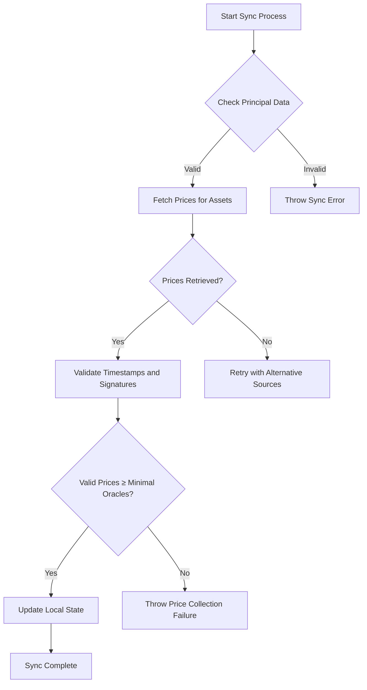
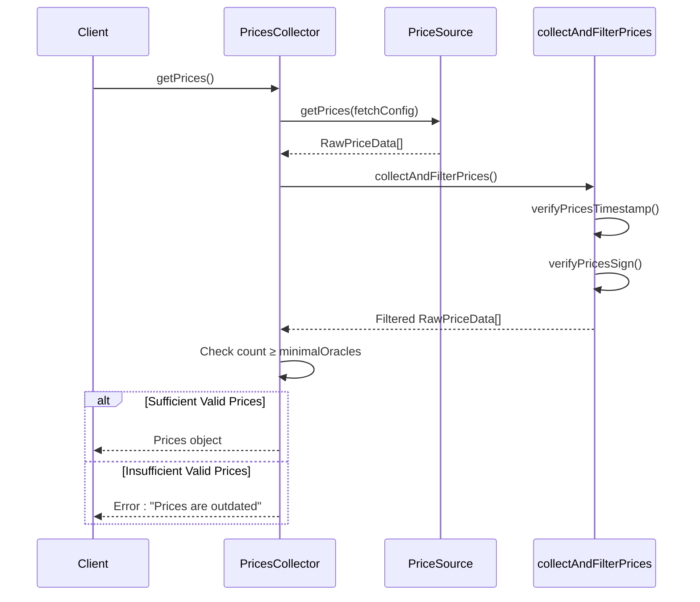
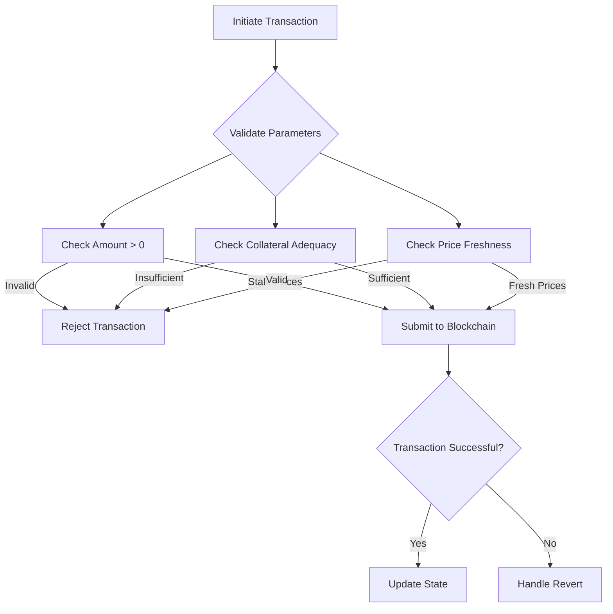
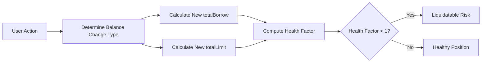

# Troubleshooting


## Table of Contents
1. [Sync Errors and User State Desynchronization](#sync-errors-and-user-state-desynchronization)
2. [Price Collection Failures](#price-collection-failures)
3. [Transaction Revert Scenarios](#transaction-revert-scenarios)
4. [Health Factor Miscalculations](#health-factor-miscalculations)
5. [Diagnostic Procedures](#diagnostic-procedures)
6. [Error Handling Code Examples](#error-handling-code-examples)
7. [Mitigation Strategies](#mitigation-strategies)
8. [Known Limitations and Workarounds](#known-limitations-and-workarounds)

## Sync Errors and User State Desynchronization

Sync errors occur when the local user state diverges from the on-chain state, typically due to failed updates or inconsistent data fetching. The EVAA SDK relies on accurate synchronization between user principals, asset configurations, and price data to maintain correct state representation.

The `PricesCollector` class is responsible for aggregating price data from multiple sources and ensuring consistency across oracle feeds. When synchronization fails, it often stems from mismatched asset lists or outdated principal data.





**Diagram sources**
- [PricesCollector.ts](file://src/prices/PricesCollector.ts#L1-L164)

**Section sources**
- [PricesCollector.ts](file://src/prices/PricesCollector.ts#L1-L164)

## Price Collection Failures

Price collection failures can arise from network timeouts, invalid responses, or stale data. The SDK uses multiple price sources including backend endpoints and ICP-based oracles to ensure redundancy.

The `collectAndFilterPrices` function in `utils.ts` handles the core logic for collecting and validating price data. It applies two critical filters:
- **Timestamp validation**: Ensures prices are not older than `TTL_ORACLE_DATA_SEC` (120 seconds)
- **Signature verification**: Confirms data integrity using public key cryptography

When fewer than the required number of valid oracles (`minimalOracles`) return acceptable data, the process fails with "Prices are outdated".





**Diagram sources**
- [utils.ts](file://src/prices/utils.ts#L104-L141)
- [PricesCollector.ts](file://src/prices/PricesCollector.ts#L120-L140)

**Section sources**
- [utils.ts](file://src/prices/utils.ts#L104-L141)
- [PricesCollector.ts](file://src/prices/PricesCollector.ts#L120-L140)

## Transaction Revert Scenarios

Transaction reverts can occur due to several conditions:

### Insufficient Collateral
When a user attempts to borrow beyond their collateral limit, the transaction will revert. This is calculated using the `calculateHealthParams` function which compares total debt against the liquidation threshold.

### Expired Prices
Price data older than 120 seconds is considered expired and will cause transaction reverts. This is enforced by `verifyPricesTimestamp()` which checks the difference between current time and price timestamp.

### Amount Validation Failures
Invalid amount values (e.g., zero or negative when positive is required) trigger validation failures. The SDK performs these checks before submitting transactions to the blockchain.





**Diagram sources**
- [math.ts](file://src/api/math.ts#L497-L530)
- [utils.ts](file://src/prices/utils.ts#L1-L20)

**Section sources**
- [math.ts](file://src/api/math.ts#L497-L530)

## Health Factor Miscalculations

Health factor miscalculations typically stem from incorrect input data or flawed assumptions in the calculation logic. The `predictHealthFactor` function computes the health factor based on projected changes to user balances.

Root causes include:
- **Incorrect price data**: Using stale or invalid prices skews the calculation
- **Outdated asset configurations**: Changes in collateral factors or liquidation thresholds not reflected
- **Floating-point precision issues**: Converting bigints to numbers introduces rounding errors

The formula used is:

```
Health Factor = max(0, min(1, 1 - totalBorrow / totalLimit))
```


Where:
- **totalBorrow**: Sum of all borrow positions weighted by asset price
- **totalLimit**: Sum of supply positions multiplied by their liquidation thresholds





**Diagram sources**
- [math.ts](file://src/api/math.ts#L497-L530)

**Section sources**
- [math.ts](file://src/api/math.ts#L497-L530)

## Diagnostic Procedures

Effective diagnostics require systematic analysis of logs and state inspection.

### Log Analysis
Enable debug logging to trace price collection:

```typescript
// Enable console debugging in Backend.ts
// console.debug('outputData', outputData);
// console.debug('[FILTERING] before filtering prices len ', priceSource.sourceName, prices.length);
```


Key log markers to monitor:
- `[FILTERING] before filtering prices len`
- `[FILTERING] after filtering prices len`
- `Price source error`
- `sign is valid:`

### State Inspection Techniques
Verify critical state elements:
1. **Principal dictionary**: Ensure all keys match pool assets
2. **Price dictionary**: Confirm all required assets have price entries
3. **Timestamp validation**: Check that all prices are within TTL window
4. **Signature verification**: Validate oracle signatures match known public keys

Use the following test case pattern for validation:

```typescript
expect(prices.dict.values().length).toBeGreaterThan(4);
expect(prices.dataCell).not.toEqual(Cell.EMPTY);
```


**Section sources**
- [PriceCollector.test.ts](file://tests/prices/PriceCollector.test.ts#L0-L43)
- [utils.ts](file://src/prices/utils.ts#L1-L20)

## Error Handling Code Examples

### Detecting and Handling Price Collection Errors

```typescript
try {
    const prices = await collector.getPrices();
    if (prices.dict.size === 0) {
        throw new Error("No prices collected");
    }
} catch (error) {
    if (error.message.includes("Prices are outdated")) {
        // Implement retry with fallback sources
        await handlePriceCollectionRetry();
    } else if (error.message.includes("Failed to collect sufficient prices")) {
        // Switch to alternative price source
        await useFallbackPriceSource();
    } else {
        // Unknown error - propagate
        throw error;
    }
}
```


### Graceful Handling of Sync Errors

```typescript
async function safeSyncUserData() {
    try {
        await evaa.getSync();
        return { success: true, data: evaa.userData };
    } catch (error) {
        console.error("Sync failed:", error);
        return {
            success: false,
            error: "Failed to synchronize user data",
            retryable: true
        };
    }
}
```


**Section sources**
- [PriceCollector.test.ts](file://tests/prices/PriceCollector.test.ts#L85-L127)
- [PricesCollector.ts](file://src/prices/PricesCollector.ts#L1-L164)

## Mitigation Strategies

### Retry Mechanisms
Implement exponential backoff for transient failures:

```typescript
async function proxyFetchRetries(fetchPromise, fetchConfig) {
    const maxRetries = fetchConfig?.maxRetries || 3;
    let delay = 1000; // Start with 1s delay
    
    for (let i = 0; i < maxRetries; i++) {
        try {
            return await fetchPromise;
        } catch (error) {
            if (i === maxRetries - 1) throw error;
            await new Promise(resolve => setTimeout(resolve, delay));
            delay *= 2; // Exponential backoff
        }
    }
}
```


### Fallback Price Sources
Configure multiple redundant sources:

```typescript
const sources: PriceSourcesConfig = {
    backendEndpoints: [],
    icpEndpoints: DefaultPriceSourcesConfig.icpEndpoints,
};

const collector = new PricesCollector({
    ...config,
    sourcesConfig: sources,
    additionalPriceSources: [new FakeBackendPriceSource('', ORACLES_MAINNET)],
});
```


### User Notifications
Provide clear feedback for common issues:
- "Price data is stale - please refresh"
- "Insufficient collateral for this action"
- "Network congestion detected - transactions may fail"

**Section sources**
- [PricesCollector.ts](file://src/prices/PricesCollector.ts#L1-L164)
- [utils.ts](file://src/prices/utils.ts#L104-L141)

## Known Limitations and Workarounds

### Limitation: Single Asset Withdrawal Without Debt
When a user has only one supplied asset and attempts to withdraw without debt, the system returns empty price data:

```typescript
if (checkNotInDebtAtAll(realPrincipals) && (realPrincipals.get(withdrawAsset.assetId) ?? 0n) > 0n && !collateralToDebt) {
    return new Prices(Dictionary.empty<bigint, bigint>(), Cell.EMPTY);
}
```


**Workaround**: Always check if price data is empty before proceeding with withdrawal calculations.

### Limitation: Collateral-to-Debt Mode Constraint
The system prevents debt-only operations on a single supplied asset:

```typescript
if (collateralToDebt && assets.length == 1) {
    throw new Error("Cannot debt only one supplied asset");
}
```


**Workaround**: Ensure at least two assets are supplied before enabling collateral-to-debt mode.

### Limitation: Median Price Calculation Edge Cases
When an even number of price points exist, the median is calculated as the average of the two middle values, which may not be representable as an exact bigint.

**Workaround**: Accept minor precision differences in edge cases where exact median calculation isn't possible with integer arithmetic.

**Section sources**
- [PricesCollector.ts](file://src/prices/PricesCollector.ts#L50-L70)
- [utils.ts](file://src/prices/utils.ts#L49-L65)

**Referenced Files in This Document**   
- [PricesCollector.ts](file://src/prices/PricesCollector.ts)
- [utils.ts](file://src/prices/utils.ts)
- [math.ts](file://src/api/math.ts)
- [Backend.ts](file://src/prices/sources/Backend.ts)
- [PriceCollector.test.ts](file://tests/prices/PriceCollector.test.ts)
- [health_factor_calculation_test.ts](file://tests/health_factor_calculation_test.ts)