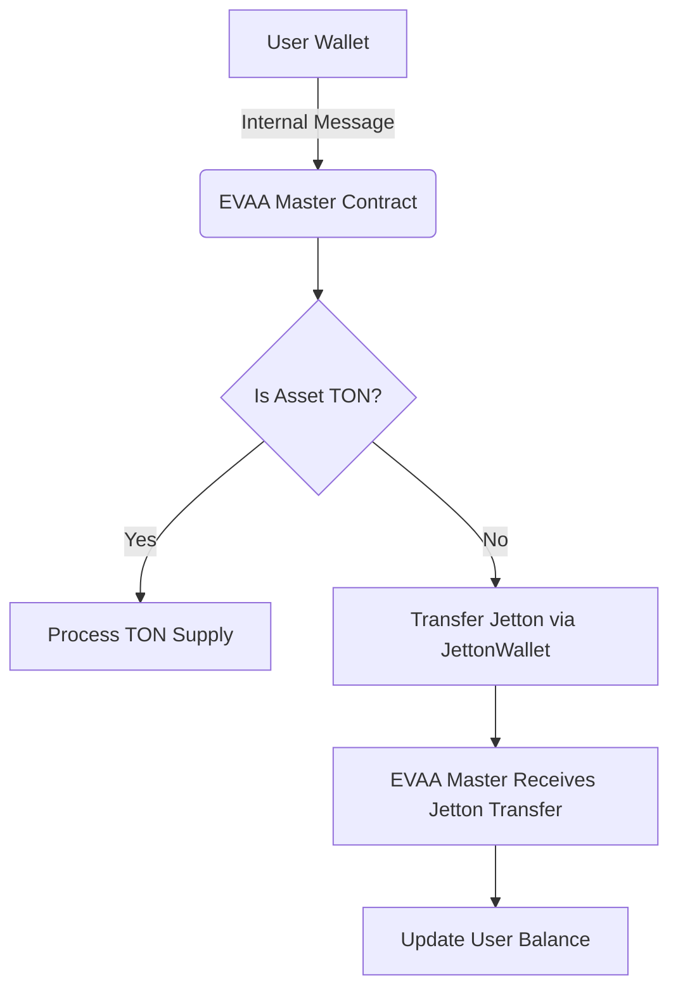
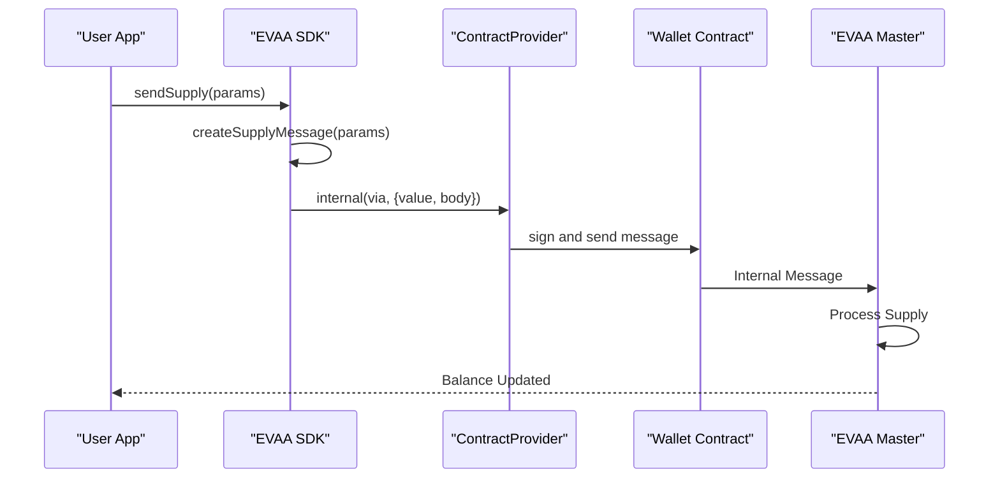

# TON Blockchain Basics


## Table of Contents
1. [Introduction](#introduction)
2. [Core Concepts of TON Blockchain](#core-concepts-of-ton-blockchain)
3. [Transaction Flow and Message Passing](#transaction-flow-and-message-passing)
4. [Contract Interaction via Sender Interface](#contract-interaction-via-sender-interface)
5. [Internal Message Construction](#internal-message-construction)
6. [Testnet vs Mainnet Configuration](#testnet-vs-mainnet-configuration)
7. [Common Pitfalls and Best Practices](#common-pitfalls-and-best-practices)
8. [Conclusion](#conclusion)

## Introduction
This document provides a comprehensive overview of the fundamental concepts of the TON (The Open Network) blockchain that are essential for developers using the EVAA SDK. It explains key components such as addresses, messages, cells, and smart contracts using the `@ton/core` library. The guide details how transactions are structured and executed on TON, emphasizing message passing and state updates. It also covers the role of providers and senders in transaction submission, illustrates contract interactions through code examples, and includes diagrams showing transaction flow from wallet to contract. Special attention is given to common pitfalls like incorrect address formats or message serialization errors, along with guidance on configuring testnet versus mainnet environments.

## Core Concepts of TON Blockchain

### Addresses
In TON, an **Address** uniquely identifies a user or smart contract on the blockchain. It consists of a workchain ID and a hash part derived from the contract's state initialization data. In the EVAA SDK, addresses are handled using the `Address` class from `@ton/core`. For example, the main pool master contract address on mainnet is defined as:


```ts
export const EVAA_MASTER_MAINNET = Address.parse('EQC8rUZqR_pWV1BylWUlPNBzyiTYVoBEmQkMIQDZXICfnuRr');
```


Addresses can be parsed from friendly formats (e.g., base64 strings) and used to open contracts for interaction.

### Messages and Cells
A **message** in TON is a data structure that carries instructions between accounts. Messages contain fields such as source and destination addresses, value (in nanotons), and body (payload). The **Cell** is a fundamental data structure used to serialize complex data into a format suitable for blockchain storage and transmission. Cells support references to other cells, enabling hierarchical data structures.

For example, the lending code for the EVAA protocol is stored as a BOC (Bag of Cells):


```ts
export const LENDING_CODE = Cell.fromBoc(Buffer.from('b5ee9c72c1010e0100fd...', 'hex'))[0];
```


Cells are used extensively in constructing operation payloads for supply, withdraw, and liquidation actions.

### Smart Contracts
Smart contracts on TON are implemented as stateful entities that respond to incoming messages. Each contract has:
- **Code**: Executable logic (stored as a Cell)
- **Data**: Persistent state (also stored as a Cell)
- **StateInit**: Initialization data combining code and data

The EVAA SDK uses abstract and concrete master contract classes (e.g., `AbstractEvaaMaster`, `EvaaMasterClassic`) to encapsulate contract logic and provide high-level methods for interaction.

**Section sources**
- [mainnet.ts](file://src/constants/general/mainnet.ts#L0-L82)
- [AbstractMaster.ts](file://src/contracts/AbstractMaster.ts#L42-L95)

## Transaction Flow and Message Passing

### How Transactions Are Structured
Transactions on TON are initiated by sending internal or external messages. An internal message typically originates from a wallet contract and targets a smart contract (like the EVAA master). The message includes:
- **Destination address**
- **Value** (amount of TON to transfer)
- **Body** (operation-specific payload)
- **Send mode** (flags controlling execution behavior)

When a user supplies assets to the EVAA protocol, the process involves:
1. Constructing a supply message with parameters like amount, asset type, and query ID.
2. Sending the message via the user’s wallet using the `Sender` interface.
3. The master contract processes the message and updates the user’s balance.





**Diagram sources**
- [AbstractMaster.ts](file://src/contracts/AbstractMaster.ts#L363-L397)
- [sw_separated.test.ts](file://tests/sw/sw_separated.test.ts#L25-L59)

### State Updates
State changes occur when a contract processes a message and modifies its persistent data. For example, after a successful supply operation, the master contract updates:
- User’s principal balance
- Total reserves for the supplied asset
- APY calculations based on new liquidity

These updates are atomic and occur within a single transaction.

## Contract Interaction via Sender Interface

### Role of Providers and Senders
In `@ton/core`, a **Provider** allows reading contract state, while a **Sender** enables sending messages (transactions).

- **ContractProvider**: Used to query contract data (e.g., `getSync()` to fetch master state).
- **Sender**: Represents the transaction signer (e.g., wallet) and includes:
  - `address`: Sender’s blockchain address
  - `send(args)`: Method to dispatch a message

Example of creating a sender using TonConnect:


```ts
const WALLET_SENDER = {
    address: WALLET_CONTRACT.address,
    send: WALLET_CONTRACT.sender(WALLET_KEY_PAIR.secretKey).send,
};
```


This sender can then be used to submit operations like supply or withdraw.

### Initiating Contract Interactions
The EVAA SDK abstracts low-level message construction through high-level methods like `sendSupply()` and `sendWithdraw()`. These methods use the `Sender` interface to submit transactions.

Example usage:


```ts
await EVAA_TESTNET.sendSupply(WALLET_SENDER, value, {
    queryID: 0n,
    includeUserCode: true,
    amount: 500_000_000n,
    userAddress: WALLET_CONTRACT.address,
    asset: TON_TESTNET,
    payload: Cell.EMPTY,
});
```


Behind the scenes, this constructs the appropriate message body and sends it via the provider.





**Diagram sources**
- [AbstractMaster.ts](file://src/contracts/AbstractMaster.ts#L42-L95)
- [sw_separated.test.ts](file://tests/sw/sw_separated.test.ts#L25-L59)

**Section sources**
- [AbstractMaster.ts](file://src/contracts/AbstractMaster.ts#L42-L95)
- [sw_separated.test.ts](file://tests/sw/sw_separated.test.ts#L25-L59)

## Internal Message Construction

### Building Operation Payloads
Messages in TON are serialized using **Cells**. The EVAA SDK constructs operation-specific payloads using `beginCell()` and stores fields in a defined order.

For a supply operation, the payload includes:
- Opcode (`OPCODES.SUPPLY_MASTER`)
- Query ID
- Include user code flag
- Amount
- User address
- Custom payload and flags

Example from `AbstractMaster.ts`:


```ts
const operationPayload = beginCell()
    .storeUint(OPCODES.SUPPLY_MASTER, 32)
    .storeUint(parameters.queryID, 64)
    .storeInt(parameters.includeUserCode ? -1 : 0, 2)
    .storeUint(parameters.amount, 64)
    .storeAddress(parameters.userAddress)
    .storeRef(parameters.payload)
    .endCell();
```


If the asset is not TON (i.e., a Jetton), the message is wrapped in a Jetton transfer instruction.

### Handling Jetton Transfers
For non-TON assets (Jettons), the supply message is sent as a transfer to the user’s Jetton wallet, which then forwards it to the EVAA master. This uses the standard Jetton interface:


```ts
const jettonWallet = provider.open(
    JettonWallet.createFromAddress(getUserJettonWallet(via.address, parameters.asset))
);
await jettonWallet.sendTransfer(via, value, message);
```


This ensures compatibility with the TON ecosystem’s token standards.

**Section sources**
- [AbstractMaster.ts](file://src/contracts/AbstractMaster.ts#L42-L95)

## Testnet vs Mainnet Configuration

### Environment-Specific Constants
The EVAA SDK separates configuration for testnet and mainnet environments using dedicated files:
- `src/constants/general/mainnet.ts`
- `src/constants/general/testnet.ts`

Each file exports contract addresses, version numbers, oracle configurations, and cell codes specific to the network.

Example from `mainnet.ts`:

```ts
export const EVAA_MASTER_MAINNET = Address.parse('EQC8rUZqR_pWV1BylWUlPNBzyiTYVoBEmQkMIQDZXICfnuRr');
export const MAINNET_VERSION = 7;
```


From `testnet.ts`:

```ts
export const EVAA_MASTER_TESTNET_PYTH_TOB_AUDITED = Address.parse('kQBNhBq8D5F1Red9JX64M32PpFrIPRvLvioAgauCDOpfMipw');
```


### Switching Between Networks
To configure the SDK for a specific network, pass the appropriate pool configuration:


```ts
// For mainnet
const evaaMainNet = client.open(new Evaa({ poolConfig: MAINNET_STABLE_POOL_CONFIG }));

// For testnet
const EVAA_TESTNET = TON_CLIENT.open(new Evaa({ poolConfig: TESTNET_PYTH_POOL_CONFIG_TOB_AUDITED }));
```


The `poolConfig` object contains all necessary parameters including master address, version, assets, and constants.

**Section sources**
- [mainnet.ts](file://src/constants/general/mainnet.ts#L0-L82)
- [testnet.ts](file://src/constants/general/testnet.ts#L0-L25)

## Common Pitfalls and Best Practices

### Incorrect Address Formats
Using improperly formatted addresses can lead to failed transactions. Always use `Address.parse()` or `Address.parseFriendly()`:


```ts
const addr = Address.parse('EQC8rUZqR_pWV1BylWUlPNBzyiTYVoBEmQkMIQDZXICfnuRr');
```


Avoid hardcoding raw strings without validation.

### Message Serialization Errors
Ensure correct field ordering and types when building Cells. Common mistakes include:
- Storing integers with wrong bit length
- Forgetting to end cells with `.endCell()`
- Mismatched opcodes

Use type-checked parameters (e.g., `SupplyParameters`) to prevent errors.

### Handling Outdated Contract Code
Set `includeUserCode: true` when interacting with user contracts to ensure they are upgraded if needed:


```ts
await EVAA_TESTNET.sendSupply(WALLET_SENDER, value, {
    includeUserCode: true,
    // ... other params
});
```


### Debugging Tips
Use `getTonConnectSender()` to capture sent BOCs for inspection:


```ts
let lastSentBoc = getLastSentBoc();
console.log(`Transaction: https://testnet.tonviewer.com/transaction/${Cell.fromBase64(lastSentBoc.boc).hash().toString('hex')}`);
```


Enable debug mode in the SDK for additional logging.

**Section sources**
- [tonConnectSender.ts](file://src/utils/tonConnectSender.ts#L0-L36)
- [supply_withdraw_test.ts](file://tests/supply_withdraw_test.ts#L143-L168)

## Conclusion
Understanding the core mechanics of the TON blockchain is crucial for effectively using the EVAA SDK. By mastering concepts like addresses, messages, cells, and smart contracts, developers can build robust applications that interact seamlessly with the protocol. The SDK abstracts much of the complexity through well-defined interfaces like `Sender` and high-level methods such as `sendSupply()` and `sendWithdraw()`, while still allowing access to low-level details when needed. Proper configuration for testnet and mainnet environments ensures smooth development and deployment. Following best practices helps avoid common pitfalls and leads to more reliable and secure applications.

**Referenced Files in This Document**   
- [AbstractMaster.ts](file://src/contracts/AbstractMaster.ts#L42-L95)
- [ClassicMaster.ts](file://src/contracts/ClassicMaster.ts#L0-L184)
- [mainnet.ts](file://src/constants/general/mainnet.ts#L0-L82)
- [testnet.ts](file://src/constants/general/testnet.ts#L0-L25)
- [tonConnectSender.ts](file://src/utils/tonConnectSender.ts#L0-L36)
- [sw_separated.test.ts](file://tests/sw/sw_separated.test.ts#L25-L59)
- [supply_withdraw_test.ts](file://tests/supply_withdraw_test.ts#L143-L168)