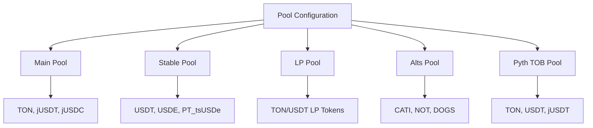
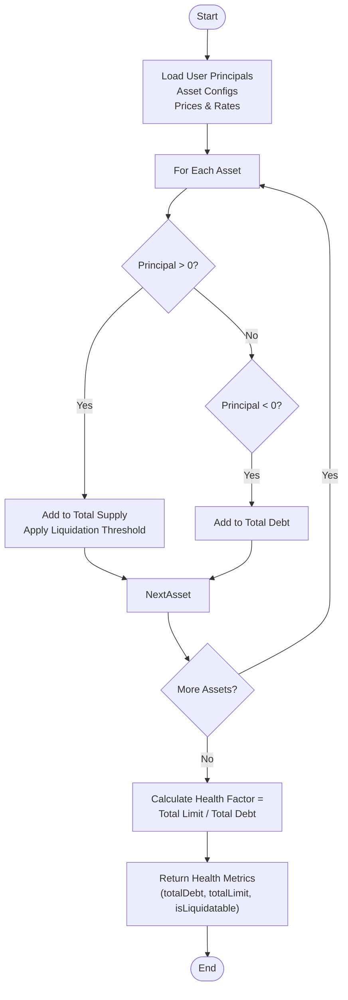
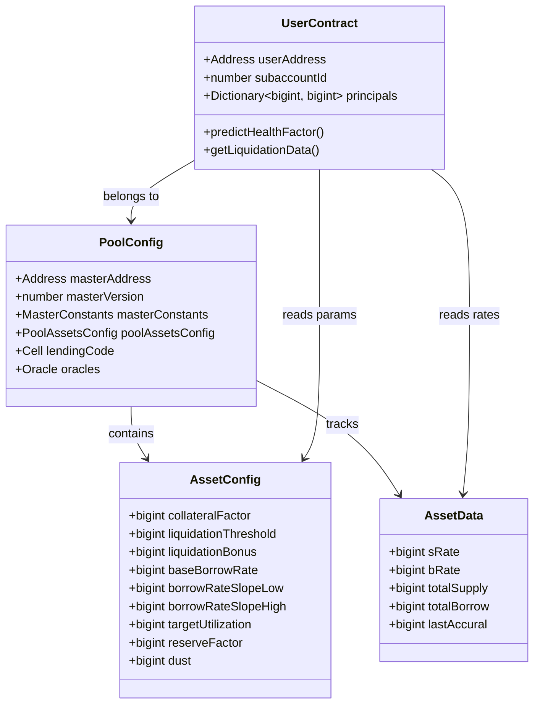

# Lending Protocol Mechanics


## Table of Contents
1. [Introduction](#introduction)
2. [Core Concepts Overview](#core-concepts-overview)
3. [Pool Configuration and Asset Management](#pool-configuration-and-asset-management)
4. [Collateralization and Health Factor](#collateralization-and-health-factor)
5. [Interest Accrual Models](#interest-accrual-models)
6. [Liquidation Mechanics](#liquidation-mechanics)
7. [User Position Tracking](#user-position-tracking)
8. [Edge Cases and Practical Examples](#edge-cases-and-practical-examples)

## Introduction
The EVAA lending protocol is a decentralized finance (DeFi) platform built on the TON blockchain that enables users to supply assets as collateral and borrow against them. This document details the core mechanics governing user positions, risk parameters, and financial calculations within the protocol. The system operates across multiple asset pools, each with distinct configurations for assets, oracles, and risk parameters. Key concepts such as collateralization ratios, health factors, liquidation thresholds, and interest models are implemented through smart contracts and mathematical functions that ensure the stability and security of the lending ecosystem.

## Core Concepts Overview

### Collateralization Ratios
Collateralization ratio determines how much value a user must lock in order to borrow. It is defined per asset via the `collateralFactor` parameter in the `AssetConfig` type. This factor represents the percentage of an asset's value that can contribute to a user's borrowing power.

### Health Factor
The health factor measures the safety of a user’s position. A value above 1.0 indicates a healthy account, while below 1.0 signals potential liquidation. It is calculated as:


```
Health Factor = Total Collateral Value × Liquidation Threshold / Total Debt
```


When this ratio drops below 1, the account becomes eligible for liquidation.

### Liquidation Threshold
This parameter defines the maximum loan-to-value ratio before liquidation occurs. It is closely related to the collateral factor but may differ slightly depending on risk settings. Expressed as a scaled integer using `ASSET_COEFFICIENT_SCALE`, it ensures precision in on-chain calculations.

### Interest Accrual Model
EVAA uses a dynamic interest rate model based on asset utilization (borrowed amount / supplied amount). Rates adjust according to supply and demand, with different slopes applied below and above a target utilization level.

**Section sources**
- [Master.ts](file://src/types/Master.ts#L70-L113)
- [math.ts](file://src/api/math.ts#L350-L400)

## Pool Configuration and Asset Management

### Pool Structure
Each lending pool is defined by a `PoolConfig` object containing:
- **masterAddress**: Contract address managing the pool
- **masterVersion**: Code version identifier
- **masterConstants**: Scaling factors and global parameters
- **poolAssetsConfig**: List of supported assets
- **lendingCode**: Bytecode for user contracts
- **oracles**: Price feed aggregator (PricesCollector or PythCollector)

Multiple pools exist for different asset categories:
- **Stablecoins**: USDT, USDE, TSUSDE
- **LP Tokens**: TON/USDT pairs from DeDust, STON.fi
- **Altcoins**: CATI, NOT, DOGS
- **Main Pool**: Core assets like TON and jUSDT





**Diagram sources**
- [mainnet.ts](file://src/constants/pools/mainnet.ts#L50-L190)

### Asset Configuration
Each asset in a pool has specific risk and pricing parameters defined in `AssetConfig`:

| Parameter | Description |
|---------|-------------|
| `collateralFactor` | Max percentage of value counted toward borrowing power |
| `liquidationThreshold` | Loan-to-value ratio at which liquidation triggers |
| `liquidationBonus` | Incentive for liquidators (e.g., 10% bonus) |
| `baseBorrowRate` | Base interest rate when utilization is zero |
| `borrowRateSlopeLow` | Rate increase per unit utilization below target |
| `borrowRateSlopeHigh` | Rate increase per unit utilization above target |
| `targetUtilization` | Optimal utilization level for stable rates |
| `reserveFactor` | Portion of interest paid to protocol reserves |
| `dust` | Minimum balance threshold below which debt is considered negligible |

These values are stored in dictionaries mapped by `assetId` and accessed during health and interest calculations.

**Section sources**
- [Master.ts](file://src/types/Master.ts#L70-L113)
- [mainnet.ts](file://src/constants/pools/mainnet.ts#L10-L50)

## Collateralization and Health Factor

### Health Factor Computation
The health factor is derived from the user’s total collateral value weighted by liquidation thresholds versus their outstanding debt.

#### Formula

```
Total Borrowing Power = Σ (Supply Value × Liquidation Threshold)
Health Factor = Total Borrowing Power / Total Debt
```


If Health Factor < 1 → Account is liquidatable.

#### Implementation
The `calculateHealthParams` function in `math.ts` computes this using real-time prices, principal balances, and rate indices.


```typescript
function calculateHealthParams(parameters: HealthParamsArgs) {
    let totalSupply = 0n;
    let totalDebt = 0n;
    let totalLimit = 0n;

    for (const asset of poolConfig.poolAssetsConfig) {
        const principal = principals.get(asset.assetId)!;
        const assetConfig = assetsConfig.get(asset.assetId)!;
        const assetData = assetsData.get(asset.assetId)!;
        const assetPrice = prices.get(asset.assetId)!;

        const { sRate, bRate } = assetData;
        const assetBalance = presentValue(sRate, bRate, principal, poolConfig.masterConstants);
        const assetWorth = assetBalance.amount * assetPrice / (10n ** assetConfig.decimals);

        if (assetBalance.type === BalanceType.supply) {
            totalSupply += assetWorth;
            totalLimit += assetWorth * assetConfig.liquidationThreshold / ASSET_LIQUIDATION_THRESHOLD_SCALE;
        } else if (assetBalance.type === BalanceType.borrow && assetConfig.dust < assetBalance.amount) {
            totalDebt += assetWorth;
        }
    }

    return {
        totalDebt,
        totalLimit,
        totalSupply,
        isLiquidatable: totalLimit < totalDebt
    };
}
```





**Diagram sources**
- [math.ts](file://src/api/math.ts#L450-L500)
- [health_factor_calculation_test.ts](file://tests/health_factor_calculation_test.ts#L10-L50)

**Section sources**
- [math.ts](file://src/api/math.ts#L450-L500)
- [Master.ts](file://src/types/Master.ts#L100-L110)

## Interest Accrual Models

### Dynamic Interest Rate Model
EVAA employs a piecewise linear interest rate model where borrow rates increase with utilization.

#### Key Parameters
- `targetUtilization`: Ideal utilization (e.g., 80%)
- `baseBorrowRate`: Base rate at 0% utilization
- `borrowRateSlopeLow`: Slope below target
- `borrowRateSlopeHigh`: Steeper slope above target

#### Utilization Calculation

```
Utilization = Total Borrow / Total Supply
```


#### Borrow Rate Formula

```
If Utilization ≤ Target:
    Borrow Rate = Base + SlopeLow × Utilization
Else:
    Borrow Rate = Base + SlopeLow × Target + SlopeHigh × (Utilization - Target)
```


Supply rate is derived by reducing borrow rate by reserve factor.

### Code Implementation

```typescript
function calculateInterestWithSupplyBorrow(
    totalSupply: bigint,
    totalBorrow: bigint,
    assetConfig: AssetConfig,
    masterConstants: MasterConstants
): AssetInterest {
    let utilization = 0n;
    if (totalSupply !== 0n) {
        utilization = (totalBorrow * masterConstants.FACTOR_SCALE) / totalSupply;
    }

    let borrowInterest = 0n;
    if (utilization <= assetConfig.targetUtilization) {
        borrowInterest = assetConfig.baseBorrowRate +
            mulFactor(masterConstants.FACTOR_SCALE, assetConfig.borrowRateSlopeLow, utilization);
    } else {
        borrowInterest = assetConfig.baseBorrowRate +
            mulFactor(masterConstants.FACTOR_SCALE, assetConfig.borrowRateSlopeLow, assetConfig.targetUtilization) +
            mulFactor(masterConstants.FACTOR_SCALE, assetConfig.borrowRateSlopeHigh, utilization - assetConfig.targetUtilization);
    }

    const supplyInterest = mulDiv(
        mulDiv(borrowInterest, utilization, masterConstants.FACTOR_SCALE),
        masterConstants.ASSET_RESERVE_FACTOR_SCALE - assetConfig.reserveFactor,
        masterConstants.ASSET_RESERVE_FACTOR_SCALE
    );

    return { supplyInterest, borrowInterest };
}
```


**Section sources**
- [math.ts](file://src/api/math.ts#L250-L300)

## Liquidation Mechanics

### Liquidation Conditions
An account becomes liquidatable when:
- `totalDebt > totalLimit` (i.e., Health Factor < 1)
- The debt exceeds the `dust` threshold

### Liquidation Process
1. **Identify largest loan and collateral assets**
2. **Calculate maximum liquidation amount** based on:
   - Available collateral value
   - Protocol-defined `COLLATERAL_WORTH_THRESHOLD`
   - Liquidation bonus incentive
3. **Enforce minimum collateral return** to liquidator
4. **Apply reserve factor** to cover protocol fees

### Liquidation Bonus
The `liquidationBonus` parameter incentivizes liquidators by allowing them to acquire collateral at a discount. For example, a 10% bonus means the liquidator pays 10% less than market value.

### Code Snippet

```typescript
const liquidationAmount = bigIntMin(
    (collateralValue * loanScale * ASSET_COEFFICIENT_SCALE) / liquidationBonus / loanAssetPrice,
    (loanValue * loanScale) / loanAssetPrice
) - 5n;

minCollateralAmount = (((liquidationAmount * loanAssetPrice * liquidationBonus) / 
    ASSET_LIQUIDATION_BONUS_SCALE) * collateralDecimal) / collateralAssetPrice / loanScale;
```


**Section sources**
- [math.ts](file://src/api/math.ts#L500-L570)
- [AbstractMaster.ts](file://src/contracts/AbstractMaster.ts#L300-L350)

## User Position Tracking

### Principal-Based Accounting
User positions are tracked using **principal values**, which represent the original amount supplied or borrowed. Interest accrues over time, increasing the effective balance.

#### Present Value Calculation

```typescript
function presentValue(sRate: bigint, bRate: bigint, principalValue: bigint, masterConstants: MasterConstants): UserBalance {
    if (principalValue > 0) {
        return { amount: (principalValue * sRate) / FACTOR_SCALE, type: BalanceType.supply };
    } else if (principalValue < 0) {
        return { amount: (-principalValue * bRate) / FACTOR_SCALE, type: BalanceType.borrow };
    }
    return { amount: 0n, type: undefined };
}
```


### Subaccount Support
Users can manage multiple isolated positions via subaccounts, identified by a 16-bit ID. Each subaccount maintains independent principal balances and health metrics.

### Contract Interaction
The `AbstractEvaaMaster` class provides methods to interact with user contracts:
- `openUserContract(userAddress, subaccountId)` – Opens a user’s lending position
- `calculateUserSCAddr()` – Derives the state contract address deterministically





**Diagram sources**
- [Master.ts](file://src/types/Master.ts#L50-L113)
- [AbstractMaster.ts](file://src/contracts/AbstractMaster.ts#L150-L200)

**Section sources**
- [AbstractMaster.ts](file://src/contracts/AbstractMaster.ts#L150-L200)
- [Master.ts](file://src/types/Master.ts#L50-L113)

## Edge Cases and Practical Examples

### Zero-Interest Scenarios
When utilization is very low, borrow rates approach `baseBorrowRate`. If both slopes are zero, rates remain constant regardless of demand.

### Maximum Borrow Limits
A user cannot borrow beyond their collateralized limit:

```
Max Borrow Value = Σ (Supply Value × Liquidation Threshold)
```

Actual borrowable amount depends on asset prices and decimals.

### Safe vs Risky Positions

#### Safe Position Example
- Supplies: 1000 USDT ($1000)
- Collateral Factor: 80%
- Borrow: 500 TON ($500)
- Liquidation Threshold: 82%
- Health Factor = (1000 × 0.82) / 500 = 1.64 → **Safe**

#### Risky Position Example
- Supplies: 1000 USDT ($1000)
- Collateral Factor: 80%
- Borrow: 850 TON ($850)
- Liquidation Threshold: 82%
- Health Factor = (1000 × 0.82) / 850 = 0.96 → **Liquidatable**

### Dust Threshold Handling
Small debts below the `dust` level are ignored in health calculations to prevent unnecessary liquidations.

### Testing Validation
The test file `health_factor_calculation_test.ts` validates edge cases including:
- Zero supply
- Mixed asset types
- Decimal precision handling
- Rate index updates

**Section sources**
- [math.ts](file://src/api/math.ts#L450-L570)
- [health_factor_calculation_test.ts](file://tests/health_factor_calculation_test.ts#L1-L100)

**Referenced Files in This Document**   
- [AbstractMaster.ts](file://src/contracts/AbstractMaster.ts)
- [Master.ts](file://src/types/Master.ts)
- [mainnet.ts](file://src/constants/pools/mainnet.ts)
- [math.ts](file://src/api/math.ts)
- [health_factor_calculation_test.ts](file://tests/health_factor_calculation_test.ts)