# Classic Oracle

## Table of Contents
1. [Introduction](#introduction)
2. [Project Structure](#project-structure)
3. [Core Components](#core-components)
4. [Architecture Overview](#architecture-overview)
5. [Detailed Component Analysis](#detailed-component-analysis)
6. [Dependency Analysis](#dependency-analysis)
7. [Performance Considerations](#performance-considerations)
8. [Troubleshooting Guide](#troubleshooting-guide)
9. [Conclusion](#conclusion)

## Introduction
This document provides a comprehensive analysis of the Classic Oracle implementation within the EVAA Finance protocol. It details how the `ClassicOracleParser` class extends the `AbstractOracleParser` to handle the native oracle data format used for price feeds. The document explains the structure of expected price data, including timestamp validation, price deviation checks, and normalization into the internal price format. It also covers integration with the `PricesCollector`, error handling mechanisms, and performance implications. Guidance is provided on choosing between Classic and Pyth oracles based on latency, security, and decentralization requirements.

## Project Structure
The project follows a modular architecture with clear separation of concerns. The core oracle parsing logic resides in the `src/api/parsers/` directory, while price collection and aggregation are managed in `src/prices/`. The structure supports extensibility for multiple oracle types (Classic, Pyth) and integrates with broader system components such as asset configuration, math utilities, and contract interfaces.

**Diagram sources**
- [ClassicOracleParser.ts](file://src/api/parsers/ClassicOracleParser.ts#L1-L19)
- [AbstractOracleParser.ts](file://src/api/parsers/AbstractOracleParser.ts#L1-L16)
- [PricesCollector.ts](file://src/prices/PricesCollector.ts#L1-L163)

**Section sources**
- [ClassicOracleParser.ts](file://src/api/parsers/ClassicOracleParser.ts#L1-L19)
- [AbstractOracleParser.ts](file://src/api/parsers/AbstractOracleParser.ts#L1-L16)

## Core Components
The core components of the Classic Oracle system include:
- **ClassicOracleParser**: Implements parsing of oracle configuration data from blockchain cells.
- **AbstractOracleParser**: Provides a base interface and shared functionality for all oracle types.
- **PricesCollector**: Aggregates price data from multiple sources, validates it, and computes median prices.
- **Oracle.interface**: Defines the contract for price retrieval operations used across the system.

These components work together to ensure reliable, tamper-resistant price feeds for the lending and borrowing operations in the protocol.

**Section sources**
- [ClassicOracleParser.ts](file://src/api/parsers/ClassicOracleParser.ts#L1-L19)
- [PricesCollector.ts](file://src/prices/PricesCollector.ts#L1-L163)
- [Oracle.interface.ts](file://src/prices/Oracle.interface.ts#L1-L18)

## Architecture Overview
The Classic Oracle architecture is designed around a decentralized network of oracles that submit price updates in the form of signed cell data. The system parses this data, validates signatures and timestamps, and aggregates prices using a medianization algorithm to resist manipulation.

**Diagram sources**
- [ClassicOracleParser.ts](file://src/api/parsers/ClassicOracleParser.ts#L1-L19)
- [PricesCollector.ts](file://src/prices/PricesCollector.ts#L1-L163)

## Detailed Component Analysis

### ClassicOracleParser Analysis
The `ClassicOracleParser` class extends `AbstractOracleParser` to implement protocol-specific logic for parsing oracle configuration data stored in TON blockchain cells. It extracts key parameters such as the number of active oracles and consensus threshold.

#### Class Diagram

**Diagram sources**
- [AbstractOracleParser.ts](file://src/api/parsers/AbstractOracleParser.ts#L1-L16)
- [ClassicOracleParser.ts](file://src/api/parsers/ClassicOracleParser.ts#L1-L19)

**Section sources**
- [ClassicOracleParser.ts](file://src/api/parsers/ClassicOracleParser.ts#L1-L19)
- [AbstractOracleParser.ts](file://src/api/parsers/AbstractOracleParser.ts#L1-L16)

### PricesCollector Analysis
The `PricesCollector` class is responsible for gathering price data from various sources, validating it, and computing final prices used by the protocol. It implements the `Oracle` interface and serves as the main integration point between oracle data and smart contracts.

#### Flowchart of Price Collection Process

```mermaid
flowchart TD
Start([Start getPrices]) --> Collect["collectAndFilterPrices()"]
Collect --> Validate["verifyPricesTimestamp()"]
Validate --> Count{"Enough Prices?<br/>(≥ minimalOracles)"}
Count --> |No| Error["Throw Error: Insufficient Data"]
Count --> |Yes| Filter["Filter by Timestamp"]
Filter --> Median["getMedianPrice() for each asset"]
Median --> Pack["packAssetsData() & packOraclesData()"]
Pack --> Return["Return Prices object"]
Return --> End([End])
Error --> End
```

**Diagram sources**
- [PricesCollector.ts](file://src/prices/PricesCollector.ts#L1-L163)

**Section sources**
- [PricesCollector.ts](file://src/prices/PricesCollector.ts#L1-L163)

## Dependency Analysis
The Classic Oracle system has well-defined dependencies that enable modularity and testability. The `ClassicOracleParser` depends only on low-level cell parsing utilities and the abstract parser interface, while `PricesCollector` integrates with multiple price sources and utility functions.

**Diagram sources**
- [ClassicOracleParser.ts](file://src/api/parsers/ClassicOracleParser.ts#L1-L19)
- [PricesCollector.ts](file://src/prices/PricesCollector.ts#L1-L163)
- [AbstractOracleParser.ts](file://src/api/parsers/AbstractOracleParser.ts#L1-L16)

**Section sources**
- [ClassicOracleParser.ts](file://src/api/parsers/ClassicOracleParser.ts#L1-L19)
- [PricesCollector.ts](file://src/prices/PricesCollector.ts#L1-L163)

## Performance Considerations
The Classic Oracle system is optimized for gas efficiency and reliability:
- **Gas Usage**: Parsing cell data is computationally efficient due to the binary format used by TON blockchain.
- **Latency**: Multiple price sources are queried in parallel using `Promise.any()`, reducing overall latency.
- **Robustness**: The system can tolerate individual source failures through redundancy and validation.
- **Medianization**: Computing medians across multiple oracles protects against outlier prices without requiring complex statistical analysis.
- **Caching**: While not explicitly shown, the architecture supports caching of recent price data to minimize redundant computations.

When comparing Classic vs Pyth oracles:
- **Classic Oracle**: Lower latency, simpler integration, fully on-chain validation.
- **Pyth Oracle**: Higher decentralization, external market coverage, but potentially higher gas costs due to verification overhead.

## Troubleshooting Guide
Common issues and their solutions:

**Error: "Not enough price data"**
- **Cause**: Insufficient valid price sources responded within timeout
- **Solution**: Check network connectivity, verify oracle node availability, increase `minimalOracles` threshold

**Error: "User from another pool"**
- **Cause**: Principal dictionary contains asset IDs not present in current pool configuration
- **Solution**: Validate user's asset portfolio matches expected pool assets

**Error: "Cannot debt only one supplied asset"**
- **Cause**: Attempting to create debt with only one collateral asset when `collateralToDebt` is true
- **Solution**: Ensure at least two assets are available for collateralization

**Timestamp Validation Failures**
- **Cause**: Oracle prices are expired or timestamp is in the future
- **Solution**: Synchronize oracle node clocks, check for replay attacks

**Section sources**
- [PricesCollector.ts](file://src/prices/PricesCollector.ts#L1-L163)
- [ClassicOracleParser.ts](file://src/api/parsers/ClassicOracleParser.ts#L1-L19)

## Conclusion
The Classic Oracle implementation provides a secure, efficient mechanism for price discovery in the EVAA Finance protocol. By extending the `AbstractOracleParser`, it maintains compatibility with the broader oracle framework while implementing protocol-specific parsing logic. The integration with `PricesCollector` ensures robust price aggregation through medianization and strict validation. This design balances decentralization, security, and performance, making it suitable for high-stakes financial operations on the TON blockchain.

**Referenced Files in This Document**   
- [ClassicOracleParser.ts](file://src/api/parsers/ClassicOracleParser.ts#L1-L19)
- [AbstractOracleParser.ts](file://src/api/parsers/AbstractOracleParser.ts#L1-L16)
- [PricesCollector.ts](file://src/prices/PricesCollector.ts#L1-L163)
- [Oracle.interface.ts](file://src/prices/Oracle.interface.ts#L1-L18)