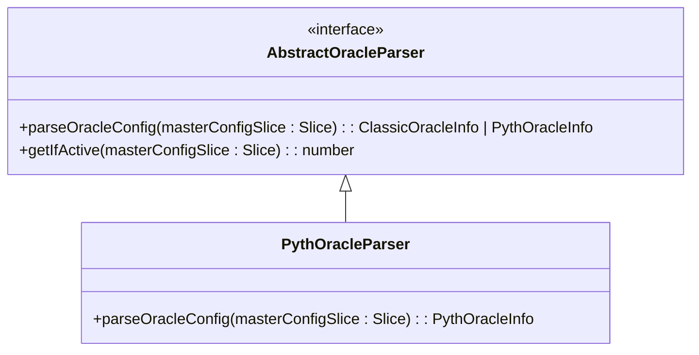
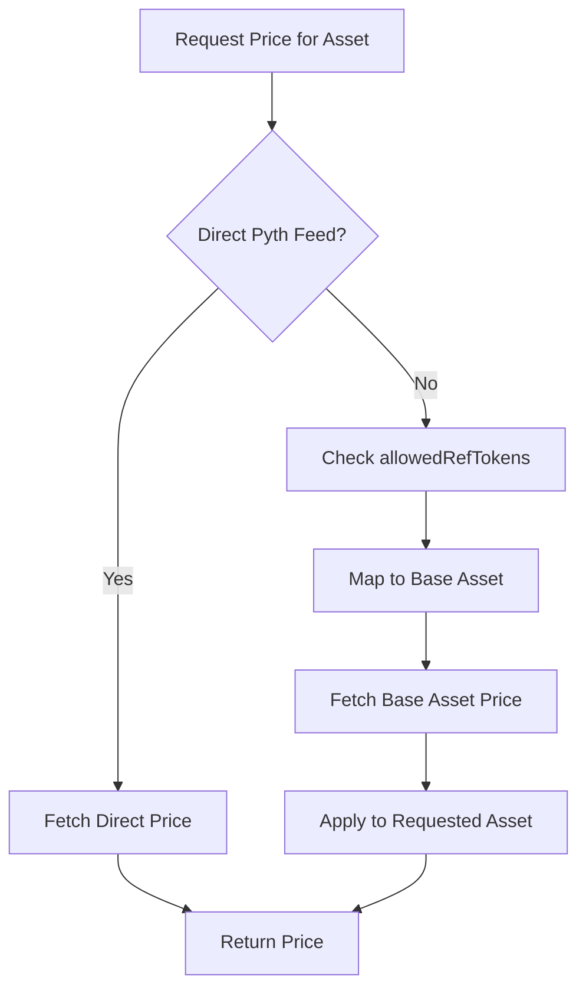
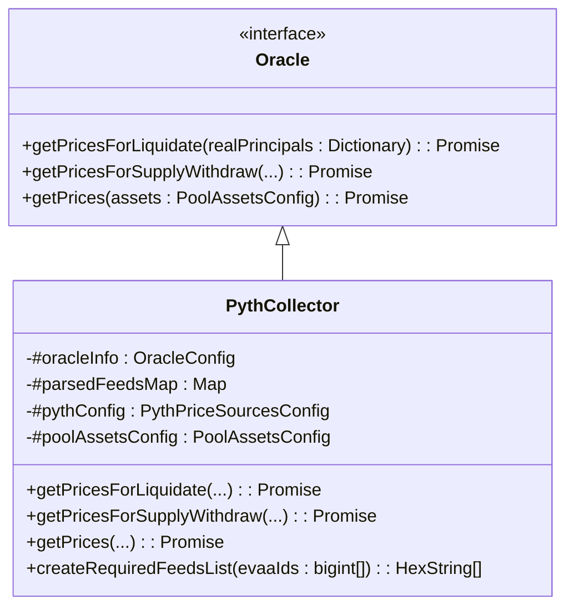
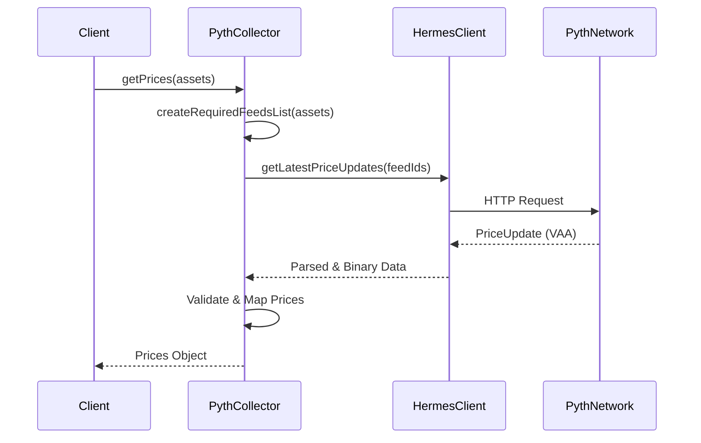

# Pyth Oracle


## Table of Contents
1. [Introduction](#introduction)
2. [Core Components Overview](#core-components-overview)
3. [PythOracleParser Implementation](#pythoracleparser-implementation)
4. [Pyth Price Data Flow and Processing](#pyth-price-data-flow-and-processing)
5. [PythCollector: Aggregation and Price Retrieval](#pythcollector-aggregation-and-price-retrieval)
6. [Data Structures and Type Definitions](#data-structures-and-type-definitions)
7. [Integration with Oracle Interface](#integration-with-oracle-interface)
8. [Security and Reliability Considerations](#security-and-reliability-considerations)
9. [Comparison with Classic Oracle](#comparison-with-classic-oracle)
10. [Conclusion](#conclusion)

## Introduction
The Pyth Oracle implementation in the EVAA FFI SDK enables secure and decentralized price feed retrieval from the Pyth Network for assets on The Open Network (TON). This document details the architecture, data flow, and integration of the Pyth oracle system, focusing on how price updates are parsed, validated, and aggregated for use in lending and liquidation operations. The system leverages Wormhole-based Verified Action Approvals (VAAs) to deliver low-latency, cross-chain price data with strong cryptographic guarantees.

## Core Components Overview

The Pyth oracle system consists of several key components:
- **PythOracleParser**: Parses on-chain oracle configuration from the master contract.
- **PythCollector**: Fetches and aggregates price updates from Pyth Network endpoints.
- **Prices**: Encapsulates price data and associated metadata for downstream use.
- **feeds.ts**: Defines asset mappings between Pyth feed IDs and internal EVAA asset IDs.
- **Oracle.interface.ts**: Standardizes interaction with oracle systems.

These components work together to deliver reliable price data for financial operations such as supply, withdrawal, and liquidation.

**Section sources**
- [PythOracleParser.ts](file://src/api/parsers/PythOracleParser.ts)
- [PythCollector.ts](file://src/prices/PythCollector.ts)
- [Prices.ts](file://src/prices/Prices.ts)
- [Oracle.interface.ts](file://src/prices/Oracle.interface.ts)

## PythOracleParser Implementation

The `PythOracleParser` class implements the `AbstractOracleParser` interface to extract Pyth-specific configuration from the master contract's configuration cell.





**Diagram sources**
- [AbstractOracleParser.ts](file://src/api/parsers/AbstractOracleParser.ts#L6-L16)
- [PythOracleParser.ts](file://src/api/parsers/PythOracleParser.ts#L22-L34)

### Configuration Parsing
The `parseOracleConfig` method extracts the following data from the master contract configuration:


```ts
parseOracleConfig(masterConfigSlice: Slice): PythOracleInfo {
    const oraclesSlice = masterConfigSlice.loadRef().beginParse();
    const feedDataCell = oraclesSlice.loadRef();
    const feedDataSlice = feedDataCell.beginParse();

    return {
        pythAddress: oraclesSlice.loadAddress(),
        feedsMap: feedDataSlice.loadDict(Dictionary.Keys.BigUint(256), Dictionary.Values.Buffer(64)),
        allowedRefTokens: feedDataSlice.loadDict(Dictionary.Keys.BigUint(256), Dictionary.Values.BigUint(256)),
        pricesTtl: oraclesSlice.loadUint(32),
        pythComputeBaseGas: oraclesSlice.loadUintBig(64),
        pythComputePerUpdateGas: oraclesSlice.loadUintBig(64),
        pythSingleUpdateFee: oraclesSlice.loadUintBig(64),
    };
}
```


**Key fields:**
- **pythAddress**: Contract address of the Pyth consumer on TON
- **feedsMap**: Dictionary mapping Pyth price feed IDs to internal asset configurations
- **allowedRefTokens**: Dictionary defining which tokens can be priced via reference to base assets
- **pricesTtl**: Time-to-live for price updates in seconds
- **Gas and fee parameters**: Cost metrics for price update computation

This parser enables the system to dynamically adapt to different Pyth network configurations across mainnet and testnet environments.

**Section sources**
- [PythOracleParser.ts](file://src/api/parsers/PythOracleParser.ts#L1-L34)
- [AbstractOracleParser.ts](file://src/api/parsers/AbstractOracleParser.ts#L6-L16)

## Pyth Price Data Flow and Processing

The Pyth price data pipeline involves several stages: feed selection, network retrieval, parsing, and validation.

### Feed Mapping and Resolution
The system uses a two-level mapping system to resolve asset prices:

1. **Direct mapping**: Pyth feed ID → EVAA asset ID
2. **Referred mapping**: Some assets (e.g., stTON) derive their price from a base asset (e.g., TON)

The `feedsMap` dictionary stores these mappings in a packed buffer format:
- Bytes 0–31: EVAA asset ID
- Bytes 32–63: Referred Pyth feed ID (0 if none)





**Diagram sources**
- [feeds.ts](file://src/api/feeds.ts#L70-L92)
- [PythCollector.ts](file://src/prices/PythCollector.ts#L100-L130)

### Price Update Retrieval
The `PythCollector` uses the Hermes client to fetch price updates from multiple Pyth endpoints for redundancy:


```ts
async #getPythFeedsUpdates(feedIds: HexString[]): Promise<PythFeedUpdateType> {
    const latestPriceUpdates: PriceUpdate = await Promise.any(
        this.#pythConfig.pythEndpoints.map((x) =>
            new HermesClient(x).getLatestPriceUpdates(feedIds, { encoding: 'hex' }),
        ),
    );
    return { binary: Buffer.from(latestPriceUpdates.binary.data[0], 'hex'), parsed: latestPriceUpdates['parsed'] };
}
```


The use of `Promise.any` ensures that the first successful response from any endpoint is used, improving reliability and reducing latency.

**Section sources**
- [PythCollector.ts](file://src/prices/PythCollector.ts#L170-L185)

## PythCollector: Aggregation and Price Retrieval

The `PythCollector` class implements the `Oracle` interface and is responsible for aggregating price updates from the Pyth Network.





**Diagram sources**
- [Oracle.interface.ts](file://src/prices/Oracle.interface.ts#L4-L18)
- [PythCollector.ts](file://src/prices/PythCollector.ts#L23-L45)

### Constructor and Initialization
The constructor initializes mapping dictionaries for efficient price resolution:


```ts
constructor(config: PythCollectorConfig) {
    this.#oracleInfo = config.pythOracle;
    this.#pythConfig = config.pythConfig;
    this.#poolAssetsConfig = config.poolAssetsConfig;
    this.#parsedFeedsMap = parseFeedsMapDict(this.#oracleInfo.feedsMap);

    // Build direct and referred mappings
    for (const [pythId, feedInfo] of this.#parsedFeedsMap.entries()) {
        this.#pythToEvaaDirect.set(pythId, feedInfo.evaaId);
        this.#evaaToPythDirect.set(feedInfo.evaaId, pythId);
        
        if (feedInfo.referredPythFeed && feedInfo.referredPythFeed !== 0n) {
            if (!this.#pythToEvaaReferred.has(feedInfo.referredPythFeed)) 
                this.#pythToEvaaReferred.set(feedInfo.referredPythFeed, new Set());
            this.#pythToEvaaReferred.get(feedInfo.referredPythFeed)!.add(feedInfo.evaaId);
        }
    }
}
```


**Section sources**
- [PythCollector.ts](file://src/prices/PythCollector.ts#L47-L85)

### Price Aggregation Logic
The `getPrices` method orchestrates the entire price retrieval process:





**Diagram sources**
- [PythCollector.ts](file://src/prices/PythCollector.ts#L100-L160)

The method ensures that:
- Only requested assets receive prices
- All requested assets have valid prices (throws if missing)
- Price data is packaged into a TON cell for on-chain verification

## Data Structures and Type Definitions

### Oracle Configuration

```ts
type OracleConfig = {
    pythAddress: Address;
    feedsMap: Dictionary<bigint, Buffer>;
    allowedRefTokens: Dictionary<bigint, bigint>;
};
```


### Price Update Types

```ts
type PythFeedUpdateType = {
    parsed: PriceUpdate['parsed'];
    binary: Buffer;
};
```


The `parsed` field contains human-readable price data including:
- **price**: Current price in integer form
- **conf**: Confidence interval
- **expo**: Price exponent (scale factor)
- **publish_time**: Timestamp of update

### Internal Mappings
The system uses several internal maps for efficient lookups:
- **pythToEvaaDirect**: Pyth ID → EVAA asset ID
- **pythToEvaaReferred**: Base Pyth ID → Set of derived EVAA IDs
- **evaaToPythDirect**: EVAA ID → Pyth ID
- **allowedRefEvaa**: EVAA ID → Base EVAA ID

**Section sources**
- [Types.ts](file://src/prices/Types.ts#L1-L62)
- [feeds.ts](file://src/api/feeds.ts#L70-L92)
- [Master.ts](file://src/types/Master.ts#L1-L113)

## Integration with Oracle Interface

The `PythCollector` fully implements the `Oracle` interface, providing three methods for different use cases:


```ts
interface Oracle {
    getPricesForLiquidate(realPrincipals: Dictionary<bigint, bigint>): Promise<Prices>;
    getPricesForSupplyWithdraw(...): Promise<Prices>;
    getPrices(assets: PoolAssetsConfig): Promise<Prices>;
}
```


### Method Specialization
- **getPricesForLiquidate**: Optimized for liquidation scenarios, filters out zero-balance assets
- **getPricesForSupplyWithdraw**: Handles edge cases like single-asset debt and collateral conversion
- **getPrices**: General-purpose method for arbitrary asset lists

All methods ultimately delegate to the core price fetching logic, ensuring consistent behavior and validation.

**Section sources**
- [Oracle.interface.ts](file://src/prices/Oracle.interface.ts#L4-L18)
- [PythCollector.ts](file://src/prices/PythCollector.ts#L90-L160)

## Security and Reliability Considerations

### Trust Model
The system relies on the Pyth Network's Wormhole-based verification:
- Price updates are signed by Pyth's guardians (2/3+ threshold)
- VAAs are verified on-chain before price usage
- Multiple endpoint sources prevent single-point failure

### Fallback Strategies
- **Multiple endpoints**: Configurable list of Hermes endpoints
- **Promise.any**: Fastest response wins, improving availability
- **Retry mechanism**: Built-in retry logic with configurable parameters

### Validation Checks
- All requested assets must have prices (completeness check)
- Price TTL enforced to prevent stale data usage
- Feed ID mappings are validated at initialization

These measures ensure the system remains resilient during network outages or endpoint failures.

**Section sources**
- [PythCollector.ts](file://src/prices/PythCollector.ts#L170-L215)
- [prices.ts](file://src/api/prices.ts#L20-L30)

## Comparison with Classic Oracle

| Feature | Pyth Oracle | Classic Oracle |
|--------|-------------|----------------|
| **Latency** | ~1-2 seconds | ~15-30 seconds |
| **Accuracy** | High (exchange-aggregated) | Medium (single-source) |
| **Decentralization** | High (multi-guardian) | Medium (centralized backend) |
| **Cost** | Higher gas (VAA verification) | Lower gas |
| **Update Frequency** | Continuous | Periodic |
| **Cross-chain Support** | Native (Wormhole) | Limited |

The Pyth oracle offers superior latency and accuracy at the cost of higher complexity and gas usage. It is particularly well-suited for high-frequency operations like liquidations where price freshness is critical.

## Conclusion
The Pyth Oracle implementation provides a robust, secure, and low-latency price feed system for the EVAA protocol on TON. By leveraging the Pyth Network's cross-chain infrastructure and implementing comprehensive validation and fallback mechanisms, the system ensures reliable price data for critical financial operations. The modular architecture allows for easy integration and maintenance, while the use of standardized interfaces enables seamless switching between oracle providers based on operational requirements.

**Referenced Files in This Document**   
- [PythOracleParser.ts](file://src/api/parsers/PythOracleParser.ts)
- [AbstractOracleParser.ts](file://src/api/parsers/AbstractOracleParser.ts)
- [PythCollector.ts](file://src/prices/PythCollector.ts)
- [prices.ts](file://src/api/prices.ts)
- [Types.ts](file://src/prices/Types.ts)
- [feeds.ts](file://src/api/feeds.ts)
- [Master.ts](file://src/types/Master.ts)
- [Prices.ts](file://src/prices/Prices.ts)
- [Oracle.interface.ts](file://src/prices/Oracle.interface.ts)