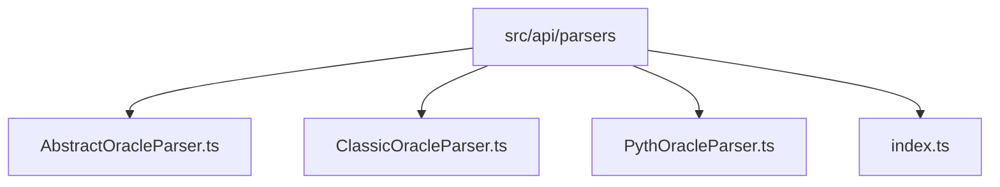
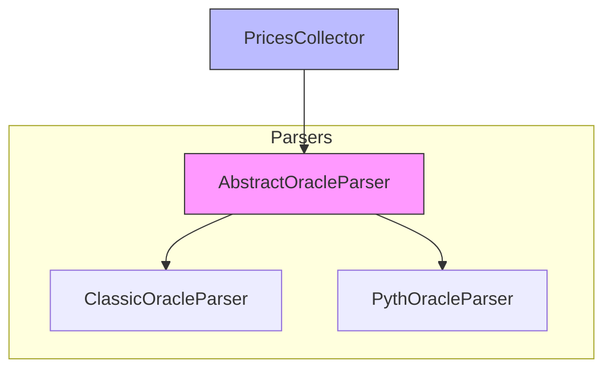
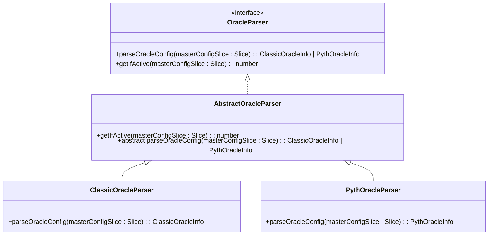
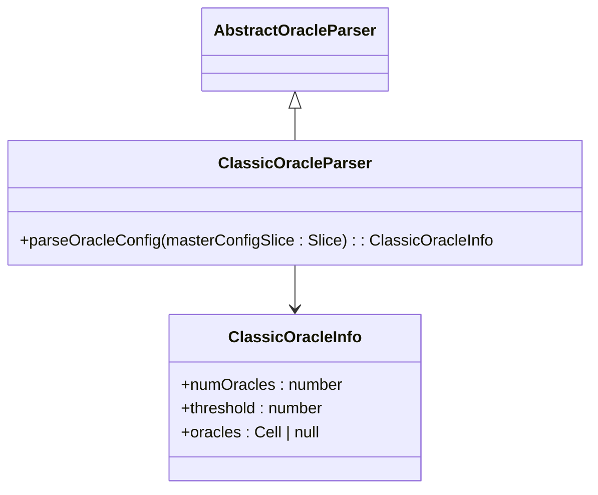
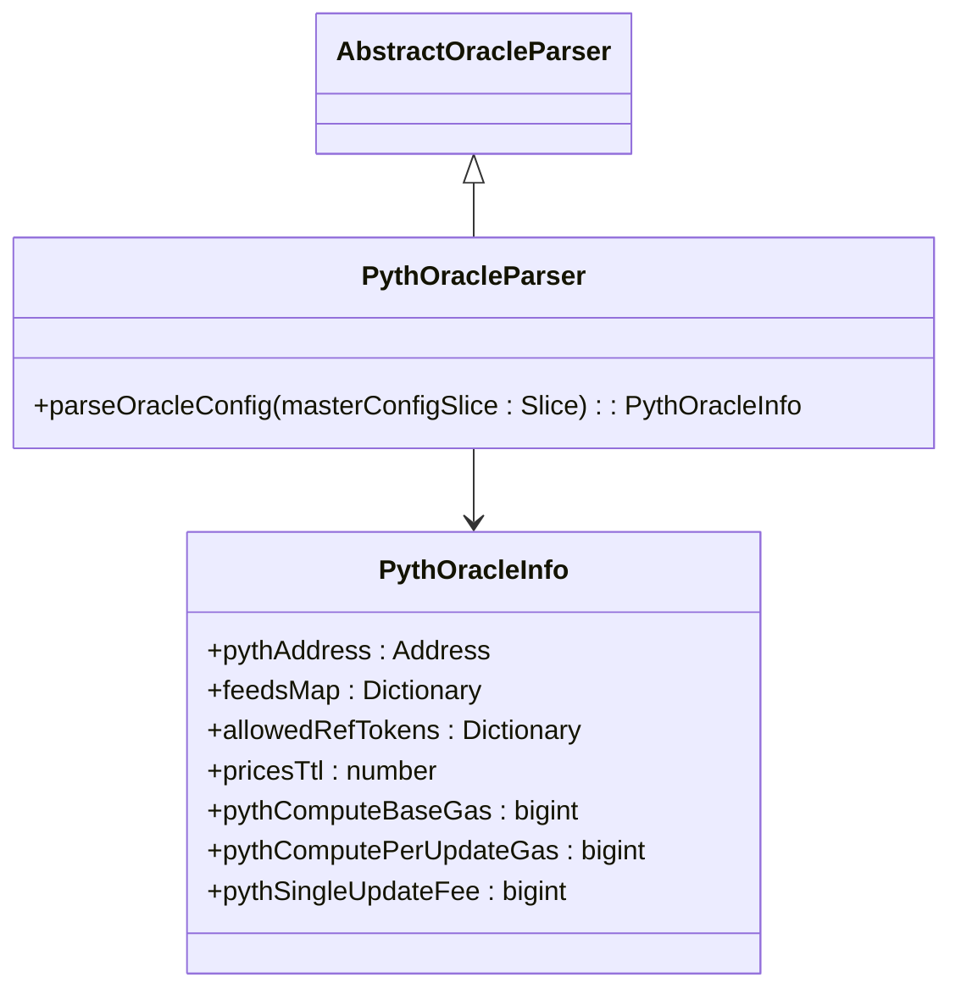
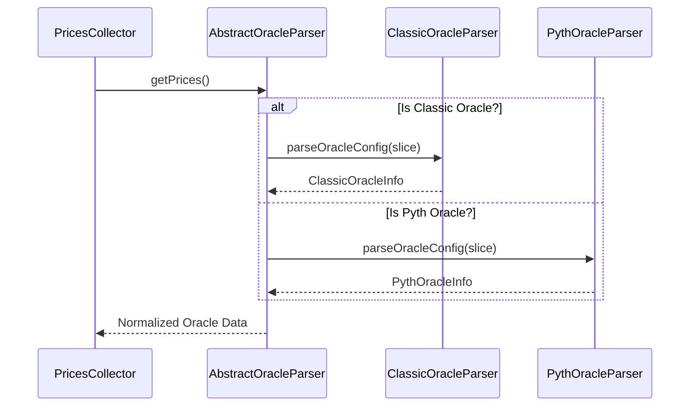
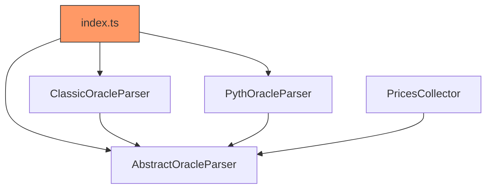

# Parser Architecture

## Table of Contents
1. [Introduction](#introduction)
2. [Project Structure](#project-structure)
3. [Core Components](#core-components)
4. [Architecture Overview](#architecture-overview)
5. [Detailed Component Analysis](#detailed-component-analysis)
6. [Dependency Analysis](#dependency-analysis)
7. [Performance Considerations](#performance-considerations)
8. [Troubleshooting Guide](#troubleshooting-guide)
9. [Conclusion](#conclusion)

## Introduction
This document provides a comprehensive architectural overview of the Oracle Parser system used in the EVAA Finance SDK. The system leverages object-oriented design patterns to enable extensible and maintainable price oracle parsing. At its core, the `AbstractOracleParser` class defines a contract for parsing oracle configuration data from blockchain state, allowing multiple oracle implementations (such as Classic and Pyth) to coexist under a unified interface. This design enables polymorphic behavior in higher-level components like `PricesCollector`, which can work with any parser implementation without modification. The documentation details the class hierarchy, method contracts, type safety mechanisms, and testing strategies that support this flexible architecture.

## Project Structure
The Oracle Parser module resides within the `src/api/parsers` directory and follows a clean, modular structure designed for extensibility. It contains abstract base classes, concrete implementations for different oracle types, and an index file for clean exports. This organization supports separation of concerns and makes it easy to add new oracle types without affecting existing code.

**Diagram sources**
- [src/api/parsers/AbstractOracleParser.ts](file://src/api/parsers/AbstractOracleParser.ts)
- [src/api/parsers/ClassicOracleParser.ts](file://src/api/parsers/ClassicOracleParser.ts)
- [src/api/parsers/PythOracleParser.ts](file://src/api/parsers/PythOracleParser.ts)

**Section sources**
- [src/api/parsers/AbstractOracleParser.ts](file://src/api/parsers/AbstractOracleParser.ts)
- [src/api/parsers/ClassicOracleParser.ts](file://src/api/parsers/ClassicOracleParser.ts)
- [src/api/parsers/PythOracleParser.ts](file://src/api/parsers/PythOracleParser.ts)

## Core Components
The core components of the Oracle Parser system include the `AbstractOracleParser` base class, two concrete implementations (`ClassicOracleParser` and `PythOracleParser`), and the `PricesCollector` class that consumes parsed oracle data. These components work together to extract, validate, and normalize oracle configuration data from blockchain state slices. The system uses TypeScript interfaces and type unions to ensure type safety across different oracle formats while maintaining a consistent API for consumers.

**Section sources**
- [src/api/parsers/AbstractOracleParser.ts](file://src/api/parsers/AbstractOracleParser.ts#L1-L15)
- [src/api/parsers/ClassicOracleParser.ts](file://src/api/parsers/ClassicOracleParser.ts#L1-L19)
- [src/api/parsers/PythOracleParser.ts](file://src/api/parsers/PythOracleParser.ts#L1-L34)
- [src/prices/PricesCollector.ts](file://src/prices/PricesCollector.ts#L1-L163)

## Architecture Overview
The Oracle Parser architecture is built around the Abstract Base Class pattern, where `AbstractOracleParser` defines a common interface that all concrete parsers must implement. This allows the `PricesCollector` and other components to interact with any parser implementation through a uniform API, promoting loose coupling and high cohesion. The system processes oracle data in three stages: parsing raw blockchain data, validating its freshness, and normalizing it into a standard format for downstream use.

**Diagram sources**
- [src/api/parsers/AbstractOracleParser.ts](file://src/api/parsers/AbstractOracleParser.ts)
- [src/api/parsers/ClassicOracleParser.ts](file://src/api/parsers/ClassicOracleParser.ts)
- [src/api/parsers/PythOracleParser.ts](file://src/api/parsers/PythOracleParser.ts)
- [src/prices/PricesCollector.ts](file://src/prices/PricesCollector.ts)

## Detailed Component Analysis

### AbstractOracleParser Analysis
The `AbstractOracleParser` class serves as the foundation for all oracle-specific parsers. It implements the `OracleParser` interface and provides a partial implementation with both abstract and concrete methods. This design enforces a contract while allowing shared functionality to be reused across implementations.

**Diagram sources**
- [src/api/parsers/AbstractOracleParser.ts](file://src/api/parsers/AbstractOracleParser.ts#L1-L15)

**Section sources**
- [src/api/parsers/AbstractOracleParser.ts](file://src/api/parsers/AbstractOracleParser.ts#L1-L15)

#### Method Contracts
The parser system defines three key methods that form its public contract:

- **parse**: Abstract method that must be implemented by subclasses to extract oracle-specific configuration data from a `Slice` object. Each implementation returns a typed structure (`ClassicOracleInfo` or `PythOracleInfo`) containing relevant fields.
- **validate**: Inherited from the interface, ensures the parsed data meets structural requirements. While not explicitly shown in the code, validation is enforced via TypeScript types and runtime checks in consuming components.
- **normalize**: Though not a direct method, normalization occurs implicitly through the unified return types and the `PricesCollector`'s aggregation logic, ensuring consistent price data output regardless of source.

These methods ensure that all parser implementations produce standardized outputs that can be consumed uniformly by higher-level systems.

### ClassicOracleParser Analysis
The `ClassicOracleParser` handles legacy oracle configurations by extracting metadata such as the number of oracles, consensus threshold, and reference to oracle list data. It extends `AbstractOracleParser` and provides a concrete implementation of the `parseOracleConfig` method tailored to the classic oracle format.

**Diagram sources**
- [src/api/parsers/ClassicOracleParser.ts](file://src/api/parsers/ClassicOracleParser.ts#L1-L19)

**Section sources**
- [src/api/parsers/ClassicOracleParser.ts](file://src/api/parsers/ClassicOracleParser.ts#L1-L19)

### PythOracleParser Analysis
The `PythOracleParser` handles Pyth Network oracle configurations, which include more complex data structures such as price feeds maps, allowed tokens, and gas cost parameters. It parses these values from nested references and dictionaries, returning a rich configuration object that supports advanced pricing mechanisms.

**Diagram sources**
- [src/api/parsers/PythOracleParser.ts](file://src/api/parsers/PythOracleParser.ts#L1-L34)

**Section sources**
- [src/api/parsers/PythOracleParser.ts](file://src/api/parsers/PythOracleParser.ts#L1-L34)

### Polymorphic Behavior in PricesCollector
The `PricesCollector` class demonstrates polymorphic usage of the parser system. By depending on the abstract `AbstractOracleParser` interface rather than concrete implementations, it can process oracle data from any supported source. This decoupling allows new oracle types to be added simply by creating a new parser class that extends the base, without modifying the collector logic.

**Diagram sources**
- [src/prices/PricesCollector.ts](file://src/prices/PricesCollector.ts#L1-L163)
- [src/api/parsers/AbstractOracleParser.ts](file://src/api/parsers/AbstractOracleParser.ts#L1-L15)

**Section sources**
- [src/prices/PricesCollector.ts](file://src/prices/PricesCollector.ts#L1-L163)

## Dependency Analysis
The parser system exhibits low coupling and high cohesion through its use of interfaces and inheritance. Dependencies flow downward from abstract to concrete classes, with no circular references. The `index.ts` file provides a clean export mechanism, enabling external modules to import parsers without knowing internal file structure.

**Diagram sources**
- [src/api/parsers/index.ts](file://src/api/parsers/index.ts#L1-L3)
- [src/api/parsers/AbstractOracleParser.ts](file://src/api/parsers/AbstractOracleParser.ts)
- [src/prices/PricesCollector.ts](file://src/prices/PricesCollector.ts)

**Section sources**
- [src/api/parsers/index.ts](file://src/api/parsers/index.ts#L1-L3)

## Performance Considerations
The parser system is optimized for minimal computational overhead during blockchain data processing. Parsing occurs only when necessary, and results are structured to support efficient downstream aggregation. The use of `Slice` objects from `@ton/core` ensures memory-efficient access to serialized data without full deserialization. Additionally, the `PricesCollector` implements filtering and validation logic that short-circuits when sufficient valid prices are collected, reducing unnecessary network requests.

## Troubleshooting Guide
Common issues in the parser system typically involve malformed blockchain data or type mismatches. When debugging:
- Ensure the input `Slice` contains valid references before calling `loadRef()`
- Verify that numeric fields match expected bit lengths (e.g., 16-bit integers for thresholds)
- Check dictionary key types when loading `feedsMap` or `allowedRefTokens`
- Confirm that `masterConfigSlice` positions align with expected data layout
- Use mock parsers in tests to isolate parsing logic from network dependencies

**Section sources**
- [src/api/parsers/ClassicOracleParser.ts](file://src/api/parsers/ClassicOracleParser.ts#L10-L19)
- [src/api/parsers/PythOracleParser.ts](file://src/api/parsers/PythOracleParser.ts#L20-L34)
- [src/prices/PricesCollector.ts](file://src/prices/PricesCollector.ts#L100-L120)

## Conclusion
The Oracle Parser architecture exemplifies effective use of object-oriented design in blockchain applications. By leveraging abstract classes, interfaces, and polymorphism, the system achieves high extensibility and maintainability. New oracle types can be integrated by simply extending `AbstractOracleParser` and implementing the required method, without touching core logic. This strategy pattern, combined with strong TypeScript typing and modular exports, creates a robust foundation for reliable price data processing in decentralized finance applications.

**Referenced Files in This Document**   
- [src/api/parsers/AbstractOracleParser.ts](file://src/api/parsers/AbstractOracleParser.ts)
- [src/api/parsers/ClassicOracleParser.ts](file://src/api/parsers/ClassicOracleParser.ts)
- [src/api/parsers/PythOracleParser.ts](file://src/api/parsers/PythOracleParser.ts)
- [src/api/parsers/index.ts](file://src/api/parsers/index.ts)
- [src/prices/PricesCollector.ts](file://src/prices/PricesCollector.ts)