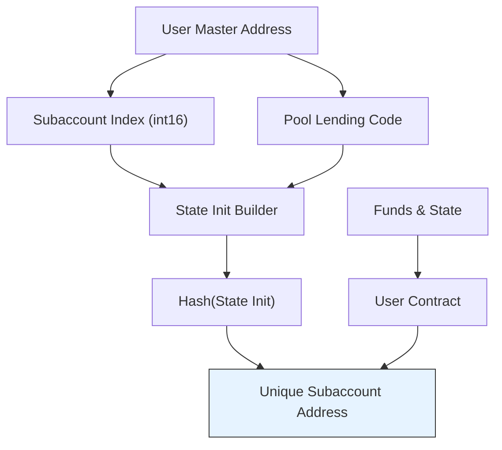
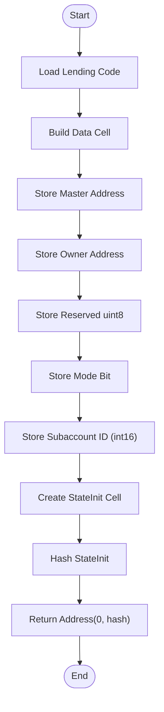
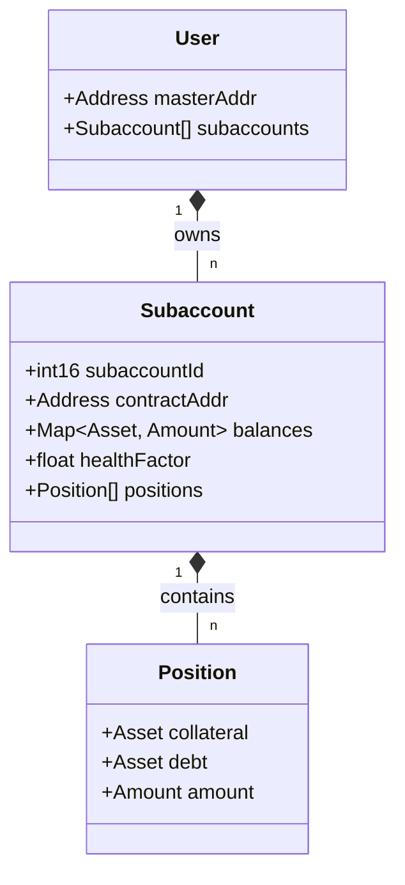
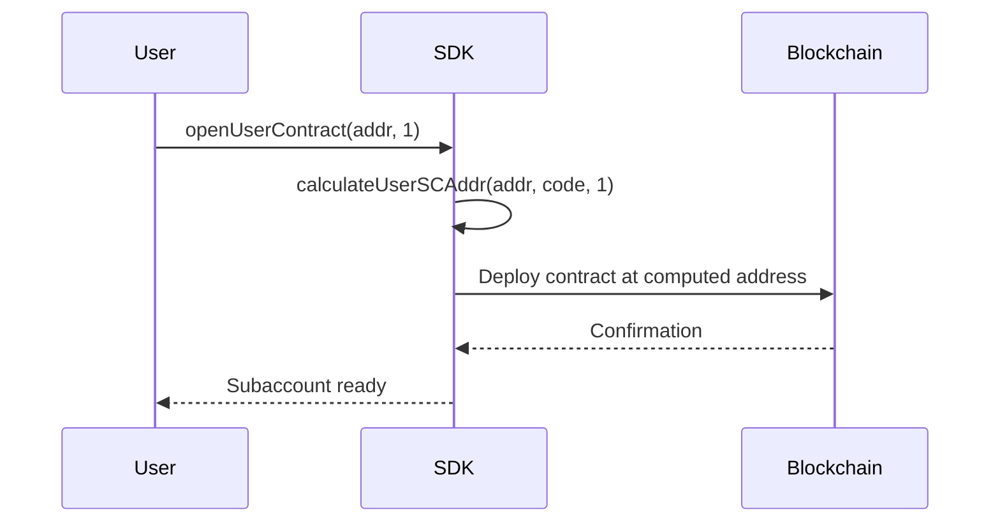

# Subaccounts


## Table of Contents
1. [Introduction](#introduction)
2. [Subaccount Architecture Overview](#subaccount-architecture-overview)
3. [Deterministic Address Derivation](#deterministic-address-derivation)
4. [Subaccount Isolation and Risk Compartmentalization](#subaccount-isolation-and-risk-compartmentalization)
5. [Code Implementation and Helper Functions](#code-implementation-and-helper-functions)
6. [Use Cases and Strategic Applications](#use-cases-and-strategic-applications)
7. [Common Issues and Troubleshooting](#common-issues-and-troubleshooting)
8. [Best Practices for Secure Subaccount Management](#best-practices-for-secure-subaccount-management)

## Introduction
Subaccounts are a critical feature enabling users to create isolated risk compartments within their primary wallet position. This design allows advanced financial strategies such as segregated collateral management, multi-strategy exposure, and risk tiering across different market conditions. Each subaccount operates as a distinct smart contract instance derived deterministically from the user's master address and a unique subaccount index. This document explores the technical implementation, use cases, and best practices surrounding subaccounts in the Evaa protocol.

**Section sources**
- [SubaccountCalculation.test.ts](file://tests/address/SubaccountCalculation.test.ts#L1-L127)

## Subaccount Architecture Overview





**Diagram sources**
- [SubaccountCalculation.test.ts](file://tests/address/SubaccountCalculation.test.ts#L10-L127)

**Section sources**
- [SubaccountCalculation.test.ts](file://tests/address/SubaccountCalculation.test.ts#L1-L127)

## Deterministic Address Derivation

The subaccount system relies on deterministic address derivation using the TON blockchain’s state initialization hashing mechanism. The derived address is computed based on:
- User's master wallet address
- Subaccount index (16-bit signed integer)
- Pool-specific lending contract code

This ensures that any party can independently verify or reconstruct a subaccount address without requiring on-chain lookups.

### Key Derivation Logic
The `calculateUserSCAddr` method computes the subaccount address by constructing a `stateInit` cell containing:
- **Code**: The pool's lending contract bytecode
- **Data**: Serialized data including:
  - Master contract address
  - User owner address
  - Reserved byte (uint8)
  - Wallet mode flag (bit)
  - Subaccount ID stored as a 16-bit signed integer

For subaccount ID `0`, an empty builder is used instead of explicitly storing `0`, ensuring backward compatibility with legacy contracts.





**Diagram sources**
- [SubaccountCalculation.test.ts](file://tests/address/SubaccountCalculation.test.ts#L25-L60)

**Section sources**
- [SubaccountCalculation.test.ts](file://tests/address/SubaccountCalculation.test.ts#L1-L127)

## Subaccount Isolation and Risk Compartmentalization

Each subaccount functions as an independent financial compartment, providing:
- **Isolated Collateral Pools**: Assets deposited in one subaccount cannot be used to back liabilities in another.
- **Independent Health Factors**: Liquidation risk is calculated per subaccount.
- **Strategy Segregation**: Users can run hedging, yield farming, or speculative strategies in parallel without cross-contamination.

This architecture enables fine-grained risk control, allowing users to allocate capital across strategies while containing potential losses.





**Diagram sources**
- [SubaccountCalculation.test.ts](file://tests/address/SubaccountCalculation.test.ts#L1-L127)

**Section sources**
- [SubaccountCalculation.test.ts](file://tests/address/SubaccountCalculation.test.ts#L1-L127)

## Code Implementation and Helper Functions

### Core Functions
The SDK exposes several helper functions for subaccount management:

- `calculateUserSCAddr(owner: Address, code: Cell, subaccountId: number): Address`  
  Computes the deterministic address of a user contract given owner, code, and subaccount ID.

- `openUserContract(owner: Address, subaccountId?: number): Address`  
  Convenience method that opens or calculates the user contract address, defaulting to subaccount 0 if unspecified.

- `isValidSubaccountId(id: number): boolean`  
  Validates whether a given ID falls within the allowed 16-bit signed integer range, excluding `-32768`.

### Example: Manual Address Calculation

```typescript
const userAddr = Address.parseFriendly('EQBOq441r0EiLi1VXlH_-ez9piPIe_4Kyzk5zNk04jTgfiIH').address;
const lendingCode = MAINNET_POOL_CONFIG.lendingCode;
const subaccountId = 1;

// Manual construction matching contract logic
const lendingDataSub1 = beginCell()
    .storeAddress(evaa.address)
    .storeAddress(userAddr)
    .storeUint(0, 8)
    .storeBit(0)
    .storeBuilder(beginCell().storeInt(1, 16))
    .endCell();

const stateInitSub1 = beginCell()
    .store(storeStateInit({
        code: lendingCode,
        data: lendingDataSub1
    }))
    .endCell();

const manualAddr1 = new Address(0, stateInitSub1.hash());
```


This matches the output of `evaa.calculateUserSCAddr(userAddr, lendingCode, 1)`.

**Section sources**
- [SubaccountCalculation.test.ts](file://tests/address/SubaccountCalculation.test.ts#L1-L127)
- [index.ts](file://src/index.ts#L1-L45)

## Use Cases and Strategic Applications

### 1. Segregated Collateral Management
Users can allocate stablecoins in one subaccount for low-risk lending and volatile assets in another for high-leverage trading.

### 2. Multi-Strategy Exposure
Run a conservative yield strategy in `subaccount=0` and a speculative leveraged position in `subaccount=1`, preventing cascading liquidations.

### 3. Hedging Operations
Maintain long positions in one subaccount and short positions in another, enabling delta-neutral portfolios with isolated margin.

### 4. Risk Tiering
Assign risk tiers (e.g., Tier 1: conservative, Tier 2: aggressive) via subaccount indices, simplifying portfolio monitoring.

### 5. Testing and Simulation
Use higher-index subaccounts (e.g., `subaccount=42`) for strategy testing without affecting primary funds.





**Diagram sources**
- [SubaccountCalculation.test.ts](file://tests/address/SubaccountCalculation.test.ts#L15-L30)

**Section sources**
- [SubaccountCalculation.test.ts](file://tests/address/SubaccountCalculation.test.ts#L1-L127)

## Common Issues and Troubleshooting

### 1. Invalid Subaccount ID Range
Subaccount IDs must be 16-bit signed integers in the range `[-32767, 32767]`. The value `-32768` is explicitly disallowed.


```typescript
expect(isValidSubaccountId(32768)).toBe(false);  // Out of range
expect(isValidSubaccountId(-32768)).toBe(false); // Explicitly invalid
```


### 2. Address Mismatch Due to Empty vs. Zero Builder
A subaccount ID of `0` uses an empty data cell, whereas manually storing `0` as `int16` produces a different hash and thus a different address.

### 3. Wallet Compatibility
Not all wallet interfaces support subaccount discovery. Users may need to manually add subaccount addresses to track balances.

### 4. Index Reuse Risks
Reusing a subaccount index after fund withdrawal may lead to confusion or incorrect state assumptions.

**Section sources**
- [SubaccountCalculation.test.ts](file://tests/address/SubaccountCalculation.test.ts#L1-L127)

## Best Practices for Secure Subaccount Management

1. **Index Organization**: Use a consistent indexing scheme (e.g., `0`=primary, `1`=hedging, `2`=yield).
2. **Balance Monitoring**: Track each subaccount separately; avoid assuming uniform distribution.
3. **Backup Strategy**: Record all active subaccount indices associated with a wallet.
4. **Security Audits**: Treat each subaccount as a separate financial entity during risk assessment.
5. **Testing First**: Use non-zero indices for experimental strategies before deploying to primary accounts.

By adhering to these practices, users can fully leverage subaccounts for sophisticated, secure, and scalable DeFi operations.

**Section sources**
- [SubaccountCalculation.test.ts](file://tests/address/SubaccountCalculation.test.ts#L1-L127)
- [userJettonWallet.ts](file://src/utils/userJettonWallet.ts#L1-L80)

**Referenced Files in This Document**   
- [SubaccountCalculation.test.ts](file://tests/address/SubaccountCalculation.test.ts)
- [userJettonWallet.ts](file://src/utils/userJettonWallet.ts)
- [index.ts](file://src/index.ts)