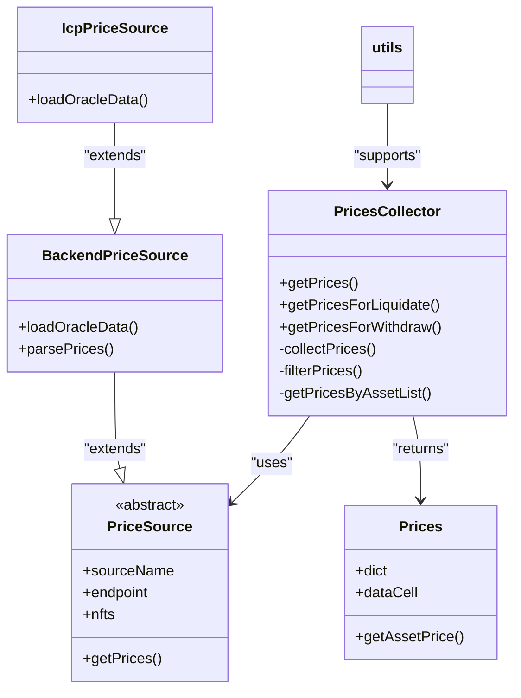
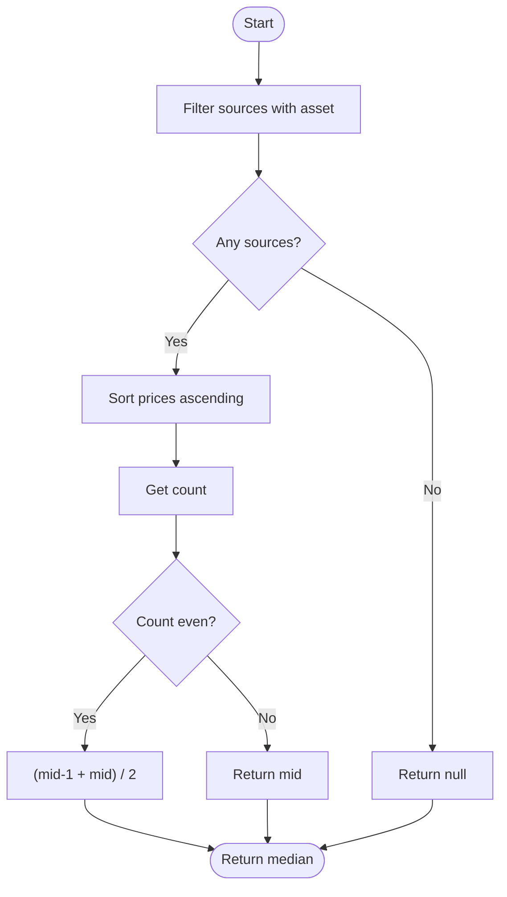
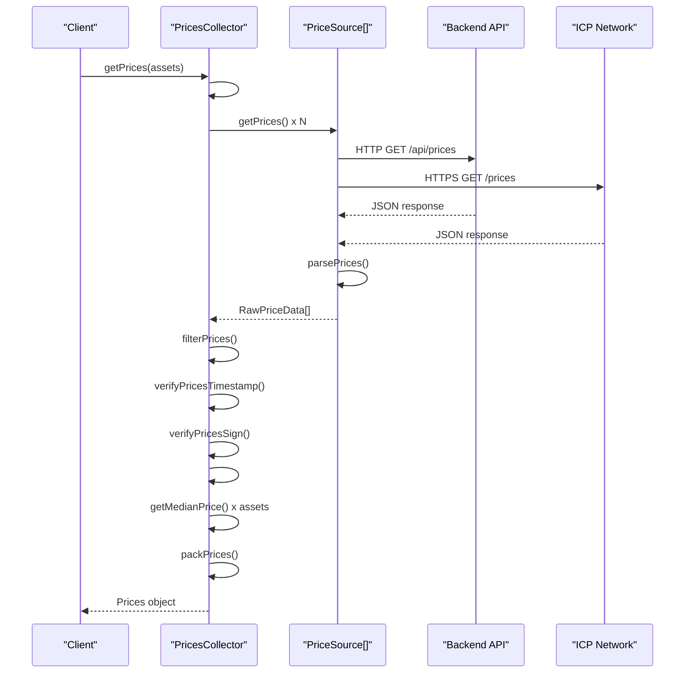

# Price Validation and Medianization


## Table of Contents
1. [Introduction](#introduction)
2. [Core Components Overview](#core-components-overview)
3. [Price Collection and Validation Pipeline](#price-collection-and-validation-pipeline)
4. [Median Price Calculation](#median-price-calculation)
5. [Data Flow and Execution Walkthrough](#data-flow-and-execution-walkthrough)
6. [Edge Case Handling](#edge-case-handling)
7. [Configuration and Threshold Management](#configuration-and-threshold-management)
8. [Troubleshooting and Debugging](#troubleshooting-and-debugging)

## Introduction
This document provides a comprehensive analysis of the price validation and medianization system used in the EVAA protocol. The system is designed to ensure secure, reliable, and tamper-resistant price feeds by aggregating data from multiple independent sources, validating their integrity, and computing robust median prices. This approach is critical for maintaining protocol security, especially in decentralized finance (DeFi) environments where accurate asset valuation prevents manipulation and liquidation risks.

The system leverages multiple oracle sources, cryptographic verification, timestamp validation, and statistical aggregation to deliver high-quality price data. It is implemented primarily in the `PricesCollector` class and supported by utility functions in `utils.ts`, with configuration defined in `Types.ts` and `constants.ts`.

## Core Components Overview

The price validation system consists of several key components that work together to collect, validate, and aggregate price data:

- **PricesCollector**: Main orchestrator that manages price collection from multiple sources.
- **PriceSource**: Abstract base class for different price data providers.
- **BackendPriceSource & IcpPriceSource**: Concrete implementations for HTTP and ICP-based endpoints.
- **utils.ts**: Contains core logic for filtering, median calculation, and data packing.
- **Prices.ts**: Represents the final output structure containing validated prices.





**Diagram sources**
- [PricesCollector.ts](file://src/prices/PricesCollector.ts#L20-L163)
- [PriceSource.ts](file://src/prices/sources/PriceSource.ts#L1-L35)
- [Backend.ts](file://src/prices/sources/Backend.ts#L1-L64)
- [Icp.ts](file://src/prices/sources/Icp.ts#L1-L30)
- [Prices.ts](file://src/prices/Prices.ts#L1-L31)

**Section sources**
- [PricesCollector.ts](file://src/prices/PricesCollector.ts#L1-L163)
- [PriceSource.ts](file://src/prices/sources/PriceSource.ts#L1-L35)

## Price Collection and Validation Pipeline

The price validation pipeline ensures data integrity through multiple layers of checks:

1. **Source Aggregation**: Collects price data from multiple independent sources.
2. **Timestamp Validation**: Ensures data freshness using TTL_ORACLE_DATA_SEC.
3. **Signature Verification**: Validates cryptographic signatures against known oracles.
4. **Outlier Filtering**: Uses median-based filtering to eliminate extreme values.
5. **Minimum Oracle Requirement**: Enforces a minimum number of valid sources.

### Timestamp Freshness Check
The system verifies that price data is not stale using a configurable time-to-live (TTL) threshold:


```typescript
export function verifyPricesTimestamp() {
    return function(priceData: RawPriceData): boolean {
        const timestamp = Date.now() / 1000;
        const pricesTime = priceData.timestamp;
        return timestamp - pricesTime < TTL_ORACLE_DATA_SEC;
    }
}
```


The `TTL_ORACLE_DATA_SEC` is set to **120 seconds** in `constants.ts`, meaning any price data older than 2 minutes is rejected.

### Cryptographic Signature Verification
Each price update is signed by an oracle node. The system verifies these signatures using public keys from registered oracle NFTs:


```typescript
export function verifyPricesSign(nfts: ExtendedEvaaOracle[]) {
    return function(priceData: RawPriceData): boolean {
        if (nfts.findIndex(x => x.pubkey.equals(priceData.pubkey as Uint8Array)) == -1) {
            return false;
        }
        return verifyRawPriceDataSign(priceData);
    }
}
```


This ensures only authorized oracles can contribute to the price feed.

### Data Filtering Process
The `collectAndFilterPrices` function applies both timestamp and signature validation:


```typescript
export async function collectAndFilterPrices(
    priceSource: PriceSource, 
    minimalOracles: number, 
    fetchConfig?: FetchConfig
): Promise<RawPriceData[]> {
    const prices = await priceSource.getPrices(fetchConfig);
    
    const acceptedPrices: RawPriceData[] = prices.filter(
        price => verifyPricesTimestamp()(price) && verifyPricesSign(priceSource.nfts)(price)
    );

    if (acceptedPrices.length < minimalOracles) {
        throw new Error("Prices are outdated");
    }

    return acceptedPrices;
}
```


**Section sources**
- [utils.ts](file://src/prices/utils.ts#L1-L40)
- [constants.ts](file://src/prices/constants.ts#L1)

## Median Price Calculation

### Why Median Prices?
Using median prices instead of single-source values significantly enhances security by:

- **Mitigating Oracle Manipulation**: A single malicious oracle cannot drastically alter the final price.
- **Reducing Volatility Spikes**: Extreme outliers are naturally filtered out.
- **Improving Robustness**: The median is less sensitive to distribution skew than the mean.

The system computes median prices using a robust algorithm that handles edge cases gracefully.

### Implementation Details
The `getMedianPrice` function implements the median calculation:


```typescript
export function getMedianPrice(pricesData: PriceData[], asset: bigint): bigint | null {
    try {
        const usingPrices = pricesData.filter(x => x.dict.has(asset));
        const sorted = usingPrices.map(x => x.dict.get(asset)!).sort((a, b) => Number(a) - Number(b));
        
        if (sorted.length == 0) {
            return null;
        }

        const mid = Math.floor(sorted.length / 2);
        if (sorted.length % 2 === 0) {
            return (sorted[mid - 1] + sorted[mid]) / 2n;
        } else {
            return sorted[mid];
        }
    }
    catch {
        return null;
    }
}
```


**Key Features:**
- Filters only sources that report the requested asset
- Sorts prices numerically
- Handles both even and odd count scenarios
- Returns `null` on failure or insufficient data
- Uses big integer arithmetic to prevent precision loss





**Diagram sources**
- [utils.ts](file://src/prices/utils.ts#L42-L58)

**Section sources**
- [utils.ts](file://src/prices/utils.ts#L42-L58)

## Data Flow and Execution Walkthrough

### Step-by-Step Execution of getPrices()
Let's trace the execution of `getPrices()` with sample inputs:

**Sample Input:**

```typescript
const assets = [{ assetId: 1n }, { assetId: 2n }];
const config = {
    poolAssetsConfig: assets,
    minimalOracles: 3,
    evaaOracles: [/* oracle NFTs */]
};
```


1. **Initialization**: `PricesCollector` is constructed with configuration
2. **Source Generation**: Creates `BackendPriceSource` and `IcpPriceSource` instances
3. **Price Collection**: Calls `#collectPricesWithValidation()`
4. **Validation Loop**: 
   - Fetches data from all sources
   - Applies timestamp and signature filters
   - Requires at least `minimalOracles` (3) valid responses
5. **Median Calculation**: For each asset, computes median across valid sources
6. **Data Packing**: Structures output in TON-compatible format





**Diagram sources**
- [PricesCollector.ts](file://src/prices/PricesCollector.ts#L70-L120)
- [Backend.ts](file://src/prices/sources/Backend.ts#L15-L60)
- [Icp.ts](file://src/prices/sources/Icp.ts#L10-L25)

**Section sources**
- [PricesCollector.ts](file://src/prices/PricesCollector.ts#L70-L120)

## Edge Case Handling

The system robustly handles various edge cases:

### Insufficient Valid Sources
If fewer than `minimalOracles` valid price sources are available, the system throws an error:


```typescript
if (this.#prices.length < this.#minimalOracles) {
    throw new Error(`Error per updating prices, valid ${this.#prices.length} of ${this.#minimalOracles}`);
}
```


### Extreme Price Deviations
Handled naturally by median calculation - outliers have minimal impact on final price.

### Empty Asset Lists
Returns empty dictionary and empty cell:

```typescript
if (assets.length == 0) {
    return new Prices(Dictionary.empty<bigint, bigint>(), Cell.EMPTY);
}
```


### User from Another Pool
Detected during principal filtering:

```typescript
if (assets.includes(undefined)) {
    throw new Error("User from another pool");
}
```


### Single Asset Debt
Prevented by validation:

```typescript
if (collateralToDebt && assets.length == 1) {
    throw new Error("Cannot debt only one supplied asset");
}
```


**Section sources**
- [PricesCollector.ts](file://src/prices/PricesCollector.ts#L40-L163)

## Configuration and Threshold Management

### Key Configuration Parameters
The system can be configured through `PricesCollectorConfig`:


```typescript
type PricesCollectorConfig = {
    poolAssetsConfig: PoolAssetsConfig;
    minimalOracles: number;
    evaaOracles: ExtendedEvaaOracle[];
    sourcesConfig?: PriceSourcesConfig;
    additionalPriceSources?: PriceSource[];
};
```


### Default Endpoints
Defined in `Types.ts`:

```typescript
export const DefaultPriceSourcesConfig: PriceSourcesConfig = {
    backendEndpoints: ['api.evaa.space', 'evaa.space'],
    icpEndpoints: ['6khmc-aiaaa-aaaap-ansfq-cai.raw.icp0.io'],
};
```


### Tolerance Thresholds
- **TTL_ORACLE_DATA_SEC**: 120 seconds (configurable)
- **minimalOracles**: Set per pool (typically 3+ for redundancy)
- **Fetch timeout**: Configurable via `FetchConfig`

### Best Practices for Configuration
1. **Set minimalOracles ≥ 3** for adequate redundancy
2. **Monitor source reliability** and adjust endpoints as needed
3. **Keep TTL conservative** (120s is reasonable for most assets)
4. **Use multiple source types** (Backend + ICP) for decentralization
5. **Regularly update oracle NFT list** to rotate trusted nodes

**Section sources**
- [Types.ts](file://src/prices/Types.ts#L1-L62)
- [constants.ts](file://src/prices/constants.ts#L1)

## Troubleshooting and Debugging

### Common Issues and Solutions

**Issue: "Failed to collect sufficient prices"**
- **Cause**: Not enough valid oracle responses
- **Solution**: Check network connectivity, verify oracle health, reduce `minimalOracles` temporarily

**Issue: "Prices are outdated"**
- **Cause**: All price data exceeds TTL
- **Solution**: Check system clock, investigate source delays, consider increasing TTL

**Issue: "User from another pool"**
- **Cause**: Asset ID mismatch
- **Solution**: Verify pool configuration and asset mapping

### Debugging Tips
1. **Enable console debugging** (commented out in code)
2. **Check individual source responses** using direct API calls
3. **Verify oracle signatures** match registered NFTs
4. **Monitor timestamp differences** between client and servers
5. **Use test environments** with mocked responses

### Validation Failure Checklist
- [ ] Are all oracle endpoints reachable?
- [ ] Do timestamps fall within TTL window?
- [ ] Are signatures valid and from authorized oracles?
- [ ] Does every source report the required assets?
- [ ] Is `minimalOracles` setting appropriate for available sources?

**Section sources**
- [PricesCollector.ts](file://src/prices/PricesCollector.ts#L1-L163)
- [utils.ts](file://src/prices/utils.ts#L1-L164)

**Referenced Files in This Document**   
- [PricesCollector.ts](file://src/prices/PricesCollector.ts)
- [utils.ts](file://src/prices/utils.ts)
- [Types.ts](file://src/prices/Types.ts)
- [constants.ts](file://src/prices/constants.ts)
- [Backend.ts](file://src/prices/sources/Backend.ts)
- [Icp.ts](file://src/prices/sources/Icp.ts)
- [PriceSource.ts](file://src/prices/sources/PriceSource.ts)
- [Prices.ts](file://src/prices/Prices.ts)