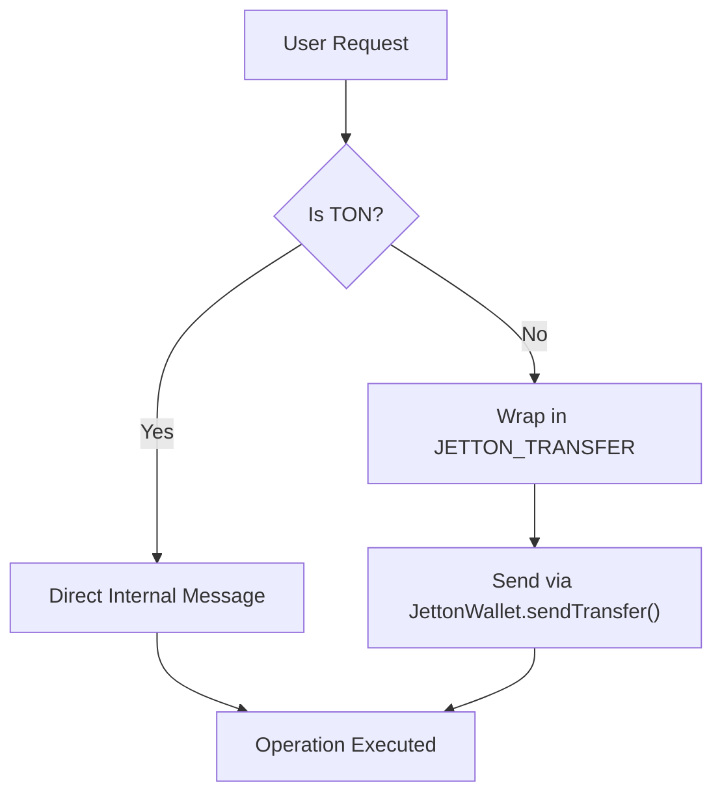
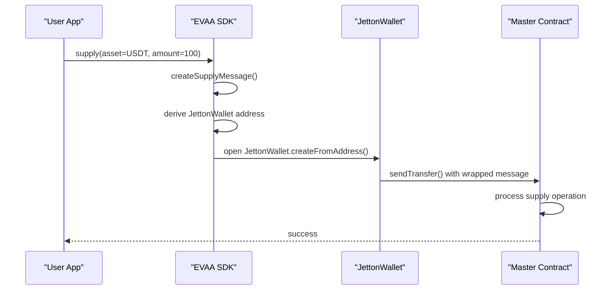

# Jetton vs TON Asset Handling


## Table of Contents
1. [Introduction](#introduction)
2. [Asset Identification Using assetId Constants](#asset-identification-using-assetid-constants)
3. [Message Construction for TON vs Jetton Operations](#message-construction-for-ton-vs-jetton-operations)
4. [Role of JettonWallet in Token Transfers](#role-of-jettonwallet-in-token-transfers)
5. [Supply and Withdraw Operations: Key Differences](#supply-and-withdraw-operations-key-differences)
6. [Common Issues and Troubleshooting](#common-issues-and-troubleshooting)
7. [Best Practices for Managing Asset Types](#best-practices-for-managing-asset-types)

## Introduction
This document provides a comprehensive overview of how the EVAA SDK distinguishes between native TON and Jetton (fungible token) assets during supply and withdrawal operations. It explains the underlying mechanisms for asset identification, message construction, and interaction with the JettonWallet contract. The goal is to clarify the technical distinctions and provide developers with practical guidance for handling both asset types correctly.

**Section sources**
- [AbstractMaster.ts](file://src/contracts/AbstractMaster.ts#L0-L422)

## Asset Identification Using assetId Constants
The SDK uses unique `assetId` constants to differentiate between various assets, including native TON and Jetton tokens. These IDs are generated using SHA-256 hashing of asset names and stored in the `ASSET_ID` object.


```ts
export const ASSET_ID = {
    TON: sha256Hash('TON'),
    USDT: sha256Hash('USDT'),
    jUSDT: sha256Hash('jUSDT'),
    stTON: sha256Hash('stTON'),
    tsTON: sha256Hash('tsTON'),
    // ... other assets
};
```


The `isTonAsset` and `isTonAssetId` utility functions are used throughout the codebase to determine whether an asset is native TON or a Jetton:


```ts
function isTonAsset(asset: PoolAssetConfig): boolean {
    return asset.name === 'TON' || asset.assetId === ASSET_ID.TON;
}
```


This distinction is critical because native TON transactions are processed directly through the blockchain's internal messaging system, while Jetton transfers require interaction with the user's JettonWallet contract.

**Section sources**
- [assetId.ts](file://src/constants/assets/assetId.ts#L2-L30)
- [AbstractMaster.ts](file://src/contracts/AbstractMaster.ts#L252-L279)

## Message Construction for TON vs Jetton Operations
The construction of operation messages differs significantly between TON and Jetton assets due to their different transfer mechanisms.

### TON Message Construction
For native TON, the operation payload is sent directly via `provider.internal()` without wrapping:


```ts
await provider.internal(via, {
    value,
    sendMode: SendMode.PAY_GAS_SEPARATELY + SendMode.IGNORE_ERRORS,
    body: message,
});
```


The message contains the opcode and relevant parameters such as amount, query ID, and user address.

### Jetton Message Construction
Jetton operations must be wrapped in a `JETTON_TRANSFER` message using the `createJettonTransferMessage` method:


```ts
protected createJettonTransferMessage(
    parameters: JettonParams, 
    defaultFees: bigint, 
    message: Cell
): Cell {
    return beginCell()
        .storeUint(OPCODES.JETTON_TRANSFER, 32)
        .storeUint(parameters.queryID, 64)
        .storeCoins(parameters.amount ?? 0n)
        .storeAddress(parameters.destinationAddress ?? this.address)
        .storeAddress(parameters.responseAddress ?? parameters.userAddress)
        .storeBit(0)
        .storeCoins(parameters.forwardAmount ?? defaultFees)
        .storeBit(1)
        .storeRef(message)
        .endCell();
}
```


This wrapper includes forwarding fees (`JETTON_FWD`) and ensures the JettonWallet contract forwards the inner operation to the target contract.





**Diagram sources**
- [AbstractMaster.ts](file://src/contracts/AbstractMaster.ts#L196-L226)
- [general/index.ts](file://src/constants/general/index.ts#L48-L90)

**Section sources**
- [AbstractMaster.ts](file://src/contracts/AbstractMaster.ts#L252-L279)
- [general/index.ts](file://src/constants/general/index.ts#L90)

## Role of JettonWallet in Token Transfers
The `JettonWallet` contract acts as an intermediary for all Jetton transfers. It holds the user's token balance and is responsible for executing transfers on behalf of the user.

### JettonWallet Class

```ts
export class JettonWallet implements Contract {
    readonly address: Address;
    static createFromAddress(address: Address) {
        return new JettonWallet(address);
    }

    async sendTransfer(
        provider: ContractProvider, 
        via: Sender, 
        value: bigint, 
        payload: Cell
    ) {
        await provider.internal(via, {
            value,
            sendMode: SendMode.PAY_GAS_SEPARATELY + SendMode.IGNORE_ERRORS,
            body: payload,
        });
    }
}
```


### Wallet Address Derivation
The SDK derives the user's JettonWallet address using the `getUserJettonWallet` function:


```ts
export function getUserJettonWallet(
    ownerAddress: Address, 
    poolAssetConfig: PoolAssetConfig
) {
    if (poolAssetConfig.name === 'TON') {
        throw new Error("Can't getUserJettonWallet for TON asset");
    }
    
    const jettonData = getUserJettonData(ownerAddress, assetName, jettonWalletCode, masterAddress);
    const stateInit = beginCell().store(storeStateInit({ code, data })).endCell();
    return new Address(0, stateInit.hash());
}
```


This deterministic address derivation allows the SDK to interact with the correct wallet without requiring explicit configuration.





**Diagram sources**
- [JettonWallet.ts](file://src/contracts/JettonWallet.ts#L0-L19)
- [userJettonWallet.ts](file://src/utils/userJettonWallet.ts#L43-L79)

**Section sources**
- [JettonWallet.ts](file://src/contracts/JettonWallet.ts#L0-L19)
- [userJettonWallet.ts](file://src/utils/userJettonWallet.ts#L43-L79)

## Supply and Withdraw Operations: Key Differences
The handling of supply and withdraw operations differs fundamentally between TON and Jetton assets.

### Supply Operation Flow

```ts
async sendSupply(
    provider: ContractProvider, 
    via: Sender, 
    value: bigint, 
    parameters: SupplyParameters
) {
    const message = this.createSupplyMessage(parameters);

    if (!isTonAsset(parameters.asset)) {
        if (!via.address) throw new Error('Via address required for jetton supply');
        const jettonWallet = provider.open(
            JettonWallet.createFromAddress(
                getUserJettonWallet(via.address, parameters.asset)
            )
        );
        await jettonWallet.sendTransfer(via, value, message);
    } else {
        await provider.internal(via, {
            value,
            sendMode: SendMode.PAY_GAS_SEPARATELY + SendMode.IGNORE_ERRORS,
            body: message,
        });
    }
}
```


### Key Differences Summary
| **Aspect** | **TON** | **Jetton** |
|----------|--------|----------|
| **Transfer Mechanism** | Direct internal message | Via JettonWallet contract |
| **Message Wrapping** | No wrapping required | Wrapped in JETTON_TRANSFER |
| **Fees** | SUPPLY fee only | SUPPLY + JETTON_FWD fees |
| **Address Requirement** | None | Via address required |
| **Contract Interaction** | Direct with Master | Through JettonWallet |

**Section sources**
- [AbstractMaster.ts](file://src/contracts/AbstractMaster.ts#L281-L317)

## Common Issues and Troubleshooting
Developers may encounter several common issues when working with different asset types.

### Missing Jetton Wallet Instance
**Issue**: Attempting to supply a Jetton without a valid `via.address`.

**Error**: `"Via address is required for jetton supply"`

**Solution**: Ensure the sender has an address and is properly configured:


```ts
const sender = tonConnectSender; // Must have .address property
await master.sendSupply(provider, sender, value, parameters);
```


### Allowance Problems
Unlike some token standards, TON Jettons do not use allowance systems. The user must own the JettonWallet that holds the tokens. If the wallet doesn't exist or has zero balance:

**Solution**: 
1. Verify the user actually holds the tokens
2. Check that the correct wallet address is being used
3. Ensure the wallet is deployed (some wallets deploy on first transfer)

### Incorrect Asset Identification
**Issue**: Misidentifying TON as a Jetton or vice versa.

**Prevention**: Always use `isTonAsset()` utility function:


```ts
import { isTonAsset } from '../utils';

if (isTonAsset(asset)) {
    // Handle as TON
} else {
    // Handle as Jetton
}
```


**Section sources**
- [AbstractMaster.ts](file://src/contracts/AbstractMaster.ts#L281-L317)
- [userJettonWallet.ts](file://src/utils/userJettonWallet.ts#L43-L79)

## Best Practices for Managing Asset Types
To ensure reliable operation across both asset types, follow these best practices:

### 1. Always Check Asset Type
Use the provided utilities to determine asset type before operations:


```ts
if (!isTonAsset(parameters.asset)) {
    // Add Jetton-specific validation
    if (!via.address) throw new Error('Via address required');
}
```


### 2. Handle Fees Correctly
Account for additional forwarding fees when working with Jettons:


```ts
const baseFee = isTonAsset(asset) ? FEES.SUPPLY : FEES.SUPPLY + FEES.JETTON_FWD;
```


### 3. Validate Wallet Existence
Before attempting Jetton operations, verify the wallet can be derived:


```ts
try {
    const walletAddress = getUserJettonWallet(userAddress, asset);
    // Proceed with operation
} catch (error) {
    // Handle TON or invalid asset
}
```


### 4. Use Consistent Error Handling
Implement unified error handling for both asset types:


```ts
try {
    await master.sendSupply(provider, sender, value, parameters);
} catch (error) {
    if (error.message.includes('via.address')) {
        console.error('Sender address required for Jetton operations');
    }
    throw error;
}
```


### 5. Test Both Asset Types
Ensure thorough testing with both TON and various Jetton assets to catch edge cases.

**Section sources**
- [AbstractMaster.ts](file://src/contracts/AbstractMaster.ts#L252-L317)
- [userJettonWallet.ts](file://src/utils/userJettonWallet.ts#L43-L79)
- [general/index.ts](file://src/constants/general/index.ts#L48-L90)

**Referenced Files in This Document**   
- [assetId.ts](file://src/constants/assets/assetId.ts)
- [JettonWallet.ts](file://src/contracts/JettonWallet.ts)
- [userJettonWallet.ts](file://src/utils/userJettonWallet.ts)
- [AbstractMaster.ts](file://src/contracts/AbstractMaster.ts)
- [general/index.ts](file://src/constants/general/index.ts)