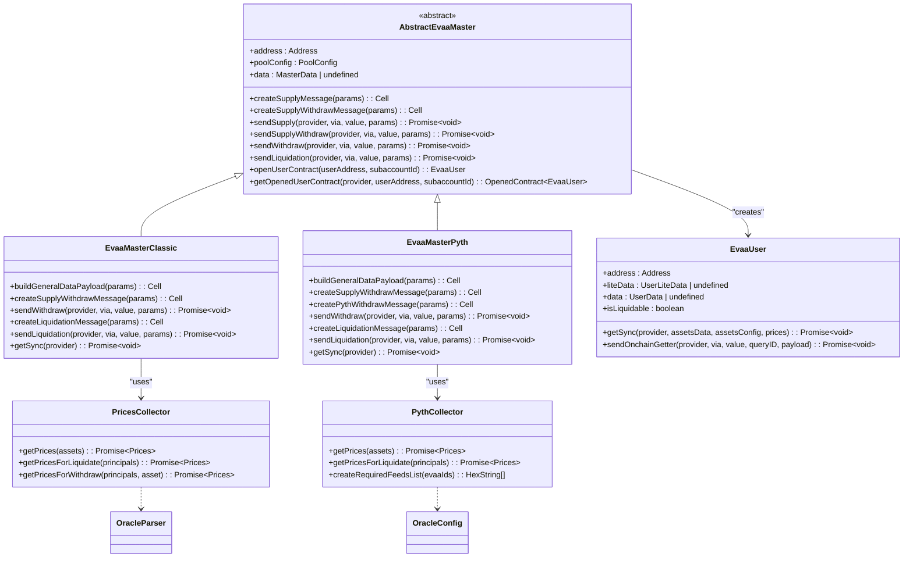
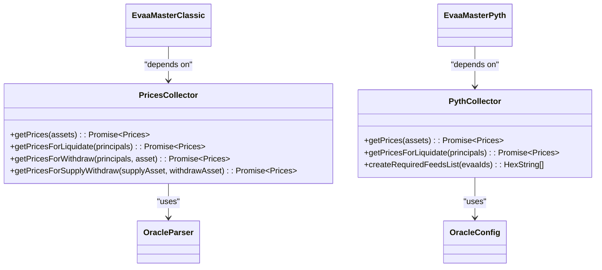
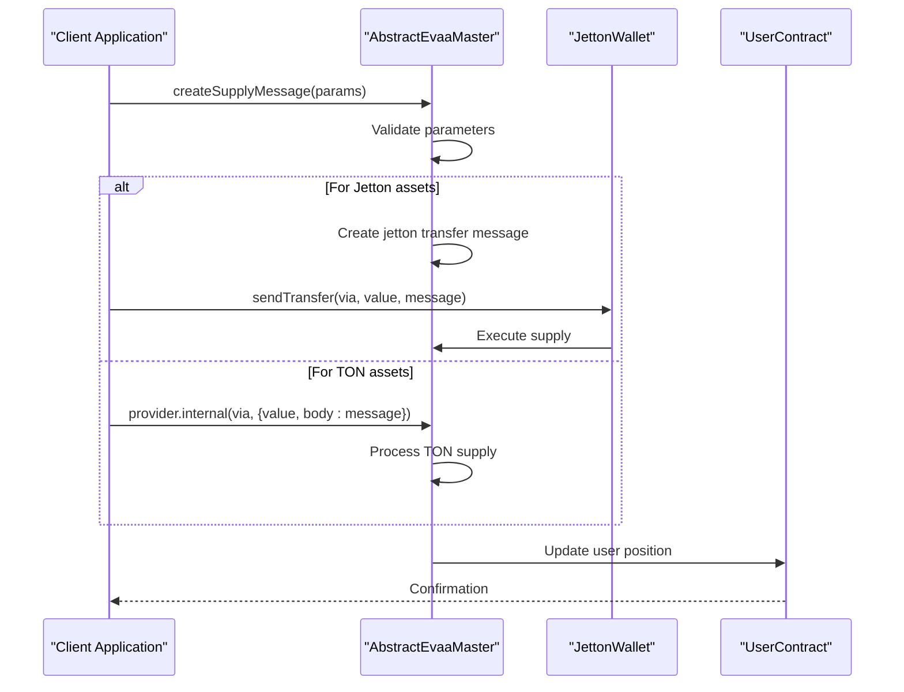
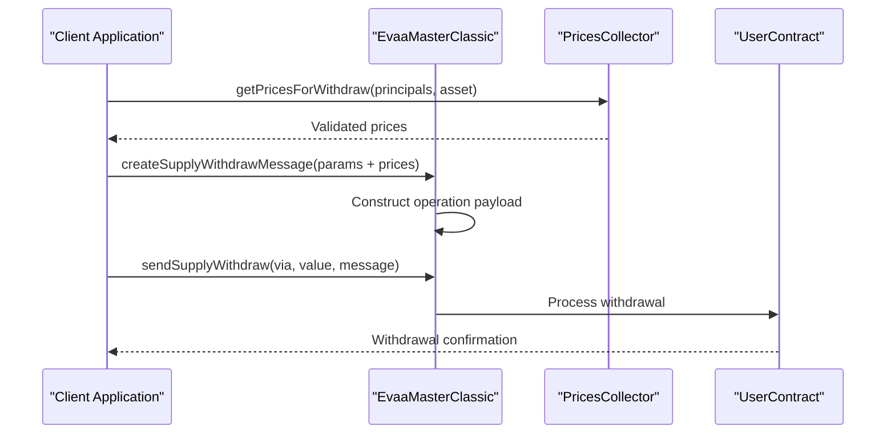
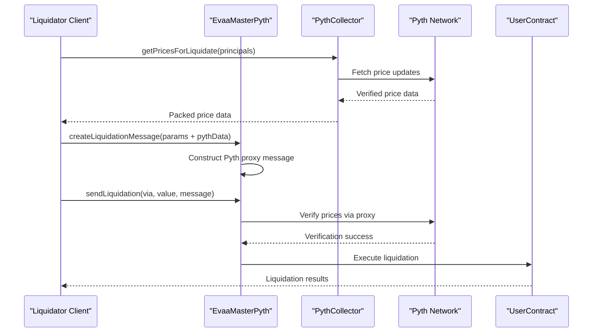

# Master Contracts


## Table of Contents
1. [Introduction](#introduction)
2. [Core Architecture Overview](#core-architecture-overview)
3. [Abstract Base Class: AbstractEvaaMaster](#abstract-base-class-abstractevaamaster)
4. [ClassicMaster Implementation](#classicmaster-implementation)
5. [PythMaster Implementation](#pythmaster-implementation)
6. [Price Context Injection via PricesCollector](#price-context-injection-via-pricescollector)
7. [Interaction Flow with Sequence Diagrams](#interaction-flow-with-sequence-diagrams)
8. [Method Signatures and Parameter Validation](#method-signatures-and-parameter-validation)
9. [Error Conditions and Gas Cost Implications](#error-conditions-and-gas-cost-implications)
10. [Examples and Wallet Integration](#examples-and-wallet-integration)

## Introduction

The Master Contracts in the EVAA SDK serve as central coordination points for supply, withdrawal, and liquidation operations across different oracle types. These contracts unify core logic through an abstract base class while allowing oracle-specific implementations for Classic and Pyth oracles. This document provides comprehensive API documentation detailing the structure, behavior, and integration patterns of these contracts.

The system leverages the TON blockchain's smart contract model, using message passing and internal state management to coordinate user interactions with lending pools. The design emphasizes modularity, extensibility, and oracle abstraction to support multiple price feed mechanisms.

**Section sources**
- [AbstractMaster.ts](file://src/contracts/AbstractMaster.ts#L1-L422)

## Core Architecture Overview





**Diagram sources**
- [AbstractMaster.ts](file://src/contracts/AbstractMaster.ts#L1-L422)
- [ClassicMaster.ts](file://src/contracts/ClassicMaster.ts#L1-L184)
- [PythMaster.ts](file://src/contracts/PythMaster.ts#L1-L265)
- [PricesCollector.ts](file://src/prices/PricesCollector.ts#L1-L163)
- [PythCollector.ts](file://src/prices/PythCollector.ts#L1-L215)
- [UserContract.ts](file://src/contracts/UserContract.ts#L1-L145)

## Abstract Base Class: AbstractEvaaMaster

The `AbstractEvaaMaster` class serves as the foundation for all Master contract implementations, providing shared functionality and defining the contract interface.

### Key Responsibilities
- **Message Construction**: Centralized creation of supply, withdraw, and liquidation messages
- **State Management**: Maintains contract data and synchronization state
- **User Contract Interaction**: Facilitates interaction with user-specific contracts
- **Oracle Abstraction**: Provides a unified interface for oracle-specific operations

### Core Methods


```typescript
/**
 * Creates a supply message for the given parameters
 * @param parameters - SupplyParameters object containing asset, amount, user address, etc.
 * @returns Cell containing the constructed message
 */
createSupplyMessage(parameters: SupplyParameters): Cell

/**
 * Sends a supply transaction through the provider
 * @param provider - ContractProvider instance
 * @param via - Sender interface for transaction signing
 * @param value - Amount of TON to attach
 * @param parameters - SupplyParameters for the operation
 */
async sendSupply(provider: ContractProvider, via: Sender, value: bigint, parameters: SupplyParameters)

/**
 * Abstract method for creating supply-withdraw messages (oracle-specific)
 */
abstract createSupplyWithdrawMessage(
    parameters: ClassicSupplyWithdrawParameters | PythSupplyWithdrawParameters
): Cell

/**
 * Abstract method for sending liquidation transactions
 */
abstract sendLiquidation(
    provider: ContractProvider,
    via: Sender,
    value: bigint,
    parameters: ClassicLiquidationParameters | PythLiquidationParameters
): Promise<void>
```


### Type Definitions

**SupplyParameters**
- asset: PoolAssetConfig
- queryID: bigint
- includeUserCode: boolean
- amount: bigint
- userAddress: Address
- responseAddress?: Address
- forwardAmount?: bigint
- payload: Cell
- subaccountId?: number
- returnRepayRemainingsFlag?: boolean
- customPayloadRecipient?: Address
- customPayloadSaturationFlag?: boolean

**WithdrawParameters**
- queryID: bigint
- amount: bigint
- userAddress: Address
- includeUserCode: boolean
- asset: PoolAssetConfig
- payload: Cell
- subaccountId?: number
- forwardAmount?: bigint
- amountToTransfer: bigint
- customPayloadSaturationFlag: boolean
- returnRepayRemainingsFlag: boolean

**LiquidationParameters**
- borrowerAddress: Address
- loanAsset: bigint
- collateralAsset: bigint
- minCollateralAmount: bigint
- liquidationAmount: bigint
- asset: PoolAssetConfig
- queryID: bigint
- payload: Cell
- liquidatorAddress: Address
- includeUserCode: boolean
- subaccountId?: number
- customPayloadRecipient?: Address
- customPayloadSaturationFlag?: boolean

**Section sources**
- [AbstractMaster.ts](file://src/contracts/AbstractMaster.ts#L1-L422)

## ClassicMaster Implementation

The `EvaaMasterClassic` class implements the `AbstractEvaaMaster` for the Classic oracle type, handling price data directly embedded in transactions.

### Oracle-Specific Behavior

Unlike the Pyth implementation, ClassicMaster expects pre-fetched price data to be included directly in transaction messages via the `priceData` field. This approach suits scenarios where price data is readily available off-chain.

### Method Implementations

#### createSupplyWithdrawMessage

```typescript
createSupplyWithdrawMessage(parameters: ClassicSupplyWithdrawParameters): Cell
```

Constructs a supply-withdraw message with embedded price data. Uses different opcodes based on whether price data is provided:
- `OPCODES.SUPPLY_WITHDRAW_MASTER` when price data is present
- `OPCODES.SUPPLY_WITHDRAW_MASTER_WITHOUT_PRICES` when price data is absent

#### sendWithdraw

```typescript
async sendWithdraw(
    provider: ContractProvider,
    via: Sender,
    value: bigint,
    parameters: ClassicWithdrawParameters
): Promise<void>
```

Implements withdrawal by reusing the supply-withdraw functionality with zero supply amount, maintaining consistency in message construction.

#### createLiquidationMessage

```typescript
protected createLiquidationMessage(parameters: ClassicLiquidationParameters): Cell
```

Creates a liquidation message that includes:
- Borrower and collateral information
- Price data reference
- Custom payload configuration
- Subaccount support

**Section sources**
- [ClassicMaster.ts](file://src/contracts/ClassicMaster.ts#L1-L184)

## PythMaster Implementation

The `EvaaMasterPyth` class implements the `AbstractEvaaMaster` for the Pyth oracle network, leveraging verifiable price updates.

### Oracle Integration Strategy

PythMaster uses the Pyth Network's verifiable price feeds, requiring additional parameters for price verification and proxy handling.

### Key Type Extensions

**PythBaseData**
- priceData: Buffer | Cell
- targetFeeds: HexString[]

**ProxySpecificPythParams**
- pythAddress: Address
- attachedValue: bigint
- minPublishTime: number | bigint
- maxPublishTime: number | bigint

**OnchainSpecificPythParams**
- publishGap: number | bigint
- maxStaleness: number | bigint

### Specialized Methods

#### createSupplyWithdrawMessage

```typescript
createSupplyWithdrawMessage(parameters: PythSupplyWithdrawParameters): Cell
```

Handles both jetton and TON supply-withdraw operations differently:
- For jetton assets: Uses `makeOnchainGetterMasterMessage` with price verification parameters
- For TON assets: Uses `makePythProxyMessage` with proxy-specific parameters

#### sendWithdraw

```typescript
async sendWithdraw(
    provider: ContractProvider,
    via: Sender,
    value: bigint,
    parameters: PythWithdrawParameters
): Promise<void>
```

Sends withdrawal messages directly to the Pyth proxy contract rather than the master contract, attaching the full value for price verification.

#### createLiquidationMessage

```typescript
protected createLiquidationMessage(parameters: PythLiquidationParameters): Cell
```

Constructs liquidation messages with Pyth-specific price verification data, supporting both on-chain getter and proxy patterns based on asset type.

**Section sources**
- [PythMaster.ts](file://src/contracts/PythMaster.ts#L1-L265)

## Price Context Injection via PricesCollector

The PricesCollector system enables dynamic price context injection into Master contract operations.

### PricesCollector Class





**Diagram sources**
- [PricesCollector.ts](file://src/prices/PricesCollector.ts#L1-L163)
- [PythCollector.ts](file://src/prices/PythCollector.ts#L1-L215)

### Price Collection Workflow

1. **Asset Identification**: Determine required assets based on user position
2. **Source Selection**: Choose appropriate price sources based on configuration
3. **Data Aggregation**: Collect prices from multiple sources
4. **Validation**: Verify timestamp and signature integrity
5. **Median Calculation**: Compute median prices across sources
6. **Packaging**: Format prices into Cell objects for blockchain transmission

### Integration with Master Contracts

Master contracts use price collectors to obtain validated price data before constructing transaction messages. The collected prices are then embedded in operation payloads to provide current market context for risk assessment.

**Section sources**
- [PricesCollector.ts](file://src/prices/PricesCollector.ts#L1-L163)
- [PythCollector.ts](file://src/prices/PythCollector.ts#L1-L215)

## Interaction Flow with Sequence Diagrams

### Supply Operation Flow





**Diagram sources**
- [AbstractMaster.ts](file://src/contracts/AbstractMaster.ts#L1-L422)

### Withdraw Operation Flow (Classic)





**Diagram sources**
- [ClassicMaster.ts](file://src/contracts/ClassicMaster.ts#L1-L184)
- [PricesCollector.ts](file://src/prices/PricesCollector.ts#L1-L163)

### Liquidation Flow (Pyth)





**Diagram sources**
- [PythMaster.ts](file://src/contracts/PythMaster.ts#L1-L265)
- [PythCollector.ts](file://src/prices/PythCollector.ts#L1-L215)

## Method Signatures and Parameter Validation

### createSupplyMessage


```typescript
createSupplyMessage(parameters: SupplyParameters): Cell
```


**Parameter Validation Rules:**
- asset: Must be valid PoolAssetConfig
- amount: Must be positive bigint
- userAddress: Must be valid TON Address
- queryID: Must be unique for the session
- subaccountId: Must be 0-65535 if specified

**Error Conditions:**
- Throws if amount ≤ 0
- Throws if userAddress is invalid
- Throws if asset configuration is missing

### createWithdrawMessage


```typescript
// Classic
createWithdrawMessage(parameters: ClassicWithdrawParameters): Cell
// Pyth  
createWithdrawMessage(parameters: PythWithdrawParameters): Cell
```


**Supports:**
- Partial withdrawals (amount < full balance)
- Full withdrawals (amount = full balance)
- Subaccount withdrawals (subaccountId > 0)

**Validation:**
- amount must be ≤ available balance
- priceData must be valid and recent (Classic)
- pyth parameters must meet verification requirements (Pyth)

### createLiquidationMessage


```typescript
createLiquidationMessage(parameters: LiquidationParameters): Cell
```


**Cross-Asset Capability:**
- loanAsset and collateralAsset can be different
- Supports any valid asset pair in the pool

**Min Collateral Enforcement:**
- minCollateralAmount must be > 0
- System calculates expected collateral based on current prices
- Transaction fails if actual collateral < minimum

**Validation:**
- Borrower must be currently liquidatable
- Liquidator must have sufficient balance
- Collateral asset must be enabled for borrowing

**Section sources**
- [AbstractMaster.ts](file://src/contracts/AbstractMaster.ts#L1-L422)
- [ClassicMaster.ts](file://src/contracts/ClassicMaster.ts#L1-L184)
- [PythMaster.ts](file://src/contracts/PythMaster.ts#L1-L265)

## Error Conditions and Gas Cost Implications

### Common Error Conditions

**Insufficient Collateral**
- Triggered when user's health factor falls below threshold
- Prevents further borrowing
- Enables liquidation by third parties
- Checked during supply, withdraw, and liquidation operations

**Invalid Price Data**
- Classic: priceData timestamp too old
- Pyth: signature verification failure
- Missing required price feeds

**Balance Insufficiency**
- Supply: insufficient balance in sender's wallet
- Withdraw: insufficient liquidity in pool
- Liquidation: insufficient liquidator balance

### Gas Cost Implications

**Message Construction Costs**
- Supply: ~0.01 TON (base) + asset-specific fees
- Withdraw: ~0.02 TON (higher due to price verification)
- Liquidation: ~0.03 TON (highest due to complexity)

**Oracle-Specific Differences**
- Classic: Lower gas costs, assumes trusted price data
- Pyth: Higher gas costs, includes price verification overhead

**Optimization Recommendations**
- Batch operations when possible
- Reuse price data across multiple operations
- Use subaccounts judiciously (increases message size)

**Section sources**
- [AbstractMaster.ts](file://src/contracts/AbstractMaster.ts#L1-L422)
- [ClassicMaster.ts](file://src/contracts/ClassicMaster.ts#L1-L184)
- [PythMaster.ts](file://src/contracts/PythMaster.ts#L1-L265)

## Examples and Wallet Integration

### Supply Example


```typescript
const supplyParams: SupplyParameters = {
    asset: poolConfig.assetsConfig[0],
    queryID: 12345n,
    includeUserCode: true,
    amount: 1000000000n, // 1 TON
    userAddress: userAddress,
    payload: Cell.EMPTY,
};

const message = master.createSupplyMessage(supplyParams);
await master.sendSupply(provider, sender, 1200000000n, supplyParams); // Send with 0.2 TON extra for fees
```


### Withdraw Example (Pyth)


```typescript
const pythParams: TonPythParams = {
    priceData: await fetchPythPrices(),
    targetFeeds: ['0xfeed1', '0xfeed2'],
    minPublishTime: Math.floor(Date.now() / 1000) - 60,
    maxPublishTime: Math.floor(Date.now() / 1000) + 60,
    pythAddress: pythProxyAddress,
    attachedValue: 500000000n,
};

const withdrawParams: PythWithdrawParameters = {
    queryID: 12346n,
    amount: 500000000n,
    userAddress: userAddress,
    includeUserCode: true,
    asset: usdtAsset,
    payload: Cell.EMPTY,
    forwardAmount: 100000000n,
    amountToTransfer: 400000000n,
    customPayloadSaturationFlag: false,
    returnRepayRemainingsFlag: true,
    pyth: pythParams,
};

await master.sendWithdraw(provider, sender, 500000000n, withdrawParams);
```


### Wallet Integration via Sender Interface


```typescript
import { TonConnectSender } from '../utils/tonConnectSender';

const sender = new TonConnectSender(tonConnect);
const openedMaster = provider.open(master);

// The Sender interface abstracts wallet interaction
await openedMaster.sendSupply(sender, supplyValue, supplyParams);
```


The Sender interface enables integration with various wallet providers (TonConnect, SDK-based, etc.) while maintaining a consistent API for transaction signing and sending.

**Section sources**
- [AbstractMaster.ts](file://src/contracts/AbstractMaster.ts#L1-L422)
- [ClassicMaster.ts](file://src/contracts/ClassicMaster.ts#L1-L184)
- [PythMaster.ts](file://src/contracts/PythMaster.ts#L1-L265)
- [UserContract.ts](file://src/contracts/UserContract.ts#L1-L145)

**Referenced Files in This Document**   
- [AbstractMaster.ts](file://src/contracts/AbstractMaster.ts)
- [ClassicMaster.ts](file://src/contracts/ClassicMaster.ts)
- [PythMaster.ts](file://src/contracts/PythMaster.ts)
- [PricesCollector.ts](file://src/prices/PricesCollector.ts)
- [PythCollector.ts](file://src/prices/PythCollector.ts)
- [UserContract.ts](file://src/contracts/UserContract.ts)