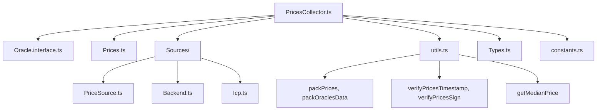
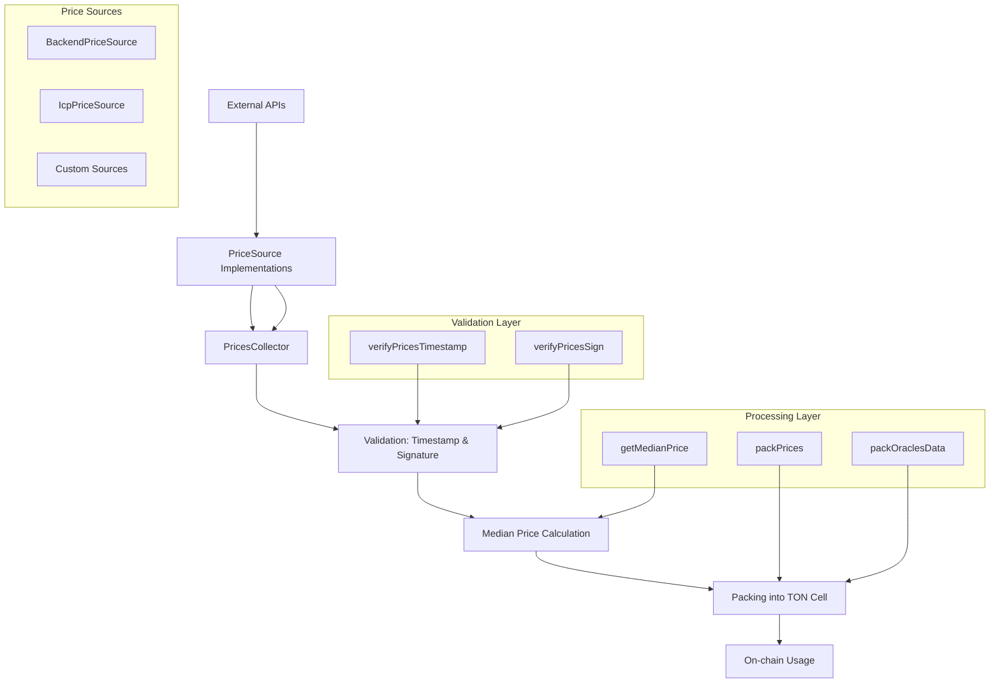
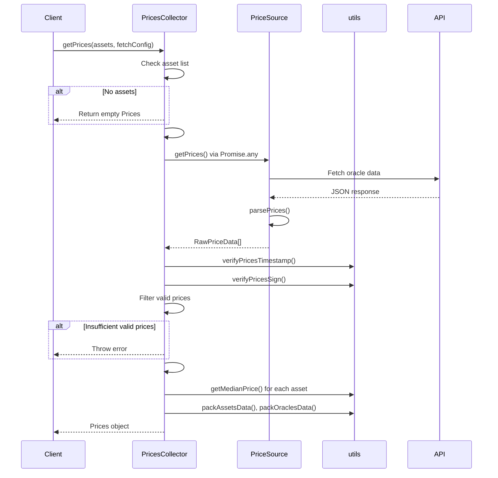
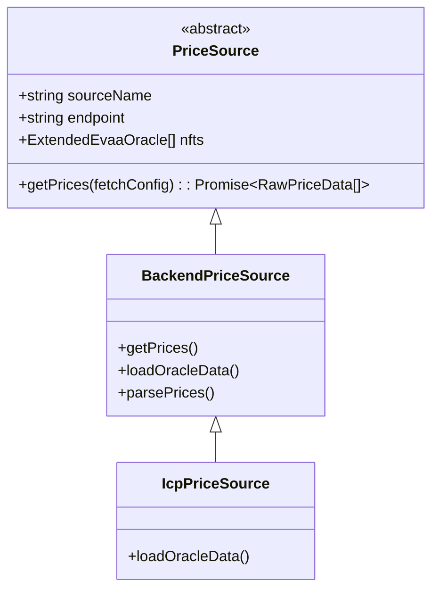
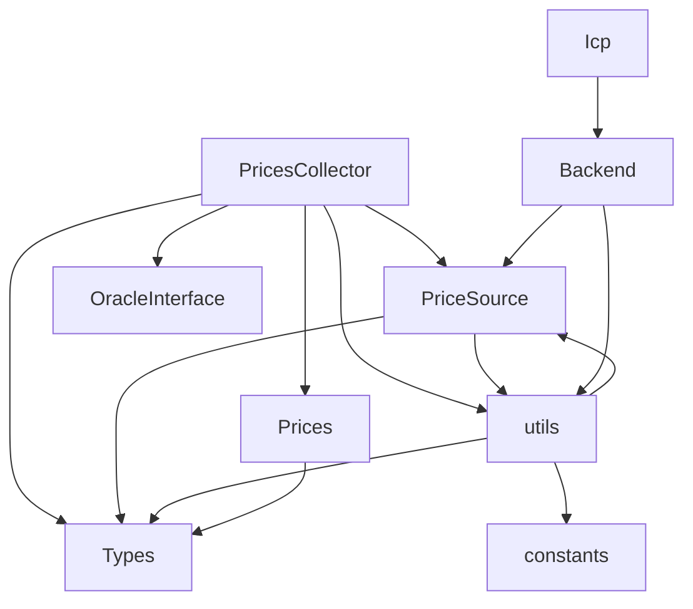

# Price System


## Table of Contents
1. [Introduction](#introduction)
2. [Project Structure](#project-structure)
3. [Core Components](#core-components)
4. [Architecture Overview](#architecture-overview)
5. [Detailed Component Analysis](#detailed-component-analysis)
6. [Dependency Analysis](#dependency-analysis)
7. [Performance Considerations](#performance-considerations)
8. [Troubleshooting Guide](#troubleshooting-guide)
9. [Conclusion](#conclusion)

## Introduction
The Price System within the EVAA SDK is responsible for securely aggregating, validating, and packaging price data from multiple oracle sources for use in on-chain financial operations such as liquidation, supply, and withdrawal. It ensures data freshness, cryptographic integrity, and resistance to single points of failure by combining prices from multiple independent sources and computing medians. This document provides comprehensive documentation for the `PricesCollector` class and its supporting components, detailing configuration, data flow, validation logic, and integration with the TON blockchain.

## Project Structure
The price system is organized under the `src/prices/` directory and includes modular components for source abstraction, data processing, and serialization. Key subdirectories include `sources/` for pluggable price source implementations and utility modules for parsing, validation, and cell packing.





**Diagram sources**
- [PricesCollector.ts](file://src/prices/PricesCollector.ts)
- [sources/PriceSource.ts](file://src/prices/sources/PriceSource.ts)
- [utils.ts](file://src/prices/utils.ts)

**Section sources**
- [PricesCollector.ts](file://src/prices/PricesCollector.ts)
- [sources/PriceSource.ts](file://src/prices/sources/PriceSource.ts)

## Core Components
The core components of the price system include:
- **PricesCollector**: Orchestrates price fetching, validation, medianization, and serialization.
- **PriceSource**: Abstract base class for pluggable oracle data sources.
- **BackendPriceSource & IcpPriceSource**: Concrete implementations for backend and ICP-based oracles.
- **Oracle.interface**: Defines the contract for price retrieval methods.
- **Prices**: Encapsulates final price data and serialized cell output.
- **utils.ts**: Contains critical functions for validation, median calculation, and TON Cell packing.
- **Types.ts**: Defines data structures and default configurations.

These components work together to ensure secure, reliable, and efficient price aggregation suitable for decentralized finance applications.

**Section sources**
- [PricesCollector.ts](file://src/prices/PricesCollector.ts#L1-L164)
- [Types.ts](file://src/prices/Types.ts#L1-L63)
- [Prices.ts](file://src/prices/Prices.ts#L1-L32)

## Architecture Overview
The price system follows a modular, source-agnostic architecture where multiple oracle sources contribute price data that is aggregated, validated, and transformed into a format consumable by on-chain contracts.





**Diagram sources**
- [PricesCollector.ts](file://src/prices/PricesCollector.ts)
- [sources/Backend.ts](file://src/prices/sources/Backend.ts)
- [sources/Icp.ts](file://src/prices/sources/Icp.ts)
- [utils.ts](file://src/prices/utils.ts)

## Detailed Component Analysis

### PricesCollector Class Analysis
The `PricesCollector` class is the central orchestrator of the price system. It manages multiple price sources, validates responses, computes median prices, and packages results into TON Cells.

#### Constructor Configuration
The constructor accepts a `PricesCollectorConfig` object that defines:
- **poolAssetsConfig**: List of assets supported by the pool.
- **minimalOracles**: Minimum number of valid oracle responses required.
- **evaaOracles**: Oracle NFT configurations containing public keys and IDs.
- **sourcesConfig**: Optional configuration for backend and ICP endpoints.
- **additionalPriceSources**: Optional array of custom `PriceSource` implementations.


```typescript
constructor(config: PricesCollectorConfig) {
    this.#poolAssetsConfig = config.poolAssetsConfig;
    this.#sourcesConfig = config.sourcesConfig ?? DefaultPriceSourcesConfig;
    this.#priceSources = generatePriceSources(this.#sourcesConfig, config.evaaOracles);
    this.#minimalOracles = config.minimalOracles;
    if (config.additionalPriceSources) {
        this.#priceSources.push(...config.additionalPriceSources);
    }
    this.#prices = [];
}
```


This design enables flexible deployment across networks and integration with custom oracle networks.

**Section sources**
- [PricesCollector.ts](file://src/prices/PricesCollector.ts#L15-L35)

#### Core Methods

##### getPrices Method
Fetches and aggregates prices for specified assets. If no assets are provided, defaults to all pool assets.





**Diagram sources**
- [PricesCollector.ts](file://src/prices/PricesCollector.ts#L70-L100)
- [utils.ts](file://src/prices/utils.ts#L20-L35)

##### validateTimestamps (via verifyPricesTimestamp)
Ensures price data freshness by checking against `TTL_ORACLE_DATA_SEC`, which is set to 120 seconds.


```typescript
export function verifyPricesTimestamp() {
    return function(priceData: RawPriceData): boolean {
        const timestamp = Date.now() / 1000;
        const pricesTime = priceData.timestamp;
        return timestamp - pricesTime < TTL_ORACLE_DATA_SEC;
    }
}
```


This prevents stale data from being used in critical financial operations.

**Section sources**
- [utils.ts](file://src/prices/utils.ts#L20-L26)
- [constants.ts](file://src/prices/constants.ts#L1)

##### computeMedian (via getMedianPrice)
Computes the median price across all valid oracle responses for a given asset.


```typescript
export function getMedianPrice(pricesData: PriceData[], asset: bigint): bigint | null {
    const usingPrices = pricesData.filter(x => x.dict.has(asset));
    const sorted = usingPrices.map(x => x.dict.get(asset)!).sort((a, b) => Number(a) - Number(b));
    
    if (sorted.length == 0) return null;

    const mid = Math.floor(sorted.length / 2);
    if (sorted.length % 2 === 0) {
        return (sorted[mid - 1] + sorted[mid]) / 2n;
    } else {
        return sorted[mid];
    }
}
```


The algorithm handles both even and odd counts, returning exact medians using big integer arithmetic.

**Section sources**
- [utils.ts](file://src/prices/utils.ts#L28-L45)

##### packPrices (via packPrices and packOraclesData)
Serializes median prices and oracle data into a TON Cell format suitable for on-chain verification.


```typescript
export function packPrices(assetsDataCell: Cell, oraclesDataCell: Cell): Cell {
    let pricesCell = beginCell()
      .storeRef(assetsDataCell)
      .storeRef(oraclesDataCell)
    .endCell();
    return pricesCell;
}
```


The structure includes:
- **assetsDataCell**: Contains median prices for each asset.
- **oraclesDataCell**: Contains signed oracle data with Merkle proofs for efficient verification.

**Section sources**
- [utils.ts](file://src/prices/utils.ts#L60-L66)
- [utils.ts](file://src/prices/utils.ts#L90-L100)

### PriceSource Interface and Implementations
The `PriceSource` abstract class defines a pluggable interface for oracle data retrieval.





**Diagram sources**
- [sources/PriceSource.ts](file://src/prices/sources/PriceSource.ts#L1-L36)
- [sources/Backend.ts](file://src/prices/sources/Backend.ts#L1-L65)
- [sources/Icp.ts](file://src/prices/sources/Icp.ts#L1-L31)

#### BackendPriceSource
Fetches price data from HTTPS endpoints in JSON format, decodes hex-encoded BOC data, and parses TON Cells.

#### IcpPriceSource
Extends `BackendPriceSource` with a different endpoint path (`/prices` instead of `/api/prices`) for ICP-based oracle services.

### Oracle.interface Analysis
Defines the contract that `PricesCollector` implements for price retrieval in different operational contexts.


```typescript
export interface Oracle {
    getPricesForLiquidate(realPrincipals: Dictionary<bigint, bigint>, fetchConfig?: FetchConfig): Promise<Prices>;
    getPricesForSupplyWithdraw(...): Promise<Prices>;
    getPrices(assets: PoolAssetsConfig, fetchConfig?: FetchConfig): Promise<Prices>;
}
```


This enables type-safe integration with other SDK components expecting standardized price data.

**Section sources**
- [Oracle.interface.ts](file://src/prices/Oracle.interface.ts#L1-L19)

## Dependency Analysis
The price system exhibits a clean dependency hierarchy with minimal coupling.





Key observations:
- All dependencies flow toward core utilities and types.
- No circular dependencies exist.
- External dependencies are limited to `@ton/core`, `@ton/crypto`, and `@pythnetwork/hermes-client`.
- The system is extensible via the `PriceSource` interface without modifying core logic.

**Diagram sources**
- [PricesCollector.ts](file://src/prices/PricesCollector.ts)
- [sources/PriceSource.ts](file://src/prices/sources/PriceSource.ts)
- [utils.ts](file://src/prices/utils.ts)

## Performance Considerations
The price system is designed to perform efficiently in both browser and server environments:

- **Network Resilience**: Uses `Promise.any()` to return the first successful response from multiple sources, reducing latency and improving reliability.
- **Caching Potential**: Although not implemented, the architecture allows for response caching to reduce redundant network calls.
- **Error Handling**: Implements retry logic via `proxyFetchRetries` and graceful degradation when some sources fail.
- **Memory Efficiency**: Uses streaming parsing and avoids deep cloning where possible.
- **Browser vs Server**: Identical logic runs in both environments; performance differences mainly stem from network conditions and execution context limits.

For high-frequency applications, consider pre-fetching prices or implementing a local cache layer.

**Section sources**
- [PricesCollector.ts](file://src/prices/PricesCollector.ts#L110-L120)
- [utils.ts](file://src/prices/utils.ts#L140-L150)

## Troubleshooting Guide
Common issues and their solutions:

| Issue | Cause | Solution |
|------|-------|----------|
| "Error per updating prices" | Insufficient valid oracle responses | Check network connectivity, verify oracle endpoints, ensure time synchronization |
| "Prices are outdated" | Timestamp validation failed | Ensure system clock is accurate; check if oracles are updating frequently enough |
| "User from another pool" | Asset ID mismatch | Verify `poolAssetsConfig` matches the target pool |
| Signature verification failed | Invalid or tampered data | Confirm oracle public keys are correct and data integrity is maintained |
| Empty Prices object | No supplied assets | Ensure at least one asset has non-zero principal |

Always validate inputs and handle promise rejections when calling price methods.

**Section sources**
- [PricesCollector.ts](file://src/prices/PricesCollector.ts#L80-L90)
- [utils.ts](file://src/prices/utils.ts#L47-L50)

## Conclusion
The EVAA SDK's Price System provides a robust, secure, and extensible framework for oracle price aggregation. By leveraging multiple independent sources, cryptographic verification, medianization, and efficient serialization, it ensures reliable price data for decentralized finance operations on the TON blockchain. The modular design allows for easy integration of new oracle networks and adaptation to different deployment scenarios.

**Referenced Files in This Document**   
- [PricesCollector.ts](file://src/prices/PricesCollector.ts)
- [PriceSource.ts](file://src/prices/sources/PriceSource.ts)
- [Backend.ts](file://src/prices/sources/Backend.ts)
- [Icp.ts](file://src/prices/sources/Icp.ts)
- [Oracle.interface.ts](file://src/prices/Oracle.interface.ts)
- [utils.ts](file://src/prices/utils.ts)
- [Types.ts](file://src/prices/Types.ts)
- [constants.ts](file://src/prices/constants.ts)
- [Prices.ts](file://src/prices/Prices.ts)