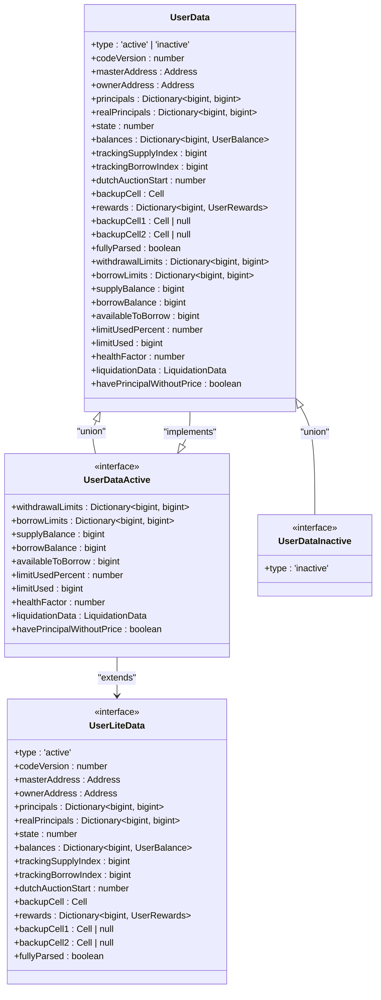
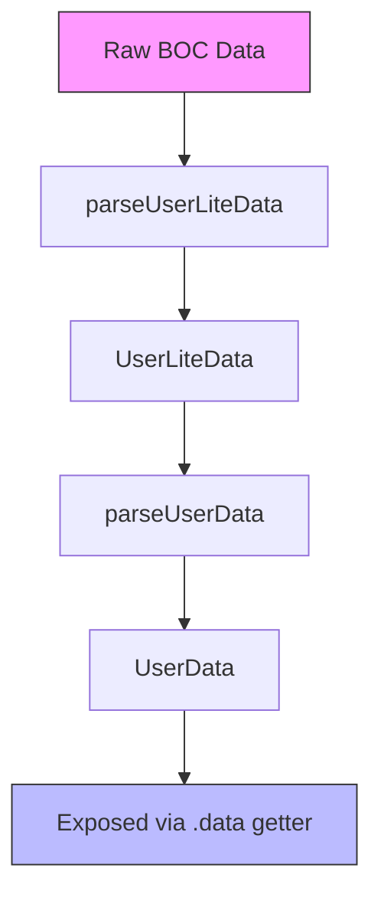
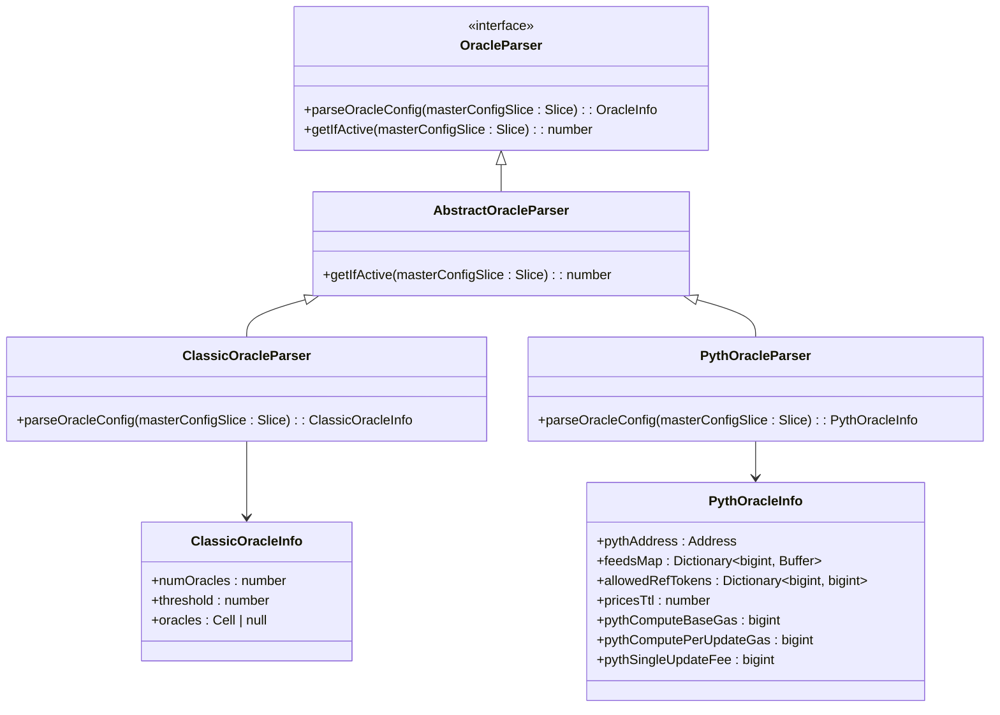
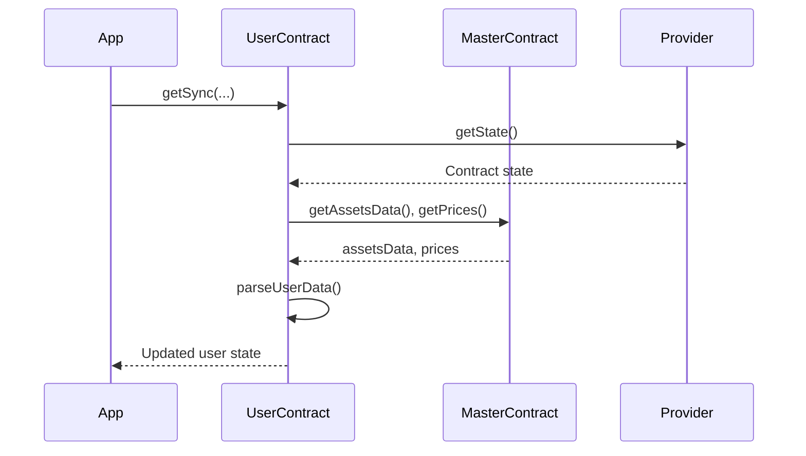
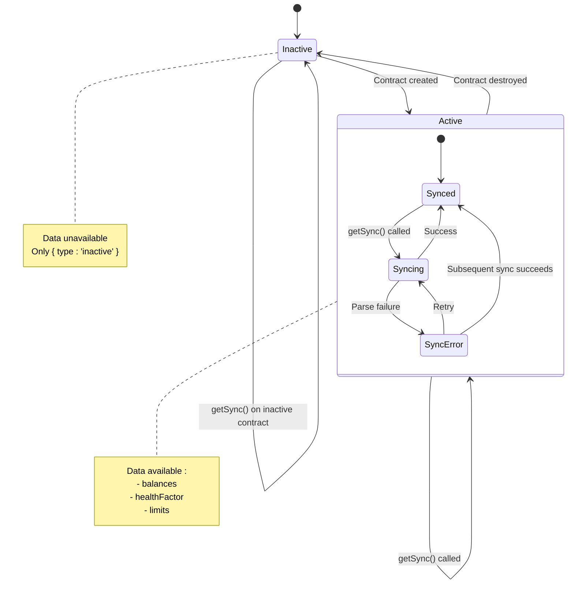

# User Interaction


## Table of Contents
1. [User Interaction](#user-interaction)
2. [Initialization and Provider Setup](#initialization-and-provider-setup)
3. [User State Synchronization](#user-state-synchronization)
4. [Data Parsing and Type Mapping](#data-parsing-and-type-mapping)
5. [Integration with Oracle Parsers](#integration-with-oracle-parsers)
6. [Usage Patterns and Health Monitoring](#usage-patterns-and-health-monitoring)
7. [Principal Balances and Operation Eligibility](#principal-balances-and-operation-eligibility)
8. [Error Scenarios](#error-scenarios)
9. [Master Contract Collaboration](#master-contract-collaboration)
10. [State Transition Diagram](#state-transition-diagram)

## Initialization and Provider Setup

The `EvaaUser` class serves as the primary interface for interacting with user state in the EVAA protocol. It is initialized via the static `createFromAddress` method, which takes a user's contract address and an optional `PoolConfig` object.


```typescript
static createFromAddress(address: Address, poolConfig: PoolConfig = MAINNET_POOL_CONFIG) {
    return new EvaaUser(address, poolConfig);
}
```


The `poolConfig` parameter contains essential configuration data such as the master contract address, asset configurations, and constants used for rate calculations. If not provided, the default `MAINNET_POOL_CONFIG` is used.

The constructor is private, enforcing the use of the factory method pattern. This ensures consistent initialization and encapsulates configuration logic.

**Section sources**
- [UserContract.ts](file://src/contracts/UserContract.ts#L18-L28)

## User State Synchronization

User state is synchronized from the blockchain using the `getSync` method, which retrieves and parses the user's contract data.


```typescript
async getSync(
    provider: ContractProvider,
    assetsData: ExtendedAssetsData,
    assetsConfig: ExtendedAssetsConfig,
    prices: Dictionary<bigint, bigint>,
    applyDust: boolean = false,
)
```


### Method Parameters
- **provider**: `ContractProvider` instance for blockchain interaction
- **assetsData**: Current state of assets (rates, totals)
- **assetsConfig**: Configuration for each asset (factors, fees)
- **prices**: Price dictionary mapping asset IDs to current values
- **applyDust**: Flag to zero out balances below dust threshold

The method first checks the contract state. If active, it:
1. Decodes raw contract data into `UserLiteData` using `parseUserLiteData`
2. Enriches lite data with price-based metrics via `parseUserData`
3. Updates the internal `_data` field and sync timestamp

Inactive contracts are marked with `{ type: 'inactive' }`.

A lighter version, `getSyncLite`, omits price calculations and is useful when prices are unavailable.

**Section sources**
- [UserContract.ts](file://src/contracts/UserContract.ts#L85-L115)
- [parser.ts](file://src/api/parser.ts#L358-L457)

## Data Parsing and Type Mapping

The parsing pipeline transforms raw blockchain data into structured user state objects defined in `src/types/User.ts`.

### Type Hierarchy




**Diagram sources**
- [User.ts](file://src/types/User.ts#L1-L119)

### Parsing Workflow




**Diagram sources**
- [parser.ts](file://src/api/parser.ts#L358-L457)

The `parseUserData` function computes:
- **Supply/Borrow Balances**: Valued in USD using provided prices
- **Health Factor**: Ratio of collateral value to debt limit
- **Liquidation Status**: Whether user is eligible for liquidation
- **Operation Limits**: Maximum withdraw/borrow amounts

**Section sources**
- [parser.ts](file://src/api/parser.ts#L358-L457)
- [User.ts](file://src/types/User.ts#L1-L119)

## Integration with Oracle Parsers

While `UserContract` itself does not directly use oracle parsers, it relies on price data that is typically obtained through `OracleParser` implementations.





**Diagram sources**
- [AbstractOracleParser.ts](file://src/api/parsers/AbstractOracleParser.ts#L1-L16)
- [ClassicOracleParser.ts](file://src/api/parsers/ClassicOracleParser.ts#L1-L20)
- [PythOracleParser.ts](file://src/api/parsers/PythOracleParser.ts#L1-L34)

These parsers are used by `AbstractEvaaMaster` to interpret oracle configuration, but the resulting price data flows into `UserContract` via the `getSync` method.

**Section sources**
- [AbstractMaster.ts](file://src/contracts/AbstractMaster.ts#L1-L422)

## Usage Patterns and Health Monitoring

### Health Factor Monitoring
Users can monitor their health status using the `healthFactor` getter:


```typescript
get healthFactor(): number {
    if (!this._data || this._data.type === 'inactive') {
        return 1;
    }
    return this._data.healthFactor;
}
```


A health factor below 1 indicates the user is at risk of liquidation.

### Liquidation Status
The `isLiquidable` getter provides a boolean check:


```typescript
get isLiquidable(): boolean {
    if (!this._data || this._data.type === 'inactive') {
        return false;
    }
    return this._data.liquidationData.liquidable;
}
```


### Example: Health Threshold Alert

```typescript
if (userContract.data?.healthFactor < 1.1) {
    console.warn("User is approaching liquidation threshold");
    // Trigger notification or auto-repay
}
```


**Section sources**
- [UserContract.ts](file://src/contracts/UserContract.ts#L137-L145)
- [User.ts](file://src/types/User.ts#L1-L119)

## Principal Balances and Operation Eligibility

### Reading Principal Balances
Principal balances (raw token amounts) are accessible via:


```typescript
const principals = userContract.liteData?.principals;
const supplyPrincipal = principals?.get(assetId);
```


The `principals` dictionary contains post-dust-adjustment values, while `realPrincipals` contains original values.

### Checking Operation Eligibility
Withdraw limits are computed during `getSync`:


```typescript
const withdrawalLimit = userContract.data?.withdrawalLimits.get(assetId);
if (withdrawalLimit && amount <= withdrawalLimit) {
    // Withdrawal is allowed
}
```


Similarly, borrow eligibility is determined by:
- Available liquidity in the pool
- User's remaining borrow limit
- Health factor impact

**Section sources**
- [UserContract.ts](file://src/contracts/UserContract.ts#L85-L115)
- [parser.ts](file://src/api/parser.ts#L358-L457)

## Error Scenarios

### Deserialization Failures
If contract data cannot be parsed:
- `getSync` will set `_data` to `{ type: 'inactive' }`
- Subsequent `.data` access returns undefined
- No explicit error is thrown; status is reflected in state

### Missing Prices
When prices are missing for assets with non-zero principal:
- `fullyParsed` flag is set to `false`
- `havePrincipalWithoutPrice` is set to `true`
- Health factor and liquidation data are not computed
- `healthFactor` defaults to 1

### Invalid Contract State
If the user contract is inactive:
- `_data` is set to `{ type: 'inactive' }`
- All getters return default/undefined values
- No operations should be attempted

**Section sources**
- [parser.ts](file://src/api/parser.ts#L358-L457)
- [UserContract.ts](file://src/contracts/UserContract.ts#L85-L115)

## Master Contract Collaboration

`UserContract` collaborates with `Master` contracts through the `AbstractEvaaMaster` class:





**Diagram sources**
- [AbstractMaster.ts](file://src/contracts/AbstractMaster.ts#L1-L422)
- [UserContract.ts](file://src/contracts/UserContract.ts#L85-L115)

The `openUserContract` method in `AbstractEvaaMaster` creates a properly configured `EvaaUser` instance:


```typescript
openUserContract(userAddress: Address, subaccountId: number = 0): EvaaUser {
    return EvaaUser.createFromAddress(
        this.calculateUserSCAddr(userAddress, this._poolConfig.lendingCode, subaccountId),
        this._poolConfig,
    );
}
```


This ensures the user contract is initialized with the correct pool configuration.

**Section sources**
- [AbstractMaster.ts](file://src/contracts/AbstractMaster.ts#L385-L395)

## State Transition Diagram





**Diagram sources**
- [UserContract.ts](file://src/contracts/UserContract.ts#L85-L115)

The user contract transitions between `Active` and `Inactive` states based on blockchain status, with internal synchronization states managing data freshness.

**Referenced Files in This Document**   
- [UserContract.ts](file://src/contracts/UserContract.ts#L1-L145)
- [parser.ts](file://src/api/parser.ts#L1-L457)
- [User.ts](file://src/types/User.ts#L1-L119)
- [Master.ts](file://src/types/Master.ts#L1-L113)
- [AbstractMaster.ts](file://src/contracts/AbstractMaster.ts#L1-L422)
- [AbstractOracleParser.ts](file://src/api/parsers/AbstractOracleParser.ts#L1-L16)
- [ClassicOracleParser.ts](file://src/api/parsers/ClassicOracleParser.ts#L1-L20)
- [PythOracleParser.ts](file://src/api/parsers/PythOracleParser.ts#L1-L34)