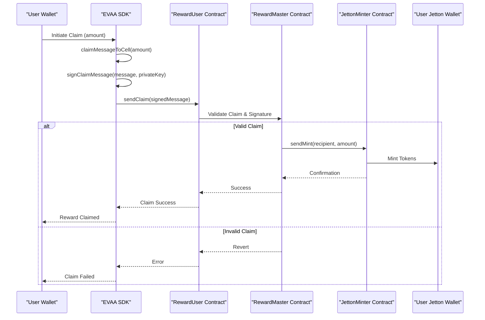

# Rewards System


## Table of Contents
1. [Introduction](#introduction)
2. [Core Components Overview](#core-components-overview)
3. [RewardMaster Contract](#rewardmaster-contract)
4. [RewardUser Contract](#rewarduser-contract)
5. [JettonMinter Integration](#jettonminter-integration)
6. [Reward Claiming Workflow](#reward-claiming-workflow)
7. [Data Structures and Configuration](#data-structures-and-configuration)
8. [Error Handling and Validation](#error-handling-and-validation)
9. [Sequence Diagram: Reward Distribution Lifecycle](#sequence-diagram-reward-distribution-lifecycle)
10. [Gas Optimization and Best Practices](#gas-optimization-and-best-practices)

## Introduction
The EVAA SDK's Rewards System enables decentralized reward tracking and distribution for users participating in protocol activities. It consists of two primary smart contracts: **RewardMaster** for global reward management and **RewardUser** for individual claim handling. This system supports both TON and Jetton-based rewards, with cryptographic signing to ensure claim authenticity. The integration with **JettonMinter** allows for seamless token minting during reward distribution. This document details the architecture, methods, data flow, and best practices for interacting with the rewards system.

## Core Components Overview
The Rewards System is composed of three key components:
- **RewardMaster**: Manages protocol-level reward state, admin operations, and user contract deployment.
- **RewardUser**: Handles individual user reward balances and claim execution.
- **JettonMinter**: Distributes Jetton tokens upon successful reward claims.

These components work in concert to ensure secure, efficient, and auditable reward distribution.

**Section sources**
- [RewardMaster.ts](file://src/rewards/RewardMaster.ts)
- [RewardUser.ts](file://src/rewards/RewardUser.ts)
- [JettonMinter.ts](file://src/rewards/JettonMinter.ts)

## RewardMaster Contract

### Purpose and Responsibilities
The `RewardMaster` contract serves as the central authority for reward management. It tracks available rewards, deploys user-specific reward contracts, and facilitates top-ups and withdrawals by administrators.

### Key Methods
- **createFromConfig**: Initializes a new `RewardMaster` instance from configuration data.
- **sendDeploy**: Deploys the contract with a specified Jetton wallet address for token rewards.
- **sendTonTopUp**: Allows admins to increase the available TON rewards.
- **sendAdminWithdraw**: Enables withdrawal of excess rewards by the admin.
- **getRewardUserAddress**: Computes the deterministic address of a user's reward contract.

### Configuration Requirements
The `EvaaRewardsConfig` type defines the required parameters:

```typescript
type EvaaRewardsConfig = {
    adminAddress: Address;
    evaaMasterAddress: Address;
    availableReward: number;
    asset: PoolAssetConfig;
    rewardMasterCode: Cell;
    rewardUserCode: Cell;
    publicKey: Buffer;
};
```


**Section sources**
- [RewardMaster.ts](file://src/rewards/RewardMaster.ts#L18-L109)
- [MasterRewards.ts](file://src/types/MasterRewards.ts#L1-L14)

## RewardUser Contract

### Purpose and Responsibilities
The `RewardUser` contract manages individual user reward states. Each user has a dedicated instance that tracks accrued rewards and processes claims.

### Key Methods
- **claimMessageToCell**: Constructs a claim message containing the user address and claim amount.
- **signClaimMessage**: Signs the claim message using the user's private key for authentication.
- **sendClaim**: Submits the signed claim to initiate reward distribution.
- **getData**: Retrieves the current state of the user's reward contract.

### Claim Validation
Claims are validated using cryptographic signatures. The system verifies that:
- The claim message hash matches the signed payload.
- The signature corresponds to the expected public key.
- The requested amount does not exceed accrued rewards.

**Section sources**
- [RewardUser.ts](file://src/rewards/RewardUser.ts#L18-L89)
- [UserRewards.ts](file://src/types/UserRewards.ts#L1-L10)

## JettonMinter Integration

### Role in Reward Distribution
The `JettonMinter` contract is responsible for minting Jetton tokens when rewards are claimed. It interfaces directly with the `RewardMaster` to issue tokens to user wallets.

### Key Methods
- **sendMint**: Initiates the minting process with specified recipient and amount.
- **getWalletAddressOf**: Retrieves the Jetton wallet address for a given user.
- **sendMintMessage**: Constructs a minting message for external processing.

### Opcodes and Messaging
The minting process uses the `REWARD_JETTON_MINT` opcode (0x178d4519) to distinguish reward-related minting from other operations.

**Section sources**
- [JettonMinter.ts](file://src/rewards/JettonMinter.ts#L0-L113)
- [general/index.ts](file://src/constants/general/index.ts#L0-L90)

## Reward Claiming Workflow

### Event Flow
1. User requests claim amount.
2. SDK constructs claim message via `claimMessageToCell`.
3. Message is signed using `signClaimMessage` with user's private key.
4. Signed message is sent via `sendClaim`.
5. `RewardMaster` validates signature and available balance.
6. If valid, `JettonMinter` is invoked to mint tokens.
7. Tokens are transferred to user's wallet.

### Blocking Conditions
Claims are blocked under the following conditions:
- Pending operations on the user contract.
- Insufficient available rewards in `RewardMaster`.
- Invalid signature or claim amount.
- Claim period not active (if time-bound).

**Section sources**
- [RewardUser.ts](file://src/rewards/RewardUser.ts#L18-L89)
- [claim_ton.test.ts](file://tests/rewards/claim_ton.test.ts)

## Data Structures and Configuration

### EvaaRewardsConfig
Defines the initialization parameters for `RewardMaster`:
- **adminAddress**: Controller of the reward system.
- **evaaMasterAddress**: Parent protocol contract.
- **availableReward**: Initial TON reward pool.
- **asset**: Associated asset configuration.
- **rewardMasterCode/rewardUserCode**: Contract bytecode.
- **publicKey**: Cryptographic key for claim verification.

### EvaaUserRewardsConfig
Configures individual `RewardUser` instances:
- **userAddress**: Beneficiary address.
- **rewardMasterAddress**: Parent master contract.
- **asset/publicKey**: Asset and cryptographic context.

**Section sources**
- [MasterRewards.ts](file://src/types/MasterRewards.ts#L1-L14)
- [UserRewards.ts](file://src/types/UserRewards.ts#L1-L10)

## Error Handling and Validation

### Common Error Scenarios
- **Insufficient Rewards**: Claim amount exceeds available pool.
- **Invalid Claim Period**: Claim attempted outside allowed window.
- **Transaction Revert**: Gas limitations or contract logic failure.
- **Signature Mismatch**: Claim not properly signed.

### Fee Structure
Defined in `FEES` constants:
- **REWARD_MASTER_DEPLOY**: 0.05 TON
- **REWARD_USER_CLAIM**: 0.1 TON
- **REWARD_MASTER_TON_TOP_UP**: 0.03 TON

These fees ensure spam resistance and cover operational costs.

**Section sources**
- [general/index.ts](file://src/constants/general/index.ts#L0-L90)
- [withdraw_ton.test.ts](file://tests/rewards/withdraw_ton.test.ts)

## Sequence Diagram: Reward Distribution Lifecycle





**Diagram sources**
- [RewardMaster.ts](file://src/rewards/RewardMaster.ts)
- [RewardUser.ts](file://src/rewards/RewardUser.ts)
- [JettonMinter.ts](file://src/rewards/JettonMinter.ts)

## Gas Optimization and Best Practices

### Batch Claim Optimization
While the current API supports individual claims, batch processing can be achieved by:
- Aggregating claims off-chain.
- Submitting multiple transactions in sequence.
- Monitoring gas usage to avoid block limits.

### State Synchronization Pitfalls
Common issues include:
- **Stale Reward State**: Always call `getData` before claiming.
- **Pending Operations**: Ensure no prior claim is pending.
- **Clock Drift**: Verify claim periods using on-chain timestamps.

### Best Practices
- Pre-validate claim eligibility off-chain.
- Use sufficient gas allowances.
- Implement retry logic for failed transactions.
- Cache user reward states to reduce queries.

**Section sources**
- [RewardUser.ts](file://src/rewards/RewardUser.ts)
- [claim_ton.test.ts](file://tests/rewards/claim_ton.test.ts)
- [withdraw_ton.test.ts](file://tests/rewards/withdraw_ton.test.ts)

**Referenced Files in This Document**   
- [RewardMaster.ts](file://src/rewards/RewardMaster.ts)
- [RewardUser.ts](file://src/rewards/RewardUser.ts)
- [JettonMinter.ts](file://src/rewards/JettonMinter.ts)
- [general/index.ts](file://src/constants/general/index.ts)
- [MasterRewards.ts](file://src/types/MasterRewards.ts)
- [UserRewards.ts](file://src/types/UserRewards.ts)
- [claim_ton.test.ts](file://tests/rewards/claim_ton.test.ts)
- [withdraw_ton.test.ts](file://tests/rewards/withdraw_ton.test.ts)