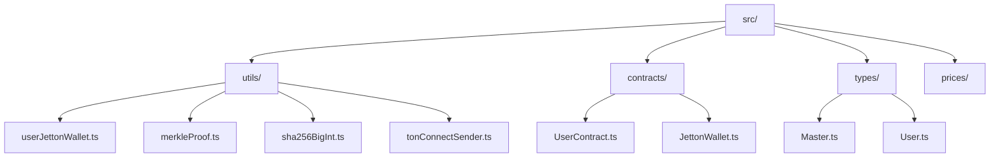
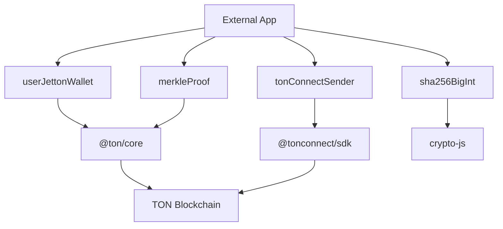
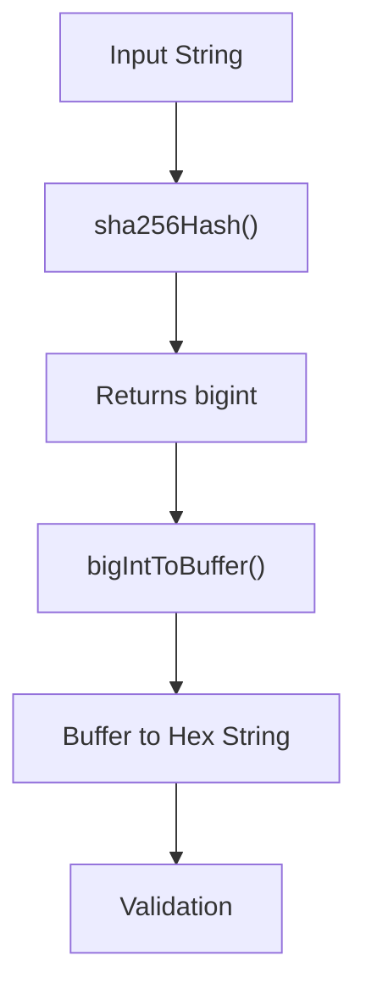
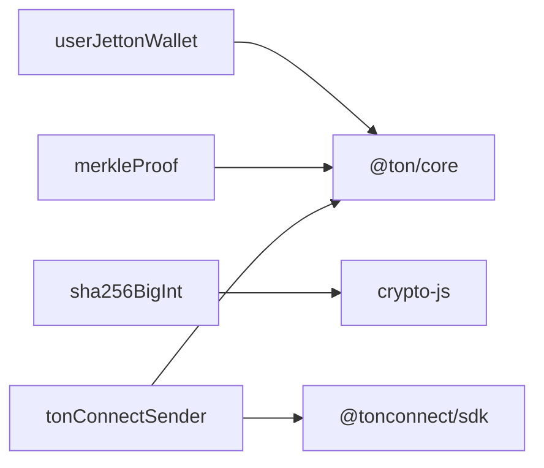

# Utilities


## Table of Contents
1. [Introduction](#introduction)
2. [Project Structure](#project-structure)
3. [Core Components](#core-components)
4. [Architecture Overview](#architecture-overview)
5. [Detailed Component Analysis](#detailed-component-analysis)
6. [Dependency Analysis](#dependency-analysis)
7. [Performance Considerations](#performance-considerations)
8. [Troubleshooting Guide](#troubleshooting-guide)
9. [Conclusion](#conclusion)

## Introduction
This document provides comprehensive documentation for the utility functions in the EVAA SDK, focusing on key tools used for address derivation, cryptographic operations, Merkle proofs, and blockchain transaction integration. These utilities are essential for interacting with Jetton wallets, verifying data integrity via Merkle trees, generating secure hashes, and sending transactions through TonConnect. The guide includes detailed explanations, usage examples, edge cases, and integration strategies to support developers in building robust applications on the EVAA protocol.

## Project Structure
The EVAA SDK is organized into modular directories that separate concerns such as API clients, contracts, prices, rewards, types, and utilities. The `utils` directory contains standalone helper functions critical for cryptographic operations, wallet address computation, and blockchain interaction.





**Diagram sources**
- [src/utils/userJettonWallet.ts](file://src/utils/userJettonWallet.ts#L1-L80)
- [src/utils/merkleProof.ts](file://src/utils/merkleProof.ts#L1-L140)
- [src/utils/sha256BigInt.ts](file://src/utils/sha256BigInt.ts#L1-L15)
- [src/utils/tonConnectSender.ts](file://src/utils/tonConnectSender.ts#L1-L37)

**Section sources**
- [src/utils/userJettonWallet.ts](file://src/utils/userJettonWallet.ts#L1-L80)
- [src/utils/merkleProof.ts](file://src/utils/merkleProof.ts#L1-L140)
- [src/utils/sha256BigInt.ts](file://src/utils/sha256BigInt.ts#L1-L15)
- [src/utils/tonConnectSender.ts](file://src/utils/tonConnectSender.ts#L1-L37)

## Core Components
The core utility functions documented here include:
- `userJettonWallet`: Derives Jetton wallet addresses for users based on asset type and master contract.
- `merkleProof`: Generates compact Merkle proofs for dictionary-based data structures used in TON smart contracts.
- `sha256BigInt`: Computes SHA-256 hashes of strings and converts them to big integers, used in subaccount derivation.
- `tonConnectSender`: Wraps the TonConnect SDK to enable transaction signing and sending from connected wallets.

These utilities serve foundational roles in security, interoperability, and state validation within the EVAA ecosystem.

**Section sources**
- [src/utils/userJettonWallet.ts](file://src/utils/userJettonWallet.ts#L1-L80)
- [src/utils/merkleProof.ts](file://src/utils/merkleProof.ts#L1-L140)
- [src/utils/sha256BigInt.ts](file://src/utils/sha256BigInt.ts#L1-L15)
- [src/utils/tonConnectSender.ts](file://src/utils/tonConnectSender.ts#L1-L37)

## Architecture Overview
The utilities are designed to be stateless, deterministic, and composable. They interact primarily with the TON blockchain primitives via `@ton/core` and integrate external services like TonConnect. The architecture emphasizes separation of concerns: cryptographic hashing, address derivation, proof generation, and transaction handling are isolated in dedicated modules.





**Diagram sources**
- [src/utils/tonConnectSender.ts](file://src/utils/tonConnectSender.ts#L1-L37)
- [src/utils/userJettonWallet.ts](file://src/utils/userJettonWallet.ts#L1-L80)
- [src/utils/sha256BigInt.ts](file://src/utils/sha256BigInt.ts#L1-L15)
- [src/utils/merkleProof.ts](file://src/utils/merkleProof.ts#L1-L140)

## Detailed Component Analysis

### userJettonWallet: Jetton Wallet Address Derivation

The `getUserJettonWallet` function computes the address of a user's Jetton wallet given their owner address and pool asset configuration. It supports multiple asset types with custom data serialization logic.

#### Key Logic
- Validates that the asset is not native TON or undefined.
- Handles special cases for assets like `USDT` and `tsTON` by wrapping code cells in exotic format.
- Constructs initial state (`stateInit`) using code and data cells.
- Returns the address derived from the hash of the state init.

#### Usage Example

```ts
const ownerAddress = Address.parse("UQ...");
const assetConfig = {
  name: "USDT",
  assetId: 1,
  jettonMasterAddress: Address.parse("EQ..."),
  jettonWalletCode: Cell.fromBoc(...)[0]
};

const walletAddress = getUserJettonWallet(ownerAddress, assetConfig);
console.log(walletAddress.toString()); // e.g., UQ...
```


#### Edge Cases
- Throws an error if attempting to derive a wallet for `TON` or undefined assets.
- Zero-balance wallets are supported; balance does not affect address derivation.
- Invalid public keys are not checked at this layer—assumes valid `Address` input.

**Section sources**
- [src/utils/userJettonWallet.ts](file://src/utils/userJettonWallet.ts#L1-L80)

### merkleProof: Merkle Tree Proof Generation

Generates compact Merkle proofs for key-value dictionaries stored in TON smart contracts. Used for efficient verification of key inclusion without revealing full data.

#### Functionality
- `generateMerkleProofDirect`: Creates a proof cell for specified keys in a dictionary.
- `generateMerkleProof`: Wraps the direct proof in a standard exotic cell format.
- Uses recursive traversal to prune irrelevant branches.

#### Input Requirements
- `dict`: A `Dictionary<K, V>` from `@ton/core`.
- `keys`: Array of keys to prove existence for.
- `keyObject`: DictionaryKey descriptor defining bit length and serialization.

#### Output Format
Returns a `Cell` containing the pruned Merkle tree structure, suitable for on-chain verification.

#### Usage Example

```ts
const dict = Dictionary.empty(Dictionary.Keys.BigUint(256), Dictionary.Values.Cell());
dict.set(BigInt("123"), someCell);
const proof = generateMerkleProof(dict, [BigInt("123")], Dictionary.Keys.BigUint(256));
```


#### Common Errors
- Throws if any requested key is missing from the dictionary.
- Incorrect key bit length causes deserialization failure on-chain.

**Section sources**
- [src/utils/merkleProof.ts](file://src/utils/merkleProof.ts#L1-L140)

### sha256BigInt: Cryptographic Hashing of Big Integers

Provides utilities to compute SHA-256 hashes and convert between `bigint` and `Buffer`.

#### Functions
- `sha256Hash(input: string)`: Returns the hash as a `bigint`.
- `bigIntToBuffer(value: bigint)`: Converts a `bigint` to a zero-padded `Buffer`.

#### Use Cases
- Subaccount derivation: hashing user identifiers.
- Proof systems: generating deterministic identifiers.
- Secure data fingerprinting.

#### Usage Example

```ts
const hash = sha256Hash("EVAA_SUBACCOUNT_001");
const buffer = bigIntToBuffer(hash);
console.log(buffer.toString('hex'));
```


#### Test Coverage
Tested with various token symbols (e.g., USDT, DOGS, NOT) to ensure consistent hex output.





**Diagram sources**
- [src/utils/sha256BigInt.ts](file://src/utils/sha256BigInt.ts#L1-L15)
- [tests/utils/sha256BigInt.test.ts](file://tests/utils/sha256BigInt.test.ts#L1-L32)

**Section sources**
- [src/utils/sha256BigInt.ts](file://src/utils/sha256BigInt.ts#L1-L15)
- [tests/utils/sha256BigInt.test.ts](file://tests/utils/sha256BigInt.test.ts#L1-L32)

### tonConnectSender: TonConnect Integration Wrapper

Enables sending signed transactions via the TonConnect wallet connector.

#### Features
- Implements the `Sender` interface from `@ton/core`.
- Stores the last sent BOC (Bag of Cells) for debugging.
- Sets a 2-minute validity window for transactions.

#### Usage Example

```ts
const sender = getTonConnectSender(connector);
await sender.send({
  to: Address.parse("UQ..."),
  value: toNano("0.05"),
  body: someMessage,
});
const lastBoc = getLastSentBoc();
```


#### Security Considerations
- Relies on external `connector` for signature security.
- Global `lastSentBoc` is for debugging only—should not be used in production logic.

#### Limitations
- Cannot return BOC directly due to `Sender` interface constraints.
- Payload must be base64-encoded.

**Section sources**
- [src/utils/tonConnectSender.ts](file://src/utils/tonConnectSender.ts#L1-L37)

## Dependency Analysis





**Diagram sources**
- [src/utils/userJettonWallet.ts](file://src/utils/userJettonWallet.ts#L1-L80)
- [src/utils/merkleProof.ts](file://src/utils/merkleProof.ts#L1-L140)
- [src/utils/sha256BigInt.ts](file://src/utils/sha256BigInt.ts#L1-L15)
- [src/utils/tonConnectSender.ts](file://src/utils/tonConnectSender.ts#L1-L37)

## Performance Considerations
- **sha256BigInt**: Fast execution; negligible overhead. Suitable for frequent calls.
- **userJettonWallet**: Lightweight computation; dominated by cell serialization.
- **merkleProof**: Time complexity O(n) in the number of keys and dictionary depth. Avoid large key sets.
- **tonConnectSender**: Network-bound; latency depends on wallet response time.

All functions are synchronous except `tonConnectSender.send()`, which is asynchronous due to external signing.

## Troubleshooting Guide
### Common Issues
- **Incorrect Jetton Wallet Address**: Ensure `jettonWalletCode` and `jettonMasterAddress` are correct. Verify asset name casing.
- **Merkle Proof Validation Failure**: Confirm key bit length matches dictionary definition. Check for missing keys.
- **Transaction Not Sent**: Ensure `connector` is connected and account is available.
- **Hash Mismatch**: Validate input strings are identical (case-sensitive).

### Debugging Strategies
- Use `getLastSentBoc()` to inspect raw transaction BOC.
- Log intermediate values in `sha256BigInt` to verify hex consistency.
- Compare derived wallet addresses with known good values.
- Test Merkle proofs locally using mock dictionaries.

**Section sources**
- [src/utils/tonConnectSender.ts](file://src/utils/tonConnectSender.ts#L1-L37)
- [src/utils/sha256BigInt.ts](file://src/utils/sha256BigInt.ts#L1-L15)
- [src/utils/userJettonWallet.ts](file://src/utils/userJettonWallet.ts#L1-L80)
- [src/utils/merkleProof.ts](file://src/utils/merkleProof.ts#L1-L140)

## Conclusion
The EVAA SDK utilities provide essential building blocks for secure and efficient blockchain interactions. From deriving wallet addresses to generating cryptographic proofs and sending transactions, these functions are designed for reliability and ease of integration. Developers should follow best practices in input validation and error handling to ensure robust application behavior. Future improvements could include better error messages and enhanced testing coverage for edge cases.

**Referenced Files in This Document**   
- [src/utils/merkleProof.ts](file://src/utils/merkleProof.ts#L1-L140)
- [src/utils/sha256BigInt.ts](file://src/utils/sha256BigInt.ts#L1-L15)
- [src/utils/tonConnectSender.ts](file://src/utils/tonConnectSender.ts#L1-L37)
- [src/utils/userJettonWallet.ts](file://src/utils/userJettonWallet.ts#L1-L80)
- [tests/utils/sha256BigInt.test.ts](file://tests/utils/sha256BigInt.test.ts#L1-L32)