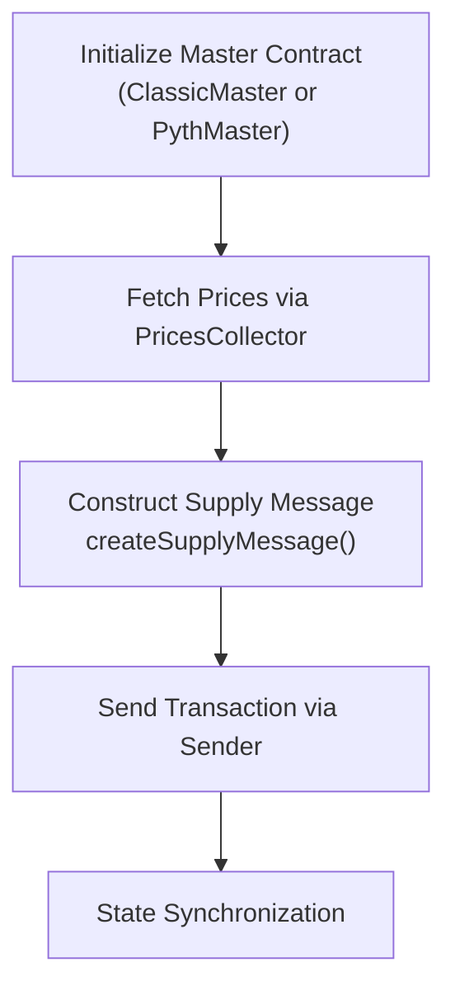
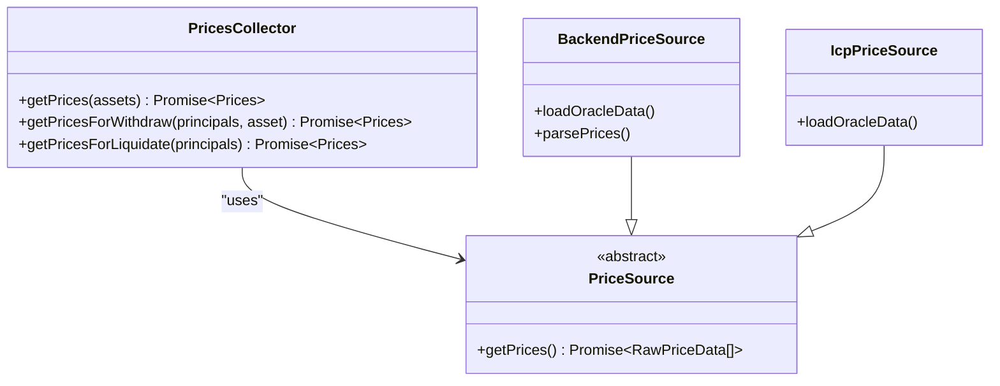
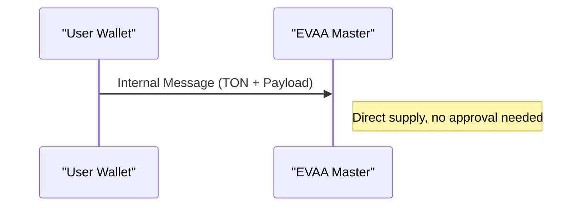
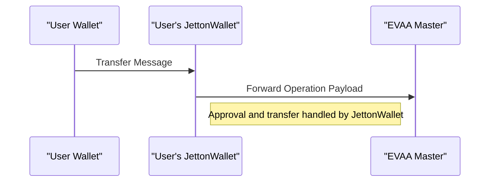
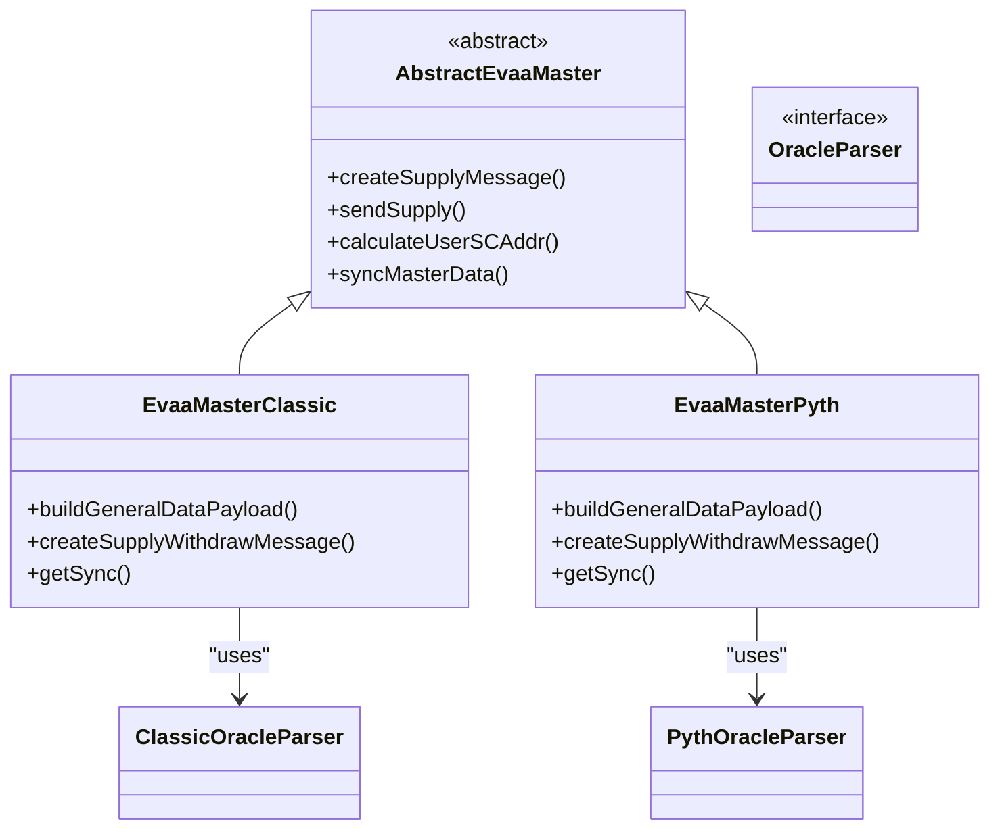

# How to Supply Assets


## Table of Contents
1. [Introduction](#introduction)
2. [Core Workflow Overview](#core-workflow-overview)
3. [Master Contract Initialization](#master-contract-initialization)
4. [Fetching Price Data](#fetching-price-data)
5. [Constructing the Supply Message](#constructing-the-supply-message)
6. [Sending the Supply Transaction](#sending-the-supply-transaction)
7. [TON vs Jetton Supply Flows](#ton-vs-jetton-supply-flows)
8. [Subaccount Usage and Risk Isolation](#subaccount-usage-and-risk-isolation)
9. [Error Handling and Common Issues](#error-handling-and-common-issues)
10. [Optimization Tips](#optimization-tips)
11. [Architecture and Inheritance Pattern](#architecture-and-inheritance-pattern)

## Introduction
This document provides a comprehensive guide on how to supply assets to the EVAA protocol using the EVAA SDK. It details the end-to-end process, including initializing the Master contract, fetching price data, constructing supply messages, and sending transactions. Special attention is given to differences between TON and Jetton assets, subaccount usage, error handling, and performance optimization.

## Core Workflow Overview
The asset supply process in the EVAA SDK follows a structured sequence:
1. Initialize the appropriate Master contract (Classic or Pyth).
2. Fetch up-to-date price data via `PricesCollector`.
3. Construct the supply message using `createSupplyMessage`.
4. Send the transaction through a wallet `Sender`.

This workflow ensures secure, efficient, and oracle-consistent asset supply operations.





**Diagram sources**
- [AbstractMaster.ts](file://src/contracts/AbstractMaster.ts)
- [PricesCollector.ts](file://src/prices/PricesCollector.ts)

## Master Contract Initialization
The Master contract serves as the central interface for all supply operations. Two implementations exist: `ClassicMaster` for traditional oracle integration and `PythMaster` for Pyth Network integration.

To initialize:

```ts
const master = new EvaaMasterClassic({
    poolConfig: POOL_CONFIG,
    debug: true
});
```


Or for Pyth:

```ts
const master = new EvaaMasterPyth({
    poolConfig: POOL_CONFIG,
    debug: true
});
```


The `poolConfig` contains essential network and contract configuration, including the master address, asset list, and code versions.

**Section sources**
- [ClassicMaster.ts](file://src/contracts/ClassicMaster.ts#L40-L45)
- [PythMaster.ts](file://src/contracts/PythMaster.ts#L105-L110)

## Fetching Price Data
Price data is critical for validating supply operations and preventing front-running. The `PricesCollector` class aggregates price feeds from multiple sources (backend, ICP) and computes median values.

### Initialization

```ts
const pricesCollector = new PricesCollector({
    poolAssetsConfig: POOL_CONFIG.poolAssetsConfig,
    minimalOracles: 3,
    evaaOracles: ORACLES_MAINNET,
});
```


### Fetching Prices

```ts
const prices = await pricesCollector.getPrices([JUSDC_TESTNET]);
```


For withdrawal-inclusive operations:

```ts
const prices = await pricesCollector.getPricesForWithdraw(principals, withdrawAsset, false);
```


The collector validates timestamps and signatures, ensuring only fresh and authentic prices are used.





**Diagram sources**
- [PricesCollector.ts](file://src/prices/PricesCollector.ts#L15-L163)
- [Backend.ts](file://src/prices/sources/Backend.ts#L0-L63)
- [Icp.ts](file://src/prices/sources/Icp.ts#L0-L29)

## Constructing the Supply Message
The `createSupplyMessage` method constructs the TON blockchain message for supplying assets. It encodes parameters such as amount, asset ID, user address, and subaccount ID.

### Parameters

```ts
type SupplyParameters = {
    asset: PoolAssetConfig;
    queryID: bigint;
    includeUserCode: boolean;
    amount: bigint;
    userAddress: Address;
    payload: Cell;
    subaccountId?: number;
    returnRepayRemainingsFlag?: boolean;
    customPayloadRecipient?: Address;
    customPayloadSaturationFlag?: boolean;
};
```


### Example

```ts
const message = master.createSupplyMessage({
    asset: JUSDC_TESTNET,
    amount: 1_000_000_000n,
    queryID: 0n,
    includeUserCode: true,
    userAddress: walletAddress,
    payload: Cell.EMPTY,
    subaccountId: 0,
});
```


The method returns a `Cell` object containing the serialized message body.

**Section sources**
- [AbstractMaster.ts](file://src/contracts/AbstractMaster.ts#L226-L279)

## Sending the Supply Transaction
The `sendSupply` method handles transaction submission. It routes the message based on whether the asset is TON or a Jetton.

### For TON:
Direct internal message via provider:

```ts
await provider.internal(via, {
    value,
    sendMode: SendMode.PAY_GAS_SEPARATELY + SendMode.IGNORE_ERRORS,
    body: message,
});
```


### For Jetton:
Requires interaction with the user's JettonWallet to approve transfer:

```ts
const jettonWallet = provider.open(
    JettonWallet.createFromAddress(getUserJettonWallet(via.address, parameters.asset))
);
await jettonWallet.sendTransfer(via, value, message);
```


The `value` must cover both gas and the supply amount for TON, or just gas for Jettons.

**Section sources**
- [AbstractMaster.ts](file://src/contracts/AbstractMaster.ts#L252-L279)
- [JettonWallet.ts](file://src/contracts/JettonWallet.ts#L0-L20)

## TON vs Jetton Supply Flows
The supply process differs significantly between native TON and Jetton assets due to TON's token model.

### TON Supply Flow




### Jetton Supply Flow




Key difference: Jetton supply requires the user's JettonWallet contract to be pre-deployed and funded with sufficient tokens and gas.

**Diagram sources**
- [AbstractMaster.ts](file://src/contracts/AbstractMaster.ts#L226-L279)
- [JettonWallet.ts](file://src/contracts/JettonWallet.ts#L0-L20)

## Subaccount Usage and Risk Isolation
Subaccounts allow users to isolate risk across different strategies or asset groups. Each subaccount has a unique address derived from the user's main address and subaccount ID.

### Address Derivation

```ts
calculateUserSCAddr(userAddress: Address, lendingCode: Cell, subaccountId: number = 0): Address {
    const subaccount = beginCell();
    if (subaccountId !== 0) {
        if (!isValidSubaccountId(subaccountId)) throw new Error('Invalid subaccount id');
        subaccount.storeInt(subaccountId, 16);
    }

    const lendingData = beginCell()
        .storeAddress(this.address)
        .storeAddress(userAddress)
        .storeUint(0, 8)
        .storeBit(0)
        .storeBuilder(subaccount)
        .endCell();
    // ... state init and hash
}
```


Supply operations can specify a `subaccountId` to target a specific subaccount. This enables compartmentalized risk management and strategy separation.

**Section sources**
- [AbstractMaster.ts](file://src/contracts/AbstractMaster.ts#L380-L400)

## Error Handling and Common Issues
Proper error handling is crucial for robust supply operations.

### Common Errors
- **Insufficient Balance**: Ensure wallet has enough TON for gas and asset amount.
- **Approval Failures**: JettonWallet must have sufficient token balance and be deployed.
- **Expired Prices**: Price data older than threshold will be rejected.
- **Transaction Reverts**: Caused by stale prices or insufficient gas.

### Example Error Handling

```ts
try {
    await master.sendSupply(provider, sender, value, parameters);
} catch (error) {
    if (error.message.includes('Prices are outdated')) {
        console.error('Refetch price data');
    } else if (error.message.includes('Insufficient balance')) {
        console.error('Top up wallet with TON');
    } else {
        console.error('Supply failed:', error);
    }
}
```


**Section sources**
- [PricesCollector.ts](file://src/prices/PricesCollector.ts#L130-L140)
- [AbstractMaster.ts](file://src/contracts/AbstractMaster.ts#L252-L279)

## Optimization Tips
- **Reuse Price Data**: Fetch prices once and reuse across multiple operations within validity window.
- **Batch Operations**: Combine supply with other actions to save gas.
- **Precompute Addresses**: Cache subaccount and JettonWallet addresses.
- **Use Appropriate Slippage**: Set realistic `minCollateralAmount` in liquidation scenarios.

Example of reusing prices:

```ts
const prices = await pricesCollector.getPrices();
// Use same prices for multiple supply operations
for (const asset of assets) {
    await supplyAsset(asset, prices);
}
```


## Architecture and Inheritance Pattern
The EVAA SDK uses an inheritance-based architecture to handle different oracle types.





The `AbstractEvaaMaster` class encapsulates shared logic (message construction, user address derivation), while concrete classes (`EvaaMasterClassic`, `EvaaMasterPyth`) implement oracle-specific behaviors like price data handling and message wrapping.

**Diagram sources**
- [AbstractMaster.ts](file://src/contracts/AbstractMaster.ts#L0-L422)
- [ClassicMaster.ts](file://src/contracts/ClassicMaster.ts#L0-L184)
- [PythMaster.ts](file://src/contracts/PythMaster.ts#L0-L265)

**Referenced Files in This Document**   
- [AbstractMaster.ts](file://src/contracts/AbstractMaster.ts)
- [ClassicMaster.ts](file://src/contracts/ClassicMaster.ts)
- [PythMaster.ts](file://src/contracts/PythMaster.ts)
- [JettonWallet.ts](file://src/contracts/JettonWallet.ts)
- [PricesCollector.ts](file://src/prices/PricesCollector.ts)
- [userJettonWallet.ts](file://src/utils/userJettonWallet.ts)
- [supply_classic_test.ts](file://tests/supply_classic_test.ts)