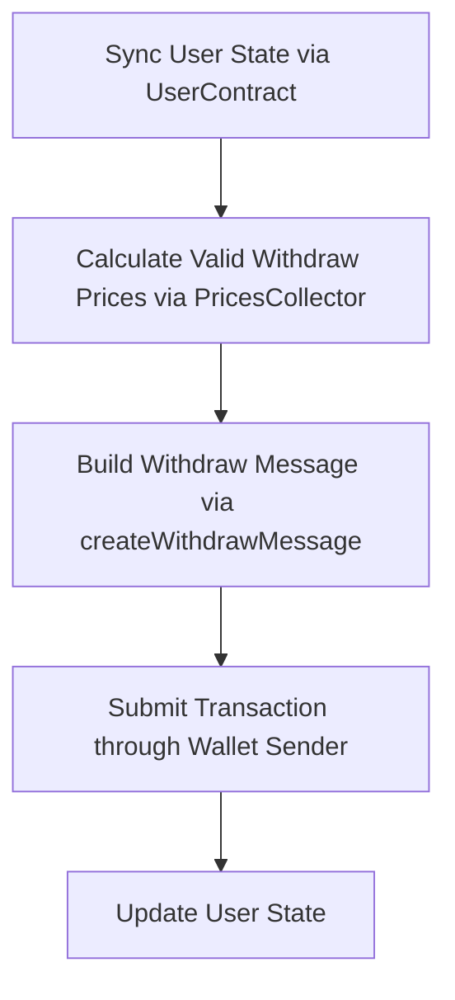
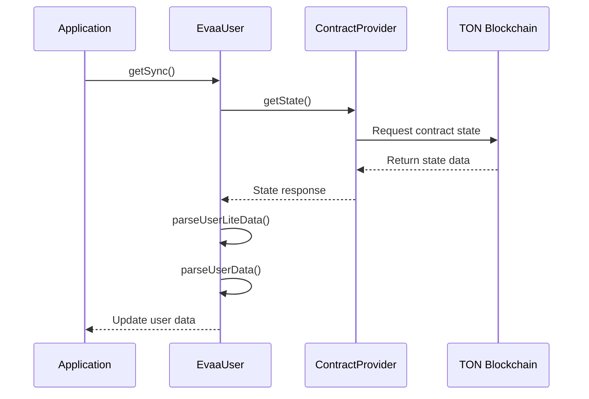
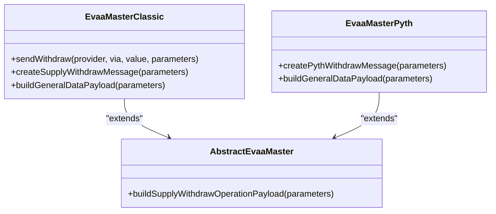
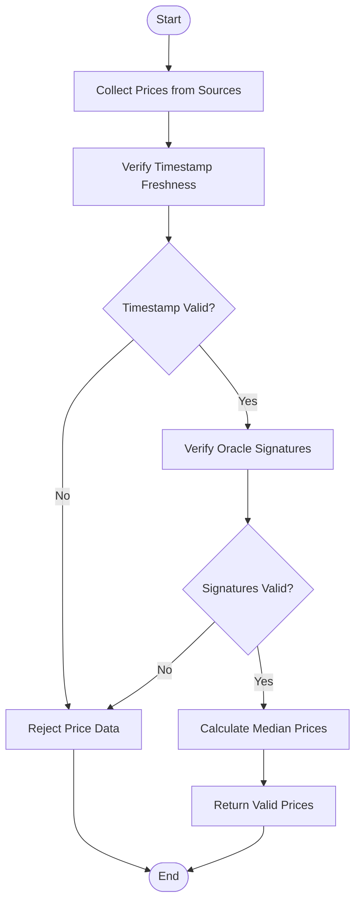
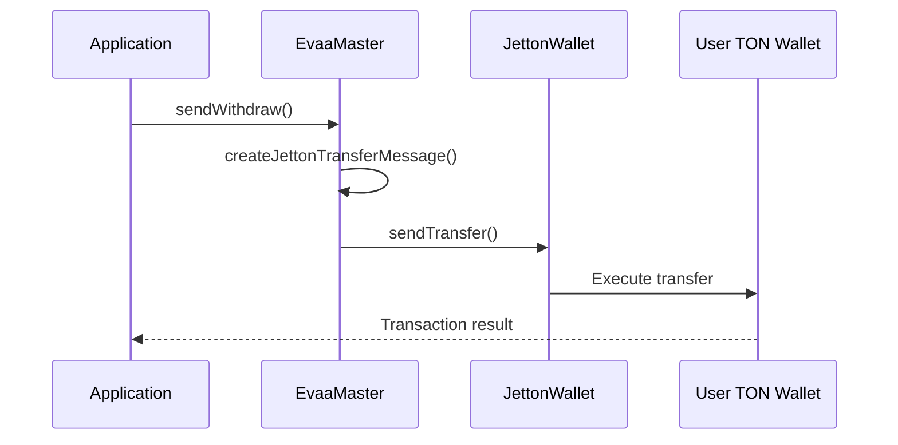

# How to Withdraw Assets


## Table of Contents
1. [Introduction](#introduction)
2. [Withdrawal Process Overview](#withdrawal-process-overview)
3. [Step-by-Step Withdrawal Workflow](#step-by-step-withdrawal-workflow)
4. [Partial vs Full Withdrawal Modes](#partial-vs-full-withdrawal-modes)
5. [Price Data Validation and Freshness](#price-data-validation-and-freshness)
6. [Subaccount-Based Withdrawals](#subaccount-based-withdrawals)
7. [Edge Cases and Failure Conditions](#edge-cases-and-failure-conditions)
8. [Troubleshooting Common Issues](#troubleshooting-common-issues)
9. [Performance Optimization Tips](#performance-optimization-tips)
10. [Integration with Non-TON Assets](#integration-with-non-ton-assets)
11. [Security Considerations](#security-considerations)

## Introduction
The EVAA SDK provides a comprehensive interface for users to withdraw assets from the protocol. This document details the complete withdrawal process, including state synchronization, price validation, message construction, and transaction submission. The system supports both Classic and Pyth oracle modes, with different price handling mechanisms. Understanding the withdrawal workflow is critical for maintaining user health factor and avoiding transaction reverts.

## Withdrawal Process Overview





**Diagram sources**
- [UserContract.ts](file://src/contracts/UserContract.ts#L31-L70)
- [PricesCollector.ts](file://src/prices/PricesCollector.ts#L26-L60)
- [ClassicMaster.ts](file://src/contracts/ClassicMaster.ts#L82-L124)

**Section sources**
- [UserContract.ts](file://src/contracts/UserContract.ts#L31-L115)
- [PricesCollector.ts](file://src/prices/PricesCollector.ts#L26-L98)

## Step-by-Step Withdrawal Workflow

### 1. Sync User State via UserContract
The withdrawal process begins with synchronizing the user's current state by fetching data from the blockchain. This ensures the SDK has up-to-date information about the user's supplied and borrowed assets.





**Diagram sources**
- [UserContract.ts](file://src/contracts/UserContract.ts#L72-L115)
- [parser.ts](file://src/api/parser.ts#L241-L270)

**Section sources**
- [UserContract.ts](file://src/contracts/UserContract.ts#L31-L115)

The `getSync` method retrieves the user's contract state and parses it into usable data structures. Two methods are available:
- `getSyncLite`: Retrieves basic user data without requiring price information
- `getSync`: Calculates full user data including health factor, which requires current prices

### 2. Calculate Valid Withdraw Prices using PricesCollector
Before constructing a withdrawal message, the SDK must obtain valid price data to prevent revert conditions. The `PricesCollector` class handles this process.


```typescript
async getPricesForWithdraw(
    realPrincipals: Dictionary<bigint, bigint>, 
    withdrawAsset: PoolAssetConfig, 
    collateralToDebt = false, 
    fetchConfig?: FetchConfig
): Promise<Prices>
```


**Key parameters:**
- `realPrincipals`: Dictionary of user's asset principals (supplied/borrowed amounts)
- `withdrawAsset`: Configuration of the asset being withdrawn
- `collateralToDebt`: Flag indicating if withdrawal should trigger debt calculation

The method implements the following logic:
- If user has no debt and is withdrawing a supplied asset, returns empty prices (no price data needed)
- Otherwise, collects prices for all relevant assets including the withdrawal asset
- Validates price freshness and signature authenticity
- Returns a `Prices` object containing median prices and signed price data

**Section sources**
- [PricesCollector.ts](file://src/prices/PricesCollector.ts#L26-L60)
- [PythCollector.ts](file://src/prices/PythCollector.ts#L77-L111)

### 3. Build the Withdraw Message via createWithdrawMessage
The SDK constructs the appropriate withdrawal message based on the oracle mode (Classic or Pyth). For Classic mode, the `sendWithdraw` method creates a supply-withdraw message with zero supply amount.





**Diagram sources**
- [ClassicMaster.ts](file://src/contracts/ClassicMaster.ts#L82-L124)
- [PythMaster.ts](file://src/contracts/PythMaster.ts#L107-L141)
- [AbstractMaster.ts](file://src/contracts/AbstractMaster.ts#L226-L250)

The message construction process:
1. Creates supply data (zero amount for withdrawals)
2. Creates withdraw data with amount, asset ID, and recipient
3. Builds general data payload with subaccount ID, flags, and price data
4. Combines components into operation payload
5. Wraps in appropriate opcode and query ID

For non-TON assets, the message is wrapped in a jetton transfer notification.

**Section sources**
- [ClassicMaster.ts](file://src/contracts/ClassicMaster.ts#L44-L80)
- [PythMaster.ts](file://src/contracts/PythMaster.ts#L143-L162)

### 4. Submit the Transaction through a Wallet Sender
The final step involves submitting the constructed message through the user's wallet sender. The SDK uses the TON `Sender` interface to handle transaction signing and broadcasting.


```typescript
await this.sendSupplyWithdraw(provider, via, value, {
    supplyAsset: TON_MAINNET,
    supplyAmount: 0n,
    queryID: parameters.queryID,
    withdrawAsset: parameters.asset,
    withdrawAmount: parameters.amount,
    // ... other parameters
});
```


The `value` parameter represents the TON amount attached to the message, which covers gas fees. For non-TON asset withdrawals, the sender must have sufficient TON balance for gas.

**Section sources**
- [ClassicMaster.ts](file://src/contracts/ClassicMaster.ts#L82-L124)

## Partial vs Full Withdrawal Modes

### Partial Withdrawal
A partial withdrawal removes a specified amount of an asset while maintaining the user's position in the protocol.

**Impact on health factor:**
- Reduces collateral value proportionally
- Maintains existing debt positions
- Improves health factor by reducing collateralization ratio


```typescript
// Example: Partial withdrawal of 100 USDT
const withdrawParams = {
    asset: USDT_MAINNET,
    amount: 10000000000n, // 10 USDT with 9 decimals
    userAddress: userAddress,
    queryID: Date.now(),
    priceData: prices.dataCell
};
```


### Full Withdrawal
A full withdrawal removes the entire balance of an asset, closing that position completely.

**Impact on health factor:**
- Removes all collateral value from that asset
- May trigger health factor violations if it was a primary collateral
- Requires careful calculation to avoid liquidation

The SDK automatically determines if a withdrawal is partial or full based on the requested amount versus available balance.

**Section sources**
- [math.ts](file://src/api/math.ts#L211-L277)
- [liquidation.ts](file://src/api/liquidation.ts#L109-L124)

## Price Data Validation and Freshness

### Price Freshness Requirements
The protocol requires up-to-date price data to prevent manipulation and ensure fair liquidations. Price data is considered valid only if:
- Timestamp is within acceptable limits (typically < 5 minutes old)
- Signatures are valid and from authorized oracles
- Median prices are calculated from sufficient oracle sources





**Diagram sources**
- [utils.ts](file://src/prices/utils.ts#L104-L141)
- [Backend.ts](file://src/prices/sources/Backend.ts#L26-L63)

### Price Validation Process
The SDK validates prices through:
1. **Timestamp verification**: Ensures prices are not stale
2. **Signature verification**: Confirms prices come from authorized oracles
3. **Median calculation**: Aggregates prices from multiple sources
4. **Minimum oracle count**: Requires sufficient oracles (configurable)

If price validation fails, the withdrawal transaction will revert on-chain.

**Section sources**
- [utils.ts](file://src/prices/utils.ts#L143-L163)
- [PriceCollector.test.ts](file://tests/prices/PriceCollector.test.ts#L85-L127)

## Subaccount-Based Withdrawals

The EVAA protocol supports subaccounts, allowing users to manage multiple positions within a single wallet.

### Subaccount Configuration

```typescript
interface WithdrawParameters {
    // ... other parameters
    subaccountId?: number;
}
```


**Key considerations:**
- Subaccount ID 0 represents the main account
- Non-zero IDs represent isolated subaccounts
- Each subaccount has independent health factor calculation
- Withdrawals can target specific subaccounts

### Subaccount Message Construction
When a subaccount ID is specified, the SDK includes it in the general data payload:


```typescript
buildGeneralDataPayload(parameters: ClassicSupplyWithdrawParameters): Cell {
    return beginCell()
        // ... other fields
        .storeInt(parameters.subaccountId ?? 0, 16)
        // ... other fields
        .endCell();
}
```


This ensures the withdrawal affects the correct subaccount balance.

**Section sources**
- [ClassicMaster.ts](file://src/contracts/ClassicMaster.ts#L44-L80)
- [PythMaster.ts](file://src/contracts/PythMaster.ts#L107-L141)

## Edge Cases and Failure Conditions

### Attempting to Withdraw Beyond Available Liquidity
The protocol prevents withdrawals that exceed available liquidity. The SDK should check available liquidity before submission:


```typescript
const maxWithdraw = calculateMaximumWithdrawAmount(
    assetsConfig,
    assetsData,
    principals,
    prices,
    masterConstants,
    assetId
);
```


If the requested amount exceeds `maxWithdraw`, the transaction will fail.

### Triggering Health Factor Violation
Withdrawing collateral can reduce the health factor below the threshold (typically 1.0), making the user liquidatable.

**Prevention strategy:**
Use `predictHealthFactor` to simulate the withdrawal impact:


```typescript
const predictedHF = predictHealthFactor({
    balanceChangeType: BalanceChangeType.Withdraw,
    amount: withdrawAmount,
    asset: withdrawAsset,
    principals: userPrincipals,
    prices: currentPrices,
    // ... other parameters
});
```


If `predictedHF < 1.0`, the withdrawal should be rejected or reduced.

**Section sources**
- [math.ts](file://src/api/math.ts#L497-L530)
- [liquidation.ts](file://src/api/liquidation.ts#L126-L158)

## Troubleshooting Common Issues

### Expired Prices
**Symptom:** Transaction reverts with "price data expired" error
**Solution:** 
1. Refresh price data using `PricesCollector.getPricesForWithdraw()`
2. Ensure system clock is synchronized
3. Check multiple price sources are available

### Insufficient Collateral
**Symptom:** Transaction reverts with "health factor too low" error
**Solution:**
1. Calculate maximum withdrawable amount using `calculateMaximumWithdrawAmount`
2. Reduce withdrawal amount accordingly
3. Consider supplying additional collateral first

### Invalid Subaccount ID
**Symptom:** Transaction fails with "invalid subaccount" error
**Solution:**
1. Verify subaccount ID exists
2. Check subaccount has sufficient balance
3. Ensure subaccount is properly initialized

**Section sources**
- [math.ts](file://src/api/math.ts#L211-L277)
- [UserContract.ts](file://src/contracts/UserContract.ts#L117-L144)

## Performance Optimization Tips

### Caching User State
Cache user state data to reduce blockchain queries:


```typescript
// Cache user data with timestamp
const userDataCache = {
    data: user.data,
    timestamp: Date.now()
};

// Only refresh if older than 30 seconds
if (Date.now() - userDataCache.timestamp > 30000) {
    await user.getSync(/* parameters */);
}
```


### Pre-fetching Price Data
Pre-fetch price data when the user opens the withdrawal interface:


```typescript
// In background, before user submits
const prices = await pricesCollector.getPricesForWithdraw(
    userPrincipals,
    selectedAsset
);
```


### Batch Operations
For multiple withdrawals, consider batching operations to reduce transaction count and gas costs.

**Section sources**
- [UserContract.ts](file://src/contracts/UserContract.ts#L31-L70)
- [PricesCollector.ts](file://src/prices/PricesCollector.ts#L62-L98)

## Integration with Non-TON Assets

### Jetton Wallet Integration
For non-TON assets (jettons), the SDK integrates with `JettonWallet` contracts:





**Diagram sources**
- [JettonWallet.ts](file://src/contracts/JettonWallet.ts#L0-L19)
- [ClassicMaster.ts](file://src/contracts/ClassicMaster.ts#L82-L124)

### Jetton Address Calculation
The SDK calculates jetton wallet addresses using:


```typescript
function getUserJettonWallet(ownerAddress: Address, poolAssetConfig: PoolAssetConfig)
```


This function generates the deterministic address for a user's jetton wallet based on their address and the asset configuration.

**Section sources**
- [userJettonWallet.ts](file://src/utils/userJettonWallet.ts#L43-L79)
- [AddressCalculation.test.ts](file://tests/address/AddressCalculation.test.ts#L101-L129)

## Security Considerations

### Median Price Validation
The protocol uses median prices from multiple oracles to prevent single-point manipulation:


```typescript
function unpackMedianPrices(pricesCell: Cell): Dictionary<bigint, bigint>
```


This ensures price data represents a consensus across oracles rather than a single source.

### Slippage Protection
While not explicitly implemented in the provided code, applications should:
- Set appropriate slippage tolerance
- Validate price impact before submission
- Use price limits where available

### Reentrancy Protection
The smart contracts include protections against reentrancy attacks, but frontends should:
- Avoid complex logic in withdrawal paths
- Use checks-effects-interactions pattern
- Validate state after operations

**Section sources**
- [utils.ts](file://src/prices/utils.ts#L104-L141)
- [PythMaster.ts](file://src/contracts/PythMaster.ts#L39-L75)

**Referenced Files in This Document**   
- [ClassicMaster.ts](file://src/contracts/ClassicMaster.ts)
- [PythMaster.ts](file://src/contracts/PythMaster.ts)
- [UserContract.ts](file://src/contracts/UserContract.ts)
- [PricesCollector.ts](file://src/prices/PricesCollector.ts)
- [PythCollector.ts](file://src/prices/PythCollector.ts)
- [math.ts](file://src/api/math.ts)
- [JettonWallet.ts](file://src/contracts/JettonWallet.ts)
- [userJettonWallet.ts](file://src/utils/userJettonWallet.ts)