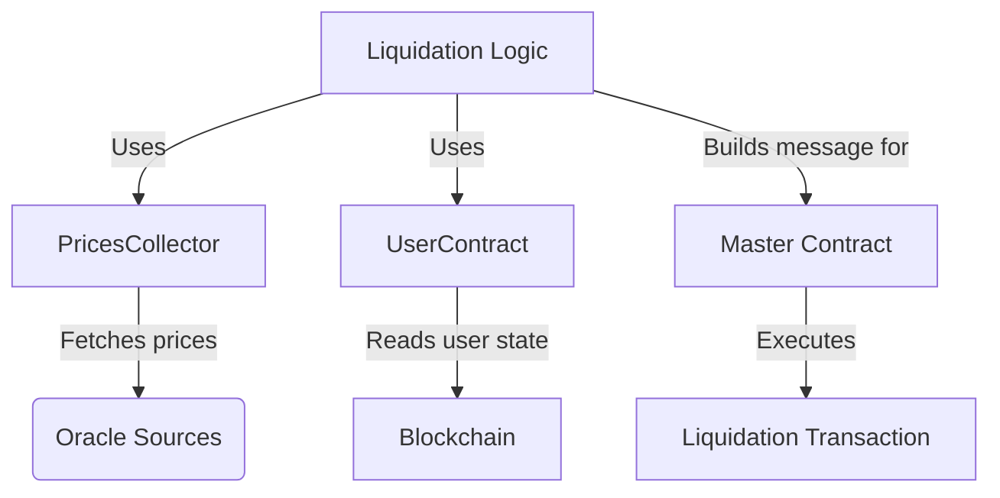
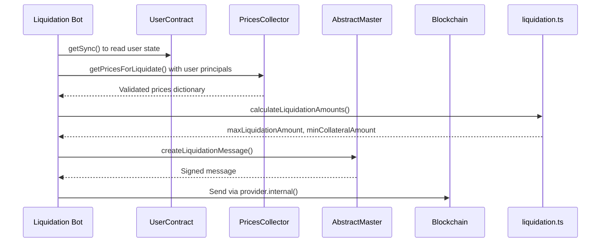
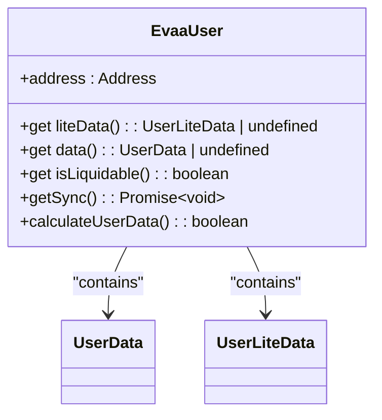
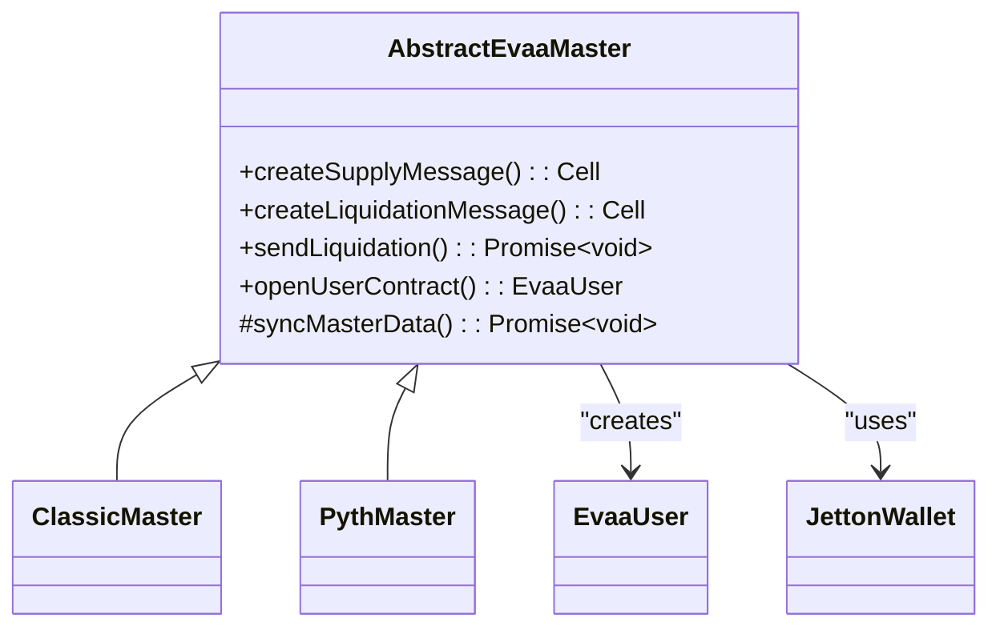

# How to Liquidate Undercollateralized Positions


## Table of Contents
1. [Introduction](#introduction)
2. [Project Structure](#project-structure)
3. [Core Components](#core-components)
4. [Architecture Overview](#architecture-overview)
5. [Detailed Component Analysis](#detailed-component-analysis)
6. [Liquidation Workflow](#liquidation-workflow)
7. [Cross-Asset Liquidation Mechanics](#cross-asset-liquidation-mechanics)
8. [Price Validation and Oracle Integration](#price-validation-and-oracle-integration)
9. [Parameter Requirements and Safety Checks](#parameter-requirements-and-safety-checks)
10. [Failure Modes and Best Practices](#failure-modes-and-best-practices)
11. [Conclusion](#conclusion)

## Introduction
The EVAA protocol enables decentralized lending and borrowing with built-in mechanisms for maintaining solvency through liquidations. When a user's position becomes undercollateralized—meaning their borrowed value exceeds the allowed threshold relative to their collateral—the system permits third-party liquidators to repay part of the debt in exchange for discounted collateral. This document details the complete liquidation workflow, from identifying at-risk users to executing secure and efficient liquidation transactions.

This guide is designed for developers building liquidation bots or integrating with the EVAA protocol, providing both high-level understanding and code-level implementation details.

## Project Structure
The EVAA SDK is organized into modular components that separate concerns such as pricing, user state management, contract interaction, and mathematical calculations. The key directories involved in liquidation operations are:

- `src/api/liquidation.ts`: Core logic for calculating liquidation amounts and health factors.
- `src/contracts/`: Contains wrappers for interacting with on-chain contracts, including `UserContract` and `AbstractMaster`.
- `src/prices/`: Manages price collection from multiple oracles via `PricesCollector`.
- `src/api/parsers/`: Handles oracle data parsing with `ClassicOracleParser` and `PythOracleParser`.

The structure supports extensibility across oracle types (e.g., Pyth vs. Classic) while maintaining a consistent interface for liquidation execution.





**Diagram sources**
- [PricesCollector.ts](file://src/prices/PricesCollector.ts#L0-L163)
- [UserContract.ts](file://src/contracts/UserContract.ts#L0-L145)
- [liquidation.ts](file://src/api/liquidation.ts#L0-L345)

**Section sources**
- [project_structure](file://#L0-L50)

## Core Components
The liquidation process relies on several core components working in concert:

- **UserContract**: Represents a user’s position and exposes methods to determine if they are liquidatable.
- **PricesCollector**: Aggregates and validates price data from multiple oracle sources.
- **AbstractMaster**: Base class for the master contract that constructs and sends liquidation messages.
- **Oracle Parsers**: Validate and parse oracle data (`ClassicOracleParser`, `PythOracleParser`).
- **Liquidation Math Functions**: Compute health factors, liquidation amounts, and collateral rewards.

These components ensure that liquidations are safe, accurate, and resistant to manipulation.

**Section sources**
- [liquidation.ts](file://src/api/liquidation.ts#L0-L345)
- [UserContract.ts](file://src/contracts/UserContract.ts#L0-L145)
- [AbstractMaster.ts](file://src/contracts/AbstractMaster.ts#L0-L422)
- [PricesCollector.ts](file://src/prices/PricesCollector.ts#L0-L163)

## Architecture Overview
The liquidation architecture follows a layered design where off-chain computation prepares transaction parameters before on-chain execution.





**Diagram sources**
- [UserContract.ts](file://src/contracts/UserContract.ts#L0-L145)
- [PricesCollector.ts](file://src/prices/PricesCollector.ts#L0-L163)
- [AbstractMaster.ts](file://src/contracts/AbstractMaster.ts#L0-L422)
- [liquidation.ts](file://src/api/liquidation.ts#L0-L345)

## Detailed Component Analysis

### UserContract Analysis
The `EvaaUser` class wraps the on-chain user contract and provides access to parsed user data, including whether the user is currently liquidatable.





**Diagram sources**
- [UserContract.ts](file://src/contracts/UserContract.ts#L0-L145)

**Section sources**
- [UserContract.ts](file://src/contracts/UserContract.ts#L0-L145)

#### Key Methods:
- **get isLiquidable**: Returns `true` if the user's health factor has dropped below the threshold.
- **getSync**: Synchronizes full user data including balances, prices, and health parameters.
- **calculateUserData**: Computes full user state from lite data and current prices.

Example usage:

```ts
const userContract = EvaaUser.createFromAddress(userAddress, poolConfig);
await userContract.getSync(provider, assetsData, assetsConfig, prices);
if (userContract.isLiquidable) {
    // Proceed with liquidation
}
```


### PricesCollector Analysis
The `PricesCollector` aggregates price data from multiple oracle sources, ensuring robustness against single-point failures or manipulation.


```mermaid
classDiagram
class PricesCollector {
+getPrices() : Promise~Prices~
+getPricesForLiquidate() : Promise~Prices~
+getPricesForWithdraw() : Promise~Prices~
#collectPricesWithValidation() : Promise~void~
#getPricesByAssetList() : { dict, dataCell }
}
PricesCollector --> Oracle : "implements"
PricesCollector --> PriceSource : "uses"
PricesCollector --> RawPriceData : "stores"
```


**Diagram sources**
- [PricesCollector.ts](file://src/prices/PricesCollector.ts#L0-L163)

**Section sources**
- [PricesCollector.ts](file://src/prices/PricesCollector.ts#L0-L163)

#### Key Methods:
- **getPricesForLiquidate**: Fetches prices required to assess a user’s health factor.
- **collectAndFilterPrices**: Gathers and filters price data based on timestamp and validity.
- **getMedianPrice**: Uses median of multiple oracle reports to resist outliers.

Example:

```ts
const pricesCollector = new PricesCollector(config);
const prices = await pricesCollector.getPricesForLiquidate(principals);
```


### AbstractMaster Analysis
The `AbstractEvaaMaster` class provides shared logic for constructing liquidation messages and interacting with the master contract.





**Diagram sources**
- [AbstractMaster.ts](file://src/contracts/AbstractMaster.ts#L0-L422)

**Section sources**
- [AbstractMaster.ts](file://src/contracts/AbstractMaster.ts#L0-L422)

#### Key Methods:
- **createLiquidationMessage**: Builds the TON cell message for liquidation.
- **sendLiquidation**: Sends the transaction via the provider.
- **openUserContract**: Instantiates a user contract wrapper for state queries.

## Liquidation Workflow
The full liquidation workflow consists of the following steps:

1. **Identify Undercollateralized User**
2. **Fetch Current Prices**
3. **Calculate Liquidation Parameters**
4. **Construct Liquidation Message**
5. **Execute Transaction**

### Step-by-Step Execution

```ts
// 1. Identify user
const userContract = master.openUserContract(userAddress);
await userContract.getSync(provider, assetsData, assetsConfig, prices);

if (!userContract.isLiquidable) return;

// 2. Fetch prices
const prices = await pricesCollector.getPricesForLiquidate(userContract.data!.principals);

// 3. Calculate amounts
const { maxLiquidationAmount, maxCollateralRewardAmount } = calculateLiquidationAmounts(
    loanAsset,
    collateralAsset,
    userContract.data!.totalSupplyWorth,
    userContract.data!.totalBorrowWorth,
    userContract.data!.principals,
    prices.dict,
    assetsData,
    assetsConfig,
    masterConstants
);

// 4. Build message
const liquidationParams: ClassicLiquidationParameters = {
    borrowerAddress: userAddress,
    loanAsset: loanAsset.assetId,
    collateralAsset: collateralAsset.assetId,
    liquidationAmount: maxLiquidationAmount,
    minCollateralAmount: maxCollateralRewardAmount,
    asset: loanAsset,
    queryID: Date.now(),
    payload: Cell.EMPTY,
    liquidatorAddress: liquidatorAddress,
    includeUserCode: false
};

const message = master.createLiquidationMessage(liquidationParams);

// 5. Execute
await provider.internal(sender, {
    value: fee,
    sendMode: SendMode.PAY_GAS_SEPARATELY,
    body: message
});
```


**Section sources**
- [liquidation.ts](file://src/api/liquidation.ts#L0-L345)
- [UserContract.ts](file://src/contracts/UserContract.ts#L0-L145)
- [AbstractMaster.ts](file://src/contracts/AbstractMaster.ts#L0-L422)

## Cross-Asset Liquidation Mechanics
EVAA supports cross-asset liquidation, allowing one asset to be used to repay debt in another. For example, a liquidator can repay USDT debt and receive wBTC as collateral.

### Key Concepts:
- **Loan Asset**: The asset being repaid (debt).
- **Collateral Asset**: The asset being seized (supply).
- **Liquidation Bonus**: Incentive given to liquidators (e.g., 5% extra collateral).
- **Reserve Factor**: Portion of repayment kept by the protocol.

The amount of collateral received is calculated as:

```
collateralAmount = (baseLiquidationValue * liquidationBonus / scale) * scale / price
```


Where:
- `baseLiquidationValue` = min(loanValue, discountedCollateralValue)
- `liquidationBonus` is defined per collateral asset
- `scale` = ASSET_LIQUIDATION_BONUS_SCALE (typically 10000)

This ensures that liquidators are rewarded while protecting the protocol from bad debt.

**Section sources**
- [liquidation.ts](file://src/api/liquidation.ts#L0-L345)

## Price Validation and Oracle Integration
To prevent price manipulation, EVAA uses multiple oracle sources and medianization.

### Oracle Parsers:
- **ClassicOracleParser**: Validates off-chain price feeds.
- **PythOracleParser**: Verifies on-chain Pyth Network price updates.

Both parsers implement the `OracleParser` interface and are used during `syncMasterData` to validate oracle payloads.

### Median Price Calculation:

```ts
function getMedianPrice(prices: RawPriceData[], assetId: bigint): bigint | null {
    const values = prices
        .map(p => p.dict.get(assetId))
        .filter((v): v is bigint => v !== undefined)
        .sort((a, b) => (a > b ? 1 : -1));
    return values[Math.floor(values.length / 2)];
}
```


Only if at least `minimalOracles` (e.g., 3) report consistent prices will the system proceed.

**Section sources**
- [PricesCollector.ts](file://src/prices/PricesCollector.ts#L0-L163)
- [ClassicOracleParser.ts](file://src/api/parsers/ClassicOracleParser.ts)
- [PythOracleParser.ts](file://src/api/parsers/PythOracleParser.ts)

## Parameter Requirements and Safety Checks
### Required Parameters:
- **borrowerAddress**: Address of the user being liquidated.
- **loanAsset**: ID of the asset to repay.
- **collateralAsset**: ID of the asset to seize.
- **liquidationAmount**: Amount of loan asset to repay.
- **minCollateralAmount**: Minimum collateral to receive (slippage protection).
- **queryID**: Unique identifier for the transaction.
- **liquidatorAddress**: Where collateral will be sent.

### Safety Functions:
- **calculateMinCollateralByTransferredAmount**: Ensures minimum reward even if full liquidation isn't possible.
- **isBadDebt**: Detects when total supply cannot cover total borrow even after bonuses.
- **deductReserve / addReserve**: Adjusts for protocol reserve factors.

Example:

```ts
const minCollateral = calculateMinCollateralByTransferredAmount(
    transferredAmount,
    maxLiquidationAmount,
    maxCollateralReward
);
```


**Section sources**
- [liquidation.ts](file://src/api/liquidation.ts#L0-L345)

## Failure Modes and Best Practices

### Common Failure Modes:
- **Health Factor Recovery**: User deposits collateral after detection but before execution.
- **Price Staleness**: Oracle data is outdated, causing transaction rejection.
- **Insufficient Balance**: Liquidator lacks enough loan asset.
- **Front-Running**: Another bot executes first.

### Best Practices for Bot Developers:
1. **Minimize Latency**: Run nodes close to validators.
2. **Use Real-Time Monitoring**: Subscribe to mempool events.
3. **Validate Prices Immediately Before Execution**.
4. **Set Conservative minCollateralAmount** to avoid losses.
5. **Retry Logic**: Handle temporary failures gracefully.
6. **Simulate Transactions Off-Chain** when possible.

Avoid reusing `queryID` and always verify the user is still liquidable immediately before sending.

**Section sources**
- [liquidation.ts](file://src/api/liquidation.ts#L0-L345)
- [UserContract.ts](file://src/contracts/UserContract.ts#L0-L145)
- [PricesCollector.ts](file://src/prices/PricesCollector.ts#L0-L163)

## Conclusion
Liquidating undercollateralized positions in the EVAA protocol involves a coordinated sequence of off-chain analysis and on-chain execution. By leveraging robust price oracles, precise health factor calculations, and secure message construction, developers can build reliable liquidation systems. Understanding the interplay between `UserContract`, `PricesCollector`, and `AbstractMaster` is essential for creating efficient and safe liquidation bots. Always validate state immediately before execution and account for potential race conditions in decentralized environments.

**Referenced Files in This Document**   
- [liquidation.ts](file://src/api/liquidation.ts#L0-L345)
- [UserContract.ts](file://src/contracts/UserContract.ts#L0-L145)
- [AbstractMaster.ts](file://src/contracts/AbstractMaster.ts#L0-L422)
- [PricesCollector.ts](file://src/prices/PricesCollector.ts#L0-L163)
- [ClassicOracleParser.ts](file://src/api/parsers/ClassicOracleParser.ts)
- [PythOracleParser.ts](file://src/api/parsers/PythOracleParser.ts)