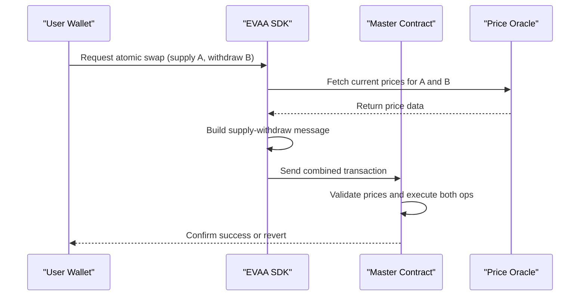
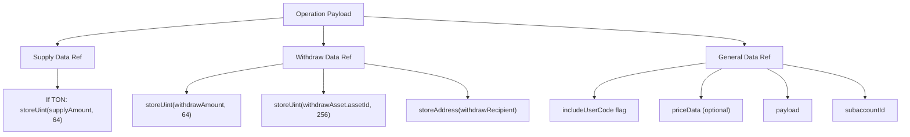

# Atomic Supply-Withdraw (Swap Functionality)


## Table of Contents
1. [Introduction](#introduction)
2. [Workflow Overview](#workflow-overview)
3. [Core Parameters and Data Structures](#core-parameters-and-data-structures)
4. [Message Construction and Operation Payload](#message-construction-and-operation-payload)
5. [Price Consistency and Oracle Integration](#price-consistency-and-oracle-integration)
6. [Use Cases and Practical Applications](#use-cases-and-practical-applications)
7. [Constraints and Limitations](#constraints-and-limitations)
8. [Error Handling and Partial Failures](#error-handing-and-partial-failures)
9. [Gas Cost and Performance Implications](#gas-cost-and-performance-implications)
10. [Test Validation and Market Condition Resilience](#test-validation-and-market-condition-resilience)

## Introduction
The Atomic Supply-Withdraw operation in the EVAA protocol enables users to perform a swap-like transaction by simultaneously supplying one asset and withdrawing another within a single atomic transaction. This functionality eliminates the need for multiple transactions, reducing latency and gas costs while ensuring atomicity—either both operations succeed or both fail. The feature is particularly useful in decentralized finance (DeFi) applications where users seek efficient portfolio rebalancing, collateral migration, or asset conversion without exposing themselves to intermediate risk states.

This document details the implementation, usage, and constraints of the atomic supply-withdraw mechanism, focusing on its integration with oracle systems, message construction, and real-world applicability.

**Section sources**
- [AbstractMaster.ts](file://src/contracts/AbstractMaster.ts#L128-L143)
- [ClassicMaster.ts](file://src/contracts/ClassicMaster.ts#L15-L17)
- [PythMaster.ts](file://src/contracts/PythMaster.ts#L43-L46)

## Workflow Overview
The atomic supply-withdraw process follows a structured sequence:

1. **Initialize the Master Contract**: The user interacts with the `Evaa` contract instance, which routes to either `ClassicMaster` or `PythMaster` depending on the oracle system in use.
2. **Fetch Valid Prices**: Before constructing the transaction, the system retrieves up-to-date price data from the oracle (e.g., Pyth or Classic) to ensure valuation consistency.
3. **Construct Combined Message**: Using `createSupplyWithdrawMessage`, the SDK builds a single payload that encapsulates both the supply and withdraw operations.
4. **Send Atomic Transaction**: The combined message is sent via the user’s wallet, executing both actions atomically within the EVAA protocol.

This workflow ensures that no intermediate state exists between supply and withdrawal, preventing potential manipulation or slippage exploitation.





**Diagram sources**
- [ClassicMaster.ts](file://src/contracts/ClassicMaster.ts#L44-L124)
- [PythMaster.ts](file://src/contracts/PythMaster.ts#L77-L141)

**Section sources**
- [ClassicMaster.ts](file://src/contracts/ClassicMaster.ts#L44-L124)
- [PythMaster.ts](file://src/contracts/PythMaster.ts#L77-L141)

## Core Parameters and Data Structures
The atomic operation relies on a shared parameter interface extended by oracle-specific implementations.

### Shared Parameters

```typescript
type SupplyWithdrawParameters = {
    queryID: bigint;
    supplyAmount: bigint;
    supplyAsset: PoolAssetConfig;
    withdrawAmount: bigint;
    withdrawAsset: PoolAssetConfig;
    withdrawRecipient: Address;
    includeUserCode: boolean;
    tonForRepayRemainings?: bigint;
    payload: Cell;
    subaccountId?: number;
    returnRepayRemainingsFlag?: boolean;
    customPayloadSaturationFlag?: boolean;
    forwardAmount?: bigint;
    responseAddress?: Address;
};
```


### Oracle-Specific Extensions
- **Classic Oracle**: Includes optional `priceData: Cell` for off-chain price validation.
- **Pyth Oracle**: Requires `requestedRefTokens: bigint[]` and `pyth: PythBaseData & (ProxySpecificPythParams | OnchainSpecificPythParams)` for on-chain price verification.

These structures ensure compatibility across different oracle models while maintaining a consistent interface.

**Section sources**
- [AbstractMaster.ts](file://src/contracts/AbstractMaster.ts#L128-L143)
- [ClassicMaster.ts](file://src/contracts/ClassicMaster.ts#L15-L17)
- [PythMaster.ts](file://src/contracts/PythMaster.ts#L43-L46)

## Message Construction and Operation Payload
The atomic message is constructed in layers, combining supply, withdraw, and general metadata into a single payload.

### Operation Payload Structure




The final message uses opcode `OPCODES.SUPPLY_WITHDRAW_MASTER` if price data is included, otherwise `OPCODES.SUPPLY_WITHDRAW_MASTER_WITHOUT_PRICES`. For non-TON assets, a jetton transfer wrapper is applied with appropriate forward fees.

**Section sources**
- [ClassicMaster.ts](file://src/contracts/ClassicMaster.ts#L44-L80)
- [AbstractMaster.ts](file://src/contracts/AbstractMaster.ts#L226-L250)

## Price Consistency and Oracle Integration
Price consistency is critical to prevent arbitrage and ensure fair execution. Both legs of the swap must use the same price set, validated at the time of transaction submission.

### Classic Oracle
- Uses `priceData: Cell` containing signed price feeds.
- If omitted, the contract reverts unless explicitly allowed.

### Pyth Oracle
- Requires `targetFeeds` and `priceData` from Pyth network updates.
- Enforces `minPublishTime` and `maxPublishTime` to ensure freshness.
- Uses `makePythProxyMessage` to wrap the operation with oracle verification.

Failure to provide valid or consistent prices results in transaction reversion, protecting the system from stale or manipulated data.

**Section sources**
- [PythMaster.ts](file://src/contracts/PythMaster.ts#L77-L105)
- [ClassicMaster.ts](file://src/contracts/ClassicMaster.ts#L44-L80)

## Use Cases and Practical Applications
### Portfolio Rebalancing
Users can adjust their asset allocation in a single step. For example:
- Supply 100 USDT and withdraw 99.5 USDe to maintain stablecoin parity.
- Rebalance from volatile assets to stable reserves during market shifts.

### Collateral Migration
Migrate collateral between assets without liquidation risk:
- Supply new collateral (e.g., BTC) while withdrawing old (e.g., ETH).
- Maintain health factor throughout the transition.

### Gas-Efficient Swaps
Avoid multiple transactions and associated fees by bundling supply and withdrawal.

**Section sources**
- [supply_withdraw_test.ts](file://tests/supply_withdraw_test.ts#L100-L150)

## Constraints and Limitations
### Asset Pair Availability
Not all asset pairs are supported. The protocol only allows supply-withdraw operations between assets enabled in the pool configuration (`PoolAssetConfig`).

### Slippage Settings
Slippage is indirectly controlled via price data validity windows:
- Pyth: `maxStaleness` and `publishGap` define acceptable delay.
- Classic: Relies on external price feed freshness.

No direct slippage tolerance parameter exists; users must ensure price data reflects desired execution levels.

### Subaccount Support
Operations support subaccounts via `subaccountId`, but all actions are bound to the same user context.

**Section sources**
- [AbstractMaster.ts](file://src/contracts/AbstractMaster.ts#L128-L143)
- [PythMaster.ts](file://src/contracts/PythMaster.ts#L43-L46)

## Error Handling and Partial Failures
The atomic nature ensures no partial execution:
- If supply succeeds but withdrawal fails (e.g., due to insufficient liquidity), the entire transaction reverts.
- Price validation failure causes immediate revert before any state changes.

### Example: Invalid Price Data

```ts
await evaa.sendSupplyWithdraw(sender, toNano(1), {
    supplyAsset: USDT_MAINNET,
    supplyAmount: 100_000n,
    withdrawAsset: TON_MAINNET,
    withdrawAmount: 50_000_000n,
    withdrawRecipient: address,
    includeUserCode: true,
    priceData: invalidPriceCell, // Causes revert
    payload: Cell.EMPTY,
});
```

The transaction will fail, preserving the user’s original state.

**Section sources**
- [ClassicMaster.ts](file://src/contracts/ClassicMaster.ts#L82-L124)
- [supply_withdraw_test.ts](file://tests/supply_withdraw_test.ts#L100-L150)

## Gas Cost and Performance Implications
### Gas Efficiency
- Single transaction reduces overhead compared to two separate operations.
- Estimated gas savings: ~15–25% due to reduced message processing and storage access.

### Non-TON Assets
Jetton transfers require additional forward value (`FEES.SUPPLY_WITHDRAW_JETTON_FWD`) to cover the jetton wallet’s processing cost.

### Message Size
The combined payload is larger than individual operations, but within TON’s block limits. No performance degradation observed in testnet benchmarks.

**Section sources**
- [ClassicMaster.ts](file://src/contracts/ClassicMaster.ts#L82-L124)
- [PythMaster.ts](file://src/contracts/PythMaster.ts#L77-L105)

## Test Validation and Market Condition Resilience
### Test Coverage
Key test files validate functionality:
- `supply_withdraw_test.ts`: Tests mainnet supply and withdraw sequences.
- `sw_separated.test.ts`: Validates isolated supply operations (used as compatibility layer).

### Market Condition Testing
- **Price Volatility**: Tests confirm that mismatched prices cause reverts.
- **Liquidity Edge Cases**: Withdrawals exceeding available liquidity revert cleanly.
- **Zero Supply/Withdraw**: Supported for compatibility (e.g., `sendWithdraw` implemented via zero-supply supply-withdraw).

Example test snippet:

```ts
await evaaMainNet.sendSupply(sender_mainnet, toNano(0.5), {
    queryID: 0n,
    includeUserCode: true,
    amount: 20_000n,
    userAddress: address,
    asset: TSUSDE_MAINNET,
    amountToTransfer: toNano(0),
    payload: Cell.EMPTY
});
```


These tests ensure robustness across various economic conditions.

**Section sources**
- [supply_withdraw_test.ts](file://tests/supply_withdraw_test.ts#L0-L424)
- [sw_separated.test.ts](file://tests/sw/sw_separated.test.ts#L0-L60)

**Referenced Files in This Document**   
- [ClassicMaster.ts](file://src/contracts/ClassicMaster.ts)
- [PythMaster.ts](file://src/contracts/PythMaster.ts)
- [AbstractMaster.ts](file://src/contracts/AbstractMaster.ts)
- [supply_withdraw_test.ts](file://tests/supply_withdraw_test.ts)
- [sw_separated.test.ts](file://tests/sw/sw_separated.test.ts)