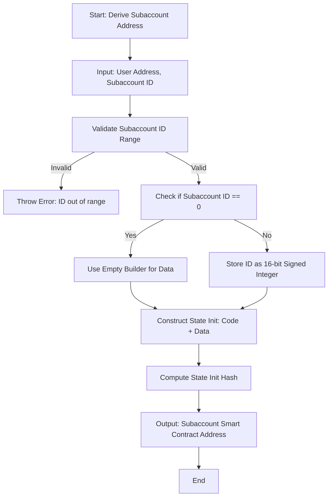
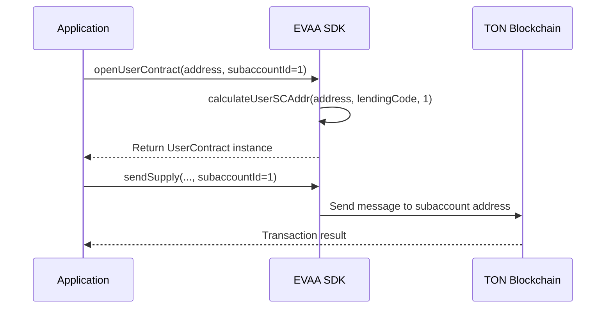
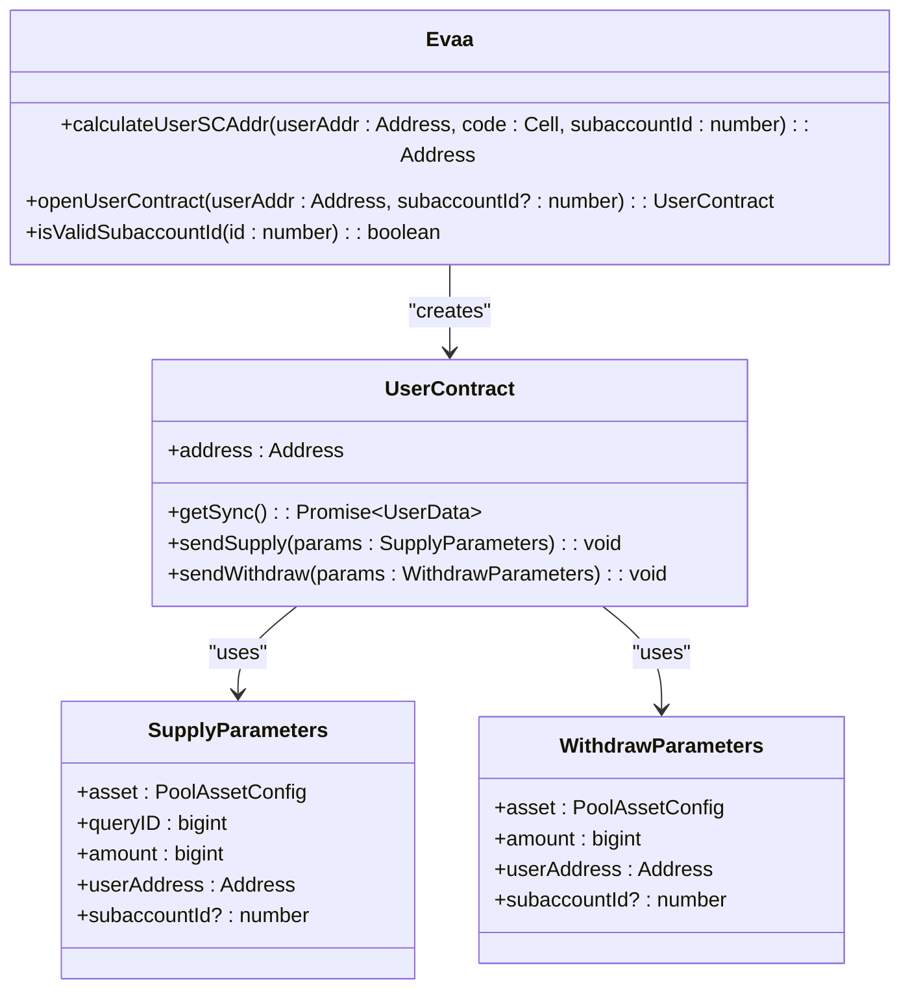

# Handling Subaccounts in Operations


## Table of Contents
1. [Introduction](#introduction)
2. [Subaccount Concept and Purpose](#subaccount-concept-and-purpose)
3. [Subaccount Address Derivation](#subaccount-address-derivation)
4. [Working with Subaccounts in SDK Operations](#working-with-subaccounts-in-sdk-operations)
5. [Jetton Wallet Interaction with Subaccounts](#jetton-wallet-interaction-with-subaccounts)
6. [Security Considerations](#security-considerations)
7. [Troubleshooting Common Issues](#troubleshooting-common-issues)
8. [Test Validation and Examples](#test-validation-and-examples)

## Introduction
This document provides a comprehensive guide on handling subaccounts within the EVAA SDK. Subaccounts are isolated risk compartments within a single wallet, enabling advanced financial strategies such as hedging or multi-strategy exposure. The EVAA protocol uses deterministic algorithms to derive unique smart contract addresses for each subaccount based on the master wallet address and a subaccount index.

The SDK supports operations across multiple subaccounts, allowing developers to manage distinct positions under one wallet. This document explains how subaccount addresses are calculated, how to perform core operations (supply, withdraw, liquidation), and best practices for secure implementation.

## Subaccount Concept and Purpose

Subaccounts in the EVAA ecosystem allow users to segment their financial activities into isolated compartments within a single master wallet. Each subaccount operates independently with its own balance, debt, and risk profile, enabling:

- **Risk Isolation**: Prevent cross-contamination of positions
- **Strategy Segmentation**: Run multiple strategies (e.g., conservative vs aggressive) simultaneously
- **Hedging**: Maintain offsetting positions in different subaccounts
- **Testing**: Experiment with new strategies without affecting primary funds

Each subaccount is identified by a signed 16-bit integer index, ranging from -32767 to 32767, excluding -32768. The index `0` is reserved for the default subaccount, which is used when no subaccount ID is explicitly specified.

**Section sources**
- [SubaccountCalculation.test.ts](file://tests/address/SubaccountCalculation.test.ts#L1-L127)

## Subaccount Address Derivation

Subaccount addresses are deterministically derived using the master wallet address and subaccount index. The address generation follows TON blockchain standards for smart contract deployment, where the contract address depends on the state initialization (`stateInit`) hash.

The derivation process involves:
1. Using the master contract's code (`lendingCode`)
2. Combining the master wallet address and subaccount index in the contract data
3. Computing the state init hash to generate the final address

For subaccount ID `0`, the SDK uses an empty builder for the subaccount data field. For any non-zero subaccount ID, it stores the ID as a 16-bit signed integer. This distinction ensures that even an explicit `0` value produces a different address than the default case.





**Diagram sources**
- [SubaccountCalculation.test.ts](file://tests/address/SubaccountCalculation.test.ts#L23-L53)

**Section sources**
- [SubaccountCalculation.test.ts](file://tests/address/SubaccountCalculation.test.ts#L23-L89)

## Working with Subaccounts in SDK Operations

The EVAA SDK provides methods to interact with specific subaccounts during core operations such as supply, withdraw, and liquidation.

### Initializing Master Contract with Subaccount Context

To work with a specific subaccount, initialize the user contract using `openUserContract()` with the desired subaccount ID:


```typescript
const evaa = new Evaa({ poolConfig: MAINNET_POOL_CONFIG });
const userAddress = Address.parseFriendly('EQBOq441r0EiLi1VXlH_-ez9piPIe_4Kyzk5zNk04jTgfiIH').address;
const userContract = evaa.openUserContract(userAddress, 1); // Subaccount ID = 1
```


### Performing Supply and Withdraw Operations

Supply and withdraw operations support an optional `subaccountId` parameter in their parameter objects:

**Supply Parameters:**
- `asset`: Asset configuration
- `queryID`: Unique query identifier
- `amount`: Amount to supply
- `userAddress`: Master wallet address
- `subaccountId`: Optional subaccount index (default: 0)

**Withdraw Parameters:**
- `asset`: Asset configuration
- `amount`: Amount to withdraw
- `userAddress`: Master wallet address
- `subaccountId`: Optional subaccount index (default: 0)

Example usage:

```typescript
await evaa.sendSupply(sender, toNano(1), {
    queryID: 123n,
    includeUserCode: true,
    amount: toNano(1),
    userAddress: walletAddress,
    asset: TON_MAINNET,
    subaccountId: 1
});
```





**Diagram sources**
- [AbstractMaster.ts](file://src/contracts/AbstractMaster.ts#L42-L95)

**Section sources**
- [AbstractMaster.ts](file://src/contracts/AbstractMaster.ts#L42-L95)

## Jetton Wallet Interaction with Subaccounts

When interacting with Jetton (token) wallets through subaccounts, address derivation follows the same deterministic principles. The `getUserJettonWallet` utility function from `utils/userJettonWallet` can be used to compute the Jetton wallet address associated with a specific subaccount.

The Jetton wallet address is derived using:
- The Jetton minter address
- The subaccount's smart contract address (not the master wallet)

This ensures that token balances are correctly isolated per subaccount. Developers must ensure they query balances and send tokens to the correct derived Jetton wallet address corresponding to the target subaccount.

**Section sources**
- [index.ts](file://src/index.ts#L1-L45)

## Security Considerations

### Subaccount Index Validation
Always validate subaccount IDs before use. The valid range is -32767 to 32767. The function `isValidSubaccountId()` is provided for this purpose:


```typescript
function isValidSubaccountId(id: number): boolean {
    return id >= -32767 && id <= 32767;
}
```


Using an invalid ID will throw an error during address calculation.

### Risk of Fund Misdirection
Incorrect subaccount indexing can lead to funds being sent to unintended addresses. Always:
- Double-check subaccount IDs before executing transactions
- Use constants or enums for commonly used subaccount indices
- Implement pre-transaction address validation

### Deterministic Address Generation
Since addresses are deterministic, never expose subaccount usage patterns that could allow adversaries to predict future addresses. Treat subaccount indices as sensitive information when used for strategic isolation.

**Section sources**
- [SubaccountCalculation.test.ts](file://tests/address/SubaccountCalculation.test.ts#L116-L126)

## Troubleshooting Common Issues

### Issue: Incorrect Address Generation
**Symptom**: Transactions fail or funds appear missing  
**Cause**: Using explicit `0` instead of omitting subaccount ID for default account  
**Solution**: For default subaccount, either omit `subaccountId` or use `0`. Do not manually encode `0` in data.

### Issue: Unexpected Balance Queries
**Symptom**: Balance returns zero despite previous supply  
**Cause**: Querying balance on wrong subaccount or master wallet instead of subaccount's Jetton wallet  
**Solution**: Ensure you're querying the correct derived Jetton wallet address for the specific subaccount.

### Issue: Transaction Reverted with "Invalid Subaccount"
**Symptom**: Smart contract reverts during operation  
**Cause**: Subaccount ID outside valid range  
**Solution**: Validate ID is between -32767 and 32767 inclusive.

## Test Validation and Examples

The SDK includes comprehensive tests validating subaccount address calculation and behavior:

- **Determinism**: Same inputs always produce same addresses
- **Uniqueness**: Different subaccount IDs produce distinct addresses
- **Boundary Testing**: Validates edge cases (-32767, 32767)
- **Consistency**: Matches manual state init computation

Example test assertion:

```typescript
expect(addr1.toString()).not.toEqual(addr0.toString()); // Different from base
expect(addr1.toString()).toEqual(opened1.toString()); // Matches openUserContract
```


The test `should verify hardcoded user smart contract address matches calculated address` confirms alignment with on-chain master contract logic.





**Diagram sources**
- [SubaccountCalculation.test.ts](file://tests/address/SubaccountCalculation.test.ts#L1-L127)
- [AbstractMaster.ts](file://src/contracts/AbstractMaster.ts#L42-L95)

**Section sources**
- [SubaccountCalculation.test.ts](file://tests/address/SubaccountCalculation.test.ts#L1-L127)

**Referenced Files in This Document**   
- [SubaccountCalculation.test.ts](file://tests/address/SubaccountCalculation.test.ts#L1-L127)
- [AbstractMaster.ts](file://src/contracts/AbstractMaster.ts#L42-L95)
- [index.ts](file://src/index.ts#L1-L45)