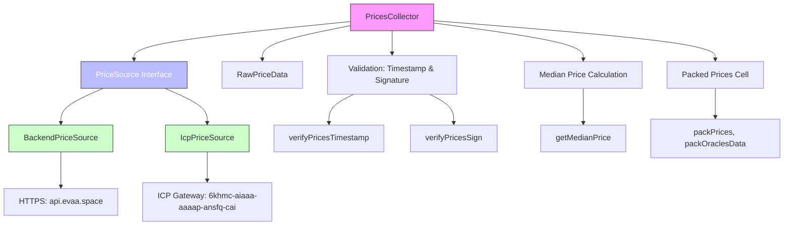
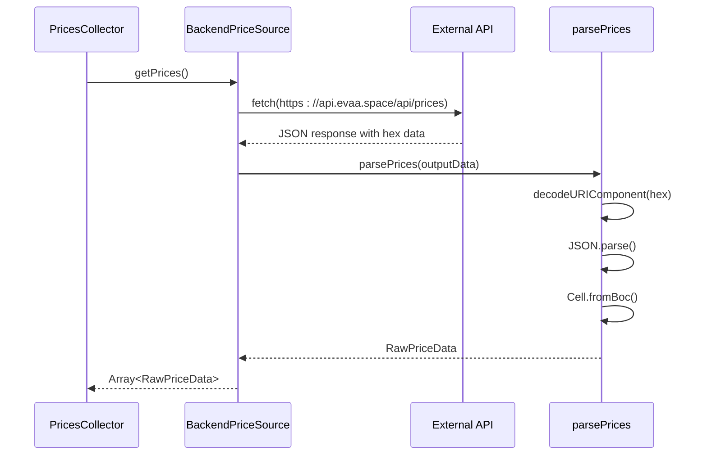
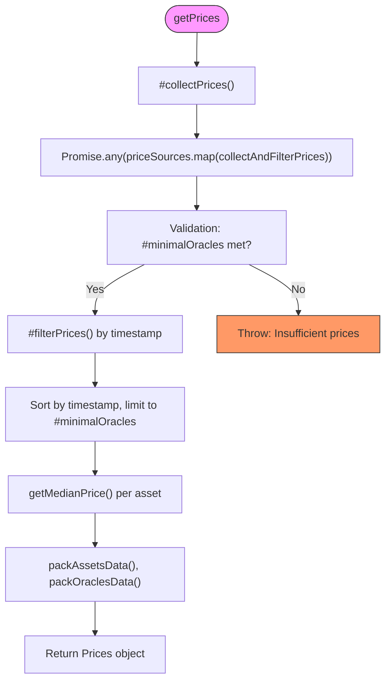
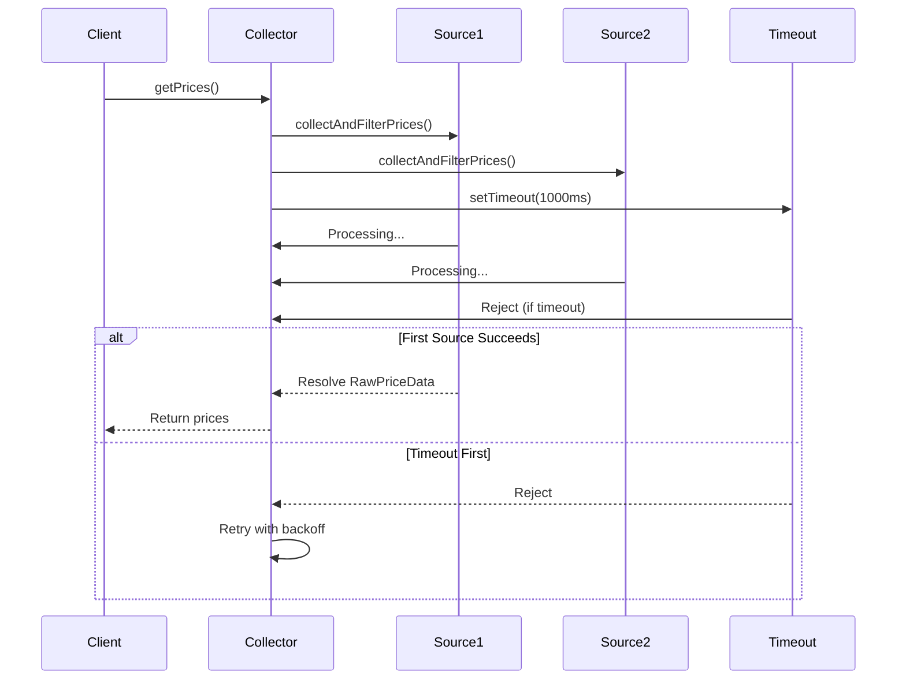

# Price Collection Mechanism


## Table of Contents
1. [Introduction](#introduction)
2. [Core Architecture Overview](#core-architecture-overview)
3. [Price Source Interface Contract](#price-source-interface-contract)
4. [Concrete Price Source Implementations](#concrete-price-source-implementations)
5. [PricesCollector: Orchestrating Multi-Source Fetching](#pricescollector-orchestrating-multi-source-fetching)
6. [Asynchronous Parallel Fetching and Timeout Handling](#asynchronous-parallel-fetching-and-timeout-handling)
7. [Configuration and Extensibility](#configuration-and-extensibility)
8. [Error Handling and Data Validation](#error-handling-and-data-validation)
9. [Performance and Resilience Considerations](#performance-and-resilience-considerations)

## Introduction
The EVAA SDK's price collection subsystem is designed to securely and reliably retrieve asset price data from multiple decentralized sources. This document details the architecture and implementation of the `PricesCollector`, which orchestrates various `PriceSource` implementations to fetch, validate, and aggregate raw price data from external APIs. The system emphasizes network resilience, fault tolerance, and extensibility, enabling integration with both centralized and decentralized oracle networks.

**Section sources**
- [PricesCollector.ts](file://src/prices/PricesCollector.ts#L1-L163)
- [PriceSource.ts](file://src/prices/sources/PriceSource.ts#L1-L35)

## Core Architecture Overview





**Diagram sources**
- [PricesCollector.ts](file://src/prices/PricesCollector.ts#L1-L163)
- [PriceSource.ts](file://src/prices/sources/PriceSource.ts#L1-L35)
- [Backend.ts](file://src/prices/sources/Backend.ts#L1-L64)
- [Icp.ts](file://src/prices/sources/Icp.ts#L1-L30)
- [utils.ts](file://src/prices/utils.ts#L1-L164)

## Price Source Interface Contract

The `PriceSource` abstract class defines a uniform contract for all price data providers. It ensures consistent behavior across different implementations by enforcing a standardized interface.


```typescript
abstract class PriceSource {
    protected priceSourceName: string;
    protected _endpoint: string;
    protected _nfts: ExtendedEvaaOracle[];

    constructor(endpoint: string, nfts: ExtendedEvaaOracle[]);

    get sourceName(): string;
    get endpoint(): string;
    get nfts(): ExtendedEvaaOracle[];
    set endpoint(endpoint: string);
    set nfts(nfts: ExtendedEvaaOracle[]);

    abstract getPrices(fetchConfig?: FetchConfig): Promise<RawPriceData[]>;
}
```


All concrete implementations must provide a `getPrices` method that returns an array of `RawPriceData`, which includes price dictionaries, signatures, public keys, timestamps, and oracle identifiers.

**Section sources**
- [PriceSource.ts](file://src/prices/sources/PriceSource.ts#L1-L35)

## Concrete Price Source Implementations

### BackendPriceSource
The `BackendPriceSource` retrieves price data from HTTPS endpoints such as `api.evaa.space`. It decodes hex-encoded JSON payloads containing BOC-serialized price cells, signatures, and public keys.





**Diagram sources**
- [Backend.ts](file://src/prices/sources/Backend.ts#L1-L64)
- [utils.ts](file://src/prices/utils.ts#L1-L164)

### IcpPriceSource
The `IcpPriceSource` extends `BackendPriceSource` to interface with Internet Computer Protocol (ICP) gateways. It uses a slightly different endpoint path (`/prices` instead of `/api/prices`) but maintains the same data format and parsing logic.


```typescript
class IcpPriceSource extends BackendPriceSource {
    protected priceSourceName: string = 'IcpPriceSource';

    async loadOracleData(fetchConfig: FetchConfig): Promise<OutputData[]> {
        // Uses https://${this._endpoint}/prices endpoint
        ...
    }
}
```


This inheritance pattern promotes code reuse while allowing endpoint customization.

**Section sources**
- [Icp.ts](file://src/prices/sources/Icp.ts#L1-L30)
- [Backend.ts](file://src/prices/sources/Backend.ts#L1-L64)

## PricesCollector: Orchestrating Multi-Source Fetching

The `PricesCollector` class serves as the central orchestrator for price data collection. It manages multiple `PriceSource` instances and aggregates their responses into a unified price feed.

### Constructor and Initialization

```typescript
constructor(config: PricesCollectorConfig) {
    this.#poolAssetsConfig = config.poolAssetsConfig;
    this.#sourcesConfig = config.sourcesConfig ?? DefaultPriceSourcesConfig;
    this.#priceSources = generatePriceSources(this.#sourcesConfig, config.evaaOracles);
    this.#minimalOracles = config.minimalOracles;
    if (config.additionalPriceSources) {
        this.#priceSources.push(...config.additionalPriceSources);
    }
}
```


The collector initializes with:
- **Pool asset configuration**: Defines supported assets
- **Minimal oracles threshold**: Minimum valid sources required
- **Source configuration**: Endpoint URLs for backend and ICP
- **Additional price sources**: Runtime-injectable custom sources

### Price Aggregation Workflow




**Diagram sources**
- [PricesCollector.ts](file://src/prices/PricesCollector.ts#L1-L163)
- [utils.ts](file://src/prices/utils.ts#L1-L164)

## Asynchronous Parallel Fetching and Timeout Handling

The system employs `Promise.any()` to execute requests to all price sources in parallel, succeeding as soon as the first source returns valid data.


```typescript
async #collectPrices(fetchConfig?: FetchConfig): Promise<boolean> {
    try {
        this.#prices = await Promise.any(
            this.#priceSources.map((x) => collectAndFilterPrices(x, this.#minimalOracles, fetchConfig)),
        );
        return true;
    } catch { }
    return false;
}
```


Each fetch operation includes:
- **Configurable timeout**: Default 1000ms via `AbortSignal.timeout()`
- **Retry mechanism**: Exponential backoff with up to 3 retries
- **Race condition**: Response vs timeout promise





**Diagram sources**
- [PricesCollector.ts](file://src/prices/PricesCollector.ts#L1-L163)
- [utils.ts](file://src/utils/utils.ts#L1-L53)

## Configuration and Extensibility

### Default Configuration

```typescript
export const DefaultPriceSourcesConfig: PriceSourcesConfig = {
    backendEndpoints: ['api.evaa.space', 'evaa.space'],
    icpEndpoints: ['6khmc-aiaaa-aaaap-ansfq-cai.raw.icp0.io'],
};
```


### Custom Source Injection
Users can inject custom price sources at runtime:

```typescript
const customCollector = new PricesCollector({
    poolAssetsConfig,
    minimalOracles: 3,
    evaaOracles,
    additionalPriceSources: [new CustomPriceSource("custom.api", oracles)]
});
```


This enables integration with private or experimental oracle networks without modifying core logic.

**Section sources**
- [Types.ts](file://src/prices/Types.ts#L1-L62)
- [PricesCollector.ts](file://src/prices/PricesCollector.ts#L1-L163)

## Error Handling and Data Validation

The system implements rigorous validation to ensure data integrity:

### Timestamp Validation
Prices older than `TTL_ORACLE_DATA_SEC` (120 seconds) are rejected:

```typescript
export function verifyPricesTimestamp() {
    return function(priceData: RawPriceData): boolean {
        const now = Date.now() / 1000;
        return now - priceData.timestamp < TTL_ORACLE_DATA_SEC;
    }
}
```


### Signature Verification
Ensures prices are signed by authorized oracles:

```typescript
export function verifyPricesSign(nfts: ExtendedEvaaOracle[]) {
    return function(priceData: RawPriceData): boolean {
        const isValidPubkey = nfts.some(x => x.pubkey.equals(priceData.pubkey));
        const isValidSignature = signVerify(message, priceData.signature, priceData.pubkey);
        return isValidPubkey && isValidSignature;
    }
}
```


### Fallback Behavior
- If no source succeeds, an error is thrown after retries
- If insufficient valid prices are collected, an error is thrown
- Empty asset lists return empty price dictionaries

**Section sources**
- [utils.ts](file://src/prices/utils.ts#L1-L164)
- [constants.ts](file://src/prices/constants.ts#L1)

## Performance and Resilience Considerations

### Latency Implications
- **Parallel fetching**: Reduces overall latency by querying all sources simultaneously
- **First-success strategy**: Response time determined by fastest healthy source
- **Timeout configuration**: Prevents hanging requests from blocking execution

### Network Resilience
- **Multiple endpoints**: Redundancy across different domains and networks
- **Retry mechanism**: Handles transient network failures
- **Decentralized sources**: Mix of HTTPS and ICP-based providers reduces single points of failure

### Optimization Opportunities
- **Caching**: Implement client-side caching to reduce redundant requests
- **Connection pooling**: Reuse HTTPS connections for repeated calls
- **Adaptive timeouts**: Adjust timeout based on network conditions

The price collection mechanism demonstrates a robust, extensible architecture that balances security, reliability, and performance in a decentralized finance context.

**Section sources**
- [PricesCollector.ts](file://src/prices/PricesCollector.ts#L1-L163)
- [utils.ts](file://src/prices/utils.ts#L1-L164)
- [utils.ts](file://src/utils/utils.ts#L1-L53)

**Referenced Files in This Document**   
- [PriceSource.ts](file://src/prices/sources/PriceSource.ts#L1-L35)
- [Backend.ts](file://src/prices/sources/Backend.ts#L1-L64)
- [Icp.ts](file://src/prices/sources/Icp.ts#L1-L30)
- [PricesCollector.ts](file://src/prices/PricesCollector.ts#L1-L163)
- [Types.ts](file://src/prices/Types.ts#L1-L62)
- [utils.ts](file://src/prices/utils.ts#L1-L164)
- [constants.ts](file://src/prices/constants.ts#L1)
- [utils.ts](file://src/utils/utils.ts#L1-L53)