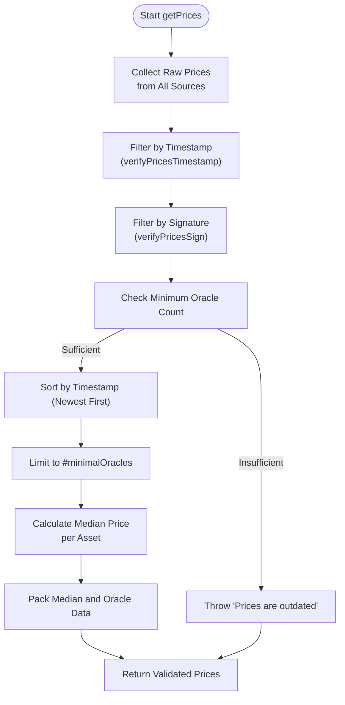

# Price Validation and Filtering


## Table of Contents
1. [Introduction](#introduction)
2. [Timestamp Validation and Freshness Check](#timestamp-validation-and-freshness-check)
3. [Outlier Detection and Data Filtering](#outlier-detection-and-data-filtering)
4. [Security Implications of Invalid Timestamps](#security-implications-of-invalid-timestamps)
5. [Handling Malformed and Delayed Price Scenarios](#handling-malformed-and-delayed-price-scenarios)
6. [Tuning Validation Thresholds for Network Conditions](#tuning-validation-thresholds-for-network-conditions)

## Introduction
The EVAA SDK implements a robust price validation and filtering mechanism to ensure the integrity and reliability of price data used in financial operations. This document details the architecture and logic behind the price validation layer, focusing on timestamp validation, outlier detection, and security safeguards. The system ensures only high-quality, timely, and authentic price data is used for critical operations such as liquidation, withdrawal, and supply calculations.

## Timestamp Validation and Freshness Check

The price validation system enforces strict timestamp freshness using a Time-To-Live (TTL) threshold defined in `constants.ts`. This threshold determines the maximum allowable age for price data before it is considered stale and rejected.

### TTL Configuration
The TTL for oracle data is set to 120 seconds, meaning any price data older than 2 minutes is automatically discarded:


```typescript
// File: src/prices/constants.ts
export const TTL_ORACLE_DATA_SEC = 120;
```


### Timestamp Validation Function
The `verifyPricesTimestamp()` function in `utils.ts` evaluates whether incoming price data falls within the acceptable time window. It compares the current system time with the timestamp embedded in the price data:


```typescript
// File: src/prices/utils.ts
export function verifyPricesTimestamp() {
    return function(priceData: RawPriceData): boolean {
        const timestamp = Date.now() / 1000;
        const pricesTime = priceData.timestamp;

        return timestamp - pricesTime < TTL_ORACLE_DATA_SEC;
    }
}
```


This function returns `true` if the price data is recent enough (within 120 seconds), allowing it to proceed through the validation pipeline. Otherwise, the data is filtered out.

### Integration in Price Collection
The `PricesCollector` class applies timestamp validation during the price collection phase. Before processing prices from any source, it filters out entries that fail the timestamp check:


```typescript
// File: src/prices/PricesCollector.ts
#filterPrices(): number {
    this.#prices = this.#prices.filter(verifyPricesTimestamp());
    return this.#prices.length;
}
```


Additionally, the `collectAndFilterPrices` utility function combines timestamp validation with signature verification to ensure both freshness and authenticity:


```typescript
// File: src/prices/utils.ts
export async function collectAndFilterPrices(priceSource: PriceSource, minimalOracles: number, fetchConfig?: FetchConfig ): Promise<RawPriceData[]> {
    const prices = await priceSource.getPrices(fetchConfig);
    const acceptedPrices: RawPriceData[] = prices.filter(
        price => verifyPricesTimestamp()(price) && verifyPricesSign(priceSource.nfts)(price)
    );

    if (acceptedPrices.length < minimalOracles) {
        throw new Error("Prices are outdated");
    }

    return acceptedPrices;
}
```


**Section sources**
- [constants.ts](file://src/prices/constants.ts#L1)
- [utils.ts](file://src/prices/utils.ts#L14-L25)
- [PricesCollector.ts](file://src/prices/PricesCollector.ts#L132-L148)

## Outlier Detection and Data Filtering

The system employs a multi-stage filtering process to eliminate outlier prices and ensure only reliable data contributes to the final median calculation.

### Median Price Calculation
After filtering stale and invalid data, the system computes the median price across all valid sources. The `getMedianPrice()` function sorts the valid prices and calculates the median value:


```typescript
// File: src/prices/utils.ts
export function getMedianPrice(pricesData: PriceData[], asset: bigint): bigint | null {
    try {
        const usingPrices = pricesData.filter(x => x.dict.has(asset));
        const sorted = usingPrices.map(x => x.dict.get(asset)!).sort((a, b) => Number(a) - Number(b));
        
        if (sorted.length == 0) {
            return null;
        }

        const mid = Math.floor(sorted.length / 2);
        if (sorted.length % 2 === 0) {
            return (sorted[mid - 1] + sorted[mid]) / 2n;
        } else {
            return sorted[mid];
        }
    }
    catch {
        return null;
    }
}
```


### Price Collection and Filtering Workflow
The `PricesCollector` orchestrates the entire price validation workflow. It collects prices from multiple sources, applies filtering, and ensures a minimum number of valid oracles contribute to the final result:





**Diagram sources**
- [utils.ts](file://src/prices/utils.ts#L104-L120)
- [PricesCollector.ts](file://src/prices/PricesCollector.ts#L26-L30)

**Section sources**
- [utils.ts](file://src/prices/utils.ts#L104-L120)
- [PricesCollector.ts](file://src/prices/PricesCollector.ts#L26-L30)

## Security Implications of Invalid Timestamps

Accepting invalid or manipulated timestamps could lead to serious security vulnerabilities, including:

- **Price Manipulation**: Attackers could replay old price data during market volatility to trigger liquidations or withdraw at favorable rates.
- **Front-Running**: Stale prices could be exploited to execute trades based on outdated information, gaining unfair advantages.
- **System Instability**: Inconsistent price data could cause incorrect risk calculations, leading to insolvency or cascading liquidations.

To mitigate these risks, the system implements multiple safeguards:

### Oracle Signature Verification
Each price data packet is cryptographically signed by authorized oracles. The system verifies these signatures to ensure data authenticity:


```typescript
// File: src/prices/utils.ts
export function verifyPricesSign(nfts: ExtendedEvaaOracle[]) {
    return function(priceData: RawPriceData): boolean {
        if (nfts.findIndex(x => x.pubkey.equals(priceData.pubkey as Uint8Array)) == -1) {
            return false;
        }
        return verifyRawPriceDataSign(priceData);
    }
}

export function verifyRawPriceDataSign(priceData: RawPriceData): boolean {
    const message = priceData.dataCell.refs[0].hash();
    const signature = priceData.signature;
    const publicKey = priceData.pubkey;
    return signVerify(message, signature, publicKey);
}
```


This ensures only data from trusted oracles is accepted, preventing spoofing attacks.

### Minimum Oracle Requirement
The system requires a minimum number of valid oracle responses (`minimalOracles`) before proceeding. This threshold prevents single-point failures and increases resilience against oracle compromise.

**Section sources**
- [utils.ts](file://src/prices/utils.ts#L143-L163)

## Handling Malformed and Delayed Price Scenarios

The system gracefully handles various edge cases and failure scenarios:

### Delayed Price Feeds
When price data is delayed beyond the TTL threshold, the system rejects it and attempts to collect from alternative sources. If insufficient valid data is available, it throws an error:


```typescript
// File: src/prices/PricesCollector.ts
async #collectPricesWithValidation(fetchConfig?: FetchConfig): Promise<void> {
    if (!this.#prices || this.#filterPrices() < this.#minimalOracles) {
        const success = await this.#collectPrices(fetchConfig);
        if (!success || this.#prices.length < this.#minimalOracles) {
            throw new Error(
                `Failed to collect sufficient prices: ${this.#prices?.length || 0} of ${this.#minimalOracles}`,
            );
        }
    }
}
```


### Empty or Zero Balances
For users with no debt or zero balances in certain assets, the system returns empty price data to avoid unnecessary calculations:


```typescript
// File: src/prices/PricesCollector.ts
async getPricesForWithdraw(realPrincipals: Dictionary<bigint, bigint>, withdrawAsset: PoolAssetConfig, collateralToDebt = false, fetchConfig?: FetchConfig): Promise<Prices> {
    if (checkNotInDebtAtAll(realPrincipals) && (realPrincipals.get(withdrawAsset.assetId) ?? 0n) > 0n && !collateralToDebt) {
        return new Prices(Dictionary.empty<bigint, bigint>(), Cell.EMPTY);
    }
    // ... rest of logic
}
```


### Missing Assets
If a user holds assets from a different pool, the system throws a clear error to prevent cross-pool contamination:


```typescript
const assets = this.#filterEmptyPrincipalsAndAssets(realPrincipals);
if (assets.includes(undefined)) {
    throw new Error("User from another pool");
}
```


**Section sources**
- [PricesCollector.ts](file://src/prices/PricesCollector.ts#L62-L98)

## Tuning Validation Thresholds for Network Conditions

The validation thresholds can be adjusted based on network conditions and operational requirements:

### Configurable Parameters
- **TTL_ORACLE_DATA_SEC**: Can be increased during network congestion or decreased for higher security requirements.
- **minimalOracles**: Can be adjusted based on the number of available oracle sources and desired fault tolerance.

### Recommendations
- **Mainnet Production**: Use default values (120 seconds TTL, 3+ oracles) for balanced security and availability.
- **High Volatility Periods**: Consider reducing TTL to 60 seconds for more responsive pricing.
- **Network Congestion**: Temporarily increase TTL to 180-240 seconds to maintain service availability.
- **Testnet/Development**: Use shorter TTL (30 seconds) for faster feedback during testing.

These thresholds should be monitored and adjusted based on oracle performance metrics and historical failure rates.

**Referenced Files in This Document**   
- [constants.ts](file://src/prices/constants.ts#L1)
- [utils.ts](file://src/prices/utils.ts#L14-L25)
- [PricesCollector.ts](file://src/prices/PricesCollector.ts#L132-L148)
- [utils.ts](file://src/prices/utils.ts#L104-L120)
- [PricesCollector.ts](file://src/prices/PricesCollector.ts#L26-L30)
- [utils.ts](file://src/prices/utils.ts#L143-L163)
- [PricesCollector.ts](file://src/prices/PricesCollector.ts#L62-L98)