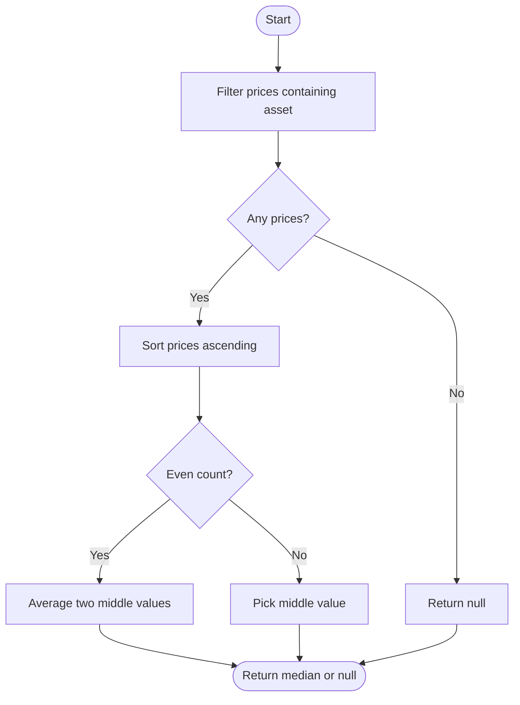
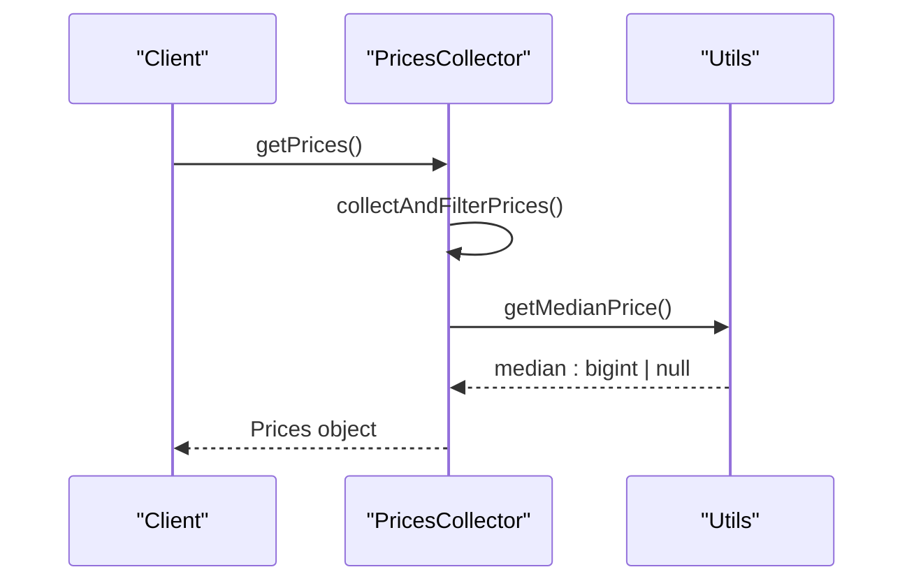

# Median Price Calculation


## Table of Contents
1. [Median Price Calculation Algorithm](#median-price-calculation-algorithm)
2. [Implementation Details](#implementation-details)
3. [Sorting and Median Logic](#sorting-and-median-logic)
4. [Precision and Arithmetic](#precision-and-arithmetic)
5. [Edge Case Handling](#edge-case-handling)
6. [Performance Characteristics](#performance-characteristics)
7. [Examples of Median Calculation](#examples-of-median-calculation)
8. [Trade-offs and Design Considerations](#trade-offs-and-design-considerations)
9. [Fallback and Error Behavior](#fallback-and-error-behavior)

## Median Price Calculation Algorithm

The EVAA SDK implements a robust median price calculation algorithm designed to enhance price stability and resist oracle manipulation. The core function, `getMedianPrice`, is located in `utils.ts` and operates on a list of price data from multiple oracle sources. By selecting the median value, the system effectively mitigates the impact of outliers and prevents single-point manipulation, which is critical in decentralized finance (DeFi) environments where price integrity is paramount.

This approach contrasts with simple averaging, which can be skewed by extreme values, and single-source pricing, which introduces centralization risk. The median provides a statistically robust estimate that reflects the consensus market price while maintaining resistance to adversarial inputs.

**Section sources**
- [src/prices/utils.ts](file://src/prices/utils.ts#L20-L45)

## Implementation Details

The `getMedianPrice` function takes two parameters: an array of `PriceData` objects and an `asset` identifier (as a `bigint`). Each `PriceData` object contains a dictionary (`dict`) mapping asset IDs to their respective prices, enabling efficient lookup.

The algorithm proceeds in three phases:
1. **Filtering**: Only price entries containing the requested asset are retained.
2. **Sorting**: Valid prices are extracted and sorted in ascending order.
3. **Median Selection**: The middle value (or average of two middle values for even-length lists) is returned.

The function is wrapped in a try-catch block to gracefully handle any unexpected errors, returning `null` if computation fails.


```typescript
export function getMedianPrice(pricesData: PriceData[], asset: bigint): bigint | null {
    try {
        const usingPrices = pricesData.filter(x => x.dict.has(asset));
        const sorted = usingPrices.map(x => x.dict.get(asset)!).sort((a, b) => Number(a) - Number(b));
        
        if (sorted.length == 0) {
            return null;
        }

        const mid = Math.floor(sorted.length / 2);
        if (sorted.length % 2 === 0) {
            return (sorted[mid - 1] + sorted[mid]) / 2n;
        } else {
            return sorted[mid];
        }
    }
    catch {
        return null;
    }
}
```


**Section sources**
- [src/prices/utils.ts](file://src/prices/utils.ts#L20-L45)

## Sorting and Median Logic

The sorting mechanism uses JavaScript's built-in `sort()` method with a numeric comparator `(a, b) => Number(a) - Number(b)`. Although the prices are stored as `bigint`, they are temporarily converted to numbers for comparison. This is safe because the price values are within the safe integer range for such comparisons.

For datasets with an odd number of elements, the median is the middle element at index `Math.floor(length / 2)`. For even-length datasets, the median is the arithmetic mean of the two central elements. This standard statistical definition ensures consistency and predictability.





**Diagram sources**
- [src/prices/utils.ts](file://src/prices/utils.ts#L20-L45)

## Precision and Arithmetic

The algorithm preserves precision by using `BigInt` arithmetic throughout. Prices are stored and processed as `bigint` values, avoiding floating-point inaccuracies that could arise from using `number` types. When computing the median for an even number of prices, the sum of the two middle values is divided by `2n` (the BigInt literal for 2), ensuring the result remains a `bigint` and maintains integer precision.

This is particularly important in blockchain contexts where exact value representation is required for financial calculations and smart contract interactions. The use of `bigint` aligns with TON blockchain's native numeric types and prevents rounding errors that could accumulate over time.

**Section sources**
- [src/prices/utils.ts](file://src/prices/utils.ts#L20-L45)

## Edge Case Handling

The algorithm includes comprehensive edge case handling:
- **Empty Input**: If no valid price sources contain the requested asset, the function returns `null`.
- **Single Source**: With one valid price, that value is returned directly as the median.
- **Even Count**: The average of the two central values is computed using integer arithmetic.
- **Runtime Errors**: Any unexpected exception (e.g., invalid data structure) is caught, and `null` is returned to prevent cascading failures.

These safeguards ensure the system remains resilient even under adverse conditions such as network failures or corrupted data.

**Section sources**
- [src/prices/utils.ts](file://src/prices/utils.ts#L20-L45)

## Performance Characteristics

The computational complexity of the median calculation is O(n log n), dominated by the sorting operation, where n is the number of valid price sources. In typical configurations, n is small (usually less than 10), making the performance overhead negligible.

The algorithm is optimized for the expected use case:
- **Time Complexity**: O(n log n) due to sorting
- **Space Complexity**: O(n) for storing the filtered and sorted price array
- **Latency**: Minimal, as operations are CPU-bound and involve small datasets

The `PricesCollector` class pre-filters and limits the number of oracle responses to `minimalOracles`, ensuring that the input size to `getMedianPrice` is bounded and predictable.





**Diagram sources**
- [src/prices/utils.ts](file://src/prices/utils.ts#L20-L45)
- [src/prices/PricesCollector.ts](file://src/prices/PricesCollector.ts#L100-L130)

## Examples of Median Calculation

### Example 1: Odd Number of Prices
**Input**: `[500n, 490n, 510n]`  
**Sorted**: `[490n, 500n, 510n]`  
**Median**: `500n` (middle value)

### Example 2: Even Number of Prices
**Input**: `[490n, 510n, 500n, 480n]`  
**Sorted**: `[480n, 490n, 500n, 510n]`  
**Median**: `(490n + 500n) / 2n = 495n` (average of two middle values)

### Example 3: Single Valid Source
**Input**: `[500n]`  
**Median**: `500n`

### Example 4: No Valid Sources
**Input**: `[]`  
**Median**: `null`

These examples demonstrate the algorithm's consistency across different scenarios.

**Section sources**
- [src/prices/utils.ts](file://src/prices/utils.ts#L20-L45)

## Trade-offs and Design Considerations

The median-based approach involves several key trade-offs:
- **Accuracy vs. Robustness**: While the median may not reflect the arithmetic mean, it provides superior resistance to outliers and manipulation.
- **Speed vs. Security**: Sorting adds computational overhead, but this is justified by the enhanced security against oracle attacks.
- **Simplicity vs. Flexibility**: The algorithm is simple and predictable, avoiding complex statistical methods that could introduce bugs.

Compared to averaging, medianization better handles scenarios where one oracle reports an extreme value due to error or attack. Unlike mode-based approaches, it works reliably even when all prices are distinct.

**Section sources**
- [src/prices/utils.ts](file://src/prices/utils.ts#L20-L45)

## Fallback and Error Behavior

When insufficient valid price sources are available (fewer than `minimalOracles`), the `PricesCollector` throws an error before `getMedianPrice` is even called. This prevents the system from operating on unreliable data.

Within `getMedianPrice`, if no price sources contain the requested asset, the function returns `null`. This null value propagates through the system, ultimately causing price-dependent operations to fail safely rather than proceed with invalid data.

The integration with `collectAndFilterPrices` ensures that only timestamp-valid and cryptographically verified price data is used, adding additional layers of data integrity checking before median calculation occurs.

**Section sources**
- [src/prices/utils.ts](file://src/prices/utils.ts#L20-L45)
- [src/prices/PricesCollector.ts](file://src/prices/PricesCollector.ts#L100-L130)

**Referenced Files in This Document**   
- [src/prices/utils.ts](file://src/prices/utils.ts#L20-L45)
- [src/prices/PricesCollector.ts](file://src/prices/PricesCollector.ts#L100-L130)
- [src/prices/Types.ts](file://src/prices/Types.ts#L53-L56)
- [tests/prices/utils.test.ts](file://tests/prices/utils.test.ts#L1-L35)