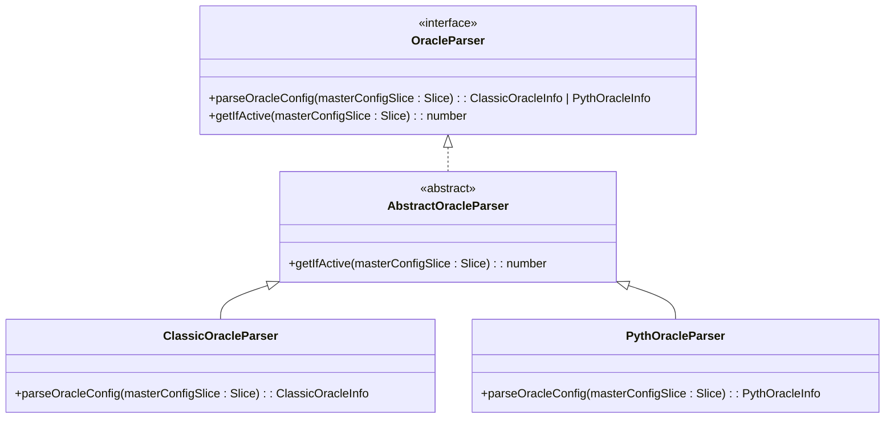
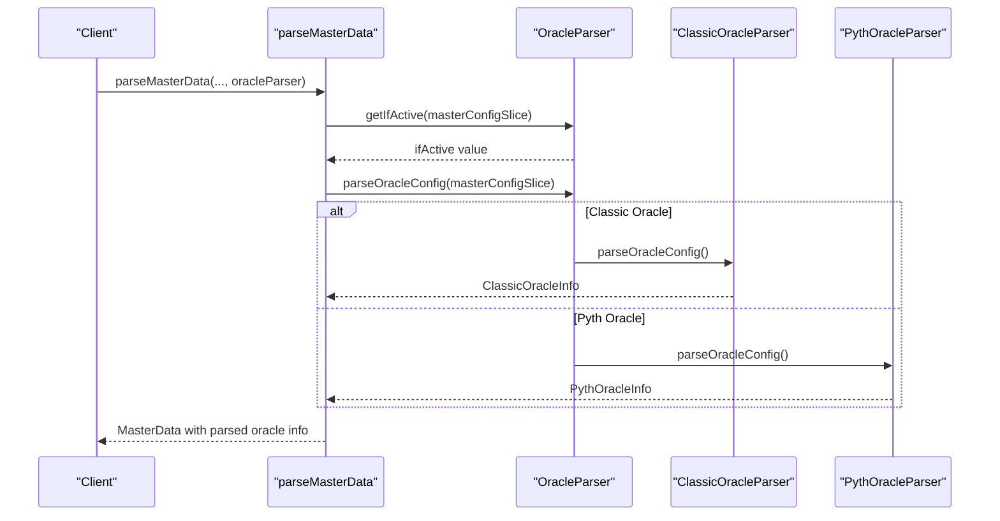

# Oracle Parsers and Format Handling


## Table of Contents
1. [Introduction](#introduction)
2. [Core Architecture](#core-architecture)
3. [AbstractOracleParser Interface](#abstractoracleparser-interface)
4. [ClassicOracleParser Implementation](#classicoracleparser-implementation)
5. [PythOracleParser Implementation](#pythoracleparser-implementation)
6. [Parser Routing and Integration](#parser-routing-and-integration)
7. [Data Flow and Transformation Examples](#data-flow-and-transformation-examples)
8. [Error Handling and Compatibility](#error-handling-and-compatibility)
9. [Extensibility Guidelines](#extensibility-guidelines)

## Introduction
This document provides a comprehensive overview of the oracle parser system used to interpret and normalize price data from different oracle implementations within the EVAA Finance protocol. The system is designed to abstract the parsing logic for various oracle formats, enabling seamless integration of new oracle types while maintaining a consistent interface for downstream components.

The primary responsibility of the oracle parser hierarchy is to extract configuration and pricing information from blockchain data structures (specifically TON Cells and Slices) and transform them into standardized, consumable formats. This enables the protocol to support multiple oracle providers—currently Classic and Pyth—without tightly coupling business logic to any specific oracle format.

## Core Architecture
The oracle parsing system follows a clean abstraction pattern based on the **Strategy Design Pattern**, where each oracle type has its own dedicated parser implementation that conforms to a shared interface. This architecture ensures extensibility, testability, and separation of concerns.





**Diagram sources**
- [AbstractOracleParser.ts](file://src/api/parsers/AbstractOracleParser.ts#L1-L16)
- [ClassicOracleParser.ts](file://src/api/parsers/ClassicOracleParser.ts#L1-L20)
- [PythOracleParser.ts](file://src/api/parsers/PythOracleParser.ts#L1-L34)

**Section sources**
- [AbstractOracleParser.ts](file://src/api/parsers/AbstractOracleParser.ts#L1-L16)
- [ClassicOracleParser.ts](file://src/api/parsers/ClassicOracleParser.ts#L1-L20)
- [PythOracleParser.ts](file://src/api/parsers/PythOracleParser.ts#L1-L34)

## AbstractOracleParser Interface
The `AbstractOracleParser` class serves as the foundational component of the oracle parsing system. It defines a contract that all concrete parser implementations must follow, ensuring consistency in how oracle data is extracted and interpreted.

### Key Components
- **OracleParser Interface**: Declares two essential methods:
  - `parseOracleConfig(masterConfigSlice: Slice)`: Extracts oracle-specific configuration data from a TON cell slice.
  - `getIfActive(masterConfigSlice: Slice)`: Determines whether the oracle is currently active.

- **Default Implementation**: The `getIfActive` method is implemented in the base class to read an 8-bit integer indicating the active status of the oracle.


```typescript
export interface OracleParser {
    parseOracleConfig(masterConfigSlice: Slice): ClassicOracleInfo | PythOracleInfo;
    getIfActive(masterConfigSlice: Slice): number;
}

export abstract class AbstractOracleParser implements OracleParser {
    abstract parseOracleConfig(masterConfigSlice: Slice): ClassicOracleInfo | PythOracleInfo;

    getIfActive(masterConfigSlice: Slice): number {
        return masterConfigSlice.loadInt(8);
    }
}
```


This abstraction allows higher-level components to interact with any oracle parser without knowing the underlying format, promoting loose coupling and easier maintenance.

**Section sources**
- [AbstractOracleParser.ts](file://src/api/parsers/AbstractOracleParser.ts#L1-L16)

## ClassicOracleParser Implementation
The `ClassicOracleParser` handles parsing logic for the legacy oracle system used in the protocol. It extracts information about a decentralized oracle network composed of multiple nodes.

### Data Structure
The parser returns a `ClassicOracleInfo` object containing:
- `numOracles`: Total number of registered oracles
- `threshold`: Minimum number of oracle responses required for consensus
- `oracles`: Reference to a cell containing individual oracle addresses (nullable)


```typescript
export type ClassicOracleInfo = {
    numOracles: number;
    threshold: number;
    oracles: Cell | null;
};
```


### Parsing Logic
The implementation assumes the input `Slice` contains a reference to another cell that holds the oracle configuration. It parses this referenced cell to extract:
1. A 16-bit unsigned integer for `numOracles`
2. A 16-bit unsigned integer for `threshold`
3. An optional reference to the list of oracle nodes via `loadMaybeMyRef`


```typescript
export class ClassicOracleParser extends AbstractOracleParser {
    parseOracleConfig(masterConfigSlice: Slice): ClassicOracleInfo {
        const oraclesSlice = masterConfigSlice.loadRef().beginParse();
        return {
            numOracles: oraclesSlice.loadUint(16),
            threshold: oraclesSlice.loadUint(16),
            oracles: loadMaybeMyRef(oraclesSlice),
        };
    }
}
```


This format suggests a simple quorum-based oracle system where price updates require agreement from at least `threshold` out of `numOracles`.

**Section sources**
- [ClassicOracleParser.ts](file://src/api/parsers/ClassicOracleParser.ts#L1-L20)

## PythOracleParser Implementation
The `PythOracleParser` is responsible for interpreting configuration data from the Pyth Network oracle integration. Pyth provides high-frequency, low-latency price feeds with cryptographic proofs.

### Data Structure
The parser returns a `PythOracleInfo` object which extends `OracleConfig` with additional execution parameters:
- `pythAddress`: Contract address of the Pyth network
- `feedsMap`: Dictionary mapping asset IDs to price feed identifiers (64-byte buffers)
- `allowedRefTokens`: Dictionary indicating which tokens can be used as reference assets
- `pricesTtl`: Time-to-live (in seconds) for price updates
- `pythComputeBaseGas`, `pythComputePerUpdateGas`, `pythSingleUpdateFee`: Gas and fee parameters for price updates


```typescript
export type OracleConfig = {
    pythAddress: Address;
    feedsMap: Dictionary<bigint, Buffer>;
    allowedRefTokens: Dictionary<bigint, bigint>;
};

export type PythOracleInfo = OracleConfig & {
    pricesTtl: number;
    pythComputeBaseGas: bigint;
    pythComputePerUpdateGas: bigint;
    pythSingleUpdateFee: bigint;
};
```


### Parsing Logic
The implementation navigates through nested cell references:
1. Loads a reference containing Pyth configuration
2. Extracts the `pythAddress`
3. Loads a secondary reference containing feed metadata
4. Parses dictionaries for `feedsMap` and `allowedRefTokens`
5. Reads TTL and gas/fee parameters


```typescript
export class PythOracleParser extends AbstractOracleParser {
    parseOracleConfig(masterConfigSlice: Slice): PythOracleInfo {
        const oraclesSlice = masterConfigSlice.loadRef().beginParse();
        const feedDataCell = oraclesSlice.loadRef();
        const feedDataSlice = feedDataCell.beginParse();

        return {
            pythAddress: oraclesSlice.loadAddress(),
            feedsMap: feedDataSlice.loadDict(Dictionary.Keys.BigUint(256), Dictionary.Values.Buffer(64)),
            allowedRefTokens: feedDataSlice.loadDict(Dictionary.Keys.BigUint(256), Dictionary.Values.BigUint(256)),
            pricesTtl: oraclesSlice.loadUint(32),
            pythComputeBaseGas: oraclesSlice.loadUintBig(64),
            pythComputePerUpdateGas: oraclesSlice.loadUintBig(64),
            pythSingleUpdateFee: oraclesSlice.loadUintBig(64),
        };
    }
}
```


This structure supports complex price feed configurations and allows dynamic mapping of assets to their respective Pyth price identifiers.

**Section sources**
- [PythOracleParser.ts](file://src/api/parsers/PythOracleParser.ts#L1-L34)

## Parser Routing and Integration
The actual routing of oracle data to the appropriate parser occurs in the `parseMasterData` function located in `parser.ts`. This function acts as the integration point between the generic parser interface and the rest of the system.

### Integration Workflow




**Diagram sources**
- [parser.ts](file://src/api/parser.ts#L1-L457)
- [AbstractOracleParser.ts](file://src/api/parsers/AbstractOracleParser.ts#L1-L16)

The `parseMasterData` function accepts an `oracleParser` instance as a parameter, allowing callers to inject the appropriate parser based on the oracle type in use. This dependency injection pattern makes the system highly flexible and testable.

Key steps in the integration:
1. Extract `masterConfigSlice` from the master contract BOC
2. Call `oracleParser.getIfActive()` to check oracle status
3. Call `oracleParser.parseOracleConfig()` to extract detailed configuration
4. Include the result in the returned `MasterData` object

This design decouples the parsing logic from the data retrieval and processing layers.

**Section sources**
- [parser.ts](file://src/api/parser.ts#L1-L457)

## Data Flow and Transformation Examples
### Example 1: Classic Oracle Payload
**Raw Input (Structure):**
- Reference to config cell
  - numOracles: 5 (uint16)
  - threshold: 3 (uint16)
  - oracles: Ref to list of 5 addresses

**Parsed Output:**

```json
{
  "numOracles": 5,
  "threshold": 3,
  "oracles": "CellRef(0xabc123...)"
}
```


### Example 2: Pyth Oracle Payload
**Raw Input (Structure):**
- Reference to Pyth config
  - pythAddress: EQA...
  - Reference to feed data
    - feedsMap: { 1: Buffer("feed1"), 2: Buffer("feed2") }
    - allowedRefTokens: { 1: 1, 2: 1 }
  - pricesTtl: 120
  - pythComputeBaseGas: 10000000
  - pythComputePerUpdateGas: 5000000
  - pythSingleUpdateFee: 1000000

**Parsed Output:**

```json
{
  "pythAddress": "EQA...",
  "feedsMap": { "1": "feed1", "2": "feed2" },
  "allowedRefTokens": { "1": 1, "2": 1 },
  "pricesTtl": 120,
  "pythComputeBaseGas": "10000000",
  "pythComputePerUpdateGas": "5000000",
  "pythSingleUpdateFee": "1000000"
}
```


These normalized structures are then used by price collectors and risk calculation modules to determine asset valuations and user health factors.

**Section sources**
- [ClassicOracleParser.ts](file://src/api/parsers/ClassicOracleParser.ts#L1-L20)
- [PythOracleParser.ts](file://src/api/parsers/PythOracleParser.ts#L1-L34)

## Error Handling and Compatibility
The parser system includes several mechanisms to handle malformed data and ensure backward compatibility:

### Error Prevention
- **Type Safety**: Strong typing via TypeScript interfaces prevents incorrect data access
- **Bounds Checking**: The `@ton/core` library automatically validates bit lengths when loading integers
- **Optional References**: Use of `loadMaybeRef` and `loadMaybeMyRef` prevents crashes on missing references

### Failure Modes
- If a required field is missing or corrupted, the `@ton/core` deserialization will throw an error
- Invalid dictionary formats will cause `loadDict` calls to fail
- Mismatched bit lengths will result in parsing exceptions

### Version Compatibility
The system supports versioning through:
- **Separate Parser Classes**: Each oracle type has its own parser, allowing independent evolution
- **Interface Contract**: As long as `parseOracleConfig` returns the expected structure, internal format changes are isolated
- **TTL Configuration**: The `pricesTtl` field in Pyth parser allows runtime adjustment of data freshness requirements

For future compatibility, it's recommended to:
- Never modify existing parser output structures
- Introduce new parser classes for major format changes
- Use optional fields for backward-compatible additions

**Section sources**
- [parser.ts](file://src/api/parser.ts#L1-L457)
- [PythOracleParser.ts](file://src/api/parsers/PythOracleParser.ts#L1-L34)
- [ClassicOracleParser.ts](file://src/api/parsers/ClassicOracleParser.ts#L1-L20)

## Extensibility Guidelines
To implement a new oracle parser for future oracle formats, follow these steps:

### Step 1: Define Output Structure
Create a TypeScript interface or type that represents the normalized oracle data:

```typescript
export type NewOracleInfo = {
    oracleAddress: Address;
    feedIds: Dictionary<bigint, Buffer>;
    updateInterval: number;
    // ... other fields
};
```


### Step 2: Implement Parser Class
Extend `AbstractOracleParser` and implement the `parseOracleConfig` method:


```typescript
export class NewOracleParser extends AbstractOracleParser {
    parseOracleConfig(masterConfigSlice: Slice): NewOracleInfo {
        const configSlice = masterConfigSlice.loadRef().beginParse();
        return {
            oracleAddress: configSlice.loadAddress(),
            feedIds: configSlice.loadDict(Dictionary.Keys.BigUint(256), Dictionary.Values.Buffer(32)),
            updateInterval: configSlice.loadUint(32),
        };
    }
}
```


### Step 3: Ensure Contract Compliance
Verify that:
- The class extends `AbstractOracleParser`
- The `parseOracleConfig` method returns the correct type
- All required fields are extracted from the slice
- Optional references are handled with `loadMaybeRef`

### Step 4: Integration
Pass an instance of your new parser to `parseMasterData` when processing contracts that use the new oracle type.

### Best Practices
- Keep parsing logic focused and minimal
- Avoid business logic within the parser
- Use descriptive field names in the output structure
- Document any assumptions about the input format
- Write unit tests using real or mocked BOC data

This extensibility model ensures that the protocol can adapt to new oracle technologies without disrupting existing functionality.

**Section sources**
- [AbstractOracleParser.ts](file://src/api/parsers/AbstractOracleParser.ts#L1-L16)
- [ClassicOracleParser.ts](file://src/api/parsers/ClassicOracleParser.ts#L1-L20)
- [PythOracleParser.ts](file://src/api/parsers/PythOracleParser.ts#L1-L34)

**Referenced Files in This Document**   
- [AbstractOracleParser.ts](file://src/api/parsers/AbstractOracleParser.ts#L1-L16)
- [ClassicOracleParser.ts](file://src/api/parsers/ClassicOracleParser.ts#L1-L20)
- [PythOracleParser.ts](file://src/api/parsers/PythOracleParser.ts#L1-L34)
- [parser.ts](file://src/api/parser.ts#L1-L457)