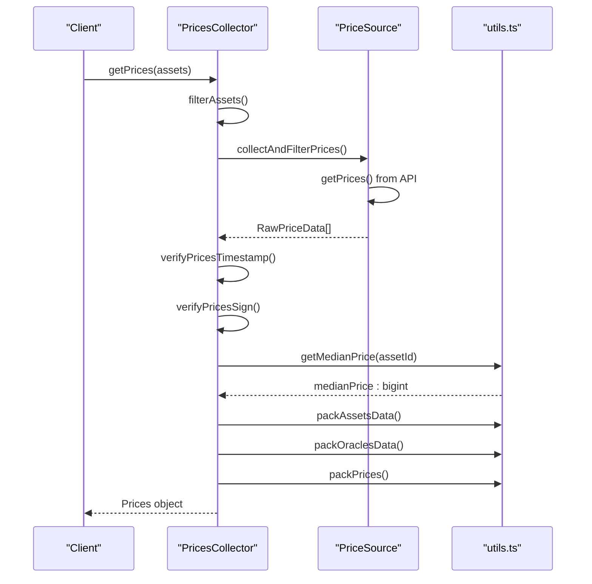
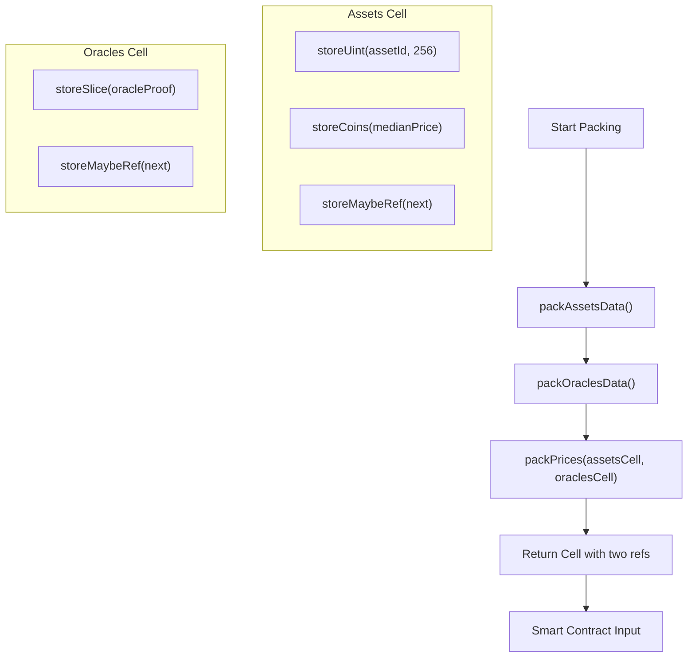

# Price Data Packing


## Table of Contents
1. [Introduction](#introduction)
2. [Core Components](#core-components)
3. [Price Data Flow and Processing Logic](#price-data-flow-and-processing-logic)
4. [Serialization Format and Cell Structure](#serialization-format-and-cell-structure)
5. [Final Packed Cell Construction](#final-packed-cell-construction)
6. [Gas Efficiency and Size Constraints](#gas-efficiency-and-size-constraints)
7. [Debugging and Verification Techniques](#debugging-and-verification-techniques)
8. [Tools for Inspecting Serialized Payloads](#tools-for-inspecting-serialized-payloads)

## Introduction
This document provides a comprehensive overview of the price data packing process in the EVAA protocol, focusing on how median prices are collected, validated, and serialized into TON blockchain cells for on-chain use. The system centers around the `PricesCollector.finalize()` method (implemented via `getPrices()`), which orchestrates the aggregation of price data from multiple oracles, computes medians, and packages the final payload using the `Prices` class and serialization utilities defined in `Types.ts` and `utils.ts`. The resulting cell structure is optimized for gas efficiency and consumed directly by smart contracts during operations such as liquidation, withdrawal, and supply.

The documentation explains the serialization format, including asset IDs, price values, timestamps, and oracle signatures encoded using TON's Cell builders. It includes examples of cell construction, byte layout insights, performance considerations, and debugging methods to verify correctness before submission.

## Core Components

The price data packing system relies on several key components:

- **`PricesCollector`**: Orchestrates price collection from various sources, validates timestamps and signatures, filters data, and computes median prices.
- **`Prices`**: Represents the final packed price data structure with dictionary access to median prices and a reference to the serialized cell.
- **`Types.ts`**: Defines core types like `RawPriceData`, `OraclePricesData`, and configuration interfaces.
- **`utils.ts`**: Contains critical serialization functions (`packAssetsData`, `packOraclesData`, `packPrices`) and validation logic.

These components work together to ensure secure, reliable, and efficient price data delivery to on-chain contracts.

**Section sources**
- [PricesCollector.ts](file://src/prices/PricesCollector.ts#L1-L163)
- [Prices.ts](file://src/prices/Prices.ts#L1-L31)
- [Types.ts](file://src/prices/Types.ts#L1-L62)
- [utils.ts](file://src/prices/utils.ts#L1-L164)

## Price Data Flow and Processing Logic

The price data flow begins when a client requests prices for specific assets via methods like `getPricesForLiquidate()` or `getPricesForWithdraw()`. The `PricesCollector` then performs the following steps:

1. **Asset Filtering**: Identifies relevant assets based on user principal balances.
2. **Price Collection**: Fetches raw price data from configured sources (backend, ICP, etc.) using `collectAndFilterPrices()`.
3. **Validation**: Ensures each price update is within the time-to-live (TTL) window and has valid cryptographic signatures.
4. **Median Calculation**: For each asset, computes the median price across all valid oracle reports.
5. **Data Packaging**: Serializes median prices and oracle data into nested Cell structures.





**Diagram sources**
- [PricesCollector.ts](file://src/prices/PricesCollector.ts#L70-L163)
- [utils.ts](file://src/prices/utils.ts#L50-L150)

**Section sources**
- [PricesCollector.ts](file://src/prices/PricesCollector.ts#L70-L163)
- [utils.ts](file://src/prices/utils.ts#L50-L150)

## Serialization Format and Cell Structure

The serialization format uses TON's `Cell` builder to encode structured binary data efficiently. Two main components are packed:

### Asset Median Prices
Each asset's median price is stored in a linked list of cells:
- **Asset ID**: Stored as a 256-bit unsigned integer (`storeUint(assetId, 256)`).
- **Median Price**: Stored as coins (`storeCoins(medianPrice)`), which uses variable-length encoding for compactness.
- **Next Reference**: Optional reference to the next asset-price pair (`storeMaybeRef()`).

This structure is built using `packAssetsData()`:


```typescript
function packAssetsData(assetsData: {assetId: bigint, medianPrice: bigint}[]): Cell {
    return assetsData.reduceRight(
        (acc: Cell | null, {assetId, medianPrice}) => beginCell()
            .storeUint(assetId, 256)
            .storeCoins(medianPrice)
            .storeMaybeRef(acc)
        .endCell(), 
        null
    )!;
}
```


#### Example Layout (3 assets):

```
Cell A → [assetId][price][ref → Cell B]
         Cell B → [assetId][price][ref → Cell C]
                  Cell C → [assetId][price][ref → null]
```


### Oracle Data with Signatures
Oracle data includes timestamp, pruned price dictionaries (via Merkle proofs), and signatures. Each oracle’s data is serialized as a `Slice` containing:
- Oracle ID (32-bit)
- Merkle proof of its price data
- Signature buffer

Multiple oracle entries are linked via `packOraclesData()` using `storeSlice()` and `storeMaybeRef()`.





**Diagram sources**
- [utils.ts](file://src/prices/utils.ts#L70-L110)

**Section sources**
- [utils.ts](file://src/prices/utils.ts#L70-L110)

## Final Packed Cell Construction

The final packed cell is constructed using `packPrices()`, which creates a cell containing two references:
- **First Reference**: The cell with median prices (`assetsDataCell`)
- **Second Reference**: The cell with oracle data proofs and signatures (`oraclesDataCell`)


```typescript
function packPrices(assetsDataCell: Cell, oraclesDataCell: Cell): Cell {
    return beginCell()
        .storeRef(assetsDataCell)
        .storeRef(oraclesDataCell)
    .endCell();
}
```


This two-ref structure allows smart contracts to easily parse both the usable price data and the verification metadata (signatures, timestamps) independently.

### Example Final Cell Layout:

```
Root Cell
├── Ref 0: Assets Cell
│   ├── [assetId][price][→ next]
│   └── ...
└── Ref 1: Oracles Cell
    ├── [slice(oracleId, proof, sig)][→ next]
    └── ...
```


Smart contracts can unpack this using `Slice` operations and dictionary parsing utilities.

**Section sources**
- [utils.ts](file://src/prices/utils.ts#L100-L110)

## Gas Efficiency and Size Constraints

The serialization design prioritizes gas efficiency and size constraints critical for blockchain operations:

- **Variable-Length Encoding**: Using `storeCoins()` for prices reduces byte size compared to fixed-width integers.
- **Merkle Proofs**: Oracle price dictionaries are pruned using Merkle proofs (`generateMerkleProofDirect`) to include only requested assets, minimizing data size.
- **Linked Lists**: Instead of arrays, linked cells reduce parsing complexity and avoid length prefix overhead.
- **Reference Chaining**: `storeMaybeRef()` enables dynamic-length collections without explicit size fields.

However, limitations exist:
- Maximum cell size is 1023 bytes; deep nesting or too many assets/oracles may exceed this.
- Each additional oracle increases signature and proof overhead (~100–200 bytes per oracle).
- High asset counts increase root cell references and traversal cost.

Best practices:
- Limit active assets per operation.
- Use minimal sufficient oracle count (`minimalOracles` config).
- Pre-filter irrelevant assets before calling `getPrices()`.

**Section sources**
- [utils.ts](file://src/prices/utils.ts#L120-L150)
- [PricesCollector.ts](file://src/prices/PricesCollector.ts#L100-L130)

## Debugging and Verification Techniques

To ensure correctness of packed data before submission, the following debugging techniques are recommended:

1. **Log Raw Price Data**: Enable debug logs in `collectAndFilterPrices()` to inspect incoming oracle data.
2. **Validate Timestamps**: Use `verifyPricesTimestamp()` to confirm all prices are fresh.
3. **Check Signatures**: `verifyRawPriceDataSign()` ensures oracle authenticity.
4. **Inspect Median Calculation**: Log inputs to `getMedianPrice()` to verify sorting and midpoint logic.
5. **Simulate Cell Parsing**: Use local TON SDK tools to parse the final cell and validate structure.

Example debug snippet:

```typescript
console.log("Median prices:", Array.from(dict.entries()));
console.log("Packed assets cell size:", assetsDataCell.bytes.length);
console.log("Packed oracles cell size:", oraclesDataCell.bytes.length);
```


Additionally, unit tests in `PriceCollector.test.ts` and `utils.test.ts` provide validation coverage for edge cases.

**Section sources**
- [utils.ts](file://src/prices/utils.ts#L10-L50)
- [PricesCollector.ts](file://src/prices/PricesCollector.ts#L140-L163)

## Tools for Inspecting Serialized Payloads

Developers can use the following tools and methods to inspect serialized price payloads:

- **`unpackMedianPrices(pricesCell)`**: Utility function that decodes a packed assets cell back into a dictionary for inspection.
- **TON CLI or SDK**: Parse cells using `Cell.fromBoc()` and traverse references manually.
- **Custom Inspector Script**:

```typescript
function inspectPricesCell(rootCell: Cell) {
    const slice = rootCell.beginParse();
    const assetsRef = slice.loadRef();
    const oraclesRef = slice.loadRef();

    console.log("Assets:", unpackMedianPrices(assetsRef));
    console.log("Oracle Count:", countCellRefs(oraclesRef));
}
```

- **Unit Testing**: Leverage existing test files like `PriceCollector.test.ts` to simulate packing under various conditions.

These tools help verify that the final payload matches expected values before on-chain submission.

**Section sources**
- [utils.ts](file://src/prices/utils.ts#L150-L164)
- [tests/prices/PriceCollector.test.ts](file://tests/prices/PriceCollector.test.ts)

**Referenced Files in This Document**   
- [PricesCollector.ts](file://src/prices/PricesCollector.ts)
- [Prices.ts](file://src/prices/Prices.ts)
- [Types.ts](file://src/prices/Types.ts)
- [utils.ts](file://src/prices/utils.ts)