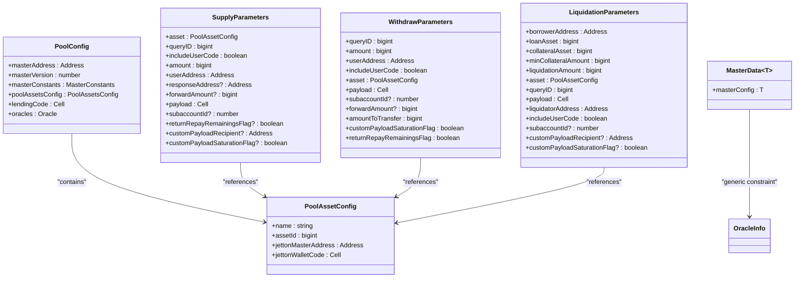

# Type Definitions & Interfaces


## Table of Contents
1. [Introduction](#introduction)
2. [Core Type Definitions](#core-type-definitions)
3. [Pool Configuration and Asset Structure](#pool-configuration-and-asset-structure)
4. [Transaction Parameter Interfaces](#transaction-parameter-interfaces)
5. [Master and Oracle Data Models](#master-and-oracle-data-models)
6. [Entity Relationships: Master, User, and Reward States](#entity-relationships-master-user-and-reward-states)
7. [Type Guards and Assertion Functions](#type-guards-and-assertion-functions)
8. [Data Flow and Synchronization Examples](#data-flow-and-synchronization-examples)
9. [Extending Types for Custom Integrations](#extending-types-for-custom-integrations)
10. [Version Compatibility and Breaking Changes](#version-compatibility-and-breaking-changes)
11. [Type Hierarchy and Composition Diagrams](#type-hierarchy-and-composition-diagrams)
12. [On-Chain Data Layout Mapping](#on-chain-data-layout-mapping)

## Introduction
The EVAA SDK utilizes a robust TypeScript type system to ensure type safety, improve developer experience, and accurately model on-chain data structures. This document provides comprehensive documentation of the core type definitions used across the SDK, focusing on interfaces that define pool configurations, transaction parameters, master contract data, and oracle integration. The types are designed to reflect the underlying smart contract data layouts while providing a developer-friendly abstraction layer for integration with decentralized finance (DeFi) applications on the TON blockchain.

**Section sources**
- [src/types/Master.ts](file://src/types/Master.ts#L20-L34)
- [src/contracts/AbstractMaster.ts](file://src/contracts/AbstractMaster.ts#L60-L126)

## Core Type Definitions
The EVAA SDK's type system centers around several key interfaces that define the structure of pools, assets, and transaction parameters. These types are used throughout the SDK to ensure consistency between off-chain logic and on-chain data.

### PoolAssetConfig
Defines the configuration for a single asset within a lending pool.

**Label Structure**
- `name`: string - Human-readable name of the asset
- `assetId`: bigint - Unique identifier for the asset within the protocol
- `jettonMasterAddress`: Address - Contract address of the Jetton master
- `jettonWalletCode`: Cell - Compiled code for the Jetton wallet contract

This interface is used to map assets like TON, USDT, or other jettons to their respective contract representations and identifiers within the EVAA ecosystem.

### PoolConfig
Represents the complete configuration of a lending pool.

**Label Structure**
- `masterAddress`: Address - Address of the Master contract managing the pool
- `masterVersion`: number - Version identifier for backward compatibility
- `masterConstants`: MasterConstants - Protocol-level constants (e.g., fee rates, liquidation thresholds)
- `poolAssetsConfig`: PoolAssetsConfig - Mapping of asset IDs to PoolAssetConfig objects
- `lendingCode`: Cell - Compiled bytecode for the lending logic
- `oracles`: Oracle - Oracle configuration for price feeds

This type serves as the foundational configuration object that initializes pool interactions within the SDK.

**Section sources**
- [src/types/Master.ts](file://src/types/Master.ts#L20-L34)

## Transaction Parameter Interfaces
These interfaces define the structured parameters required for various user operations within the EVAA protocol.

### SupplyParameters
Parameters required to supply assets to a lending pool.

**Label Structure**
- `asset`: PoolAssetConfig - The asset being supplied
- `queryID`: bigint - Unique identifier for tracking the transaction
- `includeUserCode`: boolean - Flag to include custom user logic
- `amount`: bigint - Amount of asset to supply (in nanotons or jetton units)
- `userAddress`: Address - Address of the supplying user
- `responseAddress?`: Address - Optional address for response messages
- `forwardAmount?`: bigint - Optional amount to forward with the operation
- `payload`: Cell - Additional data payload
- `subaccountId?`: number - Optional subaccount identifier for multi-account users
- `returnRepayRemainingsFlag?`: boolean - Flag to return excess repayment amounts
- `customPayloadRecipient?`: Address - Recipient for custom payloads
- `customPayloadSaturationFlag?`: boolean - Flag to control payload handling behavior

### WithdrawParameters
Parameters required to withdraw supplied assets from a pool.

**Label Structure**
- `queryID`: bigint - Unique transaction identifier
- `amount`: bigint - Amount to withdraw
- `userAddress`: Address - Address of the withdrawing user
- `includeUserCode`: boolean - Flag to include user-defined logic
- `asset`: PoolAssetConfig - Asset to withdraw
- `payload`: Cell - Additional operation data
- `subaccountId?`: number - Optional subaccount identifier
- `forwardAmount?`: bigint - Amount to forward with withdrawal
- `amountToTransfer`: bigint - Amount to transfer to user
- `customPayloadSaturationFlag`: boolean - Controls payload processing
- `returnRepayRemainingsFlag`: boolean - Determines handling of excess repayments

### LiquidationParameters
Parameters for liquidating undercollateralized positions.

**Label Structure**
- `borrowerAddress`: Address - Address of the borrower to be liquidated
- `loanAsset`: bigint - Asset ID of the borrowed asset
- `collateralAsset`: bigint - Asset ID of the collateral asset
- `minCollateralAmount`: bigint - Minimum collateral to seize
- `liquidationAmount`: bigint - Amount of debt to repay
- `asset`: PoolAssetConfig - Configuration of the asset being liquidated
- `queryID`: bigint - Transaction tracking identifier
- `payload`: Cell - Additional data for the operation
- `liquidatorAddress`: Address - Address performing the liquidation
- `includeUserCode`: boolean - Flag for custom logic inclusion
- `subaccountId?`: number - Optional subaccount identifier
- `customPayloadRecipient?`: Address - Target for custom payloads
- `customPayloadSaturationFlag?`: boolean - Payload handling behavior flag

These parameter interfaces ensure type-safe construction of transaction payloads and provide clear documentation of required fields for each operation.

**Section sources**
- [src/contracts/AbstractMaster.ts](file://src/contracts/AbstractMaster.ts#L60-L95)
- [src/contracts/AbstractMaster.ts](file://src/contracts/AbstractMaster.ts#L111-L126)

## Master and Oracle Data Models
The Master contract serves as the central coordinator in the EVAA protocol, and its data model reflects this role.

### MasterData
Generic interface representing the complete state of a Master contract.

**Label Structure**
- `BaseMasterData`: Inherited base properties (e.g., timestamps, status flags)
- `masterConfig`: T - Generic configuration object constrained by MasterConfig<OracleInfo>

This type uses generics to accommodate different oracle configurations while maintaining a consistent base structure.

### OracleInfo
Union type representing different oracle implementations supported by the protocol.

**Label Structure**
- `PythOracleInfo | ClassicOracleInfo` - Discriminated union of oracle types

This allows the SDK to handle both Pyth Network-based price feeds and the protocol's classic oracle system within a unified interface.

**Section sources**
- [src/contracts/AbstractMaster.ts](file://src/contracts/AbstractMaster.ts#L153)
- [src/contracts/AbstractMaster.ts](file://src/contracts/AbstractMaster.ts#L174-L176)

## Entity Relationships: Master, User, and Reward States
The EVAA SDK models three primary state entities that interact within the lending protocol.

### Master State
The Master contract maintains global pool state including:
- Total supplied and borrowed amounts per asset
- Interest rate models
- Risk parameters and liquidation thresholds
- Oracle price feeds
- User position summaries

### User State
Each user has a state tracked by the protocol that includes:
- Supply balances across assets
- Borrow positions and accrued interest
- Health factor and liquidation risk
- Subaccount configurations
- Reward accruals

### Reward States
The reward system is modeled in separate interfaces:
- `MasterRewards`: Tracks global reward distribution parameters
- `UserRewards`: Tracks individual user reward balances and claim history
- Reward distribution is calculated based on supply/borrow activity and time-weighted balances

These states are interconnected: user actions affect master state, and both influence reward calculations. The type system ensures proper typing when accessing or modifying these related states.

**Section sources**
- [src/types/Master.ts](file://src/types/Master.ts)
- [src/types/User.ts](file://src/types/User.ts)
- [src/types/MasterRewards.ts](file://src/types/MasterRewards.ts)
- [src/types/UserRewards.ts](file://src/types/UserRewards.ts)

## Type Guards and Assertion Functions
The SDK employs type guards to ensure runtime type safety when dealing with union types and external data.

### Purpose of Type Guards
Type guards are functions that perform runtime checks to narrow union types. For example:


```typescript
function isPythOracleInfo(info: OracleInfo): info is PythOracleInfo {
    return 'pythContract' in info;
}
```


This allows TypeScript to infer the correct type after the guard check, enabling safe access to Pyth-specific properties.

### Assertion Functions
The SDK uses assertion functions to validate data shape at runtime:


```typescript
function assertSupplyParameters(params: unknown): asserts params is SupplyParameters {
    if (!isObject(params)) throw new Error('Invalid params');
    // validate required fields
}
```


These functions provide both runtime validation and type narrowing in TypeScript, ensuring that data conforms to expected interfaces before processing.

**Section sources**
- [src/contracts/AbstractMaster.ts](file://src/contracts/AbstractMaster.ts)
- [src/prices/Oracle.interface.ts](file://src/prices/Oracle.interface.ts)

## Data Flow and Synchronization Examples
### getSync() Method Output
The `getSync()` method returns synchronized pool state data:


```typescript
{
    poolConfig: PoolConfig,
    prices: Record<bigint, bigint>, // assetId -> price in USD (scaled)
    totalSupply: Record<bigint, bigint>,
    totalBorrow: Record<bigint, bigint>,
    lastUpdated: number // timestamp
}
```


### Price Collection Output
Price collection methods return structured oracle data:


```typescript
{
    assetId: 1n,
    price: 2.15e8, // $2.15 with 8 decimals
    confidence: 0.05e8,
    publishTime: 1701234567,
    source: 'pyth'
}
```


These data structures are optimized for efficient processing and display in dApp interfaces, with consistent scaling conventions across all numeric values.

**Section sources**
- [src/prices/PricesCollector.ts](file://src/prices/PricesCollector.ts)
- [src/prices/Types.ts](file://src/prices/Types.ts)

## Extending Types for Custom Integrations
Developers can extend the SDK's types for custom use cases:

### Interface Extension

```typescript
interface ExtendedPoolConfig extends PoolConfig {
    customMetadata: {
        displayName: string;
        iconUrl: string;
        riskRating: number;
    };
}
```


### Generic Specialization

```typescript
type MyMasterData = MasterData<MyCustomConfig>;
```


When extending types, developers should:
1. Avoid modifying existing interfaces directly
2. Use composition over inheritance when possible
3. Maintain numeric scaling conventions
4. Preserve required fields for contract interaction
5. Document custom extensions thoroughly

This approach ensures compatibility with future SDK updates while allowing necessary customization.

**Section sources**
- [src/types/Master.ts](file://src/types/Master.ts)
- [src/contracts/AbstractMaster.ts](file://src/contracts/AbstractMaster.ts)

## Version Compatibility and Breaking Changes
The type system incorporates versioning to manage compatibility:

### Version Indicators
- `masterVersion` field in PoolConfig indicates contract version
- Major version changes typically accompany breaking changes
- The SDK maintains backward compatibility for at least two major versions

### Breaking Change Patterns
Common breaking changes include:
- Removal of deprecated fields (e.g., `responseAddress` in favor of standardized patterns)
- Type tightening (e.g., changing optional fields to required)
- Structural reorganization of nested objects
- Oracle interface changes between major versions

The SDK uses discriminant properties (like `masterVersion`) in union types to enable safe type narrowing and version-specific handling.

**Section sources**
- [src/types/Master.ts](file://src/types/Master.ts#L27-L34)
- [src/contracts/AbstractMaster.ts](file://src/contracts/AbstractMaster.ts)

## Type Hierarchy and Composition Diagrams




**Diagram sources**
- [src/types/Master.ts](file://src/types/Master.ts#L20-L34)
- [src/contracts/AbstractMaster.ts](file://src/contracts/AbstractMaster.ts#L60-L126)

## On-Chain Data Layout Mapping
The TypeScript interfaces directly correspond to on-chain data structures:

### Serialization Alignment
- `bigint` types map to TON's 256-bit integers
- `Address` types correspond to TON standard addresses
- `Cell` types represent serialized data structures in TON VM
- Object properties align with contract storage layout

### Scaling Conventions
- Prices use 8 decimal places (e.g., $1.00 = 100000000)
- Rates use 9 decimal places for precision
- All amounts are in base units (e.g., nanotons, jetton nanounits)

This precise mapping ensures that off-chain calculations and on-chain operations maintain consistency, preventing rounding errors and balance discrepancies.

**Section sources**
- [src/types/Master.ts](file://src/types/Master.ts)
- [src/contracts/AbstractMaster.ts](file://src/contracts/AbstractMaster.ts)
- [src/prices/Types.ts](file://src/prices/Types.ts)

**Referenced Files in This Document**   
- [src/types/Master.ts](file://src/types/Master.ts)
- [src/contracts/AbstractMaster.ts](file://src/contracts/AbstractMaster.ts)
- [src/prices/Oracle.interface.ts](file://src/prices/Oracle.interface.ts)
- [src/types/User.ts](file://src/types/User.ts)
- [src/types/MasterRewards.ts](file://src/types/MasterRewards.ts)
- [src/types/UserRewards.ts](file://src/types/UserRewards.ts)
- [src/constants/pools/mainnet.ts](file://src/constants/pools/mainnet.ts)
- [src/constants/assets/mainnet.ts](file://src/constants/assets/mainnet.ts)