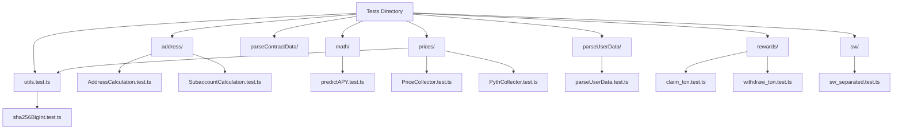
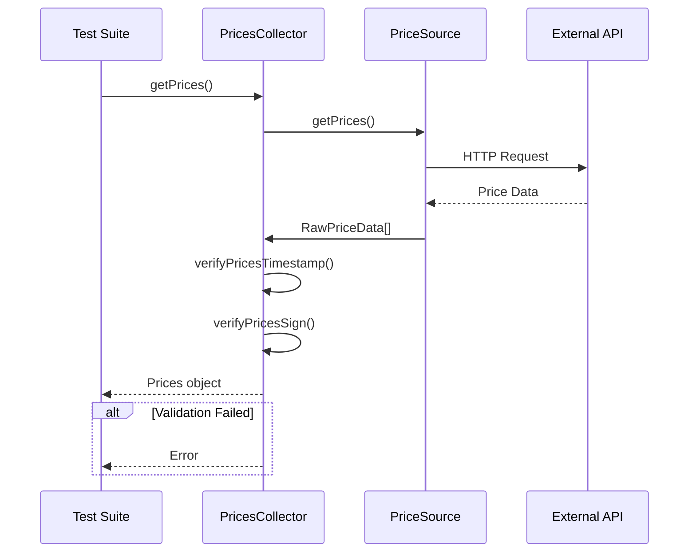

# Testing & Debugging


## Table of Contents
1. [Running Unit Tests](#running-unit-tests)
2. [Test Structure and Organization](#test-structure-and-organization)
3. [Writing Integration Tests](#writing-integration-tests)
4. [Debug Mode and Logging](#debug-mode-and-logging)
5. [Error Handling and Transaction Reverts](#error-handling-and-transaction-reverts)
6. [Mocking Price Sources and Contract Responses](#mocking-price-sources-and-contract-responses)
7. [Network-Specific Testing Considerations](#network-specific-testing-considerations)
8. [Troubleshooting Common Issues](#troubleshooting-common-issues)
9. [Monitoring and Production Best Practices](#monitoring-and-production-best-practices)

## Running Unit Tests

The EVAA SDK uses Jest as its primary testing framework, configured through the `jest.config.js` file located in the project root. To execute unit tests, developers can use either of the following commands:

- `npm test`
- `yarn test`

These commands trigger Jest to run all test files matching the pattern `**/?(*.)+(spec|test).ts` within the `tests/` directory.

The Jest configuration includes several key settings:
- **rootDir**: Set to `./tests`, indicating the base directory for test execution
- **preset**: Uses `ts-jest` to enable TypeScript support
- **testEnvironment**: Configured as `node` for backend testing
- **testTimeout**: Extended to nearly 3 million milliseconds (approximately 166 minutes) to accommodate long-running integration scenarios
- **verbose**: Enabled to provide detailed test output
- **silent**: Disabled to ensure all console logs are visible during test runs

This configuration ensures robust test execution with comprehensive logging and sufficient timeout margins for network-dependent operations.

**Section sources**
- [jest.config.js](file://jest.config.js#L1-L10)

## Test Structure and Organization

The test suite is organized into logical categories based on functionality, with tests located in the `tests/` directory. Each category corresponds to specific aspects of the SDK's operation.

### Address Calculation Tests
Located in `tests/address/`, these tests validate address derivation logic:
- `AddressCalculation.test.ts`: Verifies correct generation of master contract addresses
- `SubaccountCalculation.test.ts`: Ensures proper subaccount address computation

### Math Operations
The `tests/math/` directory contains mathematical validation:
- `predictAPY.test.ts`: Tests APY prediction algorithms used in yield calculations

### Price Collection Tests
Price-related functionality is tested in `tests/prices/`:
- `PriceCollector.test.ts`: Validates multi-source price aggregation
- `PythCollector.test.ts`: Tests Pyth Network price integration
- `utils.test.ts`: Covers utility functions for price processing

### Supply-Withdraw Workflows
Multiple test files validate supply and withdraw operations:
- `supply_classic_test.ts`, `supply_withdraw_test.ts`: Classic oracle-based supply logic
- `withdraw_pyth_test.ts`, `suppy_pyth_test.ts`: Pyth oracle-based operations
- `sw_separated.test.ts`: End-to-end supply-withdraw scenarios

### User Data Parsing
Located in `tests/parseUserData/`:
- `parseUserData.test.ts`: Validates user data deserialization from blockchain

### Reward Operations
In `tests/rewards/`:
- `claim_ton.test.ts`, `withdraw_ton.test.ts`: Tests TON reward claiming and withdrawal

### Utility Functions
Various utility validations:
- `sha256BigInt.test.ts`: Confirms cryptographic hash correctness





**Diagram sources**
- [AddressCalculation.test.ts](file://tests/address/AddressCalculation.test.ts)
- [SubaccountCalculation.test.ts](file://tests/address/SubaccountCalculation.test.ts)
- [predictAPY.test.ts](file://tests/math/predictAPY.test.ts)
- [PriceCollector.test.ts](file://tests/prices/PriceCollector.test.ts)
- [PythCollector.test.ts](file://tests/prices/PythCollector.test.ts)
- [parseUserData.test.ts](file://tests/parseUserData/parseUserData.test.ts)
- [claim_ton.test.ts](file://tests/rewards/claim_ton.test.ts)
- [withdraw_ton.test.ts](file://tests/rewards/withdraw_ton.test.ts)
- [sw_separated.test.ts](file://tests/sw/sw_separated.test.ts)
- [sha256BigInt.test.ts](file://tests/utils/sha256BigInt.test.ts)

**Section sources**
- [AddressCalculation.test.ts](file://tests/address/AddressCalculation.test.ts)
- [predictAPY.test.ts](file://tests/math/predictAPY.test.ts)
- [PriceCollector.test.ts](file://tests/prices/PriceCollector.test.ts)
- [parseUserData.test.ts](file://tests/parseUserData/parseUserData.test.ts)
- [claim_ton.test.ts](file://tests/rewards/claim_ton.test.ts)
- [sw_separated.test.ts](file://tests/sw/sw_separated.test.ts)
- [sha256BigInt.test.ts](file://tests/utils/sha256BigInt.test.ts)

## Writing Integration Tests

Integration tests should be written to validate custom logic that interacts with the EVAA SDK. The primary integration points include price collection, user data parsing, and transaction execution.

When writing integration tests, follow these patterns:

1. **Initialize Price Collectors**: Create instances of `PricesCollector` or `PythCollector` with test configurations
2. **Mock Dependencies**: Use Jest's mocking capabilities to simulate network responses
3. **Validate Data Flow**: Ensure data moves correctly between SDK components

Example integration test structure:

```typescript
import { PricesCollector } from '../src/prices/PricesCollector';
import { PoolAssetsConfig } from '../src/types/Master';

describe('Custom Price Integration', () => {
  let collector: PricesCollector;
  const mockAssets: PoolAssetsConfig = [
    { assetId: 1n, symbol: 'TEST', decimals: 9 }
  ];

  beforeEach(() => {
    collector = new PricesCollector({
      poolAssetsConfig: mockAssets,
      minimalOracles: 1,
      evaaOracles: []
    });
  });

  it('should collect prices for custom assets', async () => {
    const prices = await collector.getPrices(mockAssets);
    expect(prices.dict.size).toBeGreaterThan(0);
  });
});
```


Key considerations:
- Use real asset configurations from `src/constants/assets/`
- Test edge cases like empty principal dictionaries
- Validate error handling for invalid inputs

**Section sources**
- [PricesCollector.ts](file://src/prices/PricesCollector.ts#L1-L164)
- [PythCollector.ts](file://src/prices/PythCollector.ts#L1-L216)
- [Prices.ts](file://src/prices/Prices.ts#L1-L32)

## Debug Mode and Logging

The EVAA SDK includes comprehensive logging capabilities for debugging purposes. While explicit debug mode configuration isn't visible in the provided code, several logging mechanisms are implemented:

1. **Console Debugging**: Multiple commented `console.debug()` statements exist throughout the codebase, particularly in:
   - `src/prices/utils.ts`: Price verification and filtering
   - `src/prices/sources/Backend.ts`: Price source parsing

2. **Error Propagation**: The SDK throws descriptive errors for various failure conditions:
   - "User from another pool" when asset ownership is invalid
   - "Not enough price data" when insufficient oracles respond
   - "Missing prices for X asset(s)" in Pyth integration

3. **Validation Feedback**: Functions like `verifyPricesTimestamp()` and `verifyPricesSign()` provide implicit debugging through their return values and exception handling.

To enable debugging, uncomment the `console.debug()` statements in the source files or extend the classes to expose additional logging.





**Diagram sources**
- [PricesCollector.ts](file://src/prices/PricesCollector.ts#L1-L164)
- [utils.ts](file://src/prices/utils.ts#L1-L165)
- [Backend.ts](file://src/prices/sources/Backend.ts#L1-L65)

**Section sources**
- [PricesCollector.ts](file://src/prices/PricesCollector.ts#L1-L164)
- [utils.ts](file://src/prices/utils.ts#L1-L165)
- [Backend.ts](file://src/prices/sources/Backend.ts#L1-L65)

## Error Handling and Transaction Reverts

The SDK implements robust error handling for various failure scenarios:

### Common Error Types

**Price Collection Failures**
- `"Error per updating prices, valid X of Y"`: Insufficient valid oracle responses
- `"Prices are outdated"`: Price data exceeds TTL (Time To Live)
- `"Failed to collect sufficient prices"`: Network issues preventing data aggregation

**Asset Validation Errors**
- `"User from another pool"`: Attempting to access assets from incorrect pool
- `"Cannot debt only one supplied asset"`: Invalid collateral-to-debt configuration
- `"Missing prices for X asset(s)"`: Required price feeds unavailable

**Signature Verification Failures**
- `"nft not found"`: Oracle public key not recognized
- Invalid signature detected during price verification

### Transaction Revert Prevention

The SDK prevents transaction reverts by:
1. **Pre-validation**: Checking conditions before price collection
2. **Empty Responses**: Returning empty `Prices` objects when no debt exists
3. **Input Sanitization**: Filtering empty principals before processing

Example from `PricesCollector.getPricesForWithdraw()`:

```typescript
if (checkNotInDebtAtAll(realPrincipals) && 
    (realPrincipals.get(withdrawAsset.assetId) ?? 0n) > 0n && 
    !collateralToDebt) {
    return new Prices(Dictionary.empty<bigint, bigint>(), Cell.EMPTY);
}
```


This prevents unnecessary price collection when no debt exists, avoiding potential reverts.

**Section sources**
- [PricesCollector.ts](file://src/prices/PricesCollector.ts#L1-L164)
- [PythCollector.ts](file://src/prices/PythCollector.ts#L1-L216)
- [utils.ts](file://src/prices/utils.ts#L1-L165)

## Mocking Price Sources and Contract Responses

Effective testing requires mocking external dependencies. The SDK's architecture supports several mocking strategies:

### Price Source Mocking

Create mock implementations of `PriceSource` interface:


```typescript
class MockPriceSource extends PriceSource {
  async getPrices(): Promise<RawPriceData[]> {
    return [{
      dict: mockDict,
      dataCell: Cell.EMPTY,
      oracleId: 1,
      signature: Buffer.from('mocksig'),
      pubkey: Buffer.from('mockpubkey'),
      timestamp: Math.floor(Date.now() / 1000)
    }];
  }
}
```


### Network Response Mocking

Use Jest to mock `fetch` operations:


```typescript
global.fetch = jest.fn(() =>
  Promise.resolve({
    json: () => Promise.resolve(mockPriceData),
    ok: true
  })
);
```


### Contract Response Mocking

Mock TON blockchain interactions by:
1. Creating mock `Dictionary` objects for principal balances
2. Simulating `Cell` structures for price data
3. Using `ton-core` mock utilities

The `proxyFetchRetries` utility in `src/utils/utils.ts` can be mocked to control retry behavior during tests.

**Section sources**
- [PriceSource.ts](file://src/prices/sources/PriceSource.ts)
- [Backend.ts](file://src/prices/sources/Backend.ts#L1-L65)
- [Icp.ts](file://src/prices/sources/Icp.ts#L1-L31)
- [utils.ts](file://src/prices/utils.ts#L1-L165)

## Network-Specific Testing Considerations

Testing differs significantly between mainnet and testnet environments:

### Configuration Differences

The SDK uses different configuration files:
- `src/constants/assets/mainnet.ts`: Mainnet asset configurations
- `src/constants/assets/testnet.ts`: Testnet asset configurations
- `src/constants/pools/mainnet.ts`: Mainnet pool settings
- `src/constants/pools/testnet.ts`: Testnet pool settings

### Price Source Endpoints

Different endpoints are used for price collection:
- **Mainnet**: `api.evaa.space`, `evaa.space`
- **Testnet**: May use staging endpoints (not explicitly defined)

### Oracle Configurations

Oracles are configured differently:
- Mainnet uses production oracles with valid signatures
- Testnet may use mock oracles with simplified verification

### Testing Strategy

1. **Unit Tests**: Run identically on both networks
2. **Integration Tests**: Use mocked endpoints regardless of network
3. **End-to-End Tests**: Should be run separately for each network

The `DefaultPriceSourcesConfig` in `Types.ts` defines the default endpoints used in testing.

**Section sources**
- [mainnet.ts](file://src/constants/assets/mainnet.ts)
- [testnet.ts](file://src/constants/assets/testnet.ts)
- [Types.ts](file://src/prices/Types.ts#L1-L63)
- [PricesCollector.ts](file://src/prices/PricesCollector.ts#L1-L164)

## Troubleshooting Common Issues

### Price Collection Failures

**Symptoms**: "Error per updating prices" or "Prices are outdated"

**Solutions**:
1. Verify network connectivity to price endpoints
2. Check system clock synchronization (timestamp validation)
3. Ensure sufficient oracles are configured (`minimalOracles`)
4. Validate oracle public keys in configuration

### Sync Errors

**Symptoms**: Missing prices for specific assets

**Solutions**:
1. Verify asset IDs match between pool configuration and price feeds
2. Check that `feedsMap` in Pyth configuration contains required mappings
3. Ensure `allowedRefTokens` are properly configured for referred assets

### Transaction Timeouts

**Symptoms**: Tests hanging or failing with timeout errors

**Solutions**:
1. Increase `testTimeout` in `jest.config.js`
2. Implement proper retry logic using `proxyFetchRetries`
3. Mock slow network responses in tests
4. Use `fetchConfig` parameter to control timeout settings

### Signature Verification Failures

**Symptoms**: "nft not found" or invalid signature errors

**Solutions**:
1. Verify oracle public keys match expected values
2. Check that signature data is properly formatted
3. Ensure message hashing is consistent between signer and verifier

### Empty Price Responses

**Symptoms**: `Prices` object with empty dictionary

**Solutions**:
1. Verify that assets have non-zero principals
2. Check that `collateralToDebt` flag is properly set
3. Ensure asset is included in pool configuration

**Section sources**
- [PricesCollector.ts](file://src/prices/PricesCollector.ts#L1-L164)
- [PythCollector.ts](file://src/prices/PythCollector.ts#L1-L216)
- [utils.ts](file://src/prices/utils.ts#L1-L165)
- [Types.ts](file://src/prices/Types.ts#L1-L63)

## Monitoring and Production Best Practices

### Monitoring Tools

1. **Logging Aggregation**: Collect and analyze console output from debug statements
2. **Performance Monitoring**: Track price collection latency
3. **Error Tracking**: Monitor frequency of price collection failures

### Production Recommendations

1. **Redundant Price Sources**: Configure multiple endpoints for high availability
2. **Health Checks**: Implement regular validation of price collector functionality
3. **Rate Limiting**: Respect API rate limits (noted in `DefaultPythPriceSourcesConfig`)
4. **Cache Management**: Consider caching price data for frequently accessed assets

### Deployment Practices

1. **Configuration Management**: Separate mainnet and testnet configurations
2. **Rollback Strategy**: Maintain previous working versions
3. **Gradual Rollout**: Deploy to testnet before mainnet
4. **Automated Testing**: Run test suite before every deployment

The SDK's modular design supports these practices through configurable price sources and isolated components.

**Section sources**
- [PricesCollector.ts](file://src/prices/PricesCollector.ts#L1-L164)
- [PythCollector.ts](file://src/prices/PythCollector.ts#L1-L216)
- [Types.ts](file://src/prices/Types.ts#L1-L63)
- [utils.ts](file://src/prices/utils.ts#L1-L165)

**Referenced Files in This Document**   
- [jest.config.js](file://jest.config.js)
- [PricesCollector.ts](file://src/prices/PricesCollector.ts)
- [PythCollector.ts](file://src/prices/PythCollector.ts)
- [Prices.ts](file://src/prices/Prices.ts)
- [Types.ts](file://src/prices/Types.ts)
- [utils.ts](file://src/prices/utils.ts)
- [Backend.ts](file://src/prices/sources/Backend.ts)
- [Icp.ts](file://src/prices/sources/Icp.ts)
- [AddressCalculation.test.ts](file://tests/address/AddressCalculation.test.ts)
- [SubaccountCalculation.test.ts](file://tests/address/SubaccountCalculation.test.ts)
- [predictAPY.test.ts](file://tests/math/predictAPY.test.ts)
- [parseAltsPool.test.ts](file://tests/parseContractData/parseAltsPool.test.ts)
- [parseUserData.test.ts](file://tests/parseUserData/parseUserData.test.ts)
- [PriceCollector.test.ts](file://tests/prices/PriceCollector.test.ts)
- [PythCollector.test.ts](file://tests/prices/PythCollector.test.ts)
- [utils.test.ts](file://tests/prices/utils.test.ts)
- [claim_ton.test.ts](file://tests/rewards/claim_ton.test.ts)
- [withdraw_ton.test.ts](file://tests/rewards/withdraw_ton.test.ts)
- [sw_separated.test.ts](file://tests/sw/sw_separated.test.ts)
- [sha256BigInt.test.ts](file://tests/utils/sha256BigInt.test.ts)