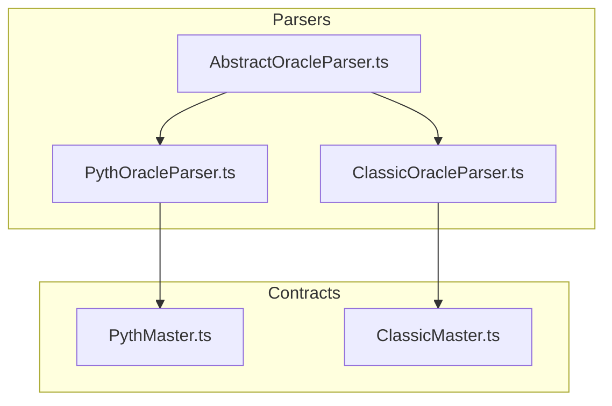
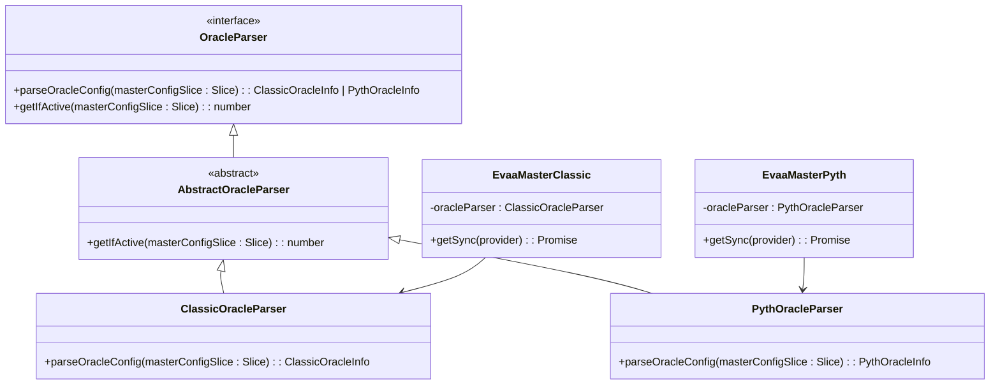
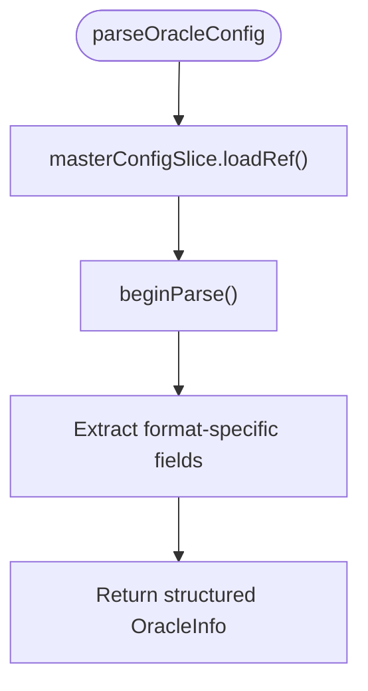
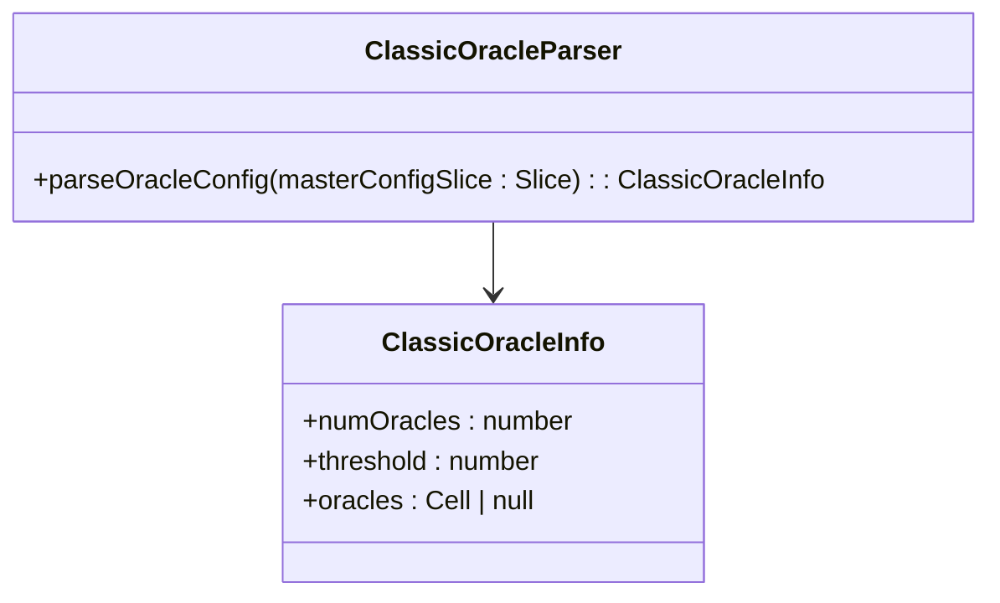
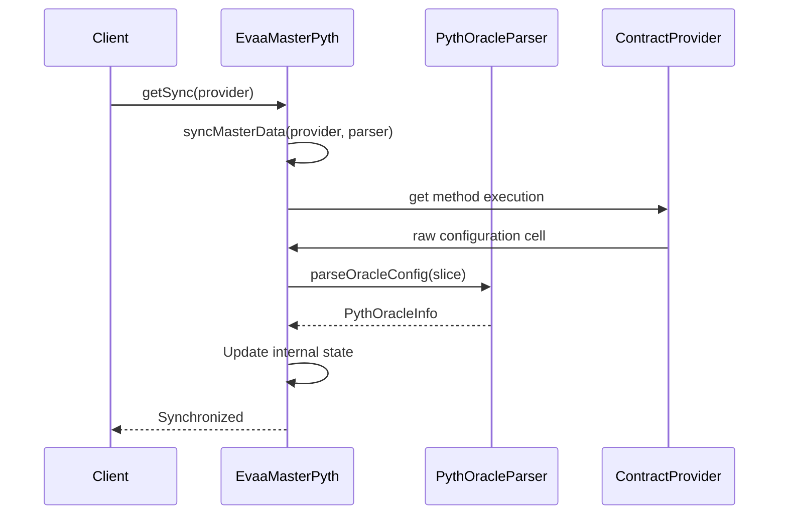

# Extending Oracle Parsers


## Table of Contents
1. [Introduction](#introduction)
2. [Project Structure](#project-structure)
3. [Core Components](#core-components)
4. [Architecture Overview](#architecture-overview)
5. [Detailed Component Analysis](#detailed-component-analysis)
6. [Extending the Oracle Parser System](#extending-the-oracle-parser-system)
7. [Parser Integration with Master Contracts](#parser-integration-with-master-contracts)
8. [Error Handling and Validation](#error-handling-and-validation)
9. [Performance Considerations](#performance-considerations)
10. [Unit Testing Oracle Parsers](#unit-testing-oracle-parsers)
11. [Conclusion](#conclusion)

## Introduction
This document provides a comprehensive guide to extending the OracleParser system in the EVAA SDK. It details how to create custom implementations based on the `AbstractOracleParser` class, using `ClassicOracleParser` and `PythOracleParser` as reference examples. The guide covers method requirements, integration with master contracts, error handling, performance optimization, and testing strategies. The goal is to enable developers to implement new oracle parsers for different data formats while maintaining consistency and reliability across the system.

**Section sources**
- [AbstractOracleParser.ts](file://src/api/parsers/AbstractOracleParser.ts#L1-L16)

## Project Structure
The project follows a modular structure organized by functionality. Oracle-related parsing logic resides under `src/api/parsers`, while contract implementations are located in `src/contracts`. The `AbstractOracleParser` serves as the base class for all oracle data parsers, with concrete implementations for Classic and Pyth oracle systems. Master contracts such as `PythMaster` and `ClassicMaster` utilize these parsers during initialization to extract oracle configuration data from blockchain state.





**Diagram sources**
- [AbstractOracleParser.ts](file://src/api/parsers/AbstractOracleParser.ts#L1-L16)
- [ClassicOracleParser.ts](file://src/api/parsers/ClassicOracleParser.ts#L1-L20)
- [PythOracleParser.ts](file://src/api/parsers/PythOracleParser.ts#L1-L34)
- [PythMaster.ts](file://src/contracts/PythMaster.ts#L1-L265)
- [ClassicMaster.ts](file://src/contracts/ClassicMaster.ts#L1-L184)

## Core Components
The core components of the oracle parsing system include the `OracleParser` interface, the `AbstractOracleParser` base class, and two concrete implementations: `ClassicOracleParser` and `PythOracleParser`. These components work together to extract and validate oracle configuration data from smart contract state cells.

The `OracleParser` interface defines two essential methods:
- `parseOracleConfig(masterConfigSlice: Slice)`: Extracts oracle-specific configuration data
- `getIfActive(masterConfigSlice: Slice)`: Determines if the oracle system is active

The `AbstractOracleParser` class implements `getIfActive` and requires subclasses to implement `parseOracleConfig`.

**Section sources**
- [AbstractOracleParser.ts](file://src/api/parsers/AbstractOracleParser.ts#L1-L16)

## Architecture Overview
The oracle parsing architecture follows a strategy pattern where different parser implementations handle distinct oracle data formats. The master contracts (`EvaaMasterPyth` and `EvaaMasterClassic`) accept parser instances during synchronization to extract configuration data from on-chain storage.





**Diagram sources**
- [AbstractOracleParser.ts](file://src/api/parsers/AbstractOracleParser.ts#L1-L16)
- [ClassicOracleParser.ts](file://src/api/parsers/ClassicOracleParser.ts#L1-L20)
- [PythOracleParser.ts](file://src/api/parsers/PythOracleParser.ts#L1-L34)
- [PythMaster.ts](file://src/contracts/PythMaster.ts#L1-L265)
- [ClassicMaster.ts](file://src/contracts/ClassicMaster.ts#L1-L184)

## Detailed Component Analysis

### AbstractOracleParser Analysis
The `AbstractOracleParser` class provides a foundation for all oracle data parsers. It implements the `OracleParser` interface and includes a default implementation for `getIfActive`, which reads an 8-bit integer from the configuration slice to determine activation status.





**Section sources**
- [AbstractOracleParser.ts](file://src/api/parsers/AbstractOracleParser.ts#L1-L16)

### ClassicOracleParser Analysis
The `ClassicOracleParser` handles legacy oracle data format by extracting three key fields:
- **numOracles**: 16-bit unsigned integer representing the number of oracle nodes
- **threshold**: 16-bit unsigned integer indicating consensus threshold
- **oracles**: Optional reference to oracle node list cell





**Diagram sources**
- [ClassicOracleParser.ts](file://src/api/parsers/ClassicOracleParser.ts#L1-L20)

**Section sources**
- [ClassicOracleParser.ts](file://src/api/parsers/ClassicOracleParser.ts#L1-L20)

### PythOracleParser Analysis
The `PythOracleParser` processes Pyth Network oracle data, extracting both configuration and pricing parameters:


```typescript
type PythOracleInfo = {
    pythAddress: Address;
    feedsMap: Dictionary<bigint, Buffer>;
    allowedRefTokens: Dictionary<bigint, bigint>;
    pricesTtl: number;
    pythComputeBaseGas: bigint;
    pythComputePerUpdateGas: bigint;
    pythSingleUpdateFee: bigint;
};
```


The parser loads nested references including feed data and token configurations, supporting dynamic updates and fee calculations.


```mermaid
sequenceDiagram
participant Parser as PythOracleParser
participant Slice as Slice
participant Dict as Dictionary
Parser->>Slice : loadRef().beginParse()
Parser->>Slice : loadAddress()
Parser->>Slice : loadDict(feedsMap)
Parser->>Slice : loadDict(allowedRefTokens)
Parser->>Slice : loadUint(32)
Parser->>Slice : loadUintBig(64) x3
Parser-->> : Return PythOracleInfo
```


**Diagram sources**
- [PythOracleParser.ts](file://src/api/parsers/PythOracleParser.ts#L1-L34)

**Section sources**
- [PythOracleParser.ts](file://src/api/parsers/PythOracleParser.ts#L1-L34)

## Extending the Oracle Parser System
To create a new oracle parser, follow these steps:

1. **Extend AbstractOracleParser**: Create a new class that extends `AbstractOracleParser`
2. **Implement parseOracleConfig**: Extract format-specific fields from the configuration slice
3. **Define Type Interface**: Create a TypeScript interface for the parsed data structure
4. **Handle Optional References**: Use `loadMaybeMyRef` or similar utilities for nullable cells

Example implementation structure:

```typescript
export type NewOracleInfo = {
    version: number;
    endpoint: string;
    timeout: number;
    metadata: Cell | null;
};

export class NewOracleParser extends AbstractOracleParser {
    parseOracleConfig(masterConfigSlice: Slice): NewOracleInfo {
        const configSlice = masterConfigSlice.loadRef().beginParse();
        return {
            version: configSlice.loadUint(8),
            endpoint: configSlice.loadStringTail(),
            timeout: configSlice.loadUint(16),
            metadata: loadMaybeMyRef(configSlice),
        };
    }
}
```


**Section sources**
- [AbstractOracleParser.ts](file://src/api/parsers/AbstractOracleParser.ts#L1-L16)
- [ClassicOracleParser.ts](file://src/api/parsers/ClassicOracleParser.ts#L1-L20)
- [PythOracleParser.ts](file://src/api/parsers/PythOracleParser.ts#L1-L34)

## Parser Integration with Master Contracts
Parser instances are injected into master contracts during the synchronization process via the `getSync` method:





Both `PythMaster` and `ClassicMaster` instantiate their respective parsers in `getSync()`:
- `EvaaMasterPyth` uses `new PythOracleParser()`
- `EvaaMasterClassic` uses `new ClassicOracleParser()`

This ensures type-safe configuration extraction tailored to each oracle system.

**Diagram sources**
- [PythMaster.ts](file://src/contracts/PythMaster.ts#L1-L265)
- [ClassicMaster.ts](file://src/contracts/ClassicMaster.ts#L1-L184)

**Section sources**
- [PythMaster.ts](file://src/contracts/PythMaster.ts#L1-L265)
- [ClassicMaster.ts](file://src/contracts/ClassicMaster.ts#L1-L184)

## Error Handling and Validation
Common issues and their handling strategies:

### Timestamp Validation Failures
When processing Pyth price updates, ensure publish times fall within acceptable ranges:
- Validate `minPublishTime` ≤ actual publish time ≤ `maxPublishTime`
- Reject updates with timestamps exceeding `maxStaleness` from current time

### Malformed Price Responses
Handle corrupted or incomplete data:
- Validate dictionary sizes for `feedsMap` and `allowedRefTokens`
- Check for proper buffer lengths in price data
- Verify required fields are present before processing

### Error Handling Best Practices

```typescript
try {
    const result = parser.parseOracleConfig(slice);
    if (!result.pythAddress) throw new Error('Missing pythAddress');
    return result;
} catch (error) {
    console.error('Oracle config parsing failed:', error);
    throw new Error(`Invalid oracle configuration: ${error.message}`);
}
```


**Section sources**
- [PythOracleParser.ts](file://src/api/parsers/PythOracleParser.ts#L1-L34)
- [ClassicOracleParser.ts](file://src/api/parsers/ClassicOracleParser.ts#L1-L20)

## Performance Considerations
When parsing large datasets or handling frequent updates:

1. **Memory Usage Optimization**:
   - Avoid deep cloning of large cells
   - Use streaming parsing for large dictionaries
   - Release references promptly after use

2. **Efficient Dictionary Handling**:
   - Pre-allocate dictionary sizes when possible
   - Use efficient key types (BigUint over strings)
   - Batch operations when processing multiple feeds

3. **Caching Strategies**:
   - Cache parsed configurations when they remain valid
   - Implement TTL-based invalidation using `pricesTtl`
   - Avoid redundant parsing of unchanged data

4. **Gas Optimization**:
   - Minimize cell copying operations
   - Optimize serialization format
   - Reduce nested reference loading

**Section sources**
- [PythOracleParser.ts](file://src/api/parsers/PythOracleParser.ts#L1-L34)
- [PythMaster.ts](file://src/contracts/PythMaster.ts#L1-L265)

## Unit Testing Oracle Parsers
Use Jest with mock data to test parser implementations:

### Test Setup

```typescript
import { Cell, Slice } from '@ton/core';
import { PythOracleParser } from '../src/api/parsers/PythOracleParser';
import testData from './parse_pyth.test.ts';

describe('PythOracleParser', () => {
    let parser: PythOracleParser;
    
    beforeEach(() => {
        parser = new PythOracleParser();
    });

    test('parses valid Pyth configuration', () => {
        const cell = Cell.fromBoc(testData.validConfig)[0];
        const slice = cell.beginParse();
        const result = parser.parseOracleConfig(slice);
        
        expect(result.pythAddress.toString()).toBe('UQ...');
        expect(result.feedsMap.size).toBe(3);
        expect(result.pricesTtl).toBe(60);
    });
});
```


### Mock Data Structure
Create test fixtures in `parse_pyth.test.ts` and `parse_classic.ts` containing:
- Valid configuration cells
- Edge case scenarios (empty dictionaries, maximum values)
- Error condition simulations (malformed cells, missing fields)

Run tests using:

```bash
npm test parse_pyth.ts
npm test parse_classic.ts
```


**Section sources**
- [parse_pyth.ts](file://tests/parse_pyth.ts)
- [parse_classic.ts](file://tests/parse_classic.ts)
- [PythOracleParser.ts](file://src/api/parsers/PythOracleParser.ts#L1-L34)
- [ClassicOracleParser.ts](file://src/api/parsers/ClassicOracleParser.ts#L1-L20)

## Conclusion
The OracleParser system provides a flexible and extensible framework for handling different oracle data formats. By extending `AbstractOracleParser`, developers can implement custom parsers that integrate seamlessly with master contracts. Proper error handling, performance optimization, and thorough testing ensure reliable operation in production environments. The architecture supports future oracle systems while maintaining backward compatibility with existing implementations.

**Referenced Files in This Document**   
- [AbstractOracleParser.ts](file://src/api/parsers/AbstractOracleParser.ts#L1-L16)
- [ClassicOracleParser.ts](file://src/api/parsers/ClassicOracleParser.ts#L1-L20)
- [PythOracleParser.ts](file://src/api/parsers/PythOracleParser.ts#L1-L34)
- [PythMaster.ts](file://src/contracts/PythMaster.ts#L1-L265)
- [ClassicMaster.ts](file://src/contracts/ClassicMaster.ts#L1-L184)