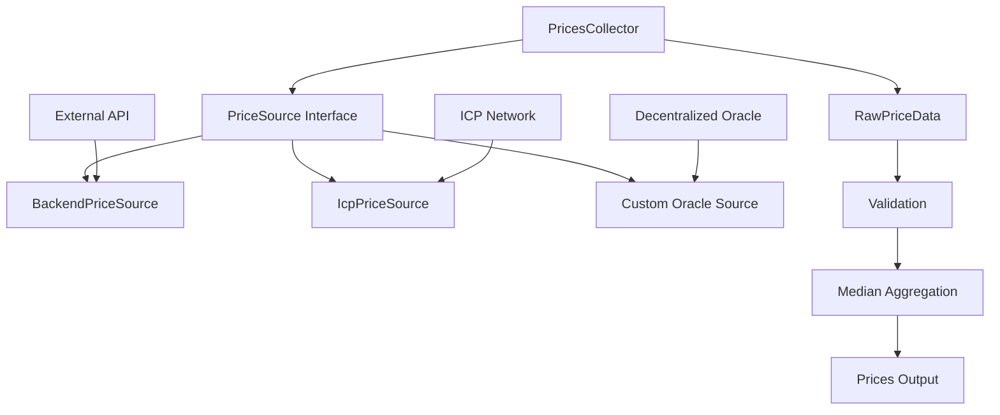
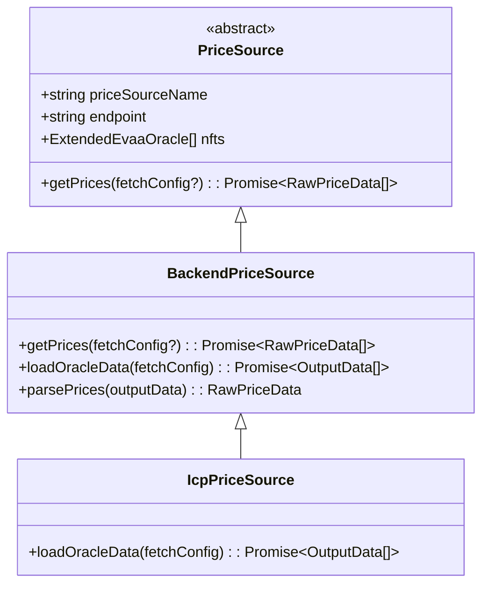
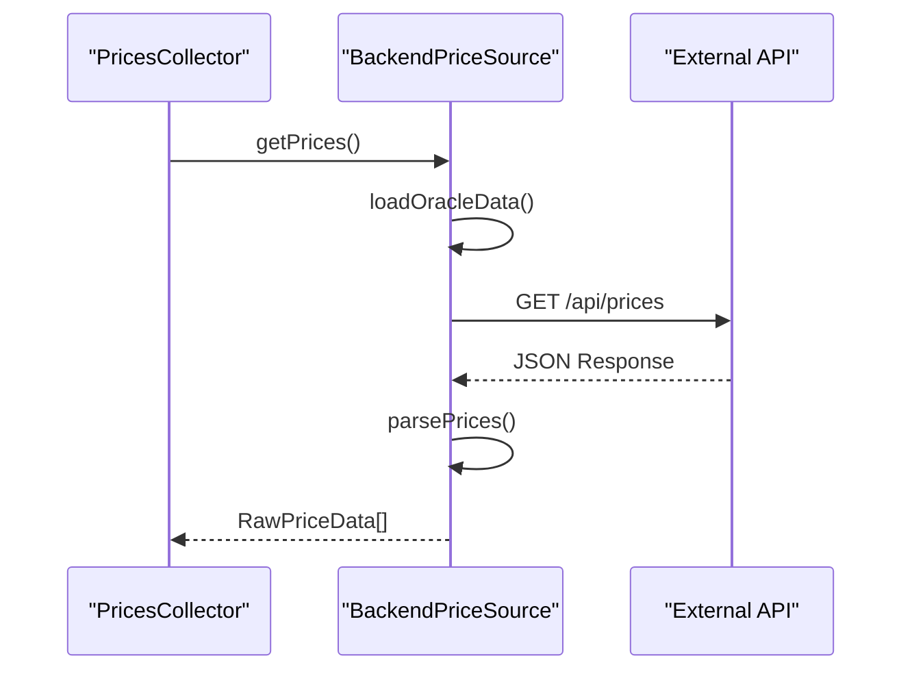
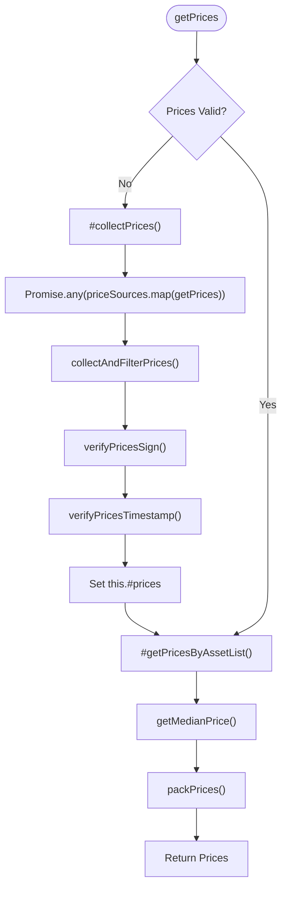
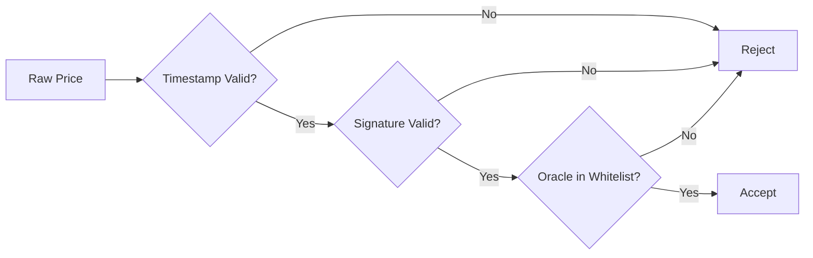

# Custom Price Sources


## Table of Contents
1. [Introduction](#introduction)
2. [Core Architecture](#core-architecture)
3. [PriceSource Interface and Inheritance](#pricesource-interface-and-inheritance)
4. [Concrete Implementations: Backend and Icp](#concrete-implementations-backend-and-icp)
5. [Integration with PricesCollector](#integration-with-pricescollector)
6. [Example: Adding a Decentralized Oracle Network Source](#example-adding-a-decentralized-oracle-network-source)
7. [Data Format Handling and Normalization](#data-format-handling-and-normalization)
8. [Security Considerations](#security-considerations)
9. [Testing Custom Price Sources](#testing-custom-price-sources)
10. [Performance Implications and Concurrency Control](#performance-implications-and-concurrency-control)

## Introduction
This document provides a comprehensive guide to implementing custom price sources within the EVAA SDK. It details how developers can extend the `PriceSource` interface to integrate new external pricing APIs, particularly focusing on decentralized oracle networks. The system is designed for modularity, security, and resilience, allowing multiple independent price feeds to be aggregated and validated before use in financial operations such as liquidation and withdrawal.

The architecture leverages TypeScript classes and interfaces to enforce type safety and clear contracts between components. Price data is fetched from various sources, normalized into a standard format (`RawPriceData`), validated for freshness and authenticity, and then aggregated using median logic to mitigate the risk of poisoned feeds.

**Section sources**
- [PriceSource.ts](file://src/prices/sources/PriceSource.ts#L1-L35)
- [PricesCollector.ts](file://src/prices/PricesCollector.ts#L1-L163)

## Core Architecture
The price fetching system is built around a modular source pattern where each price provider implements a common interface. The `PricesCollector` class orchestrates the collection, validation, and aggregation of price data from multiple `PriceSource` instances.





**Diagram sources**
- [PriceSource.ts](file://src/prices/sources/PriceSource.ts#L1-L35)
- [PricesCollector.ts](file://src/prices/PricesCollector.ts#L1-L163)

## PriceSource Interface and Inheritance
The `PriceSource` abstract class defines the contract that all price sources must follow. It encapsulates shared state such as the API endpoint and list of oracles (`ExtendedEvaaOracle[]`), and exposes a getter for the source name.

### Key Properties and Methods
- **`priceSourceName`**: A string identifier for the source (default: `'BackendPriceSource'`)
- **`_endpoint`**: The base URL for API requests
- **`_nfts`**: Array of oracle configurations containing IDs and public keys
- **`getPrices(fetchConfig?: FetchConfig)`**: Abstract method that must be implemented by subclasses to fetch and return `RawPriceData[]`





**Diagram sources**
- [PriceSource.ts](file://src/prices/sources/PriceSource.ts#L1-L35)
- [Backend.ts](file://src/prices/sources/Backend.ts#L1-L64)
- [Icp.ts](file://src/prices/sources/Icp.ts#L1-L30)

**Section sources**
- [PriceSource.ts](file://src/prices/sources/PriceSource.ts#L1-L35)

## Concrete Implementations: Backend and Icp
Two concrete implementations are provided: `BackendPriceSource` and `IcpPriceSource`. Both inherit from `PriceSource` and override the `getPrices` method.

### BackendPriceSource
This class fetches price data from centralized backend services. It uses `fetch` with timeout and retry logic via `proxyFetchRetries`. The response is expected in JSON format, with hex-encoded BOC (Bag of Cells) data for prices, signatures, and public keys.

#### Data Flow
1. Request `/api/prices` from the configured endpoint
2. Parse JSON response and extract oracle-specific data by NFT address
3. Decode URL-encoded hex string into UTF-8 JSON
4. Parse BOC data using `@ton/core`
5. Construct `RawPriceData` objects with verified fields





**Diagram sources**
- [Backend.ts](file://src/prices/sources/Backend.ts#L1-L64)

### IcpPriceSource
This class extends `BackendPriceSource` and is tailored for ICP (Internet Computer Protocol) endpoints. It overrides `loadOracleData` to use a different endpoint path (`/prices`) but reuses the same parsing logic.

**Section sources**
- [Backend.ts](file://src/prices/sources/Backend.ts#L1-L64)
- [Icp.ts](file://src/prices/sources/Icp.ts#L1-L30)

## Integration with PricesCollector
The `PricesCollector` class is responsible for aggregating price data from multiple sources. It accepts an optional `additionalPriceSources` array in its configuration, allowing custom sources to be injected at runtime.

### Configuration and Initialization

```typescript
type PricesCollectorConfig = {
    poolAssetsConfig: PoolAssetsConfig;
    minimalOracles: number;
    evaaOracles: ExtendedEvaaOracle[];
    sourcesConfig?: PriceSourcesConfig;
    additionalPriceSources?: PriceSource[];
};
```


During construction, `PricesCollector`:
1. Generates default sources from `sourcesConfig` (e.g., backend and ICP endpoints)
2. Appends any `additionalPriceSources` provided in config
3. Stores the combined list in `#priceSources`

### Price Collection Workflow
The `getPrices()` method orchestrates the entire process:
1. Calls `#collectPricesWithValidation()` which uses `Promise.any()` to race all sources
2. Each source's `getPrices()` is called with optional `FetchConfig`
3. Results are filtered for timestamp validity and signature authenticity
4. Median prices are computed across valid responses





**Diagram sources**
- [PricesCollector.ts](file://src/prices/PricesCollector.ts#L1-L163)
- [utils.ts](file://src/prices/utils.ts#L1-L164)

**Section sources**
- [PricesCollector.ts](file://src/prices/PricesCollector.ts#L1-L163)

## Example: Adding a Decentralized Oracle Network Source
To integrate a new decentralized oracle (e.g., Chainlink on TON), create a class that extends `PriceSource`.

### Implementation Steps
1. Define a new class, e.g., `ChainlinkPriceSource`
2. Implement `getPrices()` with HTTP client setup
3. Add retry and timeout handling using `proxyFetchRetries`
4. Normalize response into `RawPriceData`


```typescript
import { PriceSource } from './PriceSource';
import { RawPriceData } from '..';
import { FetchConfig, proxyFetchRetries, DefaultFetchConfig } from '../../utils/utils';

export class ChainlinkPriceSource extends PriceSource {
    protected priceSourceName: string = 'ChainlinkPriceSource';

    async getPrices(fetchConfig?: FetchConfig): Promise<RawPriceData[]> {
        const config = { ...DefaultFetchConfig, ...fetchConfig };
        const url = `https://${this._endpoint}/latest`;
        
        const fetchPromise = fetch(url, {
            headers: { 'Accept': 'application/json' },
            signal: AbortSignal.timeout(config.timeout)
        }).then(async (res) => {
            if (!res.ok) throw new Error(`HTTP ${res.status}`);
            const json = await res.json();
            
            return this._nfts.map(nft => {
                const priceData = json.prices[nft.assetSymbol];
                return {
                    dict: Dictionary.create(Dictionary.Keys.BigUint(256), Dictionary.Values.BigVarUint(4))
                        .set(nft.assetId, BigInt(priceData.price)),
                    dataCell: Cell.EMPTY, // Placeholder; real implementation would include signature
                    oracleId: nft.id,
                    signature: Buffer.from(priceData.signature, 'hex'),
                    pubkey: nft.pubkey,
                    timestamp: priceData.timestamp
                } as RawPriceData;
            });
        });

        try {
            return await proxyFetchRetries(fetchPromise, config);
        } catch (error) {
            console.error(`Chainlink source failed: ${error}`);
            throw error;
        }
    }
}
```


### Usage

```typescript
const chainlinkSource = new ChainlinkPriceSource('chainlink-evaa.ton', evaaOracles);
const collector = new PricesCollector({
    poolAssetsConfig,
    minimalOracles: 3,
    evaaOracles,
    additionalPriceSources: [chainlinkSource]
});
```


**Section sources**
- [PriceSource.ts](file://src/prices/sources/PriceSource.ts#L1-L35)
- [utils.ts](file://src/utils/utils.ts#L1-L53)

## Data Format Handling and Normalization
The system supports different data formats through the `parsePrices` method in each source. For example:
- **JSON**: Used by backend and ICP sources
- **CBOR**: Could be supported by decoding with `cbor-x` or similar
- **Binary BOC**: Native TON serialization format

Normalization involves:
1. Parsing raw response into intermediate format (`OutputData`)
2. Extracting price, signature, timestamp
3. Constructing `RawPriceData` with standardized fields
4. Ensuring dictionary keys are `bigint` asset IDs


```typescript
parsePrices(outputData: OutputData): RawPriceData {
    const data = JSON.parse(decodeURIComponent(outputData.data.replace('0x', '').replace(/[0-9a-f]{2}/g, '%$&')));
    const pricesCell = Cell.fromBoc(Buffer.from(data['packedPrices'], 'hex'))[0];
    // ... rest of parsing
}
```


**Section sources**
- [Backend.ts](file://src/prices/sources/Backend.ts#L1-L64)

## Security Considerations
The system includes multiple layers of protection against malicious or faulty price data.

### Input Validation
- **Timestamp Verification**: Prices older than `TTL_ORACLE_DATA_SEC` (120 seconds) are rejected
- **Signature Verification**: Each price update is checked against the oracle's public key using `signVerify` from `@ton/crypto`
- **Oracle Whitelist**: Only prices from oracles in the `nfts` list are accepted

### Protection Against Poisoned Feeds
- **Median Aggregation**: Outliers are filtered out by taking the median across multiple sources
- **Minimum Oracle Requirement**: At least `minimalOracles` valid responses are required
- **Race Condition Mitigation**: `Promise.any()` ensures fastest valid response wins, reducing exposure window





**Diagram sources**
- [utils.ts](file://src/prices/utils.ts#L1-L164)
- [constants.ts](file://src/prices/constants.ts#L1)

**Section sources**
- [utils.ts](file://src/prices/utils.ts#L1-L164)

## Testing Custom Price Sources
The `PriceCollector.test.ts` file provides a testing framework for validating custom sources.

### Mocking Network Responses
Use Jest to mock `fetch` and simulate various scenarios:
- Success with valid data
- Timeout
- Invalid signature
- Stale prices
- Network errors


```typescript
jest.spyOn(global, 'fetch').mockResolvedValue({
    ok: true,
    json: async () => ({ prices: { '0x123': '0x...' } })
} as any);
```


### Test Cases
- **Happy Path**: Ensure `getPrices()` returns valid `RawPriceData[]`
- **Error Handling**: Verify retries and timeout logic
- **Validation**: Confirm that invalid prices are filtered out
- **Integration**: Test with `PricesCollector` to ensure median calculation works

**Section sources**
- [PriceCollector.test.ts](file://tests/prices/PriceCollector.test.ts)

## Performance Implications and Concurrency Control
Adding multiple price sources improves reliability but introduces latency and resource overhead.

### Concurrency Strategies
- **Parallel Execution**: All sources are queried concurrently using `Promise.any()`
- **Fastest-Wins**: The first source to return a valid result determines the outcome
- **Retry Backoff**: Exponential backoff (1s, 2s, 4s) prevents overwhelming APIs

### Performance Trade-offs
| Strategy | Benefit | Cost |
|--------|-------|------|
| More Sources | Higher resilience | Increased bandwidth |
| Higher `minimalOracles` | Better security | Longer wait times |
| Shorter TTL | Fresher prices | More frequent failures |
| More retries | Better reliability | Increased latency |

Developers should balance these factors based on their use case. For production systems, it's recommended to use at least 3 independent sources with `minimalOracles = 2`.

**Section sources**
- [PricesCollector.ts](file://src/prices/PricesCollector.ts#L1-L163)
- [utils.ts](file://src/utils/utils.ts#L1-L53)

**Referenced Files in This Document**   
- [PriceSource.ts](file://src/prices/sources/PriceSource.ts#L1-L35)
- [Backend.ts](file://src/prices/sources/Backend.ts#L1-L64)
- [Icp.ts](file://src/prices/sources/Icp.ts#L1-L30)
- [PricesCollector.ts](file://src/prices/PricesCollector.ts#L1-L163)
- [Types.ts](file://src/prices/Types.ts#L1-L62)
- [utils.ts](file://src/prices/utils.ts#L1-L164)
- [constants.ts](file://src/prices/constants.ts#L1)
- [utils.ts](file://src/utils/utils.ts#L1-L53)