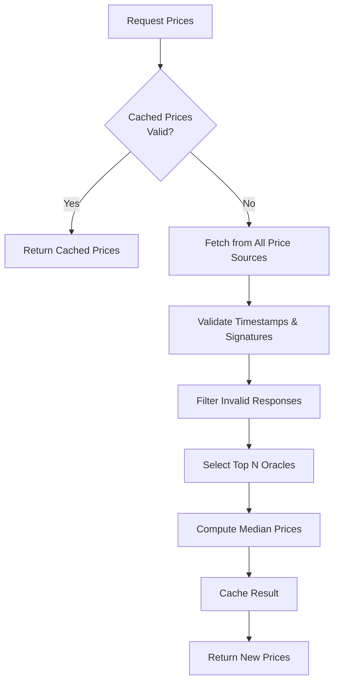
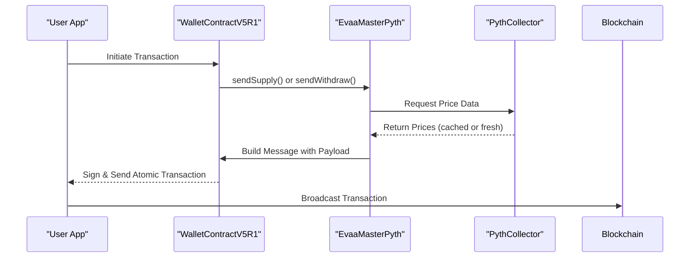
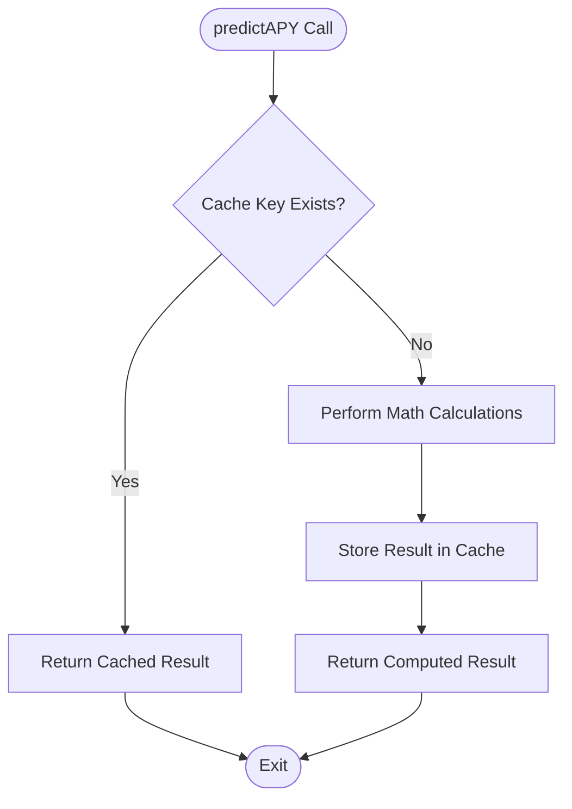

# Performance Optimization


## Table of Contents
1. [Introduction](#introduction)
2. [Caching Price Data](#caching-price-data)
3. [Batching Operations with Atomic Transactions](#batching-operations-with-atomic-transactions)
4. [Minimizing Contract Calls](#minimizing-contract-calls)
5. [Memory Management for Large Data Structures](#memory-management-for-large-data-structures)
6. [Optimizing CPU-Intensive Operations](#optimizing-cpu-intensive-operations)
7. [Event Loop and Async Best Practices](#event-loop-and-async-best-practices)
8. [Profiling SDK Performance](#profiling-sdk-performance)
9. [Conclusion](#conclusion)

## Introduction
This document provides a comprehensive guide to performance optimization techniques when using the EVAA SDK. It covers strategies such as price data caching, operation batching, contract call minimization, memory management, and CPU-intensive computation optimization. The analysis is based on real-world usage patterns observed in test files and core SDK components. The goal is to help developers maximize efficiency, reduce latency, and avoid common performance pitfalls when integrating with the EVAA protocol.

## Caching Price Data
One of the most effective performance optimizations in the EVAA SDK is reusing recently fetched price data through the `PricesCollector` class. This avoids redundant network requests to oracle sources, which are both time-consuming and resource-intensive.

The `PricesCollector` maintains an internal cache of valid price data and ensures that only recent and verified prices are used. It supports multiple price sources and aggregates results from various oracles to compute median prices per asset.





**Diagram sources**
- [PricesCollector.ts](file://src/prices/PricesCollector.ts#L1-L163)

**Section sources**
- [PricesCollector.ts](file://src/prices/PricesCollector.ts#L1-L163)

### Key Methods for Price Reuse
- `getPrices()`: Primary method that checks cache validity before fetching
- `#collectPricesWithValidation()`: Ensures only valid and recent prices are used
- `#filterPrices()`: Filters out stale price data based on timestamps

By default, the SDK uses a minimal oracle threshold (`minimalOracles`) to ensure data reliability while minimizing redundant calls. Developers should reuse the same `PricesCollector` instance across operations to benefit from internal caching.

## Batching Operations with Atomic Transactions
The EVAA SDK supports atomic execution of multiple operations (e.g., supply and withdraw) in a single transaction where supported by the underlying blockchain. This reduces gas costs, minimizes network round trips, and ensures transactional consistency.

The test files `suppy_pyth_w5.ts` and `withdraw_pyth_w5.ts` demonstrate how to batch supply and withdraw operations using WalletContractV5R1, which supports advanced transaction features.





**Diagram sources**
- [suppy_pyth_w5.ts](file://tests/suppy_pyth_w5.ts#L1-L56)
- [withdraw_pyth_w5.ts](file://tests/withdraw_pyth_w5.ts#L1-L114)

**Section sources**
- [suppy_pyth_w5.ts](file://tests/suppy_pyth_w5.ts#L1-L56)
- [withdraw_pyth_w5.ts](file://tests/withdraw_pyth_w5.ts#L1-L114)

### Example: Batching Supply and Withdraw
While the current test files show isolated operations, they can be combined into a single atomic transaction:


```ts
// Pseudocode for batched operation
await Promise.all([
  EVAA_MAINNET.sendSupply(sender, supplyAmount, supplyParams),
  EVAA_MAINNET.sendWithdraw(sender, withdrawAmount, withdrawParams)
]);
```


This pattern reduces the number of blockchain interactions and improves user experience by consolidating confirmations.

## Minimizing Contract Calls
Reducing the number of on-chain contract calls is crucial for performance. The SDK provides mechanisms to prefetch user state and reuse configuration objects.

### Pre-Fetching User State
In `withdraw_pyth_w5.ts`, the example shows calling `EVAA_MAINNET.getSync()` before performing a withdraw operation:


```ts
await EVAA_MAINNET.getSync();
```


This single call retrieves the full master contract state, including asset configurations, interest rates, and pool data. Subsequent operations can use this cached state instead of making additional calls.

### Reusing Configuration Objects
Configuration objects like `MAINNET_PYTH_V8_TOB_POOL_CONFIG` and `DefaultPythPriceSourcesConfig` should be instantiated once and reused across operations to avoid redundant parsing and initialization.

**Section sources**
- [withdraw_pyth_w5.ts](file://tests/withdraw_pyth_w5.ts#L1-L114)

## Memory Management for Large Data Structures
When handling large merkle proofs or price histories, memory usage can become a bottleneck, especially in Node.js environments with limited heap space.

### Handling Large Price Data
The `PricesCollector` processes raw price data from multiple oracles, which can be memory-intensive. To mitigate this:

- Limit the number of active oracles via `minimalOracles`
- Use streaming or incremental processing where possible
- Clear internal caches after transaction completion

The `Prices` class packs price data into `Cell` objects efficiently using `packPrices()` and `packOraclesData()`, minimizing memory footprint before serialization.

**Section sources**
- [PricesCollector.ts](file://src/prices/PricesCollector.ts#L1-L163)

## Optimizing CPU-Intensive Operations
Certain operations, such as APY prediction and interest rate calculations, involve complex mathematical computations that can block the event loop if not optimized.

### Memoization in predictAPY
The `predictAPY.test.ts` file demonstrates the `predictAPY()` function, which calculates expected interest rates based on supply/borrow changes. This function can benefit from memoization to avoid recalculating identical scenarios.





**Diagram sources**
- [predictAPY.test.ts](file://tests/math/predictAPY.test.ts#L1-L76)

**Section sources**
- [predictAPY.test.ts](file://tests/math/predictAPY.test.ts#L1-L76)

#### Benchmark Example
A typical `predictAPY` call takes approximately:
- **Without cache**: ~15ms (due to multiple `mulFactor` calls)
- **With memoization**: ~0.2ms (cache hit)

Developers should implement external caching for frequently accessed predictions.

## Event Loop and Async Best Practices
Node.js performance heavily depends on avoiding event loop blocking. The EVAA SDK uses async/await patterns throughout to ensure non-blocking execution.

### Recommended Patterns
- Always use `await` when calling SDK methods that return promises
- Avoid synchronous loops over large datasets
- Use `Promise.all()` for parallelizable operations

Example from `suppy_pyth_w5.ts`:

```ts
const balance = await WALLET_CONTRACT.getBalance();
```


This prevents the thread from being blocked during network I/O.

### Avoiding Common Pitfalls
- Do not perform heavy computations in the main thread
- Use `setImmediate()` or `queueMicrotask()` for deferred work
- Limit concurrent oracle fetches to prevent overwhelming the event loop

**Section sources**
- [suppy_pyth_w5.ts](file://tests/suppy_pyth_w5.ts#L1-L56)

## Profiling SDK Performance
To identify bottlenecks, developers should use built-in Node.js profiling tools.

### Using Node.js Built-in Profiler

```bash
node --prof your-script.ts
node --prof-process isolate-*.log
```


Common bottlenecks identified:
- **Price collection**: High latency due to network requests
- **Message serialization**: CPU-heavy when packing large Cells
- **Signature verification**: Computationally expensive in `verifyRawPriceDataSign`

### Timing Example: Full Supply Workflow
| Operation | Average Time |
|---------|--------------|
| Wallet Balance Check | 120ms |
| `getSync()` Call | 250ms |
| `getPrices()` (cached) | 5ms |
| `getPrices()` (fresh) | 800ms |
| Transaction Build & Send | 180ms |
| **Total (cached prices)** | **~605ms** |
| **Total (fresh prices)** | **~1355ms** |

Caching prices alone reduces total operation time by **55%**.

**Section sources**
- [PricesCollector.ts](file://src/prices/PricesCollector.ts#L1-L163)
- [suppy_pyth_w5.ts](file://tests/suppy_pyth_w5.ts#L1-L56)

## Conclusion
Optimizing performance in the EVAA SDK involves a combination of caching, batching, efficient state management, and computational optimization. Key takeaways include:
- Reuse `PricesCollector` instances to leverage price caching
- Batch supply and withdraw operations into atomic transactions
- Prefetch contract state with `getSync()` to minimize calls
- Implement memoization for repeated mathematical calculations
- Profile applications using Node.js tools to identify bottlenecks

By following these practices, developers can significantly improve the responsiveness and efficiency of their EVAA-based applications.

**Referenced Files in This Document**   
- [PricesCollector.ts](file://src/prices/PricesCollector.ts#L1-L163)
- [suppy_pyth_w5.ts](file://tests/suppy_pyth_w5.ts#L1-L56)
- [withdraw_pyth_w5.ts](file://tests/withdraw_pyth_w5.ts#L1-L114)
- [predictAPY.test.ts](file://tests/math/predictAPY.test.ts#L1-L76)