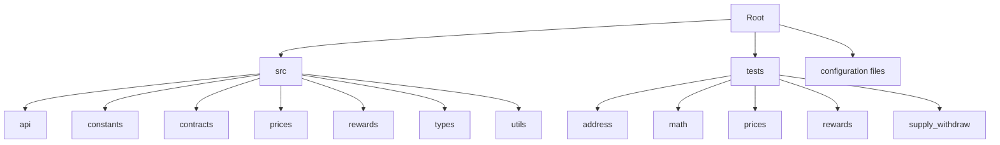
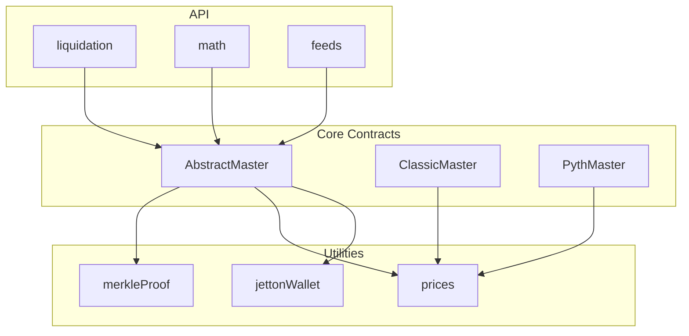
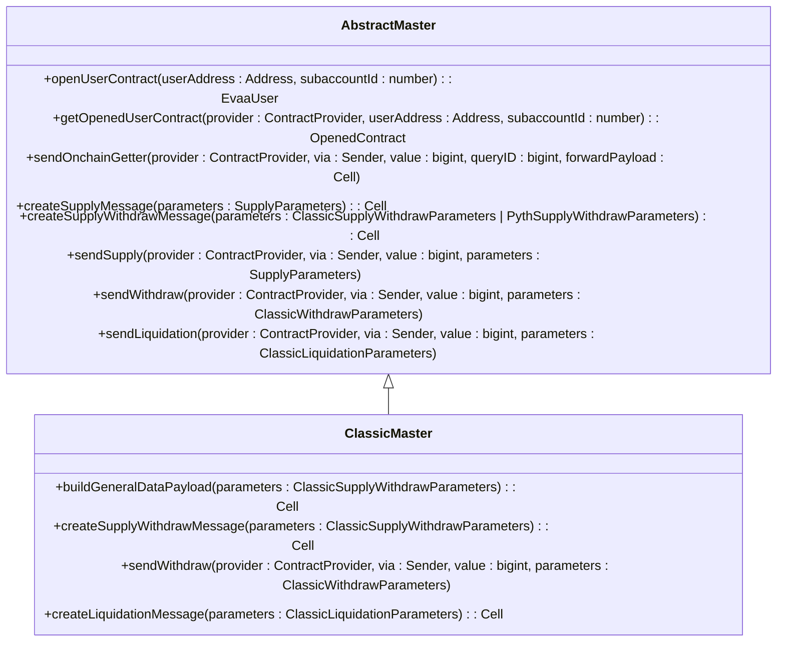
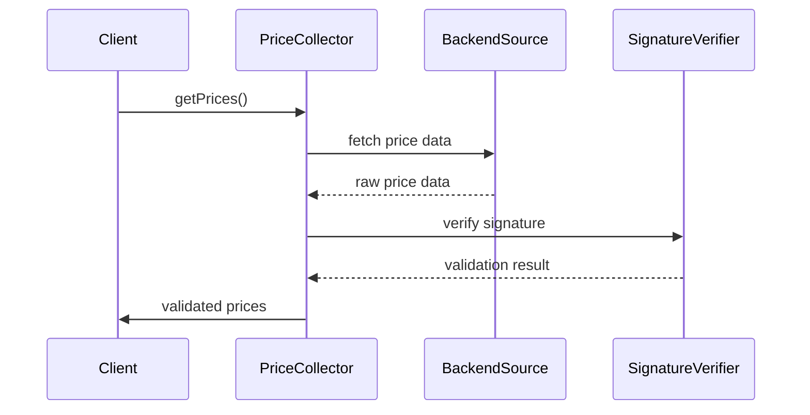
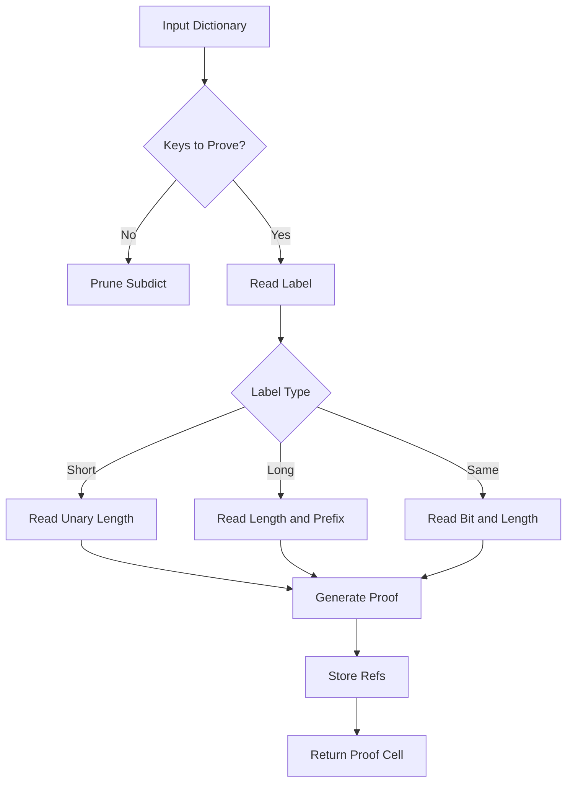
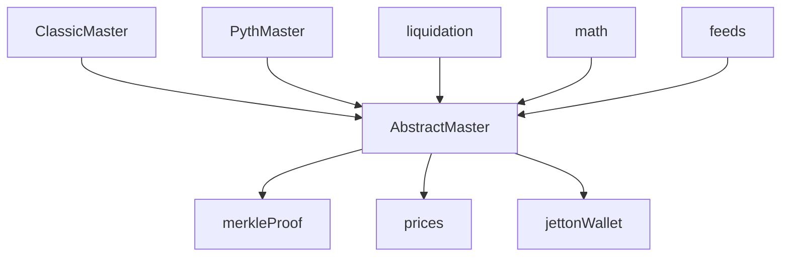

# Gas Cost Considerations

## Table of Contents
1. [Introduction](#introduction)
2. [Project Structure](#project-structure)
3. [Core Components](#core-components)
4. [Architecture Overview](#architecture-overview)
5. [Detailed Component Analysis](#detailed-component-analysis)
6. [Dependency Analysis](#dependency-analysis)
7. [Performance Considerations](#performance-considerations)
8. [Troubleshooting Guide](#troubleshooting-guide)
9. [Conclusion](#conclusion)

## Introduction
This document provides a comprehensive analysis of gas cost considerations for transactions executed through the EVAA SDK. It examines how different operations such as supply, withdraw, and liquidation incur varying computational costs based on asset type, oracle system (Classic vs Pyth), and subaccount usage. The analysis leverages test files like supply_classic_test.ts and withdraw_pyth_test.ts to illustrate real-world gas consumption patterns. Key factors that increase gas usage are documented, including price validation complexity, merkle proof verification, and multi-asset operations. The document also provides strategies to minimize fees, optimal timing for price updates, reducing redundant data in messages, and choosing between TON and Jetton transfers.

## Project Structure
The EVAA SDK is organized into several key directories: src for source code, tests for test files, and root-level configuration files. The src directory contains subdirectories for API, constants, contracts, prices, rewards, types, and utils. The tests directory includes various test files for different functionalities such as address calculation, math operations, price collection, and supply/withdraw operations.

**Diagram sources**
- [AbstractMaster.ts](file://src/contracts/AbstractMaster.ts#L196-L397)
- [ClassicMaster.ts](file://src/contracts/ClassicMaster.ts#L44-L124)

**Section sources**
- [AbstractMaster.ts](file://src/contracts/AbstractMaster.ts#L196-L397)
- [ClassicMaster.ts](file://src/contracts/ClassicMaster.ts#L44-L124)

## Core Components
The core components of the EVAA SDK include the AbstractMaster and ClassicMaster classes, which handle the creation and execution of supply, withdraw, and liquidation operations. These components interact with various utilities for price collection, merkle proof generation, and jetton transfers.

**Section sources**
- [AbstractMaster.ts](file://src/contracts/AbstractMaster.ts#L196-L397)
- [ClassicMaster.ts](file://src/contracts/ClassicMaster.ts#L44-L124)

## Architecture Overview
The architecture of the EVAA SDK is designed to support decentralized finance operations on the TON blockchain. It utilizes a modular approach with distinct components for handling different aspects of the protocol.

**Diagram sources**
- [AbstractMaster.ts](file://src/contracts/AbstractMaster.ts#L196-L397)
- [ClassicMaster.ts](file://src/contracts/ClassicMaster.ts#L44-L124)
- [merkleProof.ts](file://src/utils/merkleProof.ts#L0-L140)

## Detailed Component Analysis

### AbstractMaster Analysis
The AbstractMaster class serves as the base class for handling supply, withdraw, and liquidation operations. It provides common functionality for creating messages and sending operations.

**Diagram sources**
- [AbstractMaster.ts](file://src/contracts/AbstractMaster.ts#L196-L397)
- [ClassicMaster.ts](file://src/contracts/ClassicMaster.ts#L44-L124)

**Section sources**
- [AbstractMaster.ts](file://src/contracts/AbstractMaster.ts#L196-L397)
- [ClassicMaster.ts](file://src/contracts/ClassicMaster.ts#L44-L124)

### Price Collection and Validation
The price collection system in EVAA SDK involves multiple sources and validation steps. The PricesCollector class fetches price data from various endpoints and validates signatures.

**Diagram sources**
- [PriceCollector.test.ts](file://tests/prices/PriceCollector.test.ts#L85-L161)
- [Backend.ts](file://src/prices/sources/Backend.ts#L26-L63)

**Section sources**
- [PriceCollector.test.ts](file://tests/prices/PriceCollector.test.ts#L85-L161)
- [Backend.ts](file://src/prices/sources/Backend.ts#L26-L63)

### Merkle Proof Generation
The merkle proof generation utility is used for efficient verification of price data. It creates compact proofs that can be validated on-chain.

**Diagram sources**
- [merkleProof.ts](file://src/utils/merkleProof.ts#L0-L140)

**Section sources**
- [merkleProof.ts](file://src/utils/merkleProof.ts#L0-L140)

## Dependency Analysis
The EVAA SDK has a well-defined dependency structure with clear separation of concerns. The core contracts depend on utility functions for merkle proofs and price handling, while the API layer depends on both contracts and utilities.

**Diagram sources**
- [AbstractMaster.ts](file://src/contracts/AbstractMaster.ts#L196-L397)
- [ClassicMaster.ts](file://src/contracts/ClassicMaster.ts#L44-L124)
- [merkleProof.ts](file://src/utils/merkleProof.ts#L0-L140)

**Section sources**
- [AbstractMaster.ts](file://src/contracts/AbstractMaster.ts#L196-L397)
- [ClassicMaster.ts](file://src/contracts/ClassicMaster.ts#L44-L124)
- [merkleProof.ts](file://src/utils/merkleProof.ts#L0-L140)

## Performance Considerations
Gas costs in the EVAA SDK are influenced by several factors:
- **Oracle System**: Pyth oracle operations generally incur higher gas costs due to more complex price validation.
- **Asset Type**: Jetton transfers require additional steps compared to native TON transfers.
- **Subaccount Usage**: Operations involving subaccounts add computational overhead.
- **Price Data**: Including price data in transactions increases payload size and processing cost.
- **Merkle Proofs**: Verification of merkle proofs adds significant computational complexity.

Optimization strategies include:
- Using TON transfers instead of Jetton transfers when possible
- Minimizing the number of assets in multi-asset operations
- Reusing price data when multiple operations are performed in sequence
- Avoiding unnecessary subaccount usage
- Compressing payload data where possible

## Troubleshooting Guide
Common issues related to gas costs include:
- **Insufficient gas**: Ensure adequate value is attached to transactions
- **Price validation failures**: Verify that price data is up-to-date and properly formatted
- **Merkle proof errors**: Check that the proof is correctly generated and includes all necessary data
- **Jetton transfer failures**: Confirm that the jetton wallet is properly initialized

Monitoring tools and logging mechanisms should be implemented to track gas usage in production environments. The SDK provides methods like provider.estimateFee() to estimate transaction costs before submission.

**Section sources**
- [AbstractMaster.ts](file://src/contracts/AbstractMaster.ts#L196-L397)
- [ClassicMaster.ts](file://src/contracts/ClassicMaster.ts#L44-L124)
- [PriceCollector.test.ts](file://tests/prices/PriceCollector.test.ts#L85-L161)

## Conclusion
The EVAA SDK provides a comprehensive framework for decentralized finance operations on the TON blockchain. Understanding the gas cost implications of different operations is crucial for optimizing transaction efficiency and minimizing fees. By leveraging the strategies outlined in this document, developers can create more cost-effective applications using the EVAA protocol.

**Referenced Files in This Document**   
- [AbstractMaster.ts](file://src/contracts/AbstractMaster.ts#L196-L397)
- [ClassicMaster.ts](file://src/contracts/ClassicMaster.ts#L44-L124)
- [supply_classic_test.ts](file://tests/supply_classic_test.ts)
- [withdraw_pyth_test.ts](file://tests/withdraw_pyth_test.ts)
- [feeds.ts](file://src/api/feeds.ts#L14-L38)
- [merkleProof.ts](file://src/utils/merkleProof.ts#L0-L140)
- [PriceCollector.test.ts](file://tests/prices/PriceCollector.test.ts#L85-L161)
- [Backend.ts](file://src/prices/sources/Backend.ts#L26-L63)