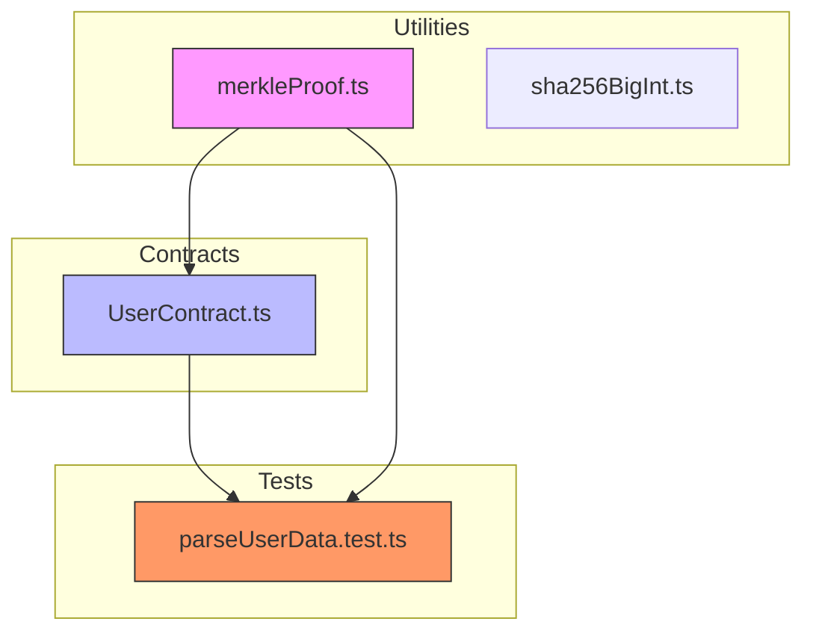
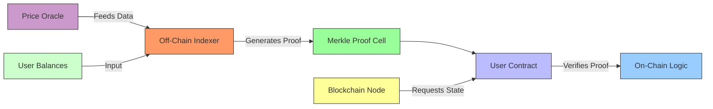
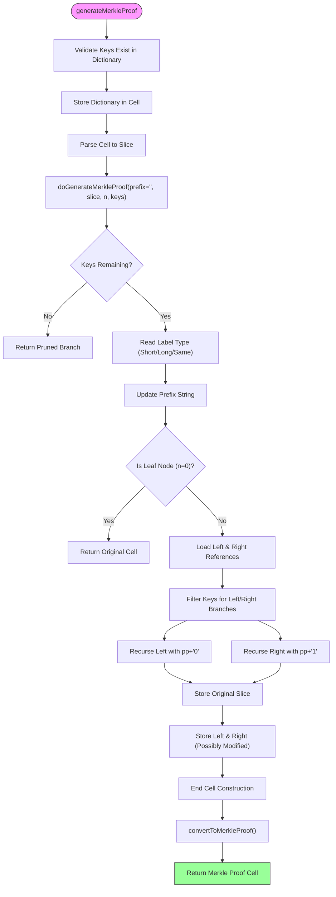
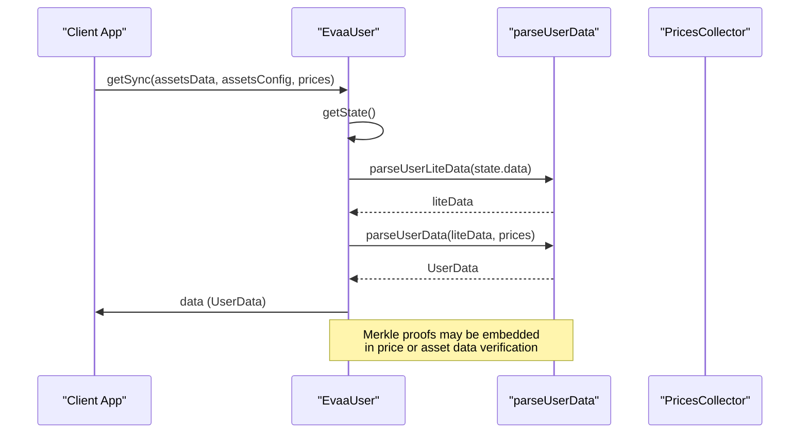
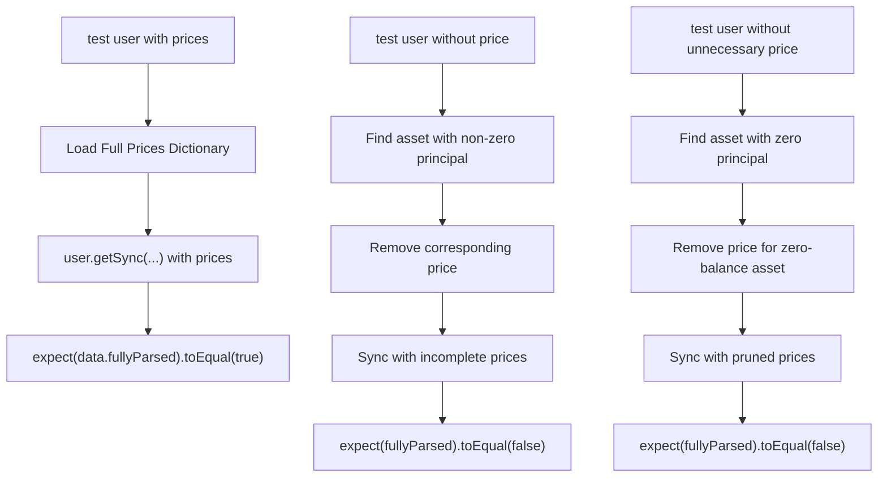

# Advanced Merkle Proofs


## Table of Contents
1. [Introduction](#introduction)
2. [Project Structure](#project-structure)
3. [Core Components](#core-components)
4. [Architecture Overview](#architecture-overview)
5. [Detailed Component Analysis](#detailed-component-analysis)
6. [Merkle Proof Generation and Verification](#merkle-proof-generation-and-verification)
7. [Integration with UserContract](#integration-with-usercontract)
8. [Security and Performance Considerations](#security-and-performance-considerations)
9. [Testing and Validation Scenarios](#testing-and-validation-scenarios)
10. [Best Practices and Recommendations](#best-practices-and-recommendations)

## Introduction
This document provides a comprehensive analysis of the implementation and usage of Merkle proofs within the EVAA SDK for state validation. The focus is on the `merkleProof.ts` utility, which enables secure and efficient verification of user balances and positions without requiring full state disclosure. The system leverages Merkle trees to authenticate user data during critical operations such as withdrawals and liquidations, ensuring integrity while minimizing on-chain computation.

The documentation covers the core algorithms, integration points with smart contracts, test scenarios, and performance implications. It is designed to be accessible to developers and auditors seeking to understand or extend the Merkle proof functionality in the EVAA protocol.

## Project Structure
The EVAA SDK is organized into modular components that separate concerns such as API parsing, contract interaction, pricing, rewards, and utilities. The Merkle proof functionality resides in the `utils` directory, specifically in `merkleProof.ts`, and is used across various modules for state validation.

Key directories relevant to Merkle proofs:
- `src/utils/`: Contains `merkleProof.ts` and related utilities
- `src/contracts/`: Houses `UserContract.ts`, which integrates proof verification
- `tests/parseUserData/`: Includes test cases validating user data parsing with price dependencies





**Diagram sources**
- [merkleProof.ts](file://src/utils/merkleProof.ts#L1-L140)
- [UserContract.ts](file://src/contracts/UserContract.ts#L1-L145)
- [parseUserData.test.ts](file://tests/parseUserData/parseUserData.test.ts#L1-L90)

**Section sources**
- [merkleProof.ts](file://src/utils/merkleProof.ts#L1-L140)
- [UserContract.ts](file://src/contracts/UserContract.ts#L1-L145)
- [parseUserData.test.ts](file://tests/parseUserData/parseUserData.test.ts#L1-L90)

## Core Components
The core components involved in Merkle proof handling are:

- **`generateMerkleProof`**: Top-level function that generates a verifiable Merkle proof for specified dictionary keys.
- **`generateMerkleProofDirect`**: Internal function that performs the actual proof generation using recursive traversal.
- **`convertToMerkleProof`**: Wraps a cell as an exotic Merkle proof cell for on-chain verification.
- **`EvaaUser` class**: Smart contract wrapper that uses Merkle proofs during state synchronization.
- **`getSync` method**: Synchronizes user state using asset data, config, and prices, indirectly relying on Merkle-based validation.

These components work together to enable off-chain computation with on-chain verifiability, a critical feature for scalability and security in decentralized finance applications.

**Section sources**
- [merkleProof.ts](file://src/utils/merkleProof.ts#L1-L140)
- [UserContract.ts](file://src/contracts/UserContract.ts#L1-L145)

## Architecture Overview
The Merkle proof system in EVAA follows a client-server model where off-chain services compute proofs and on-chain contracts verify them. The architecture ensures data integrity while minimizing gas costs and storage overhead.





**Diagram sources**
- [merkleProof.ts](file://src/utils/merkleProof.ts#L1-L140)
- [UserContract.ts](file://src/contracts/UserContract.ts#L72-L115)

## Detailed Component Analysis

### Merkle Proof Utility Analysis
The `merkleProof.ts` file implements a recursive algorithm to generate compact Merkle proofs from TON Blockchain dictionaries. It uses exotic cells to represent proofs in a format compatible with on-chain verification.

#### Key Functions and Flow




**Diagram sources**
- [merkleProof.ts](file://src/utils/merkleProof.ts#L55-L139)

**Section sources**
- [merkleProof.ts](file://src/utils/merkleProof.ts#L1-L140)

## Merkle Proof Generation and Verification
The Merkle proof system enables efficient verification of user state by allowing provers to demonstrate membership of specific key-value pairs in a large dictionary without revealing the entire dataset.

### Proof Generation Process
The `generateMerkleProof` function works as follows:
1. Validates that all requested keys exist in the input dictionary.
2. Serializes the dictionary into a cell using `storeDictDirect`.
3. Parses the cell into a slice for bit-level manipulation.
4. Recursively traverses the dictionary structure, pruning branches that do not contain requested keys.
5. Constructs a new cell containing only the necessary path to verify the requested keys.
6. Wraps the result in an exotic cell format suitable for on-chain verification.

The algorithm supports three label types in dictionary encoding:
- **Short label**: Prefix length encoded in unary, followed by the actual prefix bits.
- **Long label**: Length encoded as log2(n+1) bits, then the prefix.
- **Same label**: A repeated bit pattern indicated by a single bit and length.

This flexibility allows efficient encoding of various key distributions.

### On-Chain Verification
The generated proof is wrapped using `convertToMerkleProof`, which creates an exotic cell with:
- Type 3 (indicating a Merkle proof)
- Hash of the original cell
- Depth of the original cell
- Reference to the pruned subtree

This format allows on-chain contracts to verify that the provided data matches the expected state root without reconstructing the full tree.

**Section sources**
- [merkleProof.ts](file://src/utils/merkleProof.ts#L1-L140)

## Integration with UserContract
The `UserContract.ts` file integrates Merkle proof verification indirectly through its `getSync` method, which synchronizes user state using external data sources.

### State Synchronization Flow




**Diagram sources**
- [UserContract.ts](file://src/contracts/UserContract.ts#L72-L115)
- [parseUserData.test.ts](file://tests/parseUserData/parseUserData.test.ts#L33-L90)

**Section sources**
- [UserContract.ts](file://src/contracts/UserContract.ts#L72-L115)

The `getSync` method accepts `prices` as a dictionary parameter, which could be accompanied by Merkle proofs to validate price integrity. Although the current implementation does not explicitly pass proofs, the architecture supports integrating proof verification in future versions by validating the prices dictionary against a known root.

## Security and Performance Considerations

### Security Implications
Using weak hashing algorithms or improper proof generation can compromise the entire validation system. The current implementation relies on TON's native hashing (Blake2b via `hash(0)`), which is cryptographically secure. However, best practices must be followed:

- **Proof Freshness**: Proofs should include timestamps or nonces to prevent replay attacks.
- **Key Validation**: Always validate that requested keys exist before generating proofs to avoid leaking absence information.
- **Exotic Cell Handling**: On-chain code must properly validate exotic cell structure before trusting the contained data.

### Performance Characteristics
When handling large proof sets:
- **Memory Usage**: The recursive algorithm uses stack space proportional to tree depth (O(log n)).
- **Time Complexity**: O(k log n) where k is the number of keys and n is dictionary size.
- **Traversal Optimization**: The implementation avoids unnecessary branch exploration by filtering keys at each level.

For batch verification of multiple users:
- Generate aggregated proofs by combining key lists.
- Use parallel processing for independent proof generation.
- Cache intermediate tree nodes when multiple proofs share paths.

**Section sources**
- [merkleProof.ts](file://src/utils/merkleProof.ts#L1-L140)

## Testing and Validation Scenarios
The `parseUserData.test.ts` file contains test cases that validate user state parsing under different price availability conditions.

### Test Case Analysis




**Diagram sources**
- [parseUserData.test.ts](file://tests/parseUserData/parseUserData.test.ts#L33-L90)

**Section sources**
- [parseUserData.test.ts](file://tests/parseUserData/parseUserData.test.ts#L33-L90)

These tests demonstrate how the system handles partial data availability, which is analogous to proof-based validation where only relevant state components are provided. A missing or invalid proof would similarly result in `fullyParsed = false`.

## Best Practices and Recommendations

### Proof Generation Frequency
- Generate proofs on-demand for specific queries rather than precomputing all possible proofs.
- Cache proofs for frequently accessed user states with appropriate TTL.
- Use incremental updates when possible instead of full proof regeneration.

### Storage and Transmission
- Store only the root hash on-chain; keep full trees and proofs off-chain.
- Compress proofs using standard algorithms when transmitting over networks.
- Use efficient serialization formats (e.g., BOC in TON) for proof encoding.

### System Extensions
To support batch verification:

```typescript
// Example extension for batch proof generation
function generateBatchProof<K extends DictionaryKeyTypes, V>(
    dict: Dictionary<K, V>,
    userKeys: Array<K[]>,
    keyObject: DictionaryKey<K>
): Cell[] {
    return userKeys.map(keys => generateMerkleProof(dict, keys, keyObject));
}
```


For integration with off-chain indexing services:
- Expose proof generation endpoints via REST APIs.
- Implement webhook notifications when user state changes.
- Support GraphQL queries with proof attachments for verified responses.

**Section sources**
- [merkleProof.ts](file://src/utils/merkleProof.ts#L1-L140)
- [parseUserData.test.ts](file://tests/parseUserData/parseUserData.test.ts#L1-L90)
- [UserContract.ts](file://src/contracts/UserContract.ts#L1-L145)

**Referenced Files in This Document**   
- [merkleProof.ts](file://src/utils/merkleProof.ts)
- [parseUserData.test.ts](file://tests/parseUserData/parseUserData.test.ts)
- [UserContract.ts](file://src/contracts/UserContract.ts)