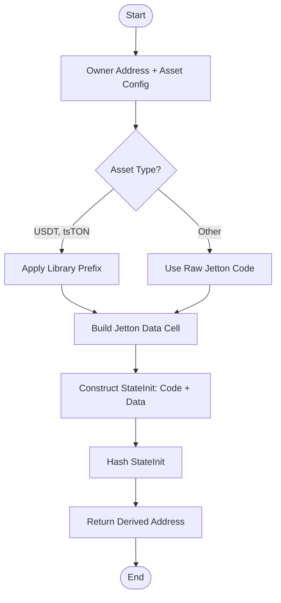
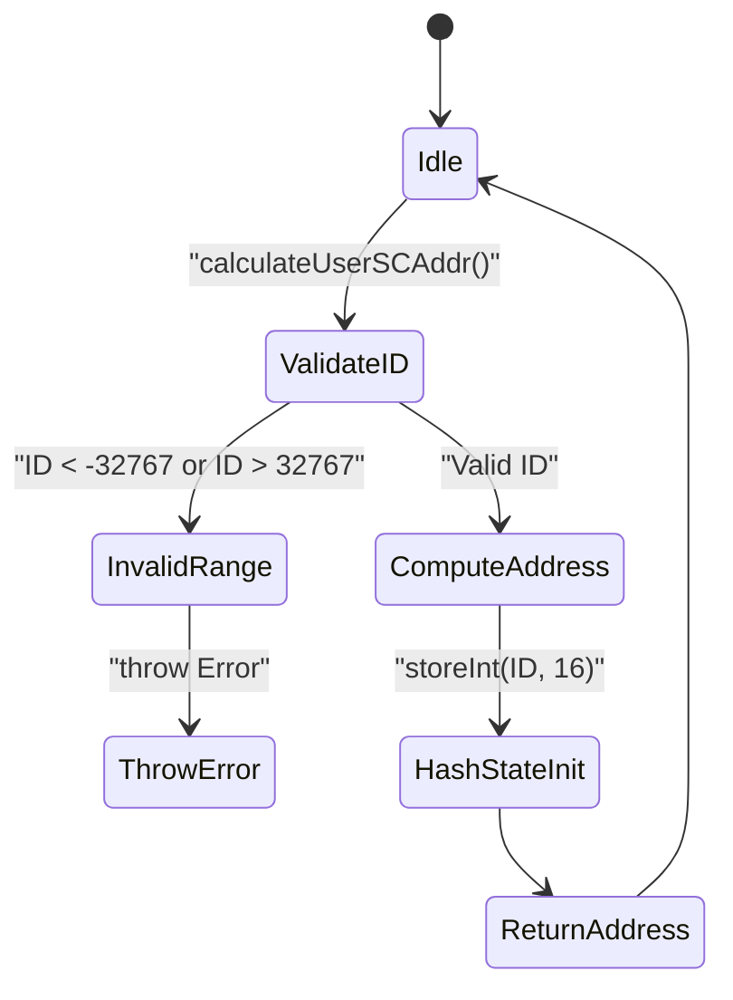
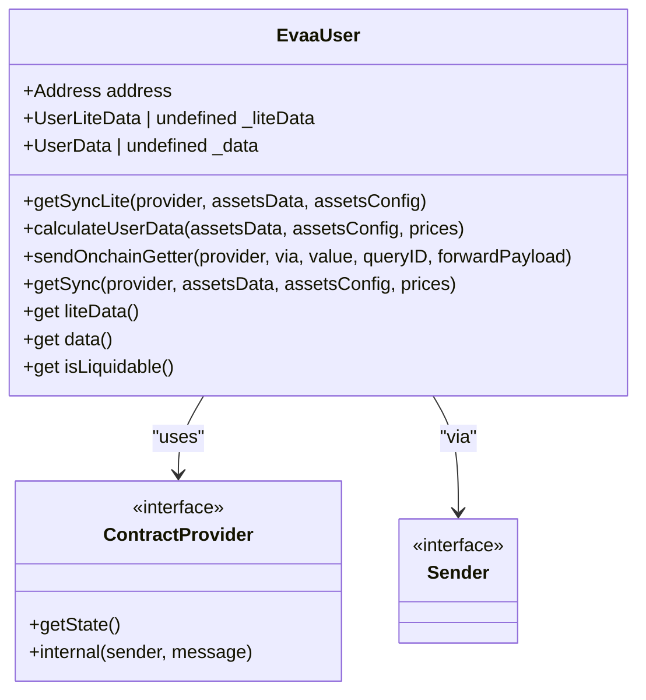
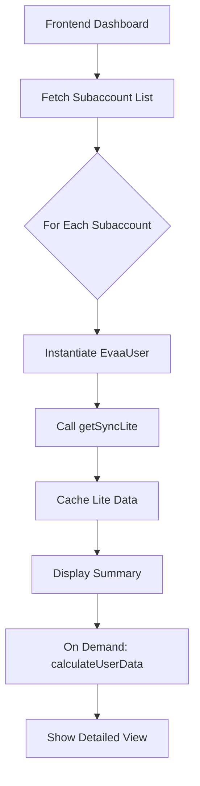

# Subaccount Management

## Table of Contents
1. [Introduction](#introduction)
2. [Subaccount Address Derivation Logic](#subaccount-address-derivation-logic)
3. [Subaccount Validation and Boundaries](#subaccount-validation-and-boundaries)
4. [User Contract Interaction and State Management](#user-contract-interaction-and-state-management)
5. [Use Cases for Subaccount Segmentation](#use-cases-for-subaccount-segmentation)
6. [Security and Access Control Considerations](#security-and-access-control-considerations)
7. [Performance Implications of Multiple Subaccounts](#performance-implications-of-multiple-subaccounts)
8. [Dashboard Integration and Data Aggregation](#dashboard-integration-and-data-aggregation)
9. [Conclusion](#conclusion)

## Introduction
This document provides a comprehensive overview of subaccount management within the Evaa protocol, focusing on how institutional and advanced users can leverage subaccounts for risk isolation and portfolio segmentation. Subaccounts enable a single wallet to manage multiple isolated financial positions, each with its own balance, transaction history, and operational logic. This pattern is particularly valuable for hedge funds, traders, and institutional investors who require strict separation between strategies or risk profiles.

The implementation relies on deterministic address derivation using the user’s wallet address and a subaccount ID. This ensures that each subaccount is uniquely identifiable and securely isolated. The core logic is implemented in `userJettonWallet.ts` for Jetton wallet derivation, validated through tests in `SubaccountCalculation.test.ts`, and managed via the `UserContract` class.

**Section sources**
- [userJettonWallet.ts](file://src/utils/userJettonWallet.ts#L0-L80)
- [SubaccountCalculation.test.ts](file://tests/address/SubaccountCalculation.test.ts#L0-L127)
- [UserContract.ts](file://src/contracts/UserContract.ts#L0-L145)

## Subaccount Address Derivation Logic

The subaccount system uses cryptographic address derivation to generate unique, deterministic wallet addresses for each subaccount. This is achieved by combining the user's base wallet address with a subaccount ID to produce a distinct smart contract address.

The `getUserJettonWallet` function in `userJettonWallet.ts` computes the Jetton wallet address for a given asset and subaccount owner. It constructs a state initialization cell (`stateInit`) using the asset-specific code and data layout, then derives the final address via hashing.

**Diagram sources**
- [userJettonWallet.ts](file://src/utils/userJettonWallet.ts#L0-L80)

The derived address ensures that each subaccount operates in isolation, preventing cross-contamination of funds or state. This mechanism is critical for enabling portfolio segmentation while maintaining a unified wallet interface.

**Section sources**
- [userJettonWallet.ts](file://src/utils/userJettonWallet.ts#L0-L80)

## Subaccount Validation and Boundaries

Subaccount IDs are constrained to a 16-bit signed integer range, ensuring compatibility with on-chain storage and computation limits. The valid range is from -32767 to 32767, excluding -32768, which is explicitly disallowed.

The test suite `SubaccountCalculation.test.ts` validates this behavior by confirming:
- Subaccount ID 0 corresponds to the default user contract address.
- Each subaccount ID produces a unique and deterministic address.
- Invalid IDs (e.g., 32768 or -32768) throw errors.
- Manual computation of state initialization matches the calculated address.

**Diagram sources**
- [SubaccountCalculation.test.ts](file://tests/address/SubaccountCalculation.test.ts#L0-L127)

This strict validation ensures that subaccount IDs remain within safe computational bounds and prevents overflow-related vulnerabilities.

**Section sources**
- [SubaccountCalculation.test.ts](file://tests/address/SubaccountCalculation.test.ts#L0-L127)

## User Contract Interaction and State Management

The `EvaaUser` class in `UserContract.ts` serves as the primary interface for interacting with a user’s subaccount. It encapsulates state retrieval, data parsing, and on-chain queries.

Key methods include:
- `getSyncLite`: Retrieves lightweight user data from the contract state.
- `calculateUserData`: Computes full user data using prices and asset configurations.
- `sendOnchainGetter`: Sends queries to the contract for real-time data fetching.
- `isLiquidable`: Determines if the subaccount is at risk of liquidation.

**Diagram sources**
- [UserContract.ts](file://src/contracts/UserContract.ts#L0-L145)

The class maintains a local cache of user data to minimize redundant on-chain queries, improving performance and reducing gas costs.

**Section sources**
- [UserContract.ts](file://src/contracts/UserContract.ts#L0-L145)

## Use Cases for Subaccount Segmentation

Subaccounts enable several advanced financial strategies:

### Hedge Fund Strategy Isolation
A hedge fund can allocate separate subaccounts for different trading strategies (e.g., long-only, arbitrage, market-making). Each strategy operates independently, allowing for precise performance tracking and risk assessment.

### Leveraged Position Isolation
Traders can isolate high-leverage positions in dedicated subaccounts to prevent cascading liquidations. If one position is liquidated, others remain unaffected.

### Multi-Asset Portfolio Management
Institutional investors can segment portfolios by asset class (e.g., stablecoins, volatile tokens, derivatives), enabling tailored risk management and compliance reporting.

These use cases demonstrate how subaccounts provide a flexible framework for sophisticated financial operations within a single wallet infrastructure.

## Security and Access Control Considerations

While subaccounts enhance operational flexibility, they introduce key security considerations:
- **Key Management**: All subaccounts are controlled by the same private key. Compromise of the master key exposes all subaccounts.
- **Access Control**: There is no built-in permission system to restrict operations on specific subaccounts. External wallet-level controls are required.
- **Phishing Risks**: Users must verify subaccount addresses carefully, as malicious actors could spoof subaccount interactions.

Best practices include:
- Using hardware wallets for key storage.
- Implementing multi-signature controls at the wallet level.
- Auditing subaccount creation and transaction patterns.

No additional file analysis is required for this section.

## Performance Implications of Multiple Subaccounts

Managing many subaccounts introduces performance trade-offs:
- **State Synchronization**: Each subaccount requires independent state fetching and parsing. Aggregating data across N subaccounts increases latency linearly.
- **Memory Usage**: Caching data for multiple subaccounts increases memory footprint.
- **Computation Overhead**: Deriving addresses and validating subaccount IDs adds minimal but cumulative overhead.

Optimization strategies include:
- Lazy loading of subaccount data.
- Batched on-chain queries.
- Client-side caching with TTL-based invalidation.

Efficient state synchronization is critical for dashboard applications that display aggregated views across subaccounts.

No additional file analysis is required for this section.

## Dashboard Integration and Data Aggregation

Dashboard interfaces can leverage subaccount data to provide unified portfolio views while preserving logical separation. Key integration patterns include:
- **Aggregated Balances**: Summarize total holdings across all subaccounts.
- **Risk Exposure Heatmaps**: Visualize leverage and liquidation risk per subaccount.
- **Strategy Performance Charts**: Track P&L for isolated strategies.

The `EvaaUser` class supports this by exposing both lite and full data models, enabling efficient rendering of summary and detailed views.

**Diagram sources**
- [UserContract.ts](file://src/contracts/UserContract.ts#L0-L145)

This architecture enables responsive, scalable dashboards that maintain clear separation of concerns.

**Section sources**
- [UserContract.ts](file://src/contracts/UserContract.ts#L0-L145)

## Conclusion

Subaccount management in the Evaa protocol provides a robust foundation for risk isolation and portfolio segmentation. By leveraging deterministic address derivation, strict validation, and efficient state management, users can securely manage multiple financial positions within a single wallet. The system supports advanced use cases such as hedge fund operations and leveraged trading while maintaining performance and security. Future enhancements could include native access control and cross-subaccount transaction routing.

**Referenced Files in This Document**   
- [userJettonWallet.ts](file://src/utils/userJettonWallet.ts#L0-L80)
- [SubaccountCalculation.test.ts](file://tests/address/SubaccountCalculation.test.ts#L0-L127)
- [UserContract.ts](file://src/contracts/UserContract.ts#L0-L145)