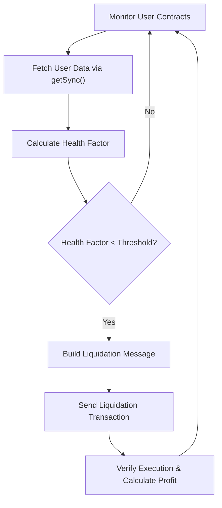
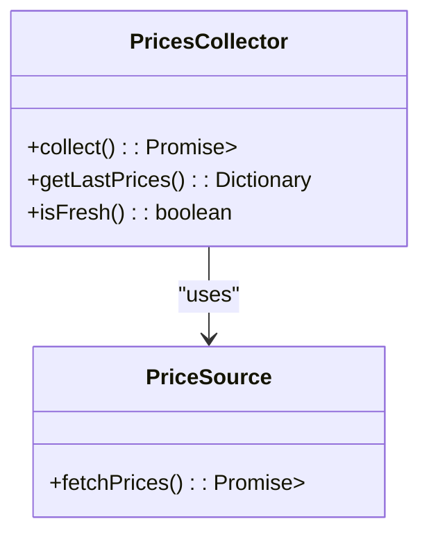
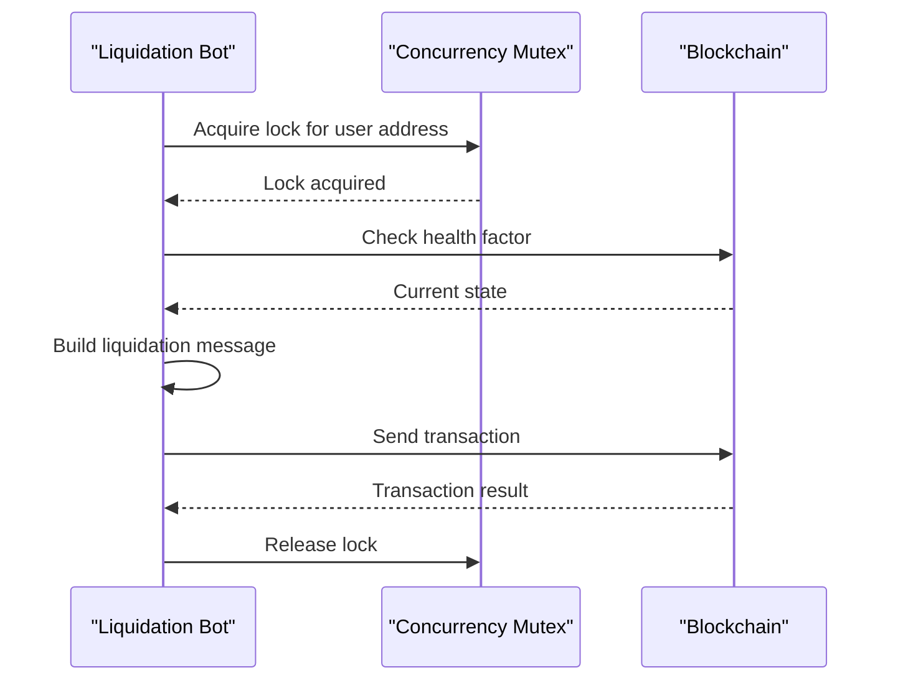
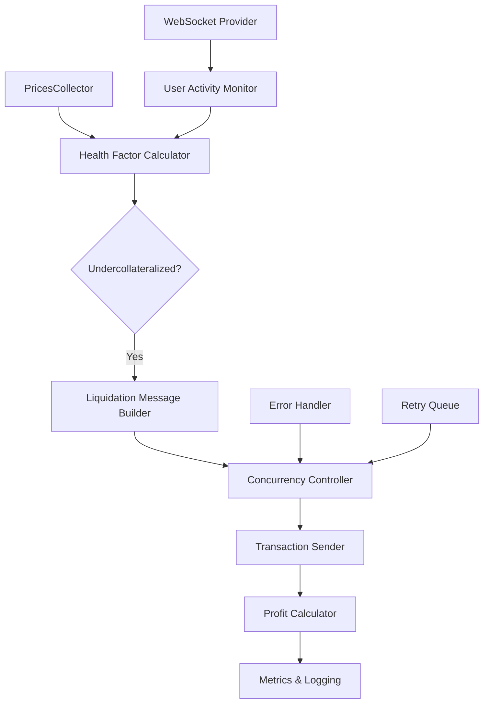

# Building Liquidation Bots


## Table of Contents
1. [Introduction](#introduction)
2. [Liquidation Workflow Overview](#liquidation-workflow-overview)
3. [Monitoring User Health Factors](#monitoring-user-health-factors)
4. [Identifying Undercollateralized Positions](#identifying-undercollateralized-positions)
5. [Efficient Price Updates with PricesCollector](#efficient-price-updates-with-pricescollector)
6. [Constructing Liquidation Transactions](#constructing-liquidation-transactions)
7. [Parsing Vulnerable User States](#parsing-vulnerable-user-states)
8. [Real-Time Monitoring with WebSocket Providers](#real-time-monitoring-with-websocket-providers)
9. [Concurrency Control and Race Condition Prevention](#concurrency-control-and-race-condition-prevention)
10. [Complete Liquidation Bot Architecture](#complete-liquidation-bot-architecture)
11. [Ethical Considerations and Protocol Incentives](#ethical-considerations-and-protocol-incentives)

## Introduction
This document provides a comprehensive guide to building automated liquidation bots using the EVAA SDK. It covers the entire lifecycle of a liquidation bot, from monitoring user health factors to executing profitable liquidations while adhering to protocol rules and ethical standards. The guide is designed for developers with basic knowledge of blockchain and DeFi protocols, offering detailed technical insights and practical implementation patterns.

## Liquidation Workflow Overview
The liquidation process in the EVAA protocol follows a structured workflow that ensures accuracy, efficiency, and compliance with on-chain rules. The core steps include:
- Monitoring user positions via `UserContract.getSync()`
- Calculating health factors using price and balance data
- Identifying undercollateralized users based on health factor thresholds
- Constructing and sending liquidation messages via master contracts
- Handling responses and calculating profitability

This workflow enables bots to detect and act on liquidation opportunities in near real-time, maximizing profit potential while minimizing gas costs and execution risks.





**Diagram sources**
- [UserContract.ts](file://src/contracts/UserContract.ts#L72-L115)
- [health_factor_calculation_test.ts](file://tests/health_factor_calculation_test.ts#L20-L51)

## Monitoring User Health Factors
The foundation of any liquidation bot is the ability to accurately monitor user health factors. This is achieved through the `UserContract.getSync()` method, which synchronizes the latest state of a user's position.

The `getSync()` function requires four key parameters:
- `assetsData`: Current asset metadata
- `assetsConfig`: Configuration including collateral factors
- `prices`: Dictionary of current asset prices
- `applyDust`: Flag to handle negligible balances


```typescript
await user.getSync(
    evaa.data!.assetsData, 
    evaa.data!.assetsConfig, 
    priceData!.dict
);
```


Once synchronized, the user's health factor can be accessed through the parsed data structure. The health factor is a critical metric that determines whether a user is eligible for liquidation.

**Section sources**
- [UserContract.ts](file://src/contracts/UserContract.ts#L72-L115)

## Identifying Undercollateralized Positions
The identification of undercollateralized positions relies on the health factor calculation logic demonstrated in `health_factor_calculation_test.ts`. This test file provides a practical example of how to predict health factor changes under different scenarios.

The health factor is calculated using the formula:

```
Health Factor = (Total Collateral Value * Collateral Factor) / Total Borrowed Value
```


A user becomes liquidatable when this value drops below 1.0. The SDK provides helper functions like `predictHealthFactor()` to simulate the impact of repayments or supply changes on a user's health status.


```typescript
const predictedHF = predictHealthFactor({
    balanceChangeType: BalanceChangeType.Repay,
    amount: 4000n,
    asset: USDT_MAINNET,
    principals: userPrincipals,
    prices: priceData!.dict,
    assetsData: evaa.data!.assetsData,
    assetsConfig: evaa.data!.assetsConfig,
    poolConfig: MAINNET_POOL_CONFIG
});
```


This predictive capability allows bots to anticipate liquidation opportunities before they become visible to other actors in the system.

**Section sources**
- [health_factor_calculation_test.ts](file://tests/health_factor_calculation_test.ts#L20-L51)

## Efficient Price Updates with PricesCollector
To minimize API costs and optimize performance, the EVAA SDK provides the `PricesCollector` class for efficient price updates. This component aggregates price data from multiple sources and caches results to reduce redundant network requests.

Key features of `PricesCollector`:
- Batched price fetching
- Local caching with TTL (Time To Live)
- Support for both classic and Pyth price oracles
- Error handling and retry mechanisms

By using `PricesCollector`, bots can maintain up-to-date price information without overwhelming external APIs or incurring excessive costs. The collector should be polled at regular intervals (e.g., every 5-10 seconds) depending on market volatility and bot strategy requirements.





**Diagram sources**
- [PricesCollector.ts](file://src/prices/PricesCollector.ts)
- [UserContract.ts](file://src/contracts/UserContract.ts#L72-L115)

## Constructing Liquidation Transactions
Liquidation transactions are constructed using the master contract's message creation methods. The EVAA SDK supports two types of master contracts: `ClassicMaster` and `PythMaster`, each with specific message formats.

For ClassicMaster, the liquidation message includes:
- Borrower address
- Collateral and loan asset IDs
- Minimum collateral amount to receive
- Liquidation amount
- Price data
- Subaccount information (if applicable)

The message structure is built using TON's cell-based serialization:


```typescript
protected createLiquidationMessage(parameters: ClassicLiquidationParameters): Cell {
    const subaccountId = parameters.subaccountId ?? 0;
    const isTon = isTonAsset(parameters.asset);
    // ... message construction logic
}
```


The final message is sent via `sendLiquidation()`, which handles both TON and jetton transfers appropriately based on the asset type.

**Section sources**
- [ClassicMaster.ts](file://src/contracts/ClassicMaster.ts#L97-L183)
- [PythMaster.ts](file://src/contracts/PythMaster.ts#L200-L232)

## Parsing Vulnerable User States
The SDK provides specialized parsing utilities to interpret user contract data. Two primary test files demonstrate this functionality: `parse_user_classic.ts` and `parse_user_pyth.ts`.

These parsers convert raw contract data into structured objects containing:
- Principal balances (borrowed amounts)
- Token balances
- Health factor
- Liquidation eligibility status
- Collateral positions

The parsing process occurs in two stages:
1. `parseUserLiteData()` - Extracts basic position data
2. `parseUserData()` - Combines lite data with prices to calculate full financial state

This two-tiered approach optimizes performance by separating data retrieval from computationally intensive valuation calculations.

**Section sources**
- [parse_user_classic.ts](file://tests/parse_user_classic.ts)
- [parse_user_pyth.ts](file://tests/parse_user_pyth.ts)
- [UserContract.ts](file://src/contracts/UserContract.ts#L72-L115)

## Real-Time Monitoring with WebSocket Providers
For low-latency monitoring, bots should integrate WebSocket providers to receive real-time updates about user activity and price changes. This enables immediate detection of:
- Large withdrawals that may trigger undercollateralization
- Significant price movements affecting health factors
- New user positions entering risky territory

WebSocket connections should be combined with periodic polling of `PricesCollector` to ensure data consistency. The optimal configuration depends on network conditions and profitability targets, but typically involves:
- WebSocket for event detection
- Polling for state verification
- Local caching to reduce redundant computations

This hybrid approach balances responsiveness with reliability and cost efficiency.

## Concurrency Control and Race Condition Prevention
Liquidation bots must implement concurrency control to prevent duplicate liquidations and race conditions. Key strategies include:

- **Mutex Locking**: Use in-memory locks when processing a specific user address
- **Transaction Nonces**: Track and manage nonces for reliable transaction ordering
- **Duplicate Detection**: Maintain a recent history of processed liquidations
- **Timeout Handling**: Implement circuit breakers for stalled operations

The SDK does not provide built-in locking mechanisms, so these must be implemented at the application level. A simple in-memory Set can track recently processed user addresses with a TTL of 30-60 seconds to prevent reprocessing.





**Diagram sources**
- [ClassicMaster.ts](file://src/contracts/ClassicMaster.ts#L157-L183)
- [UserContract.ts](file://src/contracts/UserContract.ts#L72-L115)

## Complete Liquidation Bot Architecture
A production-ready liquidation bot should incorporate the following components:





Key architectural features:
- **Modular Design**: Separated concerns for monitoring, calculation, and execution
- **Error Handling**: Comprehensive try-catch blocks and fallback strategies
- **Retry Logic**: Exponential backoff for failed transactions
- **Profit Calculation**: Real-time P&L tracking including gas costs
- **Metrics Collection**: Performance monitoring and alerting

The bot should also implement circuit breakers that pause operations during extreme market volatility or sustained failure periods.

## Ethical Considerations and Protocol Incentives
Responsible liquidation behavior is crucial for maintaining protocol stability. Bots should:
- Avoid front-running user transactions
- Respect minimum profitability thresholds
- Contribute to price oracle accuracy when possible
- Participate in protocol governance

The EVAA protocol incentivizes responsible behavior through:
- Reward programs for consistent liquidators
- Penalty mechanisms for failed or abusive liquidations
- Priority queuing for well-behaved actors
- Transparent fee structures

By aligning bot operations with protocol incentives, operators can achieve sustainable profitability while contributing to ecosystem health.

**Referenced Files in This Document**   
- [UserContract.ts](file://src/contracts/UserContract.ts)
- [PricesCollector.ts](file://src/prices/PricesCollector.ts)
- [health_factor_calculation_test.ts](file://tests/health_factor_calculation_test.ts)
- [parse_user_classic.ts](file://tests/parse_user_classic.ts)
- [parse_user_pyth.ts](file://tests/parse_user_pyth.ts)
- [ClassicMaster.ts](file://src/contracts/ClassicMaster.ts)
- [PythMaster.ts](file://src/contracts/PythMaster.ts)