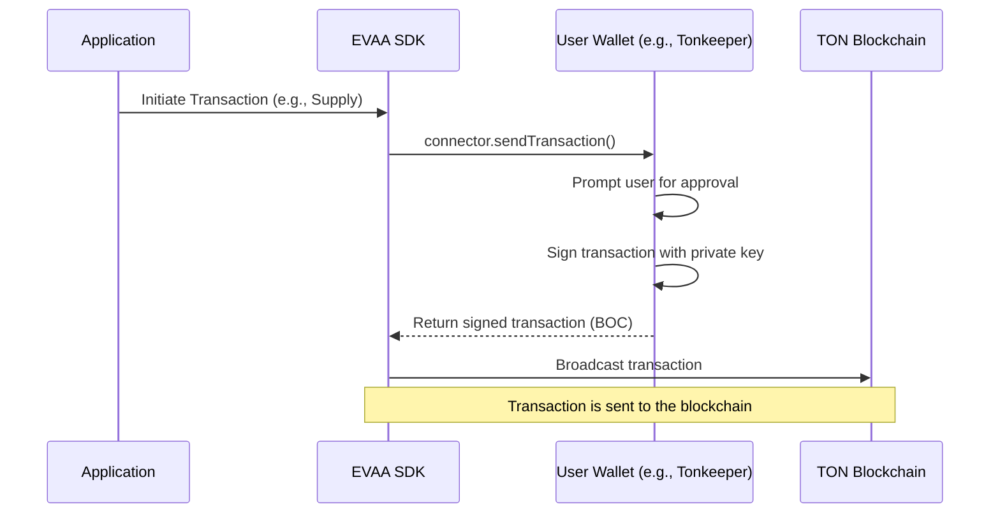
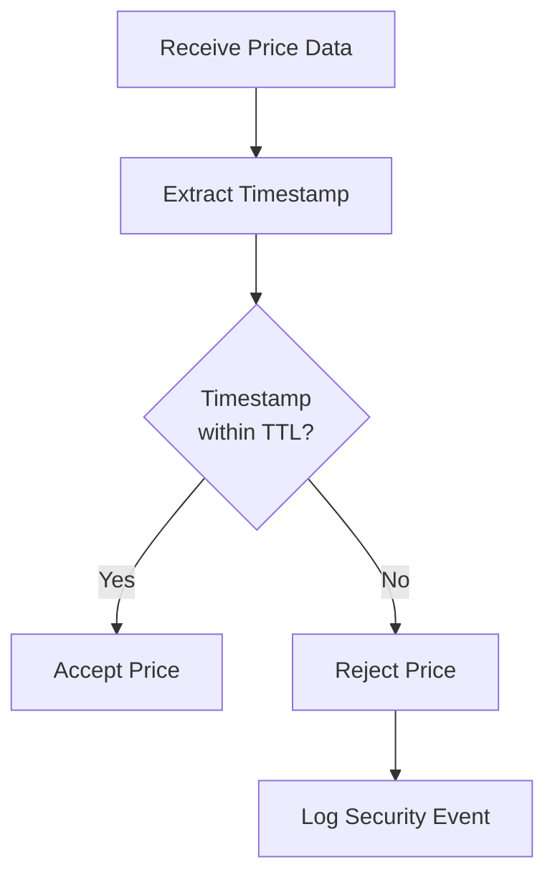

# Security Best Practices


## Table of Contents
1. [Introduction](#introduction)
2. [Secure Wallet Integration via tonConnectSender](#secure-wallet-integration-via-tonconnectsender)
3. [Private Key and Transaction Signing Security](#private-key-and-transaction-signing-security)
4. [Input Validation and Price Source Security](#input-validation-and-price-source-security)
5. [Timestamp Validation and Oracle Data Integrity](#timestamp-validation-and-oracle-data-integrity)
6. [Secure Coding and Dependency Management](#secure-coding-and-dependency-management)
7. [Deployment and Operational Security](#deployment-and-operational-security)

## Introduction
This document outlines comprehensive security best practices for integrating and extending the EVAA SDK, a software development kit designed for interaction with the EVAA lending protocol on the TON blockchain. The focus is on mitigating risks associated with private key handling, transaction signing, price oracle manipulation, and secure deployment. The analysis is based on a review of the SDK's source code, particularly modules related to wallet connectivity, price collection, and contract interaction. The goal is to provide developers with actionable guidance to ensure the integrity, confidentiality, and availability of their applications and user funds.

## Secure Wallet Integration via tonConnectSender

The `tonConnectSender.ts` file provides a critical integration point between the EVAA SDK and user wallets via the `@tonconnect/sdk`. This module implements the `Sender` interface, which is used to send transactions from a user's wallet. The security of this component is paramount, as it directly handles transaction construction and signing.

The `getTonConnectSender` function creates a `Sender` object that uses a provided `ITonConnect` connector. This design correctly delegates the responsibility of private key management and transaction signing to the external wallet application (e.g., a mobile wallet), which is a best practice. The private key never enters the application's memory space, significantly reducing the attack surface.

A notable implementation detail is the use of a global variable, `lastSentBoc`, to capture the Base64-encoded transaction BOC (Bag of Cells) after it is sent. This is a workaround for the `Sender` interface's limitation of not allowing a return value from the `send()` method. While functional, this pattern introduces a potential race condition in multi-threaded or concurrent environments, as the value of `lastSentBoc` could be overwritten by a subsequent transaction before the first one is processed. Developers should access `getLastSentBoc()` immediately after a transaction is sent and should be aware of this concurrency risk.





**Diagram sources**
- [tonConnectSender.ts](file://src/utils/tonConnectSender.ts#L15-L37)

**Section sources**
- [tonConnectSender.ts](file://src/utils/tonConnectSender.ts#L1-L37)

## Private Key and Transaction Signing Security

The EVAA SDK adheres to the principle of least privilege by not handling private keys directly. Instead, it relies on external wallet providers for transaction signing, as demonstrated in the `tonConnectSender` module. This approach ensures that private keys are never exposed to the application logic, which could be compromised by client-side vulnerabilities.

The SDK's interaction with wallets is designed around secure enclaves and hardware wallets. The `ITonConnect` interface acts as a secure channel, ensuring that all signing operations occur within the trusted environment of the user's wallet. This architecture is resilient against common web-based attacks such as cross-site scripting (XSS), as an attacker cannot extract the private key even if they gain control of the application's JavaScript context.

For backend services that require automated transaction signing, the SDK does not provide a built-in mechanism. This is intentional, as automated signing on a server introduces significant risk. If a backend service must sign transactions, it is strongly recommended to use a Hardware Security Module (HSM) or a dedicated signing service that isolates the private key in a secure, air-gapped environment. Hardcoding private keys in source code or environment variables, even with `dotenv`, is strictly prohibited and represents a critical security flaw.

## Input Validation and Price Source Security

The integrity of the lending protocol depends heavily on the accuracy of price data. The SDK's price collection system, centered around the `PricesCollector` class, is a prime target for malicious actors attempting to inject false prices to trigger liquidations or manipulate collateral values.

All user-provided data, especially in the context of price sources, must be rigorously validated. The `PricesCollector` receives price data from multiple sources, including backend APIs and ICP (Internet Computer Protocol) endpoints. Each `PriceSource` implementation, such as `Backend.ts`, is responsible for parsing raw data (e.g., from a JSON API) into a `RawPriceData` object. This parsing step is a critical validation point.

The `parsePrices` method in `BackendPriceSource` performs several checks:
1.  It decodes the hexadecimal data string.
2.  It parses the JSON payload to extract the `packedPrices`, `signature`, `publicKey`, and `timestamp`.
3.  It constructs a `Cell` object from the `packedPrices` and verifies its structure.

A failure in any of these steps throws an error, preventing the corrupted or malformed data from being processed further. This fail-fast approach is essential for maintaining system integrity. Developers extending the SDK with custom price sources must implement similarly robust parsing and validation logic to prevent injection attacks.

## Timestamp Validation and Oracle Data Integrity

To mitigate the risk of replay attacks and the use of stale price data, the `PricesCollector` implements a strict timestamp validation mechanism. This is a crucial defense against malicious price injection.

The `verifyPricesTimestamp` function, located in `utils.ts`, checks that the timestamp of a price update is within a predefined validity window (`TTL_ORACLE_DATA_SEC`). This function is applied as a filter to all incoming price data. If a price update is older than the TTL (Time-To-Live), it is discarded.





**Diagram sources**
- [utils.ts](file://src/prices/utils.ts#L104-L111)

The validation is performed in the `collectAndFilterPrices` function, which uses `verifyPricesTimestamp` as part of a composite filter that also includes signature verification. This dual-check system ensures that only timely and authentic price data is used to calculate median prices. The `TTL_ORACLE_DATA_SEC` constant, defined in `constants.ts`, should be set to a value that balances security (shorter TTL) with network reliability (longer TTL to accommodate potential delays).

## Secure Coding and Dependency Management

The SDK promotes secure coding practices through its design and implementation. A key principle is the avoidance of hardcoded secrets. While the SDK itself does not contain hardcoded keys, the example in `price_utils_test.ts` shows the use of `dotenv` to load an `RPC_API_KEY`. This is the correct approach, ensuring that sensitive credentials are managed externally and not committed to version control.

The SDK relies on external dependencies like `@ton/core`, `@tonconnect/sdk`, and `@ton/crypto`. Supply chain security is a significant concern. To mitigate risks from compromised or vulnerable dependencies, developers must:
1.  **Pin Dependency Versions:** Use exact versions in `package.json` (e.g., `"@ton/core": "0.48.0"`) rather than version ranges (e.g., `"^0.48.0"`). This prevents automatic updates that could introduce breaking changes or vulnerabilities.
2.  **Regular Auditing:** Use tools like `npm audit` or `yarn audit` to scan for known vulnerabilities in the dependency tree.
3.  **Minimize Dependencies:** Only include necessary packages to reduce the attack surface.

The codebase demonstrates good error handling by using `try/catch` blocks in critical sections, such as price data parsing. However, the use of empty `catch` blocks (e.g., in `#collectPrices`) should be avoided in production code, as they can hide critical failures. Errors should be logged and handled appropriately.

## Deployment and Operational Security

For bots and backend services that interact with the EVAA SDK, secure deployment patterns are essential. These services often hold significant privileges and are high-value targets.

*   **Network Isolation:** Backend services should be deployed in a private network segment, isolated from the public internet. Access to the service should be restricted via firewalls and security groups, allowing connections only from authorized sources.
*   **API Rate Limiting:** Any public-facing API that uses the SDK should implement rate limiting to prevent denial-of-service (DoS) attacks and brute-force attempts.
*   **Audit Trails and Logging:** Critical operations, such as sending a transaction or updating a configuration, must be logged. Logs should include a timestamp, the user or service account involved, the action performed, and the outcome. These logs are vital for forensic analysis in the event of a security incident.
*   **Replay Attack Protection:** The TON blockchain's transaction system includes a sequence number (`seqno`) to prevent replay attacks. The SDK relies on the wallet provider to manage this correctly. For custom signing solutions, ensuring the `seqno` is incremented for each transaction is mandatory.


```mermaid
graph TB
subgraph "Public Internet"
User[User Application]
end
subgraph "DMZ"
API[API Gateway]
end
subgraph "Private Network"
Backend[Backend Service]
DB[(Database)]
HSM[Hardware Security Module]
end
User --> API
API --> Backend
Backend --> DB
Backend --> HSM
HSM --> Backend
style Backend fill:#f9f,stroke:#333
style HSM fill:#f96,stroke:#333
Note right of HSM: Isolated signing environment
```


**Diagram sources**
- [AbstractMaster.ts](file://src/contracts/AbstractMaster.ts#L363-L397)

**Section sources**
- [PricesCollector.ts](file://src/prices/PricesCollector.ts#L0-L163)
- [utils.ts](file://src/prices/utils.ts#L0-L164)
- [Backend.ts](file://src/prices/sources/Backend.ts#L26-L63)

**Referenced Files in This Document**   
- [tonConnectSender.ts](file://src/utils/tonConnectSender.ts)
- [PricesCollector.ts](file://src/prices/PricesCollector.ts)
- [utils.ts](file://src/prices/utils.ts)
- [Backend.ts](file://src/prices/sources/Backend.ts)
- [PriceSource.ts](file://src/prices/sources/PriceSource.ts)
- [AbstractMaster.ts](file://src/contracts/AbstractMaster.ts)